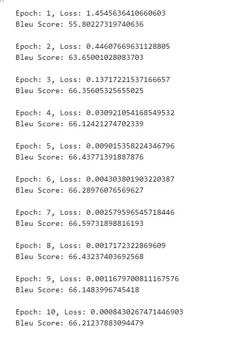

# 自然语言处理: 第四章Seq2Seq

## 理论基础

开始之前，首先提出一个问题，电脑是怎么识别人类的命令的，首先人们通过输入代码(编码) ，带入输入给计算机然后再经过处理(解码)得到最终的命令。所以可以看到这其实是一个编码 + 解码的过程。可以看到首先我们将初始的信息通过编码，得到涵盖全局的信息的特征然后再经过解码器去解码从而最终得到需要得到的信息，所以借鉴于Seq2Seq模型就借鉴于这个结构出现了。


<br />

<br />

Seq2Seq 是2014年由Llya 大神在[ Sequence to Sequence Learning with Neural Networks](https://arxiv.org/abs/1409.3215) 一文中提出的，其由几个重要的优势:

1. 实现了端到端的学习(神经网络)
2. 处理可变长度序列，Seq2Seq可以接受可变长度的序列的输入也可以生成可变长度的输出序列
3. 信息的压缩和抽象表示，编码器将上下文的信息整合到一个向量里，然后解码器通过这个向量输出序列
4. 可扩展性，很容易与其他神经网络做结合，可以处理很多复杂的问题和常见


<br />

<br />

适合处理的问题, 一些生成的问题:

* 机器翻译
* 文本摘要
* 对话系统
* 问答系统
* 语音识别
* 语音合成

不适合的问题:

* 序列标注，命名实体识别，关系抽取，词性标注
* 文本分类
* 文本相似性

局限性:

* 无法储存长序列的信息，缺少局部的信息
* lstm训练效率比较低下


<br />


<br />


## 代码实现

本次代码使用的是中英翻译的数据集，一共有40000多个数据中英互译对。本次任务需要完成的是中 -> 英任务。

<br />


### 1. 数据预处理

```
# Step 1: 数据预处理
import jieba  # 使用jieba进行中文分词
import re  # 使用正则表达式对英文句子进行分词

# 读取句子
with open('all_sentences.txt', 'r', encoding='utf-8') as f:
    all_sentences = f.readlines()

# 创建用于存储中英文句子对的列表
sentences = []

# 对每个句子进行处理
for i in range(0, len(all_sentences), 2):
    # 对中文句子进行分词
    sentence_cn = ' '.join(jieba.cut(all_sentences[i].strip(), cut_all=False))
    # 对英文句子进行分词
    sentence_en = ' '.join(re.findall(r'\b\w+\b', all_sentences[i+1].strip()))
    # 构建句子对，分别添加<sos>和<eos>标记
    sentences.append([sentence_cn, '<sos> ' + sentence_en, sentence_en + ' <eos>'])
```

### 2. 构建词汇表

```
# Step 2: 构建词汇表
word_list_cn, word_list_en = [], []  # 初始化中英文单词列表
# 遍历每一个句子并将单词添加到单词列表中
for s in sentences:
    word_list_cn.extend(s[0].split())
    word_list_en.extend(s[1].split())
    word_list_en.extend(s[2].split())
# 去重得到不重复的单词列表
word_list_cn = list(set(word_list_cn))
word_list_en = list(set(word_list_en))

# Add special tokens to the vocabulary
word_list_cn = ['<pad>'] + word_list_cn
word_list_en = ['<pad>', '<sos>', '<eos>'] + word_list_en

# 构建单词到索引的映射
word2idx_cn = {w: i for i, w in enumerate(word_list_cn)}
word2idx_en = {w: i for i, w in enumerate(word_list_en)}

# 构建索引到单词的映射
idx2word_cn = {i: w for i, w in enumerate(word_list_cn)}
idx2word_en = {i: w for i, w in enumerate(word_list_en)}

# 计算词汇表的大小
voc_size_cn = len(word_list_cn)
voc_size_en = len(word_list_en)
```

### 3. 构建数据集

```
class TranslationDataset(Dataset):
    def __init__(self, sentences, word2idx_cn, word2idx_en):
        self.sentences = sentences
        self.word2idx_cn = word2idx_cn
        self.word2idx_en = word2idx_en

    def __len__(self):
        return len(self.sentences)

    def __getitem__(self, index):
        # 将句子转换为索引
        sentence_cn = [self.word2idx_cn[word] for word in self.sentences[index][0].split()]
        sentence_en_in = [self.word2idx_en[word] for word in self.sentences[index][1].split()]
        sentence_en_out = [self.word2idx_en[word] for word in self.sentences[index][2].split()]
        return torch.tensor(sentence_cn), torch.tensor(sentence_en_in), torch.tensor(sentence_en_out)

# Collate function to pad sentences in a batch
def collate_fn(batch):
    # Sort the batch by the length of the sentences in descending order
    batch.sort(key=lambda x: len(x[0]), reverse=True)
    sentence_cn, sentence_en_in, sentence_en_out = zip(*batch)
    # Pad the sentences
    sentence_cn = nn.utils.rnn.pad_sequence(sentence_cn, padding_value=word2idx_cn['<pad>'])
    sentence_en_in = nn.utils.rnn.pad_sequence(sentence_en_in, padding_value=word2idx_en['<sos>'])
    sentence_en_out = nn.utils.rnn.pad_sequence(sentence_en_out, padding_value=word2idx_en['<eos>'])
    return sentence_cn, sentence_en_in, sentence_en_out

# 创建数据集
dataset = TranslationDataset(sentences, word2idx_cn, word2idx_en)
# 创建数据加载器，pass collate_fn to DataLoader
dataloader = DataLoader(dataset, batch_size=64, shuffle=True, collate_fn=collate_fn)
```

### 4. 构建模型

#### 4.1 RNN版本

```
import torch.nn as nn
class Seq2Seq(nn.Module):
    def __init__(self, input_size, hidden_size, output_size, dropout=0.1):
        super(Seq2Seq, self).__init__()
        self.hidden_size = hidden_size
        self.embedding = nn.Embedding(input_size, hidden_size)
        self.rnn = nn.GRU(hidden_size, hidden_size, bidirectional=True)
        self.dropout = nn.Dropout(dropout)
        self.fc = nn.Linear(hidden_size * 2, output_size)
    
    def forward(self, input, hidden):
        embedded = self.dropout(self.embedding(input))
        output, hidden = self.rnn(embedded, hidden)
        output = self.fc(output.squeeze(0))
        return output, hidden

    def init_hidden(self, batch_size):
        return torch.zeros(2, batch_size, self.hidden_size)
  
# Check if a GPU is available and if not, use a CPU
device = torch.device('cuda' if torch.cuda.is_available() else 'cpu')


model = Seq2Seq(voc_size_cn, 256, voc_size_en)
# Move the model to the device (GPU if available, otherwise CPU)
model = model.to(device)
```


<br />

#### 4.2 LSTM版

```
class Seq2Seq(nn.Module):
    def __init__(self, input_size, hidden_size, output_size, dropout = 0.1 ,num_layers = 1 ):
        super(Seq2Seq, self).__init__()
        self.hidden_size = hidden_size
        self.embedding = nn.Embedding(input_size, hidden_size)
        # self.rnn = nn.GRU(hidden_size, hidden_size, bidirectional=True)
        self.lstm = nn.LSTM(hidden_size, hidden_size , bidirectional=True , num_layers = num_layers)
        self.dropout = nn.Dropout(dropout)
        self.fc = nn.Linear(hidden_size * 2, output_size)
    
    def forward(self, input, hidden):
        embedded = self.dropout(self.embedding(input))
#         print(embedded.shape)
        output,(h_n,c_n) = self.lstm(embedded)
        output = self.fc(output.squeeze(0))
        return output, hidden

    def init_hidden(self, batch_size):
        return torch.zeros(2, batch_size, self.hidden_size)
```

<br />


### 5. 模型训练

```
# Step 5: 训练模型
from tqdm import tqdm
optimizer = torch.optim.Adam(model.parameters())
criterion = nn.CrossEntropyLoss()

from torchtext.data.metrics import bleu_score # 计算blue 分数
def compute_bleu(model, dataloader):
    model.eval()
    total_score = 0.0
    with torch.no_grad():
        for sentence_cn, sentence_en_in, sentence_en_out in dataloader:
            sentence_cn = sentence_cn.to(device)
            sentence_en_in = sentence_en_in.to(device)
            sentence_en_out = sentence_en_out.to(device)
          
            hidden = model.init_hidden(sentence_cn.size(1)).to(device)
            output, hidden = model(sentence_en_in, hidden)
          
            # Convert output to predicted tokens
            pred_tokens = output.argmax(2).detach().cpu().numpy().tolist()
            target_tokens = sentence_en_out.cpu().numpy().tolist()

            pred_sentences = [[str(token) for token in sentence] for sentence in pred_tokens]
            target_sentences = [[[str(token) for token in sentence]] for sentence in target_tokens]

            # Calculate BLEU score
            for pred_sentence, target_sentence in zip(pred_sentences, target_sentences):
                total_score += bleu_score([pred_sentence], [target_sentence])

    return total_score / len(dataloader)

for epoch in range(10):
    model.train()
    total_loss = 0
    progress_bar = tqdm(dataloader, desc='Epoch {:03d}'.format(epoch + 1), leave=False, disable=False)
    for sentence_cn, sentence_en_in, sentence_en_out in progress_bar:
        sentence_cn = sentence_cn.to(device)
        sentence_en_in = sentence_en_in.to(device)
        sentence_en_out = sentence_en_out.to(device)
      
        hidden = model.init_hidden(sentence_cn.size(1)).to(device)
        optimizer.zero_grad()
        output, hidden = model(sentence_en_in, hidden)
        loss = criterion(output.view(-1, voc_size_en), sentence_en_out.view(-1))
        total_loss += loss.item()
        loss.backward()
        optimizer.step()

        progress_bar.set_postfix({'training_loss': '{:.6f}'.format(loss.item()/len(sentence_cn))})

    print(f"Epoch: {epoch+1}, Loss: {total_loss/len(dataloader)}")
    bleu = compute_bleu(model, dataloader)
    print(f"Bleu Score: {bleu}")
```

## 结果



上图三个结果从左至右分别是: 单层rnn ， 单层lstm ， 双层lstm，通过对比可以发现三者其实差异不大，甚至rnn效果还好点，然后对比lstm不同的数量，可能是由于加的层数对比不是很明显，可以发现双层的反而过拟合了。
