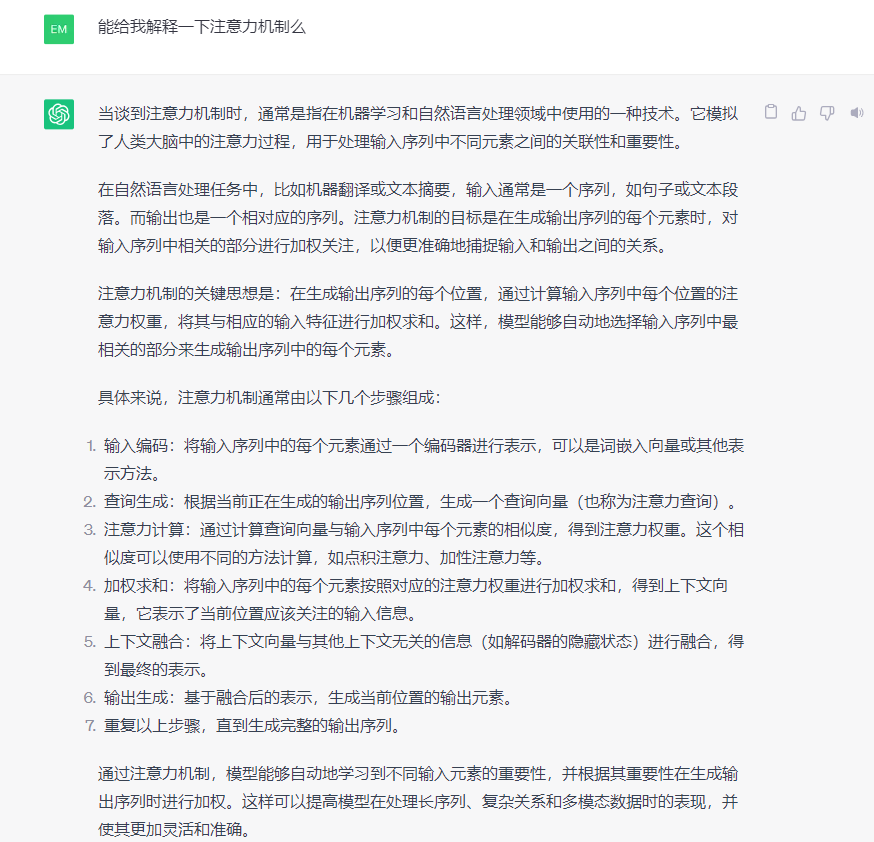
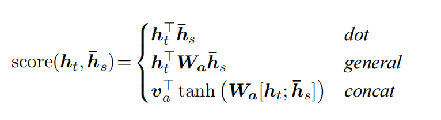
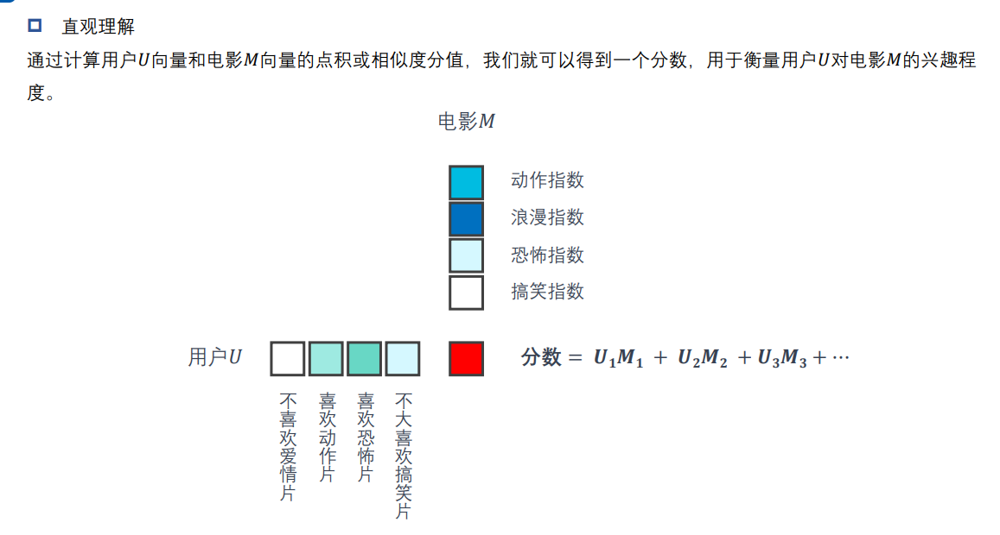
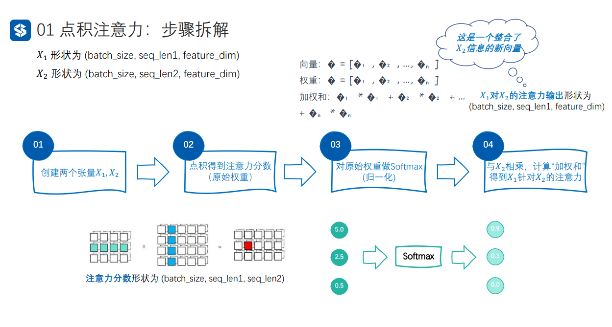
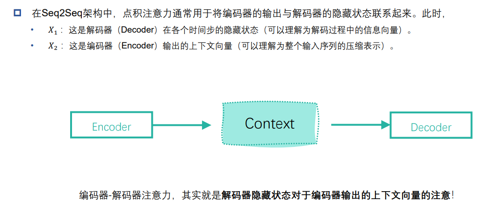
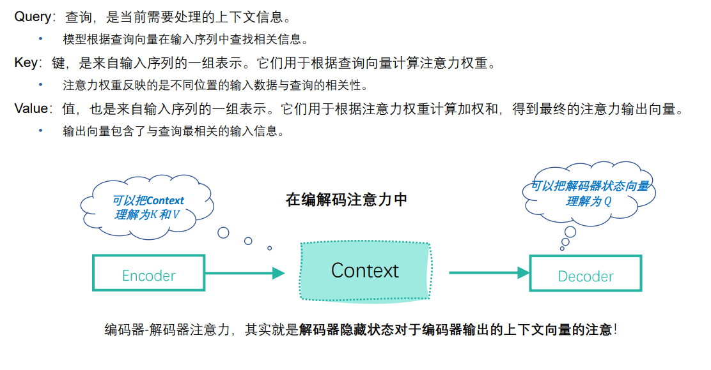
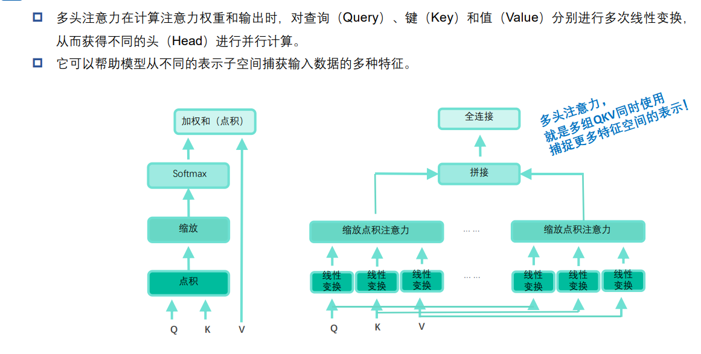
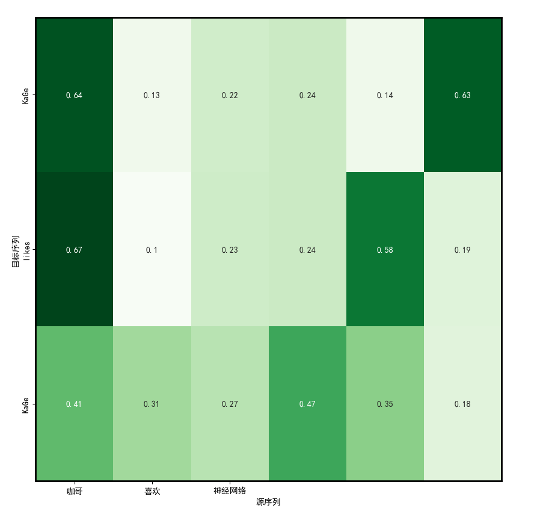

# 自然语言处理: 第五章Attention注意力机制

## 理论基础

Attention（来自2017年google发表的[[1706.03762] Attention Is All You Need (arxiv.org)](https://arxiv.org/abs/1706.03762) ），顾名思义是注意力机制，字面意思就是你所关注的东西，比如我们看到一个非常非常的故事的时候，但是其实我们一般能用5W2H就能很好的归纳这个故事，所以我们在复述或者归纳一段文字的时候，我们肯定有我们所关注的点，这些关注的点就是我们的注意力，而类似How 或者when 这种不同的形式就成为了Attention里的多头的机制。  下图是引自GPT3.5对注意力的一种直观的解释，简而言之其实就是各种不同(多头)我们关注的点(注意力)构成了注意力机制，这个奠定现代人工智能基石的基础。



<br />

<br />

那么注意力机制的优点是什么呢？ (下面的对比是相对于上一节的Seq2Seq模型)

1. 解决了长距离依赖问题，由于Seq2Seq模型一般是以时序模型eg RNN / Lstm / GRU 作为基础, 所以就会必然导致模型更倾向新的输入 -- 多头注意力机制允许模型在解码阶段关注输入序列中的不同部分
2. 信息损失：很难将所有信息压缩到一个固定长度的向量中(encorder 输出是一个定长的向量)  -- 注意力机制动态地选择输入序列的关键部分
3. 复杂度和计算成本：顺序处理序列的每个时间步 -- 全部网络都是以全连接层或者点积操作，没有时序模型
4. 对齐问题：源序列和目标序列可能存在不对齐的情况 -- 注意力机制能够为模型提供更精细的词汇级别对齐信

<br />

<br />

注意力可以拆解成下面6个部分，下面会在代码实现部分逐个解释


<br />

1. **缩放点积注意力**

两个向量相乘可以得到其相似度， 一般常用的是直接点积也比较简单，原论文里还提出里还提出了下面两种计算相似度分数的方式， 也可以参考下图。



<br />

<br />

**其实相似度分数，直观理解就是两个向量点积可以得到相似度的分数，加权求和得到输出。**


<br />


<br />


然后就是对点积注意力的拆解首先我们要明确目标我们要求解的是X1关于X2的注意力输出，所以首先需要确定的是X1 和 X2 的特征维度以及batch_size肯定要相同，然后是seq长度可以不同。 然后我们计算原始注意力权重即X1(N , seq1 , embedding) · X2(N , seq2 , embedding) -> attention( N , seq1 , seq2) , 可以看到我们得到了X1中每个单词对X2中每个单词的注意力权重矩阵所以维度是(seq1 , seq2)。

当特征维度尺寸比较大时，注意力的值会变得非常大，从而导致后期计算softmax的时候梯度消失，所以这里会对注意力的值做一个缩小，也就是将点积的结果/scaler_factor， 这个scaler_factor一般是embedding_size 的开根号。

然后我们对X2的维度做一个softmax 得到归一化的注意力权重，至于为什么是X2，是因为我们计算的是X1关于X2的注意力，所以在下一步我会会让整个attention 权重与X2做点积也就是加权求和，这里需要把X2对应的权重做归一化所以要对X2的权重做归一化。

也就是X1 与 X2 之间相互每个单词的相似度(score) 因为我们求的是X1 关于X2的注意力，所以最后我们将归一化后的权重与X2做一个加权求和(点积)即Attention_scaled(N , seq1 , seq2) · X2(N , seq2 , embedding) -> X1_attention_X2( N , seq1 , embedding) 这个时候我们可以看到最后的输出与X1的维度相同，但是里面的信息已经是整合了X2的信息的的X1'。




<br />


<br />


3. **编解码注意力**
   这个仅存在Seq2Seq的架构中，也就是将编码器的最后输出与解码器的隐藏状态相互结合，下图进行了解释可以看到encoder将输入的上下文进行编码后整合成一个context 向量，由于我们最后的输出是decoder 所以这里X1 是解码器的隐层状态，X2 是编码器的隐层状态。

   


<br />


<br />


**4. QKV**

下面介绍的就是注意力中一个经常被弄混的概念，QKV, 根据前面的只是其实query 就是X1也就是我们需要查询的目标， Key 和 Value 也就是X2，只是X2不同的表现形式，K 可以等于 V 也可以不等，上面的做法都是相等的。



6. **自注意力**

   最后就是注意力机制最核心的内容，也就是自注意力机制，那么为什么多了一个自呢？其实就是X1 = X2 ，换句话说就是自己对自己做了一个升华，文本对自己的内容做了一个类似summary的机制，得到了精华。就如同下图一样，自注意力的QKV 都来自同一个输入X向量，最后得到的X'， 它是自己整合了自己全部信息向量，它读完了自己全部的内容，并不只是单独的一个字或者一段话，而是去其糟粕后的X。


而多头自注意力也就是同样的X切分好几个QKV， 可以捕捉不同的重点(类似一个qkv捕捉when ， 一个qkv捕捉how)，所以多头是有助于网络的表达，然后这里需要注意的是多头是将**embedding  - > (n_head , embedding // n_head ) , 不是(n_head , embedding)。**

所以多头中得到的注意力权重的shape也会变成(N , n_head ， seq , seq ) 这里由于是自注意力 所以seq1 = seq2 = seq 。



<br />


<br />


## 代码实现


这里只介绍了核心代码实现， 下面是多头注意力的实现:

```
import torch.nn as nn # 导入torch.nn库
# 创建一个Attention类，用于计算注意力权重
class Mult_attention(nn.Module):
    def __init__(self, n_head):
        super(Mult_attention, self).__init__()
        self.n_head = n_head

    def forward(self, decoder_context, encoder_context , dec_enc_attn_mask): # decoder_context : x1(q) , encoder_context : x2(k , v)
        # print(decoder_context.shape, encoder_context.shape) # X1(N , seq_1 , embedding) , X2(N , seq_2 , embedding)
        # 进行切分 , (N , seq_len_X , emb_dim) -> (N , num_head , seq_len_X , head_dim) / head_dim * num_head  = emb_dim
        Q = self.split_heads(decoder_context)  # X1
        K = self.split_heads(encoder_context)  # X2
        V = self.split_heads(encoder_context)  # X2
        # print(Q.shape , 0)

        # 将注意力掩码复制到多头 attn_mask: [batch_size, n_heads, len_q, len_k]
        attn_mask = dec_enc_attn_mask.unsqueeze(1).repeat(1, self.n_head, 1, 1)

        # 计算decoder_context和encoder_context的点积，得到多头注意力分数，其实就是在原有的基础上多加一个尺度
        scores = torch.matmul(Q, K.transpose(-2, -1)) # -> (N , num_head , seq_len_1 , seq_len_2)
        scores.masked_fill_(attn_mask , -1e9)
        # print(scores.shape ,1 )

        # 自注意力原始权重进行缩放
        scale_factor = K.size(-1) ** 0.5
        scaled_weights = scores / scale_factor # -> (N , num_head , seq_len_1 , seq_len_2)
        # print(scaled_weights.shape , 2)

        # 归一化分数
        attn_weights = nn.functional.softmax(scaled_weights, dim=-1) # -> (N , num_head , seq_len_1 , seq_len_2)
        # print(attn_weights.shape , 3)

        # 将注意力权重乘以encoder_context，得到加权的上下文向量
        attn_outputs = torch.matmul(attn_weights, V) # -> (N , num_head , seq_len_1 , embedding // num_head)
        # print(attn_outputs.shape , 4) 

        # 将多头合并下(output  & attention)
        attn_outputs  = self.combine_heads(attn_outputs) # 与Q的尺度是一样的
        attn_weights = self.combine_heads(attn_weights)
        # print(attn_weights.shape , attn_outputs.shape , 5) #
        return attn_outputs, attn_weights
  
    # 将所有头的结果拼接起来，就是把n_head 这个维度去掉，
    def combine_heads(self , tensor):
        # print(tensor.size())
        batch_size, num_heads, seq_len, head_dim = tensor.size()
        feature_dim = num_heads * head_dim
        return tensor.transpose(1, 2).contiguous().view(batch_size, seq_len, feature_dim)


    def split_heads(self , tensor):
        batch_size, seq_len, feature_dim = tensor.size()
        head_dim = feature_dim // self.n_head
        # print(tensor.shape, head_dim , self.n_head)
        return tensor.view(batch_size, seq_len, self.n_head, head_dim).transpose(1, 2)
```


<br />

<br />


多头注意力的解码器，这里添加了mask机制。

```
class DecoderWithMutliHeadAttention(nn.Module):
    def __init__(self, hidden_size, output_size , n_head):
        super(DecoderWithMutliHeadAttention, self).__init__()
        self.hidden_size = hidden_size # 设置隐藏层大小
        self.n_head = n_head # 多头
        self.embedding = nn.Embedding(output_size, hidden_size) # 创建词嵌入层
        self.rnn = nn.RNN(hidden_size, hidden_size, batch_first=True) # 创建RNN层
        self.multi_attention = Mult_attention(n_head = n_head)
        self.out = nn.Linear(2 * hidden_size, output_size)  # 修改线性输出层，考虑隐藏状态和上下文向量


    def forward(self, inputs, hidden, encoder_outputs , encoder_input):
        embedded = self.embedding(inputs)  # 将输入转换为嵌入向量
        rnn_output, hidden = self.rnn(embedded, hidden)  # 将嵌入向量输入RNN层并获取输出 
        dec_enc_attn_mask = self.get_attn_pad_mask(inputs, encoder_input) # 解码器-编码器掩码
        context, attn_weights = self.multi_attention(rnn_output, encoder_outputs , dec_enc_attn_mask)  # 计算注意力上下文向量
        output = torch.cat((rnn_output, context), dim=-1)  # 将上下文向量与解码器的输出拼接
        output = self.out(output)  # 使用线性层生成最终输出
        return output, hidden, attn_weights
  
    def get_attn_pad_mask(self , seq_q, seq_k):
        #-------------------------维度信息--------------------------------
        # seq_q 的维度是 [batch_size, len_q]
        # seq_k 的维度是 [batch_size, len_k]
        #-----------------------------------------------------------------
        # print(seq_q.size(), seq_k.size())
        batch_size, len_q = seq_q.size()
        batch_size, len_k = seq_k.size()
        # 生成布尔类型张量[batch_size，1，len_k(=len_q)]
        pad_attn_mask = seq_k.data.eq(0).unsqueeze(1)  #<PAD> Token的编码值为0 
        # 变形为何注意力分数相同形状的张量 [batch_size，len_q，len_k]
        pad_attn_mask = pad_attn_mask.expand(batch_size, len_q, len_k)
        #-------------------------维度信息--------------------------------
        # pad_attn_mask 的维度是 [batch_size，len_q，len_k]
        #-----------------------------------------------------------------
        return pad_attn_mask # [batch_size，len_q，len_k]
```


<br />


<br />


## 结果

整体实验结果如下，可能是因为整体语料库太小了，所以翻译结果不是太好，但是多头注意力机制还是都跑通了:



