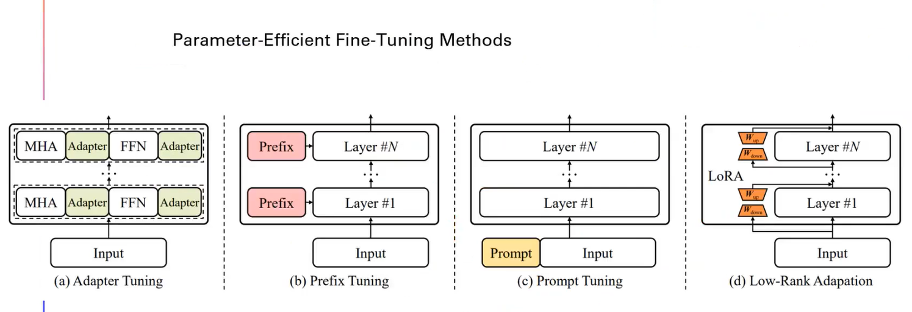
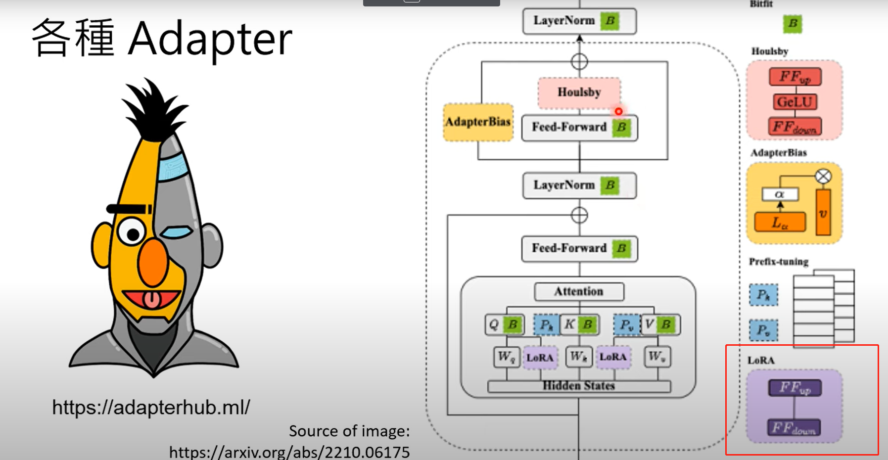
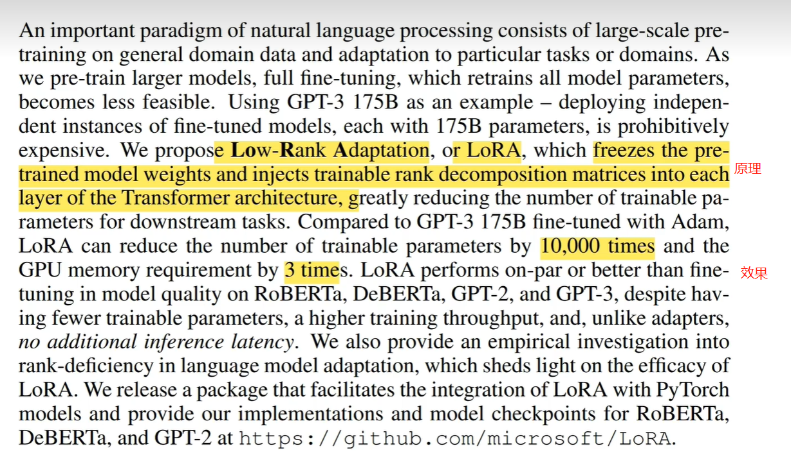
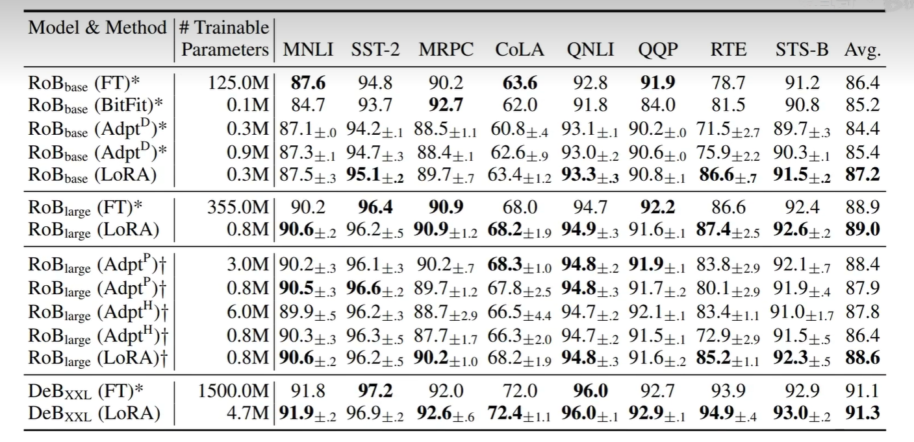
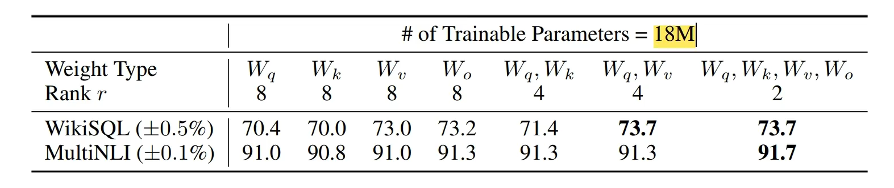
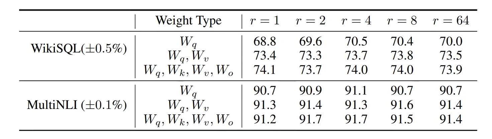
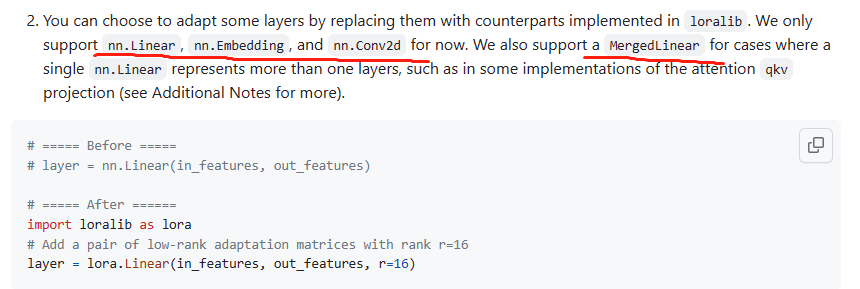

# 自然语言处理: 第十二章LoRA解读

论文地址:[[2106.09685] LoRA: Low-Rank Adaptation of Large Language Models (arxiv.org)](https://arxiv.org/abs/2106.09685)

## 理论基础

自从GPT-3.5问世以来，整个AI界基本都走向了大模型时代，而这种拥有数亿参数的大模型对于普通玩家来说作全量微调基本是不可能的事。从而微软公司提出了LoRA(low-Rank Adaptation) 对大模型进行微调的技术，简单的来说就是针对于fine_tune的过程并不是全量微调，而是更像加入了一个adapter插件(与fine_tune技术相对于的一种对于大模型适应下游任务的训练手段，其宗旨是并不改变大模型的参数，而是在大模型的基础上增加一些额外的架构，可以参考[AdapterHub - 572 adapters for 76 text tasks and 50 languages](https://adapterhub.ml/) ， 上面有各种各样的adapter) --- 降低模型的参数的秩(**有关于秩的概念，不清楚的大概可以理解成矩阵中线性无关的行或者列的最大数量**)而只去训练那些关键的参数，但是并不改变原始预训练模型的参数，从而大大的降低了可训练参数的数量从而加快了训练速度，并且拥有与全量微调相近甚至过犹不及的效果，这就是LoRA niubility的地方了。

针对于现在的大模型参数大的特点，全量微调对于很多非商业的使用者来说是非常不友好的，因此parameter-efficcient fine-tuning methods(PEFT)就提出来了，其并不需要去调整整个大模型的参数，而是去高校的优化模型的部分参数或者说是能适用于下游任务的新参数。下面是目前几个流行的方法

* Adapter Tuning: 在transformer架构中增加其他模块
* Prefix Tuning: 在每一个注意力前增加prefix
* Prompt tuning: 去不断的改变prompt(模板)的embedding，这里的promot 可以是有语义信息的hard prompt 也可以是没有任何语义信息的sofr promot([P-tuing](https://blog.csdn.net/victor_manches/article/details/136466792?spm=1001.2014.3001.5502))
* LoRA: 将原始的参数替换成低秩的矩阵，从而去优化这个低秩矩阵，也可以看成是一种adapter

Adapter这种技术核心思想是不改变原有的预训练语言模型的基础架构，而是在原有的架构基础上增加新的模块，比如Bitfit, Houisby , AdapterBias , prefix-tuning以及本文要讨论的LoRA。下面让我们来跟着论文一起走进lora的世界。

 

首先看看摘要部分,作者提出如果要对GPT-3 175B参数的模型进行全量微调的成本太高了，因此lora应运而生，其主要原理就是冻结原模型的权重并且在transformer结构中注入可训练的低秩分解矩阵(其实就是做了一个低秩矩阵分解)，其在Adam下的效果可以看到训练参数降低了10000倍，GPU内存节省了3倍，并且训练的效果在多个模型上都能达到全量微调的匹配的效果，除此之外，在Pytorch上集成了LoRA的包，以方便开发者使用这么看还是非常牛逼的。

作者在原论文中提出，在lora提出之前，对于fine_tune大模型过程中，新模型包含原始模型相同数量的参数，之前的对于改善的工作大部分都是在效果和效率之间的一个权衡，最终效果都不是很理想。作者发现在模型自适应的过程中权重的改变有着低秩内核，换句话说就是模型在自适应下游任务过程中参数的改变量是低秩的(其实只有少部分权重参数是起决定性作用的)，基于此lora的思想就提出来了，如下图，作者首先将预训练的模型参数全部冻结记作W(维度为 d * k), 然后模型重新注入**两个低秩可训练的参数矩阵A(维度为d * r) 以及 B(维度为r * k), 其中r为秩,并且远远小于d 和k的最小值一般取 1 , 2 , 4 , 8, 16....，记作▲W =  A * B**。原始的模型参数就变成了W0 + ▲W = W0 + A * B ，从而整个模型的输出也就从 h = W0 * X 变成了 h = (W0 + A * B) * X = W0 * X + A * B * X。并且对于AB矩阵，作者分别进行了不同的初始化处理，A矩阵进行了随机高斯初始化，对B进行0初始化，所以最开始的时候模型输出由于▲W =  A * B = 0 还是就等于W0 * X，并且作者还加入了一个缩放因子α ， 对于▲W 进行的大小进行缩小，缩小α / r 倍，具体细节可以参考原文。

基于此的LoRA拥有由于加入了两个低秩矩阵的乘积从而有两个好处:

* **通用性和适应性强，理论上适配所以模型，并且效果理想**
* **推断过程不会引入推理延迟，对于不同的下游任务不用担心知识迁移效果不理想，直接将BA矩阵拿掉就可以恢复原始模型，从而根据不同的BA可以搭建不同的模型。**

 

 

下面看一下作者原论文中的实际应用效果，横向的各个指标的意思放在下面了，其中base / large / XXL 表示的是模型大小。FT代表fine-tuning， 可以看到lora调整的参数是大大的降低，大部分效果也比全量微调好。

* MNLI:自然语言推断任务
* SST-2: 情感分析任务
* MRPC: 句子对匹配任务
* CoLA: 语言可接受性判断任务
* QNLI: 自然语言推断任务
* QQP: 句子对匹配任务
* RTE: 自然语言推断任务
* STS-B: 句子相似性任务

 

其次作者还研究了对于transformer模块中QKVO权重矩阵的研究，效果如下，可以发现将lora放置分散的放置在不同权重参数下，效果最佳。

 

那关于秩r的取值，作者也提出对于一般普通的任务取 1 / 2 /4 /8 就可以了，效果就能比较理想。

总结一下LoRA的优点总共有以下几点：

1. 一个基础的预训练模型可以部署多个下游任务，大大减少了参数量
2. 推理阶段无额外的计算量，大大的减少了延迟
3. 与其他参数微调方法正交，可以混合使用
4. 训练效果好，性能稳定

 

 

 

 

 

 

## 代码

Git地址: [microsoft/LoRA: Code for loralib, an implementation of &#34;LoRA: Low-Rank Adaptation of Large Language Models&#34; (github.com)](https://github.com/microsoft/LoRA)

由于LoRA是微软自研的，所以整个代码都非常成熟了，想使用的可以参考主页的介绍进行操作，下面我这里简单的介绍一下。

### 安装

`pip install loralib`

`pip install git+https://github.com/microsoft/LoRA`

上面两行命令都行

### 使用

目前支持linear / embedding / conv2d 这些层，使用起来也很方便直接lora.(in , out , r)多输入一个秩就行

如果想对transformer架构进行设置，可以qkv单独设置，同样也可以直接用mergedlinear。

训练模型时，需要设置lora.mark_only_lora_as_trainable，也就是把原始参数冻结，其余的与原始训练机制相同

模型保存与torch一致，读取时需要将strict 参数设置成false

