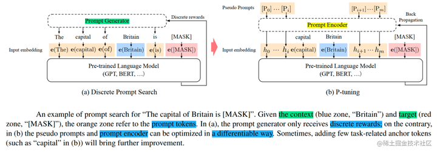

 

# 自然语言处理: 第十三章P-tuing系列之P-tuning V1

项目地址: [P-Tuning](https://github.com/THUDM/P-tuning)

论文地址: [[2103.10385] GPT Understands, Too (arxiv.org)](https://arxiv.org/abs/2103.10385)

 

## 理论基础

正如果上一节介绍LoRA([自然语言处理: 第十二章LoRA解读_lora自然英语处理-CSDN博客](https://blog.csdn.net/victor_manches/article/details/132287864?spm=1001.2014.3001.5502))一样,本次介绍的在21年由清华团推提出来的 P-Tuning V1系列也属于PEFT(参数高效微调系列)里的一种，其核心思想就是利用在下游任务中前置添加若干个可更新参数的虚拟[tokens] 所构成的模板prompt 再输入到文本中(不同于BERT添加额外的编码器层或者任务头)，从而能达到在模型达到一定量规模以上时，效果就可以媲美全量微调。如同下面的例子，对于一个文本(情感)分类的任务，你输入一个 I love this movie ，LM(language model)通过prompt(**模板:就是由 [token] 构成的前缀/后缀，注意下面的例子的模板是自然语言的，但是在p-tuing里这些token是否真的需要有意义？** 通过这些模版我们使得下游任务跟预训练任务一致，这样才能更加充分地利用原始预训练模型，起到更好的零样本、小样本学习效果)的加入就会输出[pos] / [neg] 从而自动的完成这个文本分类任务或者其他NLP任务。

 

但是这种人为的去构prompt造模板有一系列问题，比如，在GPT-3采用人工构造的模版来做上下文学习（in context learning），最后LM性能对模板的变化特别敏感，加一个词或者少一个词，或者变动位置都会造成比较大的变化。下图就列举出了LAMA 模型在不同的prompt模板下的性能差异。同时，近来的自动化搜索模版工作成本也比较高，以前这种离散化的token的搜索出来的结果可能并不是最优的，导致性能不稳定。**针对于模板的设计问题，我们并不关心模版长什么样， **我们只需要知道模版由哪些token组成，该插入到哪里，插入后能不能完成我们的下游任务，输出的候选空间是什么** 。模版是不是自然语言组成的，对我们根本没影响，“自然语言”的要求，只是为了更好地实现“一致性”，但不是必须的。**

 

于是，P-tuning考虑了如下形式的模版：作者提出了P-Tuning，设计了一种连续可微位置可变的virtual token（同Prefix-Tuning类似），通过输入n个虚拟的 token 拼接原始的input后，模型就学会了下游任务跟预训练任务一致。

 

 

那么P-Tuning是如何将这些不具备语义信息的virtual token作为prompt 结合input 输入给模型的呢？ 经过预训练的LM的词嵌入已经变得高度离散，如果随机初始化virtual token，容易优化到局部最优值，而这些virtual token理论是应该有相关关联的。作者通过实验将Prompt表征为为可以学习的prompt-encorder层，即用两层MLP(relu)+双向LSTM的方式来对Prompt Embedding进行一层处理。

 

相比Prefix Tuning，P-Tuning加入的可微的virtual token，但仅限于输入层，没有在每一层都加(这点在v2中有了改进)；另外，virtual token的位置也不一定是前缀，插入的位置是可选的。这里的出发点实际是把传统人工设计模版中的真实token替换成可微的virtual token。在下图中可以看到prompt-encoder生成的虚拟token 会选择性的插入到原始input的不同位置中去，从而更好的接近真实的有语义的token

## 实际效果

下图原作者在SuperGLUE上的实验结果，那么： **1）GPT、BERT的效果相比直接finetune都有所提升；2）GPT的效果还能超过了BERT** 。这表明GPT不仅有NLG的能力，也有NLU能力，可谓是把GPT的潜能充分“压榨”出来了，当然BERT配合P-tuning也有提升，说明P-tuning对语言模型潜能的释放是较为通用的。相比于全量微调的fine-tuning , P-tuning可以选择只优化几个Token的参数(即prompt-encoder 的参数)，因为优化所需要的显存和算力都会大大减少，**所以P-tuning实则上给了我们一种在有限算力下调用大型预训练模型的思路。**

 

 

**关于How P-tuing works? **事实上，提出这个问题的读者，应该是对BERT加个全连接层的直接finetune做法“习以为常”了。很明显，不管是PET还是P-tuning，它们其实都更接近预训练任务，而加个全连接层的做法，其实还没那么接近预训练任务，所以**某种程度上来说，P-tuning有效更加“显然”，反而是加个全连接层微调为什么会有效才是值得疑问的。**

去年有篇论文 **[《A Mathematical Exploration of Why Language Models Help Solve Downstream Tasks》](https://link.zhihu.com/?target=https%3A//arxiv.org/abs/2010.03648)** 试图回答这个问题，大致的论证顺序是：

1.预训练模型是某种语言模型任务；

2.下游任务可以表示为该种语言模型的某个特殊情形；

3.当输出空间有限的时候，它又近似于加一个全连接层；

4.所以加一个全连接层微调是有效的。

可以看到，该论文的假设主要是第2点，其实就是直接假设了下游任务可以表达为类似PET的形式，然后才去证明的。所以这进一步说明了，PET、P-tuning等才是更自然的使用预训练模型的方式，加全连接直接finetune的做法其实只是它们的推论罢了，也就是说，PET、P-tuning才是返璞归真、回归本质的方案，所以它们更有效。

## 参考文献资料

[【自娱自乐读paper】p-tuning v2论文精读_哔哩哔哩_bilibili](https://www.bilibili.com/video/BV1JQ4y1H7DR/?spm_id_from=333.337.search-card.all.click&vd_source=7660edfc8efcdd6e371b5a2c5bfc45bd)

[P-tuning：自动构建模版，释放语言模型潜能 - 知乎 (zhihu.com)](https://zhuanlan.zhihu.com/p/364141928)

[大模型参数高效微调技术原理综述（三）-P-Tuning、P-Tuning v2 - 知乎 (zhihu.com)](https://zhuanlan.zhihu.com/p/635848732)
