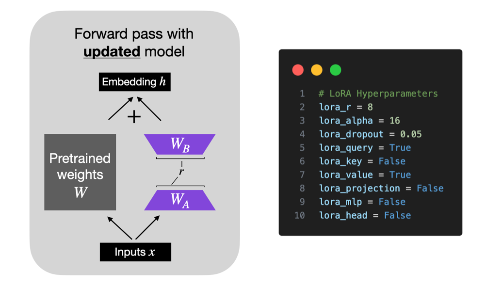
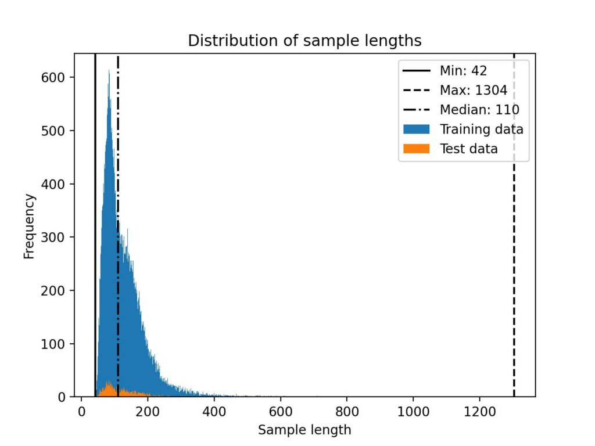
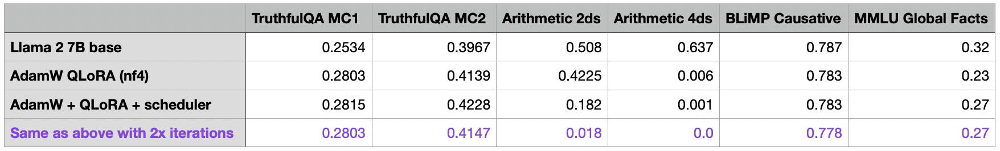
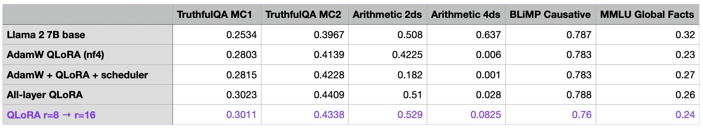
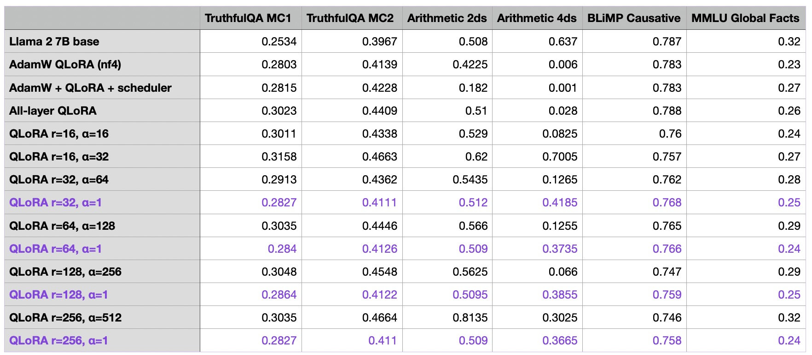

# 自然语言处理: 第十九章LoRA&QLoRA微调技巧

论文地址：[使用低秩自适应 （LoRA） 进行参数高效LLM微调 - Lightning AI --- Parameter-Efficient LLM Finetuning With Low-Rank Adaptation (LoRA) - Lightning AI](https://lightning.ai/pages/community/tutorial/lora-llm/)


<br />


<br />


本篇文章是由位来自威斯康星大学麦迪逊分校的统计学助理教授Sebastian Raschka，也是人工智能平台Lightning AI的LLM研究员，进行了成百上千次关于LoRA的实验。他的实验日记为我们提供了宝贵的见解，包括如何节省内存、选择最佳配置等问题。他的研究回答了一些关键问题，例如是否应该用SGD取代AdamW，使用调度器的潜在价值，以及如何调整LoRA的超参数。


<br />


## 实验内容

由于之前的文章已经着重的分别介绍了[LoRA](https://blog.csdn.net/victor_manches/article/details/132287864?spm=1001.2014.3001.5502) 和 QLoRA ，这里就不在赘述原理了，主要解释一下LoRA的几个超参数:

* r: `rank`也就是LoRA的低秩的秩的大小)，较小的 r 导致更简单的低秩矩阵，从而导致在适应过程中学习的参数更少。这可以加快训练速度，并可能降低计算需求。但是，随着 r 的越小，低秩矩阵捕获特定于任务的信息的能力就会降低。这可能会导致适应质量降低，并且与较高的 r 相比，模型在新任务上的表现可能不如新任务。总之，在 LoRA 中选择较小的 r 需要在模型复杂性、适应能力以及欠拟合或过拟合的风险之间进行权衡。因此，重要的是要尝试不同的 r 值，以找到合适的平衡点，以在新任务上实现所需的性能。
* alpha:`alpha` 是一个比例因子，这个系数用于在前向传播过程中将 LoRA 权重应用于预训练之中，用于调整组合结果的大小（原始模型输出加上低秩适应）。这平衡了预训练模型的知识和新的特定于任务的适应（默认情况下， `alpha` 通常设置为 1）。正如下图中的公式所示，LoRA 权重的值越大，影响就越大

  ```
  scaling = alpha / r
  weight += (lora_B @ lora_A) * scaling
  ```
* dropout: 随机丢失
* q  & k & v: 是否对是否对自注意力的q & k & v 进行训练
* projection: 是否对投影层进行训练
* mlp: 是否线性层进行训练
* head: 是否输出头进行训练



### 微调数据集

<br />

作者使用[Alpaca 数据集](https://link.zhihu.com/?target=https%3A//github.com/gururise/AlpacaDataCleaned)进行监督指令微调。当然，还有许多其他数据集可用于指令微调，包括 LIMA、Dolly、LongForm、FLAN 等。然而，探索多个数据集和数据集混合的训练将是未来研究的一个有趣的主题。
Alpaca 数据集由大约 50k 个用于训练的指令-响应对组成，输入大小的中位长度为 110 个标记（使用 Llama 2 [SentencePiece](https://link.zhihu.com/?target=https%3A//github.com/google/sentencepiece)标记器），如下面的直方图所示



<br />


### 模型选择

作者在[phi-1.5 1.3B](https://arxiv.org/abs/2309.05463), [Mistral 7B](https://arxiv.org/abs/2310.06825), [Llama 2 7B](https://arxiv.org/abs/2307.09288), Llama 2 13B, and [Falcon 40B](https://falconllm.tii.ae/) 五个模型种分别进行了性能评估，最终选择了Llama2 7B作为本次实验的对照组。


<br />

### 性能评估

作者对于模型评估，我从 Eleuther AI 的[评估工具](https://link.zhihu.com/?target=https%3A//github.com/EleutherAI/lm-evaluation-harness/tree/master)中选择了一小部分任务，包括[TruthfulQA](https://link.zhihu.com/?target=https%3A//github.com/sylinrl/TruthfulQA)、[BLiMP Causative、](https://link.zhihu.com/?target=https%3A//github.com/alexwarstadt/blimp) [MMLU Global Facts](https://link.zhihu.com/?target=https%3A//github.com/hendrycks/test)以及具有两位数（算术 2ds）和四位数字（算术 4ds）的简单算术任务。在每个基准测试中，模型性能分数在 0 到 1 之间标准化，其中 1 是满分。**（主要是评估算数和QA的性能)**


<br />


## 代码框架

作者使用的自定义 LLM 微调代码基于开源[Lit-GPT 存储库](https://link.zhihu.com/?target=https%3A//github.com/Lightning-AI/lit-gpt)。这部分我看了下还比较简单，大家如果想要复现作者的结果的话，可以参考作者原文以及Lit-GPT库。


<br />


<br />


## 实验结果

首先，我使用以下默认设置评估了 LoRA 微调（这些设置可以在微调/lora.py 脚本中更改）：

### LoRA & QLoRA的影响

```
# Hyperparameters
learning_rate = 3e-4
batch_size = 128
micro_batch_size = 1
max_iters = 50000  # train dataset size
weight_decay = 0.01
lora_r = 8
lora_alpha = 16
lora_dropout = 0.05
lora_query = True
lora_key = False
lora_value = True
lora_projection = False
lora_mlp = False
lora_head = False
warmup_steps = 100
```

此配置在总共 6,738,415,616 个可训练参数中训练了 4,194,304 个 LoRA 参数，使用单个 A100 在我的机器上花费了大约 1.8 小时。最大内存使用量为 21.33 GB。为了衡量方差，我重复了三次实验，以观察运行之间的性能波动，结果如下。可以发现几点:

1. 运行之间的性能非常一致和稳定
2. LoRA 默认模型在算术方面变得非常糟糕，但这可能是意料之中的，因为据我所知，Alpaca 不包含 （m）任何算术任务。**(所以微调的数据集任务一定要由一定的倾向性，或者泛化性去对齐下游任务的性能)**


除此之外，作者还同时做了QLoRA(4-bit下)的对比:可以发QLoRA能够明显的降低显存占用，但是也极大的提高了训练时间(我们可以看到 QLoRA 将内存需求降低了近 6 GB。然而，代价是训练时间减慢 30%，这是由于额外的量化和解定步骤而可以预料的)。但是在性能上QLoRA对模型性能的影响确实很小。该模型在算术基准上有所改进，但在MMLU Global Facts基准上有所下降。所以作者本着节省内存的目的，后续都利用QLoRA来作为对照组。


默认 LoRA（使用 bfloat-16）：

* Training time: 6685.75s 训练时间：6685.75s
* Memory used: 21.33 GB 使用的内存：21.33 GB

QLoRA 通过 –-量化 “bnb.nf4”：

* Training time: 10059.53s 训练时间：10059.53s
* Memory used: 14.18 GB 使用的内存：14.18 GB

QLoRA 通过 –quantize “bnb.fp4”：

* Training time: 9334.45s 训练时间：9334.45秒
* Memory used: 14.19 GB 使用的内存：14.19 GB


<br />


<br />


### Optimizer的影响

我在之前的所有实验中都使用了 AdamW 优化器，因为它是训练的LLM常见选择。但是，众所周知，Adam 优化器可能非常占用内存。这是因为它为每个模型参数引入并跟踪两个附加参数（ m 和 v）。本节探讨是否值得将 AdamW 换成 SGD 优化器。但是，对于 SGD 优化器，引入学习速率调度器尤为重要。我选择了余弦退火scheduler，在每次批量更新后降低学习率。作者发现:

1. 将 AdamW 与 SGD 交换只能节省少量内存，从14.18GB -》 14.15GB
2. SGD 优化器的性能似乎与 AdamW 相当。有趣的是，当将调度程序添加到 AdamW 时，TruthfulQA MC2 和 MMLU Global Facts 性能有所提高，但算术性能有所下降。（注意：TruthfulQA MC2 是其他公共排行榜中广为人知的基准测试。目前，我们不会过分强调算术性能，而是使用带有调度器的 AdamW 继续进行本文中的其余实验。(意思就是很玄学， 所以没太大差异)


<br />


<br />


### 数据集的影响

到目前为止，我已经用 50k 次迭代训练了所有模型——Alpaca 数据集有 50k 次训练示例。显而易见的问题是，我们是否可以通过多次迭代训练集来提高模型性能，因此我运行了之前的 100k 迭代实验，增加了 2 倍：整体结果如下：

1. 增加的迭代会导致整体性能更差。对于算术基准来说，下降幅度最大。我的假设是，Alpaca 数据集不包含任何相关的算术任务，并且当模型更多地关注其他任务时，它会主动取消学习基本算术。(相当于过拟合微调的数据集了)



<br />


### LoRA本身超参数的影响

#### LoRA 超参数调优第 1 部分：适用于所有层的 LoRA

现在我们已经探索了围绕 LoRA 微调脚本的基本设置，让我们将注意力转向 LoRA 超参数本身。默认情况下，LoRA 仅对多头自注意力块中的 Key 和 Query 矩阵启用。现在，我们还为值矩阵、投影层和线性层启用了它：


<br />


#### LoRA 超参数调优第 2 部分：提高 R

最重要的 LoRA 参数之一是“r”，它决定了 LoRA 矩阵的秩或维度，直接影响模型的复杂性和容量。较高的“r”表示较强的表现力，但可能导致过度拟合，而较低的“r”可以减少过度拟合，但会牺牲表现力。让所有层都启用 LoRA，让我们将 r 从 8 增加到 16，看看这对性能有什么影响：

1. ***作者这里暗示了参数r和alpha需要二者结合进行调参，最佳设置是alpha = 2 * r* **




<br />


<br />


#### LoRA 超参数调优第 3 部分：更改 Alpha

在上一节中，我们增加了矩阵秩 r，同时保持 LoRA 的 alpha 参数不变。较高的“alpha”将更强调低秩结构或正则化，而较低的“alpha”将降低其影响，使模型更多地依赖原始参数。调整“alpha”有助于在拟合数据和通过正则化模型来防止过度拟合之间取得平衡。根据经验，**在微LLMs调时，通常选择比秩大两倍的 alpha（请注意，在使用扩散模型时，这是不同的）**。让我们试试这个，看看当我们将 alpha 增加两倍时会发生什么：

1. **r 和 alpha的增加不会明显影响峰值内存要求**
2. **r 和 alpha 需要共同调整，一般alpha为r的两倍最佳。  然后r的大小一般根据任务集的难度来定（这个需要自己评估，越大适合难度越大的任务，越小适合简单任务）**




<br />


<br />


<br />


<br />


## 结论

本文探讨了使用 LoRA 训练自定义LLMs时可以调整的各种旋钮。

* **我们发现 QLoRA 是一个很好的内存节省器，尽管它增加了运行时成本。**
* **虽然学习速率调度器可能是有益的，但在 AdamW 和 SGD 优化器之间进行选择几乎没有区别。**
* **多次迭代数据集会使结果变得更糟。(过拟合微调数据集)**
* **通过优化 LoRA 设置（包括排名）可以实现最佳收益。增加排名将导致更多可训练的参数，这可能会导致更高程度的过拟合和运行时成本。但是，在提高排名时，选择适当的 alpha 值很重要，一般为2倍的r**
