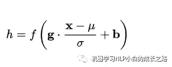

# 自然语言处理: 第二十四章 为什么在NLP领域中普遍用LayerNorm 而不是BatchNorm？

## 前言，

前面讲了[Transformer](https://blog.csdn.net/victor_manches/article/details/132110742?spm=1001.2014.3001.5502) 架构， 其中有一个层归一化layerNorm结构，最近在看不同的大模型结构中也发现会对其优化。但是似乎在CV领域貌似批次归一化BN层用的也很多，那么这两个归一化层到底有什么区别呢？为何在NLP领域几乎都是LN层，而不用BN层呢？

 

 

 

## **一、What is Normalization？**

Normalization：规范化或标准化，就是把输入数据X，在输送给神经元之前先对其进行平移和伸缩变换，将X的分布规范化成在固定区间范围的标准分布。

**变化框架：**

**参数介绍：**

μ：平移参数 ，δ：缩放参数 ，b ：再平移参数， g 再缩放参数，得到的数据符合均值为 b 、方差为g^2 的分布。

 

 

## **二、Why Normalization？**

在机器学习里，在特种工程里，为了消除特征之间尺度影响，所以都会进行scaler。同样的，在深度学习里，Normalization 把数据拉回标准正态分布，因为神经网络的Block大部分都是矩阵运算，一个向量经过矩阵运算后值会越来越大，为了网络的稳定性，我们需要及时把值拉回正态分布。

Normalization根据标准化操作的维度不同可以分为batch Normalization和Layer Normalization，不管在哪个维度上做noramlization，本质都是为了让数据在这个维度上归一化，因为在训练过程中，上一层传递下去的值千奇百怪，什么样子的分布都有。BatchNorm就是通过对batch size这个维度归一化来让分布稳定下来。LayerNorm则是通过对Hidden size这个维度归一化来让某层的分布稳定。

可以这样理解，深度网络每一层网络是相对独立的，也就是说每一层网络可以单独看成一个Classifier.不停对上一层的输出数据进行分类，每一层输出的数据分布又不一样，这就会出现Internal Covariate Shift（内部协变量偏移，这个概念是BN论文里第一次提出）. 随着网络的层数不断增大，这种误差就会不断积累，最终导致效果欠佳。显然对数据预处理只能解决第一层的问题，之后需要Normalization等方法来解决。

一般来说Normalization 可以根据N(样本数量) ， C( 通道数) ,  H , W(这里以CV里的长宽为例，对应NLP领域里的embedding) 分为四种，如上图所示。

 

 

## **三、Batch Normalization 和 Layer Normalization的对比**

先看看gpt的解释，总结一下，其核心在于NLP中句子不同位置(对应的通道C)的概率分布其实是不一样的。而且LN不依赖batch，而是单独的对每个数据单独处理，所以，更适合变长序列(NLP 中会出现padding 的方式来处理变长数据，所以对这些padding的0的维度，对齐进行norm 意义不大)的任务。

### **3.1 理解上**

BatchNorm是对一个batch-size样本内的每个特征做归一化，LayerNorm是对每个样本的所有特征做归一化。BN 的转换是针对单个神经元可训练的：不同神经元的输入经过再平移和再缩放后分布在不同的区间；而 LN 对于一整层的神经元训练得到同一个转换：所有的输入都在同一个区间范围内。如果不同输入特征不属于相似的类别（比如颜色和大小），那么 LN 的处理可能会降低模型的表达能力。

 **BN抹杀了不同特征之间的大小关系，但是保留了不同样本间的大小关系；LN抹杀了不同样本间的大小关系，但是保留了一个样本内不同特征之间的大小关系。（理解：** BN对batch数据的同一特征进行标准化，变换之后，纵向来看，不同样本的同一特征仍然保留了之前的大小关系，但是横向对比样本内部的各个特征之间的大小关系不一定和变换之前一样了，因此抹杀或破坏了不同特征之间的大小关系，保留了不同样本之间的大小关系；LN对单一样本进行标准化，样本内的特征处理后原来数值大的还是相对较大，原来数值小的还是相对较小，不同特征之间的大小关系还是保留了下来，但是不同样本在各自标准化处理之后，两个样本对应位置的特征之间的大小关系将不再确定，可能和处理之前就不一样了，所以破坏了不同样本间的大小关系）

 

 

### **3.2 使用场景上**

在BN和LN都能使用的场景中，BN的效果一般优于LN，原因是基于不同数据，同一特征得到的归一化特征更不容易损失信息。但是有些场景是不能使用BN的，例如batch size较小或者序列问题中可以使用LN。这也就解答了**RNN 或Transformer为什么用Layer Normalization？**

**首先**RNN或Transformer解决的是序列问题，一个存在的问题是不同样本的序列长度不一致，而Batch Normalization需要对不同样本的同一位置特征进行标准化处理，所以无法应用；当然，输入的序列都要做padding补齐操作，但是补齐的位置填充的都是0，这些位置都是无意义的，此时的标准化也就没有意义了。

**其次**上面说到，BN抹杀了不同特征之间的大小关系；LN是保留了一个样本内不同特征之间的大小关系，这对NLP任务是至关重要的。对于NLP或者序列任务来说，一条样本的不同特征，其实就是时序上的变化，这正是需要学习的东西自然不能做归一化抹杀，所以要用LN。

 

 

### **3.3 训练和预测时有无区别：**

LN针对的是单独一个样本，在训练和预测阶段的使用并无差别；BN是针对一个batch进行计算的，训练时自然可以根据batch计算，但是预测时有时要预测的是单个样本，此时要么认为batch size就是1，不进行标准化处理，要么是在训练时记录标准化操作的均值和方差直接应用到预测数据，这两种解决方案都不是很完美，都会存在偏差

 

### 3.4 LN的优缺点

* **LN特别适合处理变长数据，因为是对channel维度做操作(这里指NLP中的hidden维度)，和句子长度和batch大小无关**
* **BN比LN在inference的时候快，因为不需要计算mean和variance，直接用running mean和running variance就行，而且BN不适合batch小的时候。**
* **直接把VIT中的LN替换成BN，容易训练不收敛，原因是FFN没有被Normalized，所以还要在FFN block里面的两层之间插一个BN层。（可以加速20% VIT的训练**
* **BN无法应用于RNN。RNN实际是共享的MLP，在时间维度上展开，每个step的输出是(bsz, hidden_dim)。由于不同句子的同一位置的分布大概率是不同的，所以应用BN来约束是没意义的。注：而BN应用在CNN可以的原因是同一个channel的特征图都是由同一个卷积核产生的。LN原文的说法是：在训练时，对BN来说需要保存每个step的统计信息（均值和方差）。在测试时，由于变长句子的特性，测试集可能出现比训练集更长的句子，所以对于后面位置的step，是没有训练的统计量使用的。（不过实践中的话都是固定了max len，然后padding的。）不同句子的长度不一样，对所有的样本统计均值是无意义的，因为某些样本在后面的timestep时其实是padding。还有一种说法是（Normalization helps training of quantized lstm.）：应用BN层的话，每个timestep都需要去保存和计算batch统计量，耗时又耗力，后面就有人提出across timestep去shared BN的统计量，这明显不对，因为不同timestep的分布明显是不同的。**

 

**总结:** 

Layer Normalization和Batch Normalization一样都是一种归一化方法，因此，BatchNorm的好处LN也有，当然也有自己的好处：比如稳定后向的梯度，且作用大于稳定输入分布。然而BN无法胜任mini-batch size很小的情况，也很难应用于时间序列的任务。LN特别适合处理变长数据，因为是对channel维度做操作(这里指NLP中的hidden维度)，和句子长度和batch大小无关。BN比LN在inference的时候快，因为不需要计算mean和variance，直接用running mean和running variance就行。BN和LN在实现上的区别仅仅是：BN是对batch的维度去做归一化，也就是针对不同样本的同一特征做操作。LN是对hidden的维度去做归一化，也就是针对单个样本的不同特征做操作。因此，他们都可以归结为：减去均值除以标准差，施以线性映射。对于NLP data来说，Transformer中应用BN并不好用，原因是前向和反向传播中，batch统计量及其梯度都不太稳定。而对于VIT来说，BN也不是不能用，但是需要在FFN里面的两层之间插一个BN层来normalized。

 

 

 

**参考资料:**

[Transformer中的归一化(五)：Layer Norm的原理和实现 &amp; 为什么Transformer要用LayerNorm - 知乎 (zhihu.com)](https://zhuanlan.zhihu.com/p/492803886)

[一文搞懂Batch Normalization 和 Layer Normalization - 知乎 (zhihu.com)](https://zhuanlan.zhihu.com/p/647813604)
