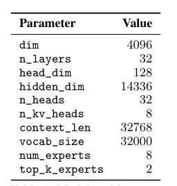
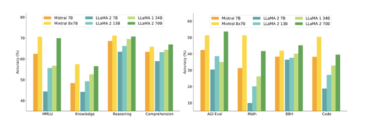
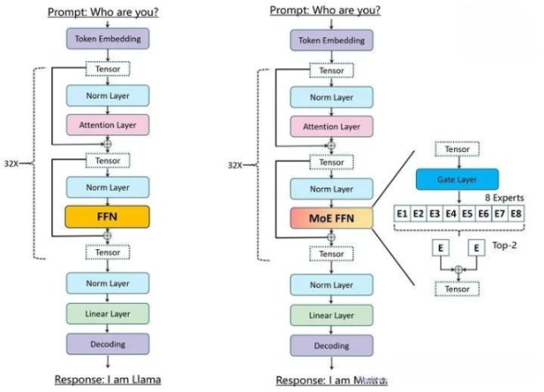
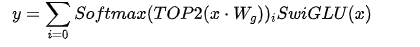
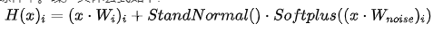

# 自然语言处理: 第二十六章大模型基底之Mistral 8x7B

文章地址: [2401.04088.pdf (arxiv.org)](https://arxiv.org/pdf/2401.04088.pdf)

项目地址: [mistralai/mistral-src: Reference implementation of Mistral AI 7B v0.1 model](https://github.com/mistralai/mistral-src)

## 前言:

**本文意在一文深度剖析Mistral 8X7B的关键改进点。**

Mistral AI是一个由DeepMind和Meta的三位前员工在巴黎共同创立的AI公司。其在23年9.月推出的第一个基座大模型[Mistral 7B](https://mistral.ai/news/announcing-mistral-7b/)一经推出就吊打当时同参数量的任何开源7B模型，甚至在当时所有评估基准中均胜过了最好的13B参数模型-Llama 2 - 13B，并在推理、数学和代码生成方面超越了Llama 34B。更令人激动人心的是，同年12月份Mistral AI 就迅速推出了混合专家模型[Mistral 8x7b](https://mistral.ai/news/mixtral-of-experts/) （一直有传言GPT4也是8个专家模型组合,Mistral8x7b模型的推出提供了一种接近GPT-4性能的可能)，其在所有评估的基准测试中胜过或与Llama 2 70B和GPT-3.5相当。除此之外 ，今年2月，Mistral 又继续推出了他们家[Mistral - large - 2402](https://mistral.ai/news/mistral-large/) ,性能如图1.可以看到其能力已经十分逼近GPT-4 且已经超过GPT-3.5和其他同等模型了。但是由于其具体的技术论文还暂未公布，所以就不作为本文的重点了。

 

 

 

### 性能对比

上是Mixtral-8x7B的参数表，对比图2的Mistral 7B的参数，可以发现多了两个参数num_experts以及top_k_experts。这也从而揭开了Mixtral-8x7B的神秘面纱，其核心就是将8个Mistral 7B组合而成一个MoE专家网络(misture of experts)，针对不同的任务或者说每个token通过一个路由器router去选择最合适的2个专家去解决不同的任务。有关于MOE网络的细节我会在下文详细介绍。

作者将Mixtral-8x7B与 Llama 2 系列和 GPT-3.5 基础模型进行比较。Mixtral 在大多数基准测试中均匹配或优于 Llama 2-70B 以及 GPT-3.5。

 

 

### MOE架构

MoE(Mixture-of-Experts) 最早在1991年就已经被Michael Jordan 和 Geoffrey Hinton两位大神在[Adaptive mixtures of local experts](https://link.zhihu.com/?target=https%3A//readpaper.com/paper/2150884987)一文中提出 , 其核心就是一个网络模型结构有多条分支，每条分支代表一个Expert(专家)，每个Expert都有其擅长的领域，当具体任务来临时，可以通过一个门空位Gate或者路由router来具体选择采用哪一个或者哪几个Experts进行计算，这样的好处就是让每个Expert更专注特定领域，降低了不同领域数据对权重学习的干扰。有没有点集成学习的影子，将多个模型的的输出加权叠加就从而获得最后的输出。

 

不同于LLaMA中的transformer架构，Mixtral-8x7B中架构如上图所示，其直接将FFN架构替换成MOEFFN架构。经过Normlayer的tensor通过一个Gate或者router(其实就是一个linear层)去决定这8个专家的权重，为了节约计算资源我们可以主动的添加权重的稀疏性，简单来说就是将一些小权重的专家g≈0就不需要计算其输出了，只需要计算权重大的几个专家

比如说作者采用了通过对线性层的Top-K (Mixtral-8x7B中k=2）logits进行softmax，如果使用较低的k值(比如一到两个)，我们可以比激活许多专家时更快地进行训练和推理。为什么不只选择最顶尖的专家呢？最初的假设是，为了让门控学习如何路由到不同的专家，需要路由到一个以上的专家，因此至少需要选择两个专家。最后将输出与权重相乘后再相加后得到最后的MOEFNN的输出y。其公式为:

不仅仅如此，因为在标准的多专家系统训练中，门控网络倾向于主要激活相同的几位专家。这会形成自我加强的循环，因为得到优先训练的专家会被更频繁地选择。[Shazeer](https://arxiv.org/abs/1701.06538)为了避免上述MOE架构在训练的过程中有偏好的只选择极少数性能强大的专家，从而导致的训练效率低下的问题，引入了一种辅助损失来鼓励平等对待所有专家。这种损失确保所有专家获得大致相同数量的训练样本。噪声具体公式如下:

另外，还有一个点需要注意的是: 虽然Mixtral-8x7B 是一个由8位7B模型组成的专家网络，但是其参数不是8 * 7 = 56 B 而是 46.7B . 这是因为每个层中，仅仅只有MOE FNN是独立曾在的，其余部分比如说attention 则是各个专家共享的。所以参数大小只有46B而不是56B。

 

 

## 总结:

本篇文章主要介绍了MistralAI公司前期推出的两个基座大模型分别是:Mistral-7B以及Mistral-8x7B。其中Mistral-7B以LLaMA2为对标产品，在其基础之上加上了SWA(滑动窗口注意力)机制，从而在性能上与LLaMA2-13B不相上下。

除此之外，Mistral-8x7B作为首个开源性能可以与GPT-3.5以及LLaMA2-70B性能比肩的MoE模型，其已经发布就震惊四座，并且也为GPT-4是MoE架构的传言做了一笔”辅证”。 截至到笔者写这篇文章，MistralAI又继续推出了Mistral-Large-2402开源版本，更是逼近GPT-4。

最后，希望上述内容梳理能给深入浅出带领大家理解这两个大模型，同时也期待MistralAI能带来更好的开源大模型。
