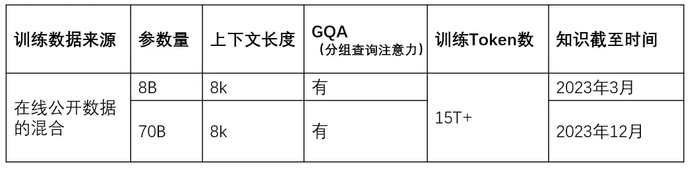
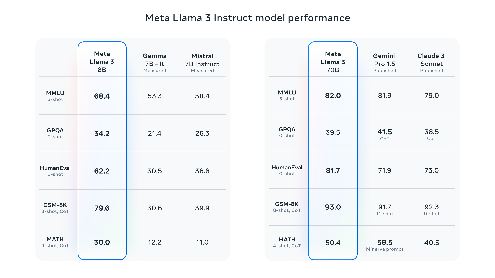
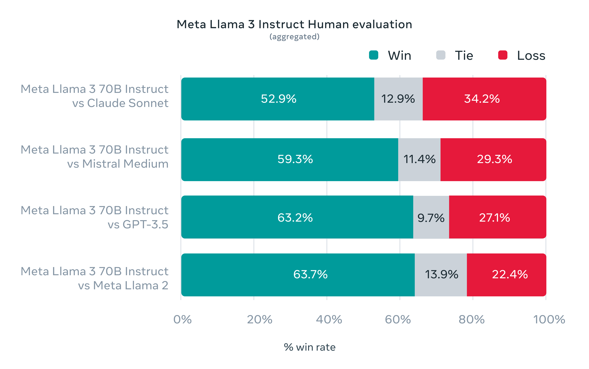
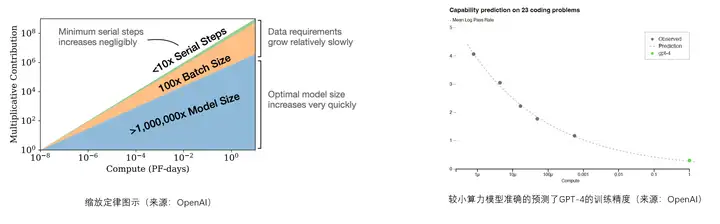
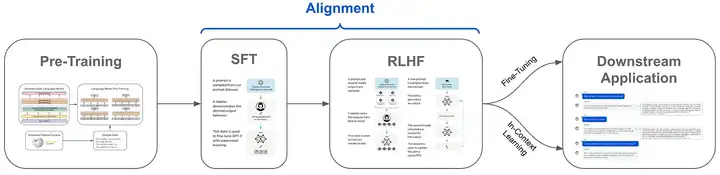

# 自然语言处理: 第二十八章大模型基底之llama3

项目地址: [meta-llama/llama3: The official Meta Llama 3 GitHub site](https://github.com/meta-llama/llama3)

## 前言

LLaMa系列一直是人们关注的焦点，Meta在4月18日发布了其最新大型语言模型 LLaMA 3。该模型将被集成到其虚拟助手Meta AI中。Meta自称8B和70B的LLaMA 3是当今 8B 和 70B 参数规模的最佳模型，并在推理、代码生成和指令跟踪方面有了很大进步。(对LLaMa系列有兴趣的可以看看我上一篇博客[第二十一章大模型基底之llama1](https://blog.csdn.net/victor_manches/article/details/137017314?spm=1001.2014.3001.5501)以及[第二十二章大模型基底之llama2](https://blog.csdn.net/victor_manches/article/details/137328572?csdn_share_tail=%7B%22type%22%3A%22blog%22%2C%22rType%22%3A%22article%22%2C%22rId%22%3A%22137328572%22%2C%22source%22%3A%22victor_manches%22%7D))

相比与LLaMa2， LLaMa3主要进行了下面几点突破：

* **扩大词汇量：** Llama 3 的词汇量从 Llama 128,256 的 2 个令牌增加到 32,000 个令牌。此增强功能支持更高效的输入和输出文本编码，并增强了其多语言功能。
* **扩展上下文长度：** Llama 3 模型提供 8,000 个令牌的上下文长度，是 Llama 4,090 支持的 2 个令牌的两倍。这种增加允许更广泛的内容处理，包括用户提示和模型响应。
* **升级后的训练数据：** Llama 3 的训练数据集比 Llama 2 大七倍，其中代码量多四倍。它包含超过 5% 的高质量非英语数据，涵盖 30 多种语言，这对于多语言应用支持至关重要。这些数据使用启发式和 NSFW 过滤器、语义重复数据删除和文本分类器等先进技术进行严格的质量控制。
* **精细化指令调整和评估：** 与 Llama 2 不同，Llama 3 采用先进的指令调优技术，包括监督微调 (SFT)、拒绝采样、近端策略优化 (PPO) 和直接策略优化 (DPO)。为了增强这一过程，引入了新的高质量人类评估集，由 1,800 个提示组成，涵盖建议、头脑风暴、分类、编码等不同用例，确保对模型功能的全面评估和微调。
* **先进的人工智能安全：** Llama 3 与 Llama 2 一样，采用了严格的安全措施，例如指令微调和全面的红队，以降低风险，特别是在网络安全和生物威胁等关键领域。为了支持这些努力，Meta 还推出了 Llama Guard 2，它是在 Llama 8 的 3B 版本上进行微调的。这个新模型增强了 [羊驼卫士系列](https://ai.meta.com/research/publications/llama-guard-llm-based-input-output-safeguard-for-human-ai-conversations/) 通过对 LLM 输入和响应进行分类来识别潜在的不安全内容，使其成为生产环境的理想选择

 

 

 

## 一. 模型性能

目前发布的是早期版本，包括 8B 和 70B 大小两个不同版本。目前发布的LLaMA 3仅支持文本输入和输出，今年晚些会发布405B（也称400B）和多模态版本。

 

Llama 3 8B 在 MMLU、ARC、DROP 和 HumanEval 等 9 个基准测试中，优于具有相似参数数量的其他开源模型，例如 Mistral 的 Mistral 7B 和 Google 的 Gemma 7B。 Llama 3 70B 超越了 Claude 3 Sonnet，并可与 Google 的 Gemini 1.5 Pro 匹敌。 在目前的lmsys排名中排名第5，开源模型榜单排名第一。

LLaMa3 还与Claude Sonnet、Mistral Medium 和 GPT-3.5进行了人工评价上的对比，其性能如下：

 

 

## 二. 模型架构

根据官方文档介绍: LlaMa3 选择了相对标准的纯解码器转换器架构。与 LlaMa32 相比，进行了几项关键改进。

1）LLaMA 3具有 128K词汇量大小的Tokenizer，可以更有效的对文本进行编码，从而显着提高模型性能。

2）8B 和 70B 的LLaMA3都采用了分组查询注意力 (GQA)机制，以提高Inference速度。（LLaMA 2 70B也采用了GQA）

3）在8,192 个Token的较长序列上训练模型，使用掩码机制确保自注意力不会跨越文档边界。需要注意的是LLaMA 3采用了8K Token进行训练，并不代表只能生成8K Token以内文本。（LLaMA 2 为4096）

 

 

LlaMa3 和LLaMa2 同样选择了GQA 和 RoPE 这两个关键技术，有关于这两点技术的优点可以参考我笔者之前关于LLaMa2的介绍。

## 三. 模型训练

### 3.1 训练数据集

Llama 3 在超过 15T tokens上进行了预训练，这些tokens都是从公开来源收集的。我们的训练数据集比 Llama 2 使用的数据集大 7 倍，包含的代码是 Llama 2 的 4 倍。为了应对即将到来的多语言用例，Llama 3 预训练数据集的 5% 以上由涵盖 30 多种语言的高质量非英语数据组成。

Meta使用一系列数据清洗方法，包括使用启发式过滤器、NSFW 过滤器、语义重复数据删除方法和文本分类器来预测数据质量。其中LLaMA 2 为LLaMA 3 提供文本质量分类器的训练数据

 

### 3.2 预训练

为了在 Llama 3 模型中有效地利用预训练数据，Meta为下游基准评估制定了一系列详细的扩展法则。这些缩放定律使我们能够选择最佳的数据组合，并就如何最好地使用我们的训练计算做出明智的决策。重要的是，缩放定律允许我们在实际训练模型之前预测最大模型在关键任务上的性能（例如，在 HumanEval 基准测试中评估的代码生成——见上文）。这有助于我们确保最终模型在各种用例和功能中具有强大的性能。

举个例子： 虽然 8B 参数模型的 Chinchilla 最优训练计算量对应于 ~200B 标记，即使在模型使用两个数量级的数据进行训练后，模型性能仍在继续提高。我们的 8B 和 70B 参数模型在我们对高达 15T 的token进行训练后，继续对数线性改进。较大的模型可以与这些较小模型的性能相匹配，但训练计算较少，但通常首选较小的模型，因为它们在推理过程中效率更高。

 

LLaMA 3在H100-80GB 的GPGPU上训练（TDP 为 700W），8B和70B的模型训练累计使用了 770 万个 GPGPU 时长。训练过程使用了3种并行加速：数据并行、模型并行和管道并行。在 16000个 GPU 上进行训练时，可实现每个 GPU 超过 400 TFLOPS 的计算利用率。（需要注意H100的稠密算力约为2000TFLOPS）

 

Meta还开发了一种先进的训练堆栈，可以自动执行错误检测、处理和维护。改进了硬件可靠性和静默数据损坏检测机制，并开发了新的可扩展存储系统，以减少检查点和训练回滚的开销。

 

以上这些改进使总体有效培训时间超过 95%，训练效率比 Llama 2 提高了约3倍。

 

 

### 3.3 指令微调

为了在聊天用例中充分释放预训练模型的潜力，我们还对指令调整方法进行了创新。我们的后培训方法是监督微调 （SFT）、拒绝抽样、近端策略优化 （PPO） 和直接偏好优化 （DPO） 的组合。SFT 中使用的提示的质量以及 PPO 和 DPO 中使用的偏好排名对对齐模型的性能有很大影响。我们在模型质量方面的一些最大改进来自于仔细管理这些数据，并对人工注释者提供的注释执行多轮质量保证。

通过 PPO 和 DPO 从偏好排名中学习也大大提高了 Llama 3 在推理和编码任务上的表现。我们发现，如果你问一个模型一个它难以回答的推理问题，模型有时会产生正确的推理痕迹：模型知道如何产生正确的答案，但它不知道如何选择它。对偏好排名的训练使模型能够学习如何选择它。

 

 

## 总结：

> LLaMa系列是Meta公司开源的最强模型，但是由于LLaMa3是近期发布的，具体的技术论文Meta还没有公开后续如果公开的话，技术细节会继续更新。 根据现有的资料，咱们可以发现:
>
> 1. 高质量数据集以及数据量的重要性, 超过7倍的预训练数据
> 2. 大模型标配 RoPE 以及 GQA 增加推理速度以及提高性能
> 3. RLHF(对齐训练的重要性)
>
> 最后让我们期待以下Meta在年底发布的LLaMa3的后续版本。

参考资料:

[陈巍：LLaMA3大模型技术全网最全解析——模型架构与训练方法（收录于GPT-4/ChatGPT技术与产业分析） - 知乎 (zhihu.com)](https://zhuanlan.zhihu.com/p/693323342)

[揭晓 Meta Llama 3：大型语言模型的飞跃 - Unite.AI](https://www.unite.ai/zh-CN/%E6%8E%A8%E5%87%BA-Meta-llama-3-%E5%A4%A7%E5%9E%8B%E8%AF%AD%E8%A8%80%E6%A8%A1%E5%9E%8B%E7%9A%84%E4%B8%80%E6%AC%A1%E9%A3%9E%E8%B7%83/)

[Meta Llama 3 简介：迄今为止最有能力的公开产品LLM --- Introducing Meta Llama 3: The most capable openly available LLM to date](https://ai.meta.com/blog/meta-llama-3/)
