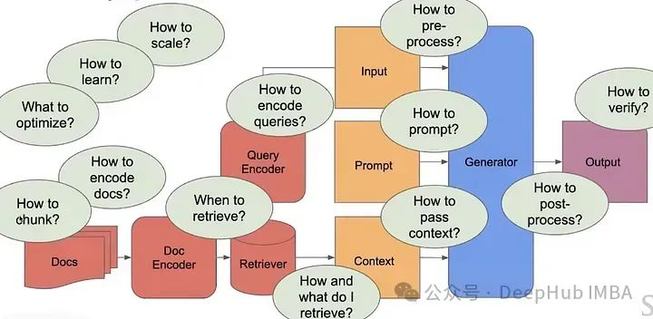
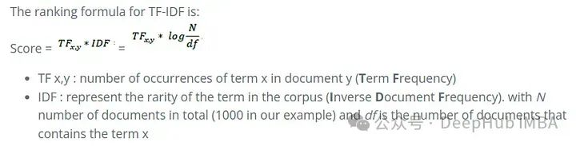
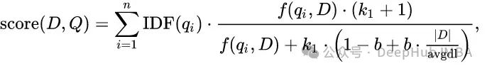
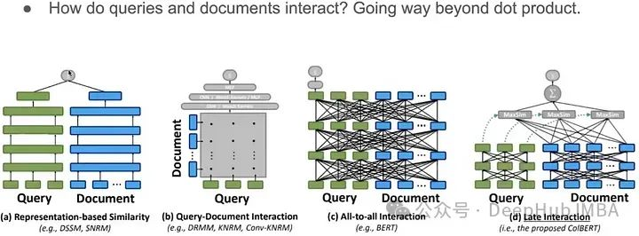
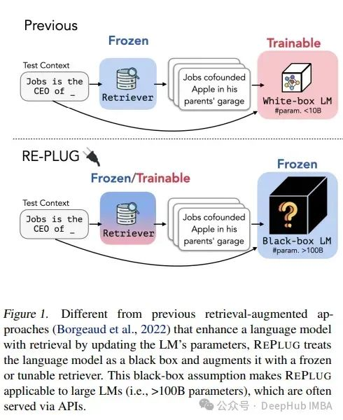
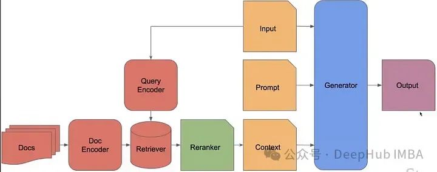

# 自然语言处理: 第三十一章RAG2.0

有关于RAG(检索增强的基础版可以参考我之前的博客[自然语言处理: 第十五章RAG(Retrieval Augmented Generation)_all-minilm-l6-v2 处理中文-CSDN博客](https://blog.csdn.net/victor_manches/article/details/136493368))。但是naive-RAG的性能在大多数情况下还不能达到落地的要求，如果我们能创建出可训练的检索器，或者说整个RAG可以像微调大型语言模型（LLM）那样定制化的话，那肯定能够获得更好的结果。但是当前RAG的问题在于各个子模块之间并没有完全协调，就像一个缝合怪一样，虽然能够工作但各部分并不和谐，所以我们这里介绍RAG 2.0的概念来解决这个问题。

 

## RAG 1.0

简单来说，RAG可以为我们的大型语言模型（LLM）提供额外的上下文，以生成更好、更具体的回应。LLM是在公开可用的数据上训练的，它们本身是非常智能的系统，但它们无法回答具体问题，因为它们缺乏回答这些问题的上下文。

所以RAG可以向LLM插入新知识或能力，尽管这种知识插入并不是永久的。而另一种常用向LLM添加新知识或能力的方法是通过对我们特定数据进行微调LLM。

通过微调添加新知识相当困难，昂贵，但是却是永久性。通过微调添加新能力甚至会影响它以前拥有的知识。在微调过程中，我们无法控制哪些权重将被改变，因此也无法得知哪些能力会增加或减少。

选择微调、RAG还是两者的结合，完全取决于手头的任务。没有一种适合所有情况的方法。

RAG的经典步骤如下：

* 将文档分成均匀的块。
* 每个块是一段原始文本。
* 使用编码器为每个块生成嵌入（例如，OpenAI嵌入，sentence_transformer等），并将其存储在数据库中。
* 找到最相似的编码块，获取这些块的原始文本，并将其作为上下文与提示一起提供给生成器。

 

 

 

## RAG 2.0

当今典型的RAG系统使用现成的冻结模型进行嵌入，使用**向量数据库**进行检索，以及使用黑盒语言模型进行生成，通过提示或编排框架将它们拼接在一起。各个组件技术上可行，但整体远非最佳。这些系统脆弱，缺乏对其部署领域的任何机器学习或专业化，需要广泛的提示，并且容易发生级联错误。结果是RAG系统很少通过生产标准。

而我们要说的RAG 2.0的概念，通过预训练、微调并对所有组件进行对齐，作为一个整体集成系统，通过语言模型和检索器的双重反向传播来最大化性能：

下面就是我们将上下文语言模型（Contextual Language Models）与冻结模型的 RAG 系统在多个维度进行比较

对于开放域问答：使用标准的自然问题（NQ）和 TriviaQA 数据集来测试每个模型检索相关知识和准确生成答案的能力。还在单步检索设置中使用 **HotpotQA**（HPQA）数据集对模型进行评估。所有数据集都使用精确匹配（EM）指标。

对于忠实度：使用 HaluEvalQA 和 TruthfulQA 来衡量每个模型在检索证据和幻觉中保持基础的能力。

而新鲜度：我们使用网络搜索索引来衡量每个 RAG 系统概括快速变化的世界知识的能力，并在最新的 FreshQA 基准测试中显示准确性。

这些维度对于构建生产级别的 RAG 系统非常重要。CLM 在多种强大的冻结模型RAG 系统上显著提升性能，这些系统是使用 GPT-4 或最先进的开源模型如 Mixtral 构建的。

 

 

**RAG如何解决智能问题？**

RAG是一种半参数系统，其中参数部分是大型语言模型（LLM），其余部分是非参数的。这样我们就得到了半参数系统。LLM在其权重或参数中存储了所有信息（以编码形式），而系统的其余部分则没有定义这些知识的参数。

但这为什么能解决问题呢？

* 在LLM中交换索引（特定信息）为我们提供了定制化，这意味着我们不会仅仅获得老旧的知识，同时我们也可以修订索引中的内容。
* 通过这些索引对LLM进行定位意味着可以减少幻觉，并且通过指向来源进行引用和归属。

所以RAG为的LLM提供了更好的上下文化能力，使其表现良好。但实际上真的这么简单吗？

并不是，因为我们有许多需要解答的问题，才能创建一个现代化的可扩展的RAG管道。

 

当前的RAG系统并没有那么智能，而且它们非常简单，无法解决需要大量自定义上下文的复杂任务。

我们看到，目前唯一可以训练的参数部分就是LLM。能否增加更多的参数呢？

 

 

### 1 稀疏检索

**TF-IDF**：TF-IDF或词频-逆文档频率，是衡量一个词对一个文档集或语料库中的文档的重要性的指标，同时调整了某些词通常出现得更频繁的事实。[1] 它常被用作信息检索、文本挖掘和用户建模搜索中的权重因子

**BM25：**可以视为对TF-IDF的改进。对于查询“机器学习”，BM25的计算将是BM25Score(机器) + BM25Score(学习)的总和。公式的第一部分是词项的逆文档频率（IDF）。公式的第二部分代表词频（TF），该词频通过文档长度进行了标准化。

f(q(i), D) 是文档 D 中词 q(i) 的词频。K 和 b 是可以调整的参数。|D| 表示文档的长度，avgdl 表示数据库中所有文档的平均长度。

 

 

### 2 密集检索

需要密集检索的原因是因为语言并不那么直白。例如，如果有同义词，稀疏检索就会完全失效。我们不仅仅想基于确切关键词匹配来检索信息，更多的是基于句子的语义。BERT sentence embedding 就是一个密集检索的例子。将句子转换为向量后，使用点积或余弦相似度来检索信息。

密集检索的一个好处是它易于并行处理，借助GPU，它可以轻松地在十亿级别的相似性搜索上运行，这就是Meta开发**FAISS**的方式，或者我们常说的向量数据库。

密集检索也就是我们常说的向量查询，它通常使用点积来判断响亮的相似程度，这也是一般RAG中常用的步骤。我们如何超越简单的点积呢?

除了简单的点积以外，还有很多文档和查询交互方式，比如说 孪生网络，ColBERT，等等

 

 

### 3. 基于模型的检索算法

ColBERT是一个非常好的检索策略，但这并不是信息检索的SOTA。我们还有其他更先进的算法和策略，如SPLADE、DRAGON和Hybrid搜索。

**1、SPLADE**:稀疏与密集的结合的查询扩展。

**2、DRAGON**：通过渐进式数据增强来推广密集检索器

让我们通过一个例子来理解DRAGON的工作原理：

* **初始询问**：“如何照顾吊兰？”
* **DRAGON的行动**：识别出植物护理的主题后，DRAGON制定了一个针对性的检索查询，专门收集有关吊兰的一般护理信息。
* **初始检索**：DRAGON深入其数据库，检索出有关这些绿叶植物的阳光需求、浇水时间表和合适肥料的文档。然后生成回应：“吊兰需要适度的间接阳光，应该每周浇水一次。在生长季节，每月施肥一次对它们有益。”
* **用户更新**：随着用户询问：“如果叶子变成棕色怎么办？”对话发生了转变。
* **DRAGON适应**：DRAGON细化检索查询，专注于吊兰叶子变棕的问题。
* **动态检索行动**：DRAGON检索有关叶子变棕的常见原因的信息，如过度浇水或过多直射阳光。
* **知识传递**：通过利用新检索到的数据，DRAGON根据对话的发展定制其回应：“吊兰的棕色叶子可能是过度浇水或阳光直射过多的迹象。尝试减少浇水频率，并将植物移至更阴凉的地方。”

DRAGON根据用户在对话中不断变化的兴趣动态调整其检索查询。用户的每一次输入都会实时更新检索过程，确保提供的信息既相关又详细，符合最新的上下文。

**3、混合搜索**：我们在密集和稀疏搜索之间进行插值。这就是RAG社区一直在研究的方向，比如采用类似BM25的并将其与SPLADE或DRAGON结合。

但是无论我们使用什么方法，检索器仍然是固定的，或者说无法定制（微调）的

### 4. 提供上下文的检索器

**1、RePlug**

这是一篇关于检索的非常有趣的论文，对于给定的查询，我们检索出前K个文档，并进行归一化（计算它们的可能性）后得到一个分布，然后我们将每个文档与查询一起单独输入给一个生成器。然后查看语言模型对正确答案的困惑度。这样就有了两个可能性分布，在这些分布上我们计算KL散度损失，以使KL散度最小化，就会得到检索到的文档与正确答案上的困惑度最低的结果。

**2、In-Context RALM**

它使用冻结模型RAG 和 BM25，然后通过重新排序专门化检索部分。包含一个零样本学习的语言模型和一个训练过的重新排序器。

语言模型是固定的，我们只反向传播或训练重新排序的部分。这不是很先进，但与前面的简单RAG相比，它的性能还不错。

但问题是如果无法访问LLM的参数，如何对检索器的参数进行反向传播或更新呢？

所以它是使用强化风格的损失来训练检索器。检索器的有效性通过其获取的信息如何增强语言模型的输出来评判。对检索器的改进集中在最大化这种增强上。这可能涉及基于从语言模型输出中派生的性能指标调整检索策略（获取信息的内容和方式）。常见的指标可能包括生成文本的连贯性、相关性和事实准确性。

**3、组合上下文化检索器和生成器**

与其单独优化LLM或retriver，不如一次优化整个流程?

当检索文档时，在每n个令牌或一次检索时，有很多地方可以优化。在RAG-token模型中，与RAG-Sequence模型的单次检索相比，可以在不同的目标token上检索不同的文档。使用编码器对所有k个文档进行编码，接着进行协同，然后在将其作为上下文提供给输入提示之前进行解码。

**4、k-NN LM**

另外一个在RAG系统中有趣的想法是增加包括k-NN LM，研究人员表明，如果在RAG环境中训练，他们可以创建25倍小的模型:

 

 

 

 

 

## SOTA

大型语言模型（LLM）的上下文化既复杂又昂贵。因为重新更新整个LLM并不容易，需要更新数十亿甚至数万亿的令牌。所以Meta的FAIR的发布了ATLAS论文，这篇论文讨论了可以用来训练整个RAG管道，并且针对不同部分使用不同类型的损失函数，并对它们进行了性能比较。以下是ATLAS论文中所有不同损失的性能比较：

ATLAS是一个经过精心设计和预训练的检索增强型语言模型，能够通过极少的训练示例学习知识密集型任务。ATLAS将这些损失函数整合进一个连贯的训练流程中，可以直接基于其对语言模型性能的影响来微调检索器，而不是依赖于外部注释或预定义的相关性评分。这种整合使系统能够随着时间的推移通过适应其训练任务的具体需求而改进。

* 使用双编码器框架作为其检索系统，一个编码器专门用于编码查询，另一个用于文档。
* 然后将检索到的文档与查询一起输入基于T5架构的强大的序列到序列语言模型，该模型在系统中充当解码器，生成最终的文本输出。
* 采用解码器**内融合**方法，将检索到的文档的信息直接整合到序列到序列模型的解码器中。这种方法允许语言模型在生成过程中动态利用检索到的信息，增强其输出的相关性和准确性。
* 

 

 

 

## 总结

RAG（检索增强生成）有三种类型：

1. 冻结模型RAG：这些在整个行业中随处可见，它们只是概念验证（POC）。
2. 半冻结模型RAG：应用智能检索器，并试图使它们以某种方式适应。不修改LLM只是操作检索器并将它们与最终输出结合。
3. 完全可训练的RAG：端到端训练相当困难，但如果做得正确，可以提供最佳性能。但是肯定非常消耗资源。

而我们常用的RAG还仅仅是第一种冻结模型RAG，所以说RAG的技术目前还处于初级阶段，扩展语言模型的参数还是令牌，如何有效地扩展检索器，通过参数还是数据块将记忆与概括分离，将知识检索与生成过程分离等，都是后续需要继续研究的问题。

 

 

 

## 参考资料

[RAG 2.0架构详解：构建端到端检索增强生成系统 (qq.com)](https://mp.weixin.qq.com/s/ZDlp_oOEF7vQFaLsU_CaDA)
