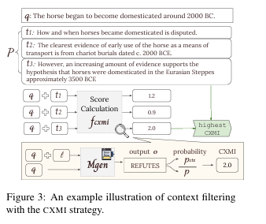

# 自然语言处理:第三十三章FILCO：过滤内容的增强RAG

文章链接: [[2311.08377] Learning to Filter Context for Retrieval-Augmented Generation (arxiv.org)](https://arxiv.org/abs/2311.08377)

项目地址: [zorazrw/filco: [Preprint] Learning to Filter Context for Retrieval-Augmented Generaton (github.com)](https://github.com/zorazrw/filco)

 

 

 

**在人工智能领域，尤其是在开放域问答和事实验证等任务中，即时检索相关知识是构建可靠系统的关键因素。然而，由于检索系统并非完美，生成模型在面对部分或完全无关的段落时仍需生成输出，这可能导致对上下文的过度或不足依赖，并在生成的输出中产生幻觉等问题。为了缓解这些问题，提出了一种名为FILCO的方法，该方法通过（1）基于词汇和信息论方法识别有用的上下文，以及（2）训练上下文过滤模型以便在测试时过滤检索到的上下文。在六个知识密集型任务中使用FLAN-T5和LLaMa2模型进行实验，证明了FILCO方法在提取式问答（QA）、复杂多跳和长形QA、事实验证以及对话生成任务上优于现有方法。FILCO有效地提高了上下文的质量，无论其是否支持规范输出。**

 

 

## 背景

检索增强型生成方法已被证明对于许多知识密集型语言任务是有效的，它们能够产生更忠实、可解释和可泛化的输出。尽管检索系统通常将检索到的顶级段落无条件地提供给生成模型，但这些系统往往返回不相关或分散注意力的内容。这导致生成模型在训练时容易产生幻觉或虚假记忆:

1. **过度依赖上下文** ：生成模型可能会过度依赖检索到的段落，即使这些段落包含分散注意力的内容或与问题仅有微弱关联。
2. **幻觉和错误记忆** ：由于检索系统返回的内容不准确或不相关，生成模型可能会产生幻觉，即生成与真实情况不符的信息，或产生错误记忆，即使用错误信息生成输出。

 

FILCO（Filtering Context for Retrieval-Augmented Generation）方法针对上述问题提出了创新的解决方案，通过以下两个方面显著提升了性能：

1. **上下文的精细过滤** ：FILCO通过细粒度的句子级别过滤检索到的上下文，而非整个段落，从而更精确地提供对生成任务有用的信息。
2. **过滤模型的训练** ：FILCO训练了一个上下文过滤模型（Mctx），该模型能够在测试时动态过滤检索到的上下文，确保生成模型（Mgen）接收到的信息是相关且有用的。

 

 

## 核心算法

FILCO的核心思想如下图，主要的pipeline也是分成两部分 

1. 是在细粒度的句子级别上学习过滤检索到的上下文，简单的来说就是通过计算query 和 向量数据库的相似度召回top_k相关文档后，训练一个专属的过滤模型(Mctx)对召回的文档进行精简/过滤 (ps: 有点像之前说的Corrective RAG)
2. 然后再将过滤完的文档输入给生成模型(Mgen)进行回答。

下面会分别的对这两部分模型进行介绍

 

 

### 上下文过滤模型（Mctx）

FILCO训练了一个上下文过滤模型（Mctx），使用上述三种度量方法过滤检索到的上下文。（i）STRINC：段落是否包含生成输出；（ii）词汇重叠：内容和输出之间有多少单字重叠；（iii）条件交叉互信息（CXMI）：当提供内容时，生成器生成输出的可能性增加多少。FILCO训练上下文过滤模型Mctx，使用这三种度量方法过滤检索到的上下文，并学习在过滤上下文中生成输出。训练数据是通过将检索到的段落和查询作为输入，然后应用过滤方法获得过滤后的上下文（tsilver）。Mctx 原始输入是问题query + 检索召回的上下文 ， 最后的输出就是过滤后的上下文

* **数据准备**：

  - 对于每个训练样本，使用检索系统（如Dense Passage Retriever，DPR）从知识库（如Wikipedia）中检索相关的文档或段落，并将其与查询一起作为输入。
* **过滤算法选择**：

  三种过滤策略（STRINC、LEXICAL、CXMI）选择最优的文本片段。

  * **字符串包含（String Inclusion, STRINC）**:

    - STRINC是一种基于词汇的简单过滤方法，它检查检索到的文本片段是否包含生成输出的确切文本。
    - 该方法通过枚举检索到的段落，并选择第一个包含输出文本的文本片段。
  * **词汇重叠（Lexical Overlap）**:

    - 该策略通过计算示例和候选文本片段之间的单字重叠来评估它们之间的主题相似性。
    - 对于问答（QA）和对话生成任务，它使用F1分数来衡量文本片段和输出之间的相似度。
    - 对于事实验证任务，由于输出是一个二元标签，它使用查询和文本片段之间的F1分数。
  * **条件交叉互信息（Conditional Cross-Mutual Information, CXMI）**:

    - CXMI是一种基于信息论的方法，用于衡量在给定上下文的情况下，生成模型生成期望输出的概率变化。 该策略选择具有最高CXMI分数的文本片段，因为它们最有可能增加生成正确输出的概率。下图是作者关于CXMI的算法图解

    
* **过滤上下文**：

  - 应用选择的过滤策略，从检索到的段落中生成过滤后的上下文（tsilver）。这是非完美的过滤结果，因为真实的输出标签在训练时是未知的。
* **模型训练**：

  - 训练Mctx，使其能够基于查询和检索到的段落生成过滤后的上下文tsilver。这个过程可以形式化为：\[ M_{ctx}(t_{silver} | q \oplus P) \]，其中\( q \)是查询，\( P \)是检索到的段落，\( t_{silver} \)是过滤后的上下文。

 

 

 

### 生成模型（Mgen）

在训练时，FILCO将过滤后的上下文（tsilver）预处理到查询中，然后输入到生成模型（Mgen）进行训练，以输出规范的响应。在推理时，使用Mctx预测过滤后的上下文（tpred），然后将其与查询一起提供给Mgen以预测输出。

1. **准备输入**：

- 将过滤后的上下文tsilver预处理到查询q的前面，形成模型的输入\( q \oplus t_{silver} \)。

2. **训练生成模型**：

   - 使用上述输入训练Mgen生成规范的输出o。这个过程可以形式化为：\[ M_{gen}(o | t_{silver} \oplus q) \]。
3. **推理**：

   - 在推理时，使用训练好的Mctx模型为每个测试查询q预测过滤后的上下文tpred：\[ tpred = M_{ctx}(q \oplus P) \]。
   - 然后将tpred与查询q一起提供给Mgen，以预测输出：\[ M_{gen}(o | tpred \oplus q) = M_{gen}(o | M_{ctx}(q, P) \oplus q) \]。

 

训练细节如下：

- **模型架构**：FLAN-T5和LLAMA2作为Mctx和Mgen的模型架构，因其在开源模型中的潜在优越性能。
- **序列长度**：所有序列的最大长度设置为1024个token。Mctx生成的过滤上下文最多512个token，Mgen生成的输出最多128个token。
- **解码策略**：使用贪婪解码策略生成过滤上下文和最终生成输出。
- **训练周期**：通常训练所有Mctx和Mgen模型3个epoch，使用学习率为5e-5，批量大小为32。

 

 

 

## 实验结果

FILCO在六个知识密集型语言数据集上进行了实验，包括NaturalQuestions (NQ)、Trivia QA (TQA)、HotpotQA、ELI5、Fact Extraction and VERificaton (FEVER)以及Wizard of Wikipedia (WoW)。使用FLAN-T5和LLaMa2模型，FILCO在所有六个数据集上都优于基线方法，即全上下文增强和段落级过滤。下图事在这6个数据集上的性能，可以看到Filco 和sliver 基本都在各个数据集上能达到SOTA

* Full: 召回top_k内容全部进行推理生成
* PSG: 基于句子场景进行部分过滤
* FILCO: 本文的算法，过滤上下文
* Silver: 迭代的算法，根据不同数据集进行微调后的算法

 

 

过滤完后的上下文不仅仅是性能上最优，并且能减少大约 4 - 6 成的内容，从而减少token消耗。

 

 

 

上文提到的上下文过滤模型Mctx可选三种过滤算法，其中不同算法在不同数据集上表现不同。具体如下，**可以发现对于随着任务难度的增加，STRINC、LEXICAL、CXMI 算法逐渐更适合用于过滤上下文。**

## 总结

通过实验，FILCO在以下方面显示出显著的优势：

- **性能提升**：FILCO在六个知识密集型任务上的性能均优于基线方法，包括提取式问答、复杂多跳问答、长形问答、事实验证和对话生成任务。
- **上下文质量改善**：FILCO有效地提高了上下文的质量，无论其是否支持规范输出。
- **输入长度减少**：FILCO通过过滤检索到的上下文，显著减少了模型输入的长度，平均减少了44-64%。
- **答案精度提高**：过滤后的上下文在所有任务上都实现了更高的答案精度，特别是对于抽象任务，如FEVER和WoW。

FILCO的成功证明了在检索增强型生成任务中，通过这种训练方法，FILCO能够有效地训练上下文过滤模型以精确地识别和过滤有用的上下文，同时训练生成模型以在过滤后的上下文上生成高质量的输出。这种细粒度的过滤和生成过程，使得FILCO在各种知识密集型任务中表现出色，提高了输出的准确性和相关性。FILCO的成功实施为未来在更多场景中实现忠实生成提供了新的思路。 **---  对于数据里有很多冲突知识的时候这个算法会很有效**

### 引用文献

- Alon, U., Xu, F. F., He, J., Sengupta, S., Roth, D., & Neubig, G. (2022). Neuro-symbolic language modeling with automaton-augmented retrieval. In ICML 2022 Workshop on Knowledge Retrieval and Language Models.
- Asai, A., Gardner, M., & Hajishirzi, H. (2022). Evidentiality-guided generation for knowledge-intensive NLP tasks. In Proceedings of the 2022 Conference of the North American Chapter of the Association for Computational Linguistics: Human Language Technologies.
