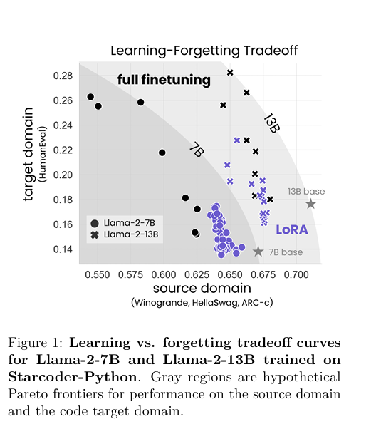
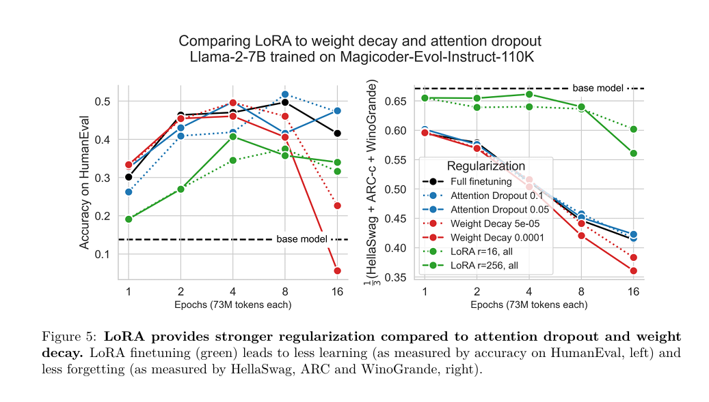

# 自然语言处理:第三十四章Lora VS FineTuning

文章链接: [[2405.09673] LoRA Learns Less and Forgets Less (arxiv.org)](https://arxiv.org/abs/2405.09673)

 

 

**这是一篇来自哥伦比亚大学和databricks对Lora 和FineTuning 更深一步的研究。有关于Lora可以参考我之前的文章: [自然语言处理: 第十二章LoRA解读_lora自然英语处理-CSDN博客](https://blog.csdn.net/victor_manches/article/details/132287864?spm=1001.2014.3001.5502) 有关于fine_tuning 可以参考[自然语言处理: 第七章GPT的搭建_gpt decoder only-CSDN博客](https://blog.csdn.net/victor_manches/article/details/132197681?spm=1001.2014.3001.5502) 。 在本文中，Low-Rank Adaptation (LoRA)的参数高效微调方法，该方法特别适用于大型语言模型（LLMs）。LoRA通过仅训练选定权重矩阵的低秩扰动来节省内存，从而在编程和数学等目标领域上进行了LoRA和全面微调的性能比较。我们发现，尽管在大多数设置中，LoRA的性能略低于全面微调，但LoRA展现出了一种理想的正则化形式：它在目标领域之外的任务上更好地维持了基础模型的性能。此外，LoRA提供了比常见的正则化技术（如权重衰减和丢弃法）更强的正则化效果，并有助于维持更多样化的生成。最后，我们提出了使用LoRA进行微调的最佳实践。**

 

 

 

## 背景

随着深度学习技术的飞速发展，大型语言模型（LLMs）已成为自然语言处理（NLP）领域的重要工具。然而，这些模型通常包含数十亿甚至数万亿的参数，使得它们的训练和微调变得非常昂贵和耗时。全面微调整个模型不仅需要大量的计算资源，还可能导致模型在原始任务上的性能下降，即所谓的“灾难性遗忘”。

为了解决这个问题，研究人员提出了一系列参数高效的微调方法，这些方法旨在通过训练模型的一小部分参数来减少计算成本，同时保持或提升模型的性能。其中，Low-Rank Adaptation（LoRA）是一种备受关注的方法，它通过训练选定权重矩阵的低秩扰动来实现高效的微调。

 

但是全量微调和Lora这张PEFT技术到底对模型性能有何影响呢？ 如上图，横轴是LLM之前的能力，纵轴是衡量微调之后的能力，紫色的是Lora，黑色的是全量微调。作者分别在llama2-7b和llama2-13b上做了对比实验，可以发现紫色的始终性能达不到黑色的范围，但是对于原始的能力保持方面，Lora却维持的更好。

 

 

 

 

## LoRA算法

LoRA的核心思想是在微调过程中，仅对预训练模型中的一部分参数进行训练，而不是整个模型。具体来说，LoRA通过分解选定权重矩阵的增量（即微调前后的权重差异）为一个低秩矩阵和一个原始矩阵的乘积来实现这一点。通过这种方式，LoRA可以在保持原始模型大部分参数不变的同时，仅训练低秩矩阵的参数，从而显著减少所需的内存和计算资源。

在LoRA中，我们通常选择模型中的某些关键层（如Transformer模型的注意力层和前馈神经网络层）进行微调。对于每个选定的层，我们将其权重矩阵的增量分解为一个低秩矩阵A和一个原始矩阵B的乘积，即ΔW = AB。在微调过程中，我们仅训练低秩矩阵A的参数，而保持原始矩阵B的参数不变。通过这种方式，我们可以将微调过程中的参数数量从数十亿减少到数千或数万，从而显著减少所需的计算资源。

 

 

## 结果

为了评估LoRA的性能，我们在编程和数学两个目标领域上进行了LoRA和全面微调的对比实验。我们考虑了两种数据设置：指令微调（约10万条prompt-query）和继续预训练（约100亿个tokens）。实验结果表明，在大多数设置中，虽然LoRA的性能略低于全面微调，但LoRA在目标领域之外的任务上更好地维持了基础模型的性能。这表明LoRA具有一种理想的正则化效果，可以在保持模型泛化能力的同时，提高在特定任务上的性能。**（并且从上面也可以看到预训练的tokens数量对性能的影响)**

此外，我们还发现，与常见的正则化技术（如权重衰减和丢弃法）相比，LoRA提供了更强的正则化效果。这可能是因为LoRA通过限制权重更新的秩来减少模型的复杂性，从而降低了过拟合的风险。此外，我们还观察到，使用LoRA进行微调可以产生更多样化的生成，这可能是因为LoRA允许模型在保持原始表示能力的同时，学习新的表示形式。

**Lora 相比于全量微调对学习率更加敏感。**

最后，我们分析了全面微调和LoRA在微调过程中学习的扰动矩阵的秩。我们发现，全面微调学习的扰动矩阵的秩通常是LoRA配置的10到100倍。这可能解释了为什么在某些情况下，全面微调的性能优于LoRA。然而，这也表明，通过优化LoRA的配置和训练方法，我们有可能进一步提高其性能。

 

 

 

## 总结

在本文中，我们介绍了Low-Rank Adaptation（LoRA）作为一种高效的大语言模型微调方法。通过仅训练选定权重矩阵的低秩扰动，LoRA可以显著减少所需的计算资源，同时保持或提升模型的性能。我们的实验结果表明，虽然LoRA在某些情况下的性能略低于全面微调，但它在目标领域之外的任务上更好地维持了基础模型的性能，并提供了更强的正则化效果。此外，我们还发现，全面微调学习的扰动矩阵的秩远高于LoRA配置，这为我们进一步优化LoRA的性能提供了方向。

基于这些发现，我们提出了以下建议：首先，在选择是否使用LoRA进行微调时，应根据具体任务和数据集的特点进行权衡。对于需要高度专业化的任务或数据集较小的场景，LoRA可能是一个更好的选择。其次，为了进一步提高LoRA的性能，可以尝试优化其配置和训练方法，例如调整低秩矩阵的秩、选择更合适的层进行微调等。最后，我们也希望未来的研究能够进一步探索LoRA的潜力，并将其应用于更多领域和场景中。
