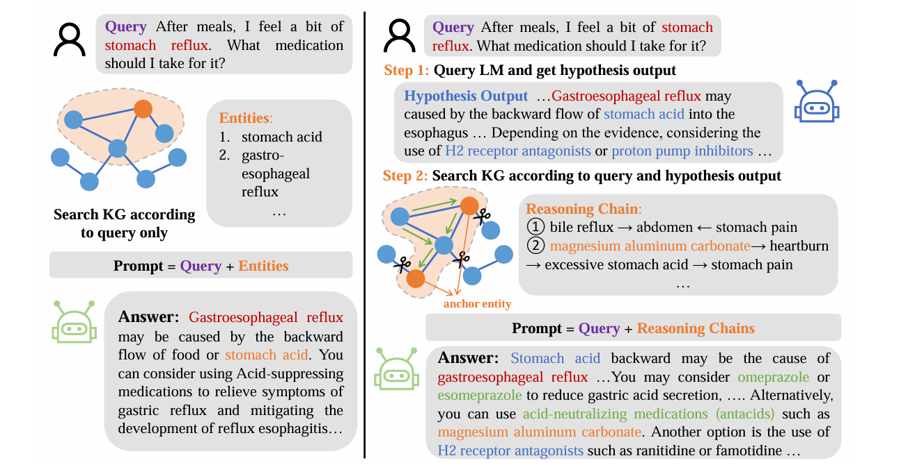
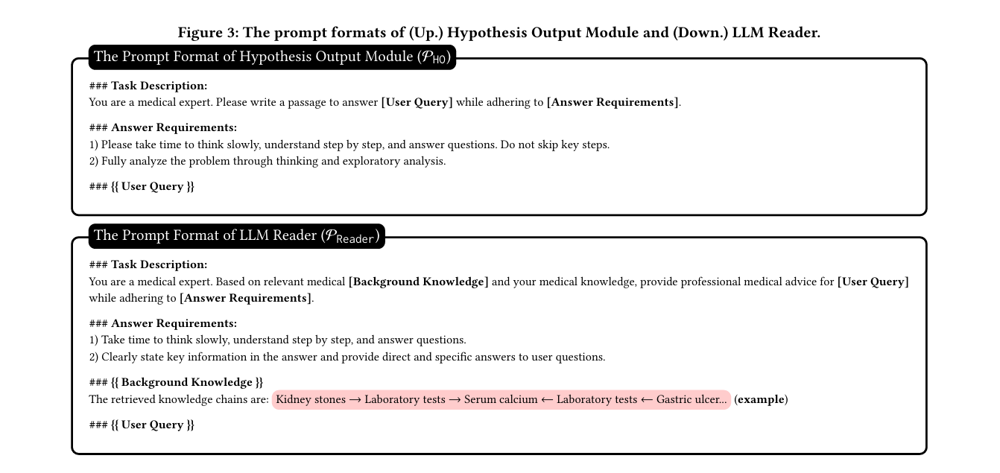
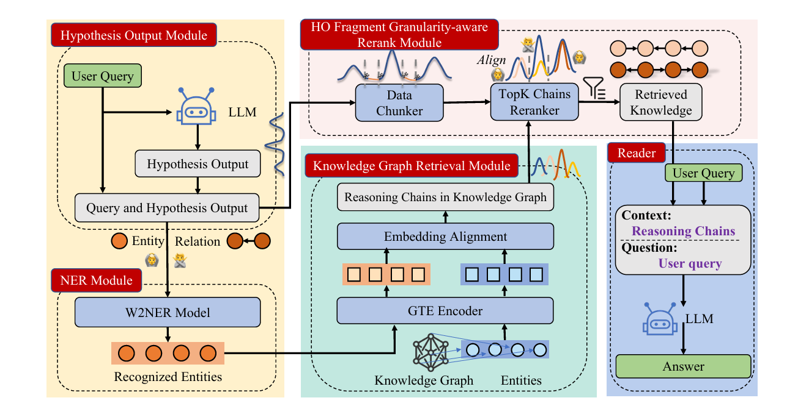
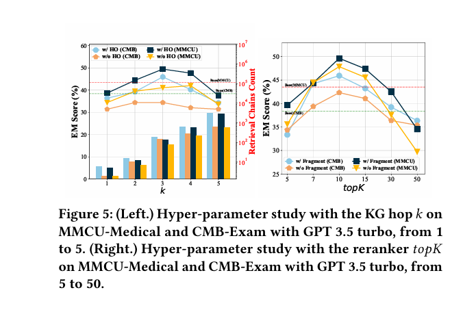

# 自然语言处理:第三十六章HyKGE：北大最强结合知识图谱的医疗RAG

文章地址: [2312.15883 (arxiv.org)](https://arxiv.org/pdf/2312.15883)

<br />

<br />

## 摘要

近期来自北大的团队推出了一种名为HyKGE（Hypothesis Knowledge Graph Enhanced）的框架，旨在通过结合知识图谱（KGs）与大型语言模型（LLMs）的检索增强生成（RAG）技术，提高医疗领域大型语言模型响应的准确性和可靠性。针对现有方法存在的知识检索不足、查询解析繁琐耗时、知识利用单调等问题，HyKGE通过LLMs的强推理能力补充用户查询的不完整性，优化与LLMs的交互过程，并提供多样化的检索知识。该框架在多个中文医疗多选题数据集和开放领域医疗问答数据集上的实验结果表明，HyKGE在准确性和可解释性方面均表现出色。

<br />

<br />

## 背景

随着大型语言模型（LLMs）的快速发展，其在医疗领域的应用也日益广泛。然而，LLMs在生成医疗响应时往往面临知识检索不足、查询解析繁琐耗时以及知识利用单调等问题，导致生成的响应缺乏准确性和可靠性。为了解决这些问题，研究者们开始探索将知识图谱（KGs）与LLMs相结合的方法，以提高医疗领域LLMs的响应质量。HyKGE框架正是在这一背景下提出的。它充分利用了LLMs的强推理能力和知识图谱的丰富知识，通过假设输出（HypothesisOutput）和精心设计的提示（prompt）来扩展知识图谱中的可行探索方向，同时优化与LLMs的交互过程，确保检索到的知识既多样又相关。


<br />


HyKEG提出了一种假说知识图谱增强框架HyKGE。该框架通过结合知识图谱和LLMs，旨在提高医疗领域文本生成的准确性和可靠性。与以往方法相比，HyKGE具有以下亮点：

1. **补偿用户查询的不完整性** ：通过LLMs的推理能力，自动扩展用户查询，从而更全面地覆盖相关知识。
2. **优化与LLMs的交互过程** ：采用精心设计的提示（prompt），提高LLMs响应的密度和效率。
3. **提供多样化的检索知识** ：通过引入HO片段粒度感知的重排模块，在保证相关性的同时，实现检索知识的多样化

<br />

<br />

## 核心算法

### HyKGE框架




HyKGE框架主要包括以下几个部分：

1. **假设输出（Hypothesis Output）**：利用LLMs的零次学习（zero-shot）能力，生成与查询相关的假设输出，这些假设输出可以作为在知识图谱中探索新知识的起点。此模块设计了细致的提示（Prompt）格式，引导LLMs逐步深入思考问题，以弥补用户查询可能存在的信息不全。例如，提示会要求模型“作为医疗专家，缓慢思考，逐步理解并回答问题，不跳过关键步骤，全面分析问题”。通过这种方式，模型能够根据问题要求，发挥其强大的推理能力，探索与问题相关的医学知识，从而生成高质量的假设输出。这个本身要求LLM对医疗知识就有着比较强的推理能力，这里可以通过fine-tune 做知识迁移到医疗领域。

   * 下面是作者原始的prompt设计

     
2. **命名实体识别模块(NER模块)** ：为减少因模型误解或幻觉导致的关系不准确问题，引入了一个专门针对医疗领域的命名实体识别模型。该模型从CMEEE数据集中训练而来，能准确提取出问题中的实体，而不是直接依赖模型对关系的分析，确保后续知识图谱检索的准确性和效率。
3. **知识检索**：基于假设输出和提示，HyKGE在知识图谱中检索与查询相关的知识。这些检索到的知识将被用于生成最终的响应。为减少因模型误解或幻觉导致的关系不准确问题，引入了一个专门针对医疗领域的命名实体识别模型。该模型从CMEEE数据集中训练而来，能准确提取出问题中的实体，而不是直接依赖模型对关系的分析，确保后续知识图谱检索的准确性和效率。
4. **HOFragment粒度感知重排模块**：为了确保检索到的知识既多样又相关，HyKGE引入了一个HOFragment粒度感知重排模块。该模块根据知识的相关性和多样性对检索结果进行重排，以过滤掉噪声信息，同时保持知识的多样性和相关性之间的平衡。


<br />


<br />


### 算法PipeLine




整体的pipeline如上图:

1. **Hypothesis Output Module:** 根据用户提问，首先得到假设性回答
2. **NER Module:** 在假设性回答里得到进行NER(命名实体识别)
3. **Knowledge Graph Retrieval Module:** 根据实体进行推理实体关系链条
4. **HO Fragment Granularity-aware Rerank Moudle:** 根据假设性回答对推理论链条进行重排序
5. **Reader:** 将重排序后的推理链和用户Query 进行生成答案


下面是作者在原文中给出的一个例子:


HyKGE框架具有以下几个显著特点：

- **结合LLMs与KGs**：HyKGE充分利用了LLMs的强推理能力和知识图谱的丰富知识，通过两者的结合提高了医疗领域LLMs的响应质量。
- **假设输出与提示设计**：通过生成假设输出和设计精心策划的提示，HyKGE能够扩展在知识图谱中的探索方向，并引导LLMs生成更准确、更相关的响应。
- **HOFragment粒度感知重排模块**：该模块能够有效过滤掉噪声信息，同时保持知识的多样性和相关性之间的平衡，从而提高了检索结果的质量。


<br />

<br />

## 实验结果与结论


为了验证HyKGE框架的有效性，研究者在两个中文医疗多选题数据集和一个中文开放领域医疗问答数据集上进行了GPT-3.5 和baichuan-13B的实验。实验结果表明，相比于其他基准方法，HyKGE在准确性和可解释性方面均表现出色达到sota。具体来说，HyKGE在医疗多选题数据集上的准确率达到了90%以上，在开放领域医疗问答数据集上的准确率也超过了85%。同时，HyKGE生成的响应具有较强的可解释性，能够清晰地展示推理过程和知识来源。**并且作者也做了消融实验，可以发现在上面几个模块中，推理链和问题描述在整个部分是至关重要的**




**作者也对返回的top_k思维链的数量进行了研究，实验表明k在10以内效果比较好，当大于10的时候性能会下降。**


```
<br />
```


这些实验结果证明了HyKGE框架在医疗领域大型语言模型响应生成方面的优越性能。通过结合LLMs与KGs、利用假设输出和提示设计以及引入HOFragment粒度感知重排模块等关键技术，HyKGE能够有效提高医疗领域LLMs的响应质量和可靠性。


<br />

<br />

## 总结

HyKGE框架是一种通过结合知识图谱和大型语言模型来提高医疗领域大型语言模型响应准确性和可靠性的有效方法。该框架利用LLMs的强推理能力和知识图谱的丰富知识，通过假设输出、提示设计以及HOFragment粒度感知重排模块等技术手段，实现了对医疗领域LLMs响应质量的显著提升。实验结果表明，HyKGE在多个医疗数据集上均取得了优异的成绩，证明了其在实际应用中的有效性和可靠性。

**对于未来AI领域的研究和发展，HyKGE框架提供了有益的启示和借鉴。首先，结合知识图谱和大型语言模型是提高AI系统性能的有效途径之一。**
