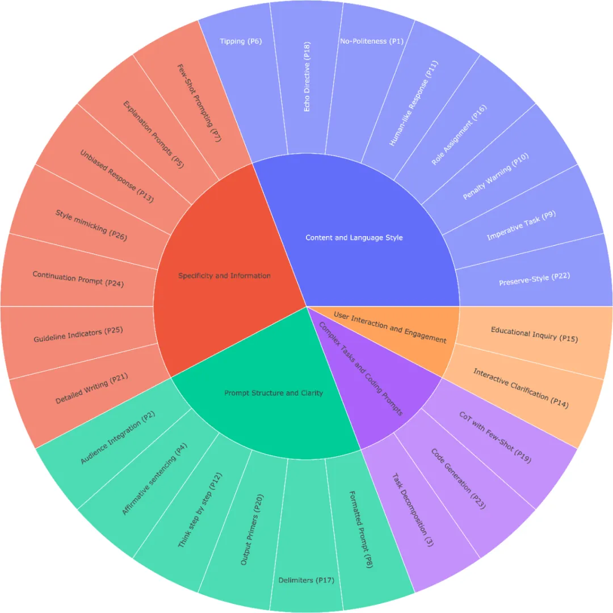
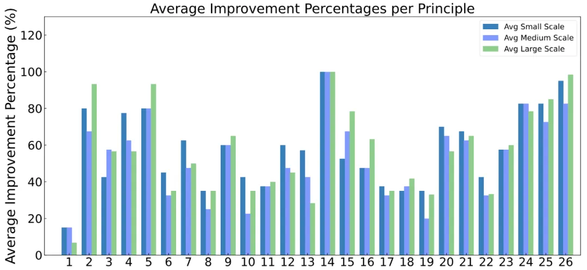

# 自然语言处理:第四十章 如何与大模型交流-Prompt工程

文章链接:[Principled Instructions Are All You Need for  Questioning LLaMA-1/2, GPT-3.5/4](https://arxiv.org/pdf/2312.16171)

主页: [VILA-Lab/ATLAS: A principled instruction benchmark on formulating effective queries and prompts for large language models (LLMs). Our paper: https://arxiv.org/abs/2312.16171 (github.com)](https://github.com/VILA-Lab/ATLAs)

数据: [raw.githubusercontent.com/VILA-Lab/ATLAS/main/data/general_dataset.json](https://raw.githubusercontent.com/VILA-Lab/ATLAS/main/data/general_dataset.json)

 

 

***写在前面: 笔者更新不易，希望走过路过点个关注和赞，笔芯!!!***

***写在前面: 笔者更新不易，希望走过路过点个关注和赞，笔芯!!!***

***写在前面: 笔者更新不易，希望走过路过点个关注和赞，笔芯!!!***

## 摘要

本文介绍了一套由26条指导原则构成的框架，旨在简化向大型语言模型（LLMs）提问和提示的过程。这些原则旨在帮助用户更好地理解如何针对不同规模的LLM设计问题，评估它们的能力，并提升用户对不同模型在接收不同提示时行为的理解。研究团队在LLaMA-1/2和GPT-3.5/4等模型上进行了广泛实验，验证了这些原则在指导指令和提示设计上的有效性。该工作为大型语言模型提示研究者提供了一个更全面的指南，并通过开源项目页面（[https://github.com/VILA-Lab/ATLAS）分享了相关资源。](https://github.com/VILA-Lab/ATLAS%EF%BC%89%E5%88%86%E4%BA%AB%E4%BA%86%E7%9B%B8%E5%85%B3%E8%B5%84%E6%BA%90%E3%80%82)

 

 

## 背景介绍

随着ChatGPT等大型语言模型在问答、数学推理、代码生成等多个领域展现出惊人的能力，如何有效与这些模型互动，特别是如何设计最优的指令或提示，成为了广大用户和开发者面临的一个挑战。直接对模型进行微调以适应特定任务往往不切实际或效率低下，因此，研究界开始聚焦于优化提示技术，即“提示工程”。这项技术涉及精心构建特定任务的指令，以引导模型产生期望的输出。本文旨在揭开这一过程的神秘面纱，帮助用户和开发者更好地与LLMs沟通，通过优化提示来提高预训练模型的响应质量。

 

 

## 26条原则

作者总结归纳了26条[框架](https://github.com/VILA-Lab/ATLAS/blob/main/data/README.md)，具体如下：

1. 如果你想要简洁的回答，不用太客气，直接说就行，不用加上“请”、“如果你不介意”、“谢谢”、“我想要”等客套话。
2. 在提问时说明目标受众，例如，告诉 LLM 你的受众是该领域的专家。
3. 把复杂的任务分成几个简单的小问题，逐步解决。
4. 用肯定的语气说“做某事”，避免用否定语气说“不要做某事”。
5. 当你需要更清楚或深入了解某个话题时，可以这样提问：
   * 用简单的语言解释[具体话题]。
   * 向我解释，就像我 11 岁一样。
   * 向我解释，就像我是[领域]的新手一样。
   * 用简单的英文写[文章/文本/段落]，就像你在向 5 岁的小孩解释。
6. 加上“如果有更好的解决方案，我会奖励 xxx”。
7. 用具体的例子来提问（即使用几个示例来引导）。
8. 在你的提问前写上“###指示###”，如果相关的话，再加上“###示例###”或“###问题###”，然后再写你的内容。用空行分隔指示、示例、问题、背景和输入数据。
9. 使用“你的任务是”和“你必须”这样的短语。
10. 使用“你将受到惩罚”这样的短语。
11. 使用“像人一样自然地回答问题”这样的短语。
12. 用引导词，比如“一步步来思考”。
13. 在提问中加上“确保你的回答没有偏见，避免刻板印象”。
14. 让 LLM 向你提问，直到它有足够的信息来回答你。例如，“从现在起，请你问我问题，直到你有足够的信息……”。
15. 如果你想测试对某个话题的理解，可以这样说：“教我[定理/话题/规则]，最后加个测试，等我回答后告诉我是否正确，但不要提前给答案。”
16. 给 LLM 指定一个角色。
17. 使用分隔符。
18. 在提问中多次重复某个特定的词或短语。
19. 将链式思维（CoT）和少量示例的提示结合使用。
20. 使用输出引导语，在你的提问结尾加上预期回答的开头部分。
21. 想写详细的文章、段落或文本时，可以这样说：“请为我写一篇详细的[文章/段落]，内容涉及[话题]，并加入所有必要的信息。”
22. 如果你要修改特定文本但不改变风格，可以这样说：“请修改用户发送的每个段落，只需改进语法和词汇，使其听起来自然，但保持原有的写作风格，确保正式的段落仍然正式。”
23. 当你有复杂的代码提示需要分成不同文件时，可以这样说：“从现在起，每当你生成跨多个文件的代码时，生成一个[编程语言]脚本，以自动创建指定的文件或修改现有文件以插入生成的代码。”然后提问。
24. 当你想用特定的词、短语或句子来开始或继续一段文字时，可以使用以下提示：“我提供给你开头部分[歌词/故事/段落/文章...]: [插入歌词/词语/句子]。请根据提供的词语完成它，并保持一致的流畅性。”
25. 明确指出模型必须遵循的要求，以关键词、规则、提示或指令的形式。
26. 想写与提供的样本相似的文本时，可以这样说：“请根据提供的段落[/标题/文本/文章/答案]使用相同的语言。

 

 

## 实验结果与结论

**在不同尺寸的模型**

 **质量提升** ：小型（7B）、中型（13B）和大型 LLMs（70B 以及 GPT-4.5/4） 的回答质量都显著提高。其中套路 2、5、15、16、25 和 26，对大型模型的提升效果最明显。而套路 14，在所有尺寸的模型中，都获得了显著的提升：

* 让 LLM 向你提问，直到它有足够的信息来回答你。例如，“从现在起，请你问我问题，直到你有足够的信息……”。

**准确提升** ：不同规模的模型应用这些套路后，平均准确率在20%到40%之间。小型和中型模型的准确率在10%到40%之间，而大型模型的准确率超过40%。在相对准确性方面，各模型的性能平均提高了10%以上，大型模型的提升甚至超过20%。

 

` `

## 总结与展望

本文通过一套细致入微的指导原则，为大型语言模型的提示设计提供了一种系统化的方法。这些原则覆盖了从简洁明了的指令到引导模型进行多步骤推理的策略，再到避免偏见和提升用户参与度的各种方面。研究不仅揭示了有效提示设计的关键要素，还展示了通过优化提示，即便是未经专门微调的大型语言模型也能在多种任务上展现更佳性能。作者希望这一工作能为从事大型语言模型提示研究的人员提供一个实用的指南，促进未来模型交互方式的创新和优化。通过开源项目，研究团队进一步鼓励社区参与到这一重要领域中来，共同探索如何更好地利用大型语言模型的潜力。
