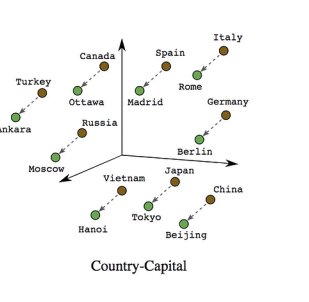
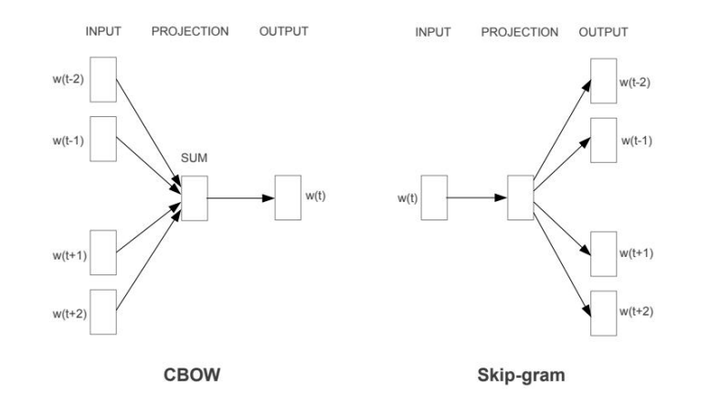
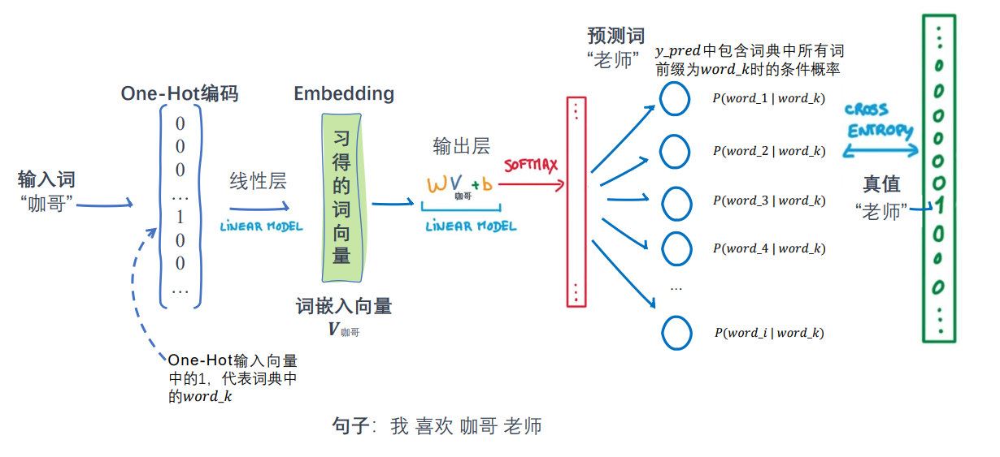
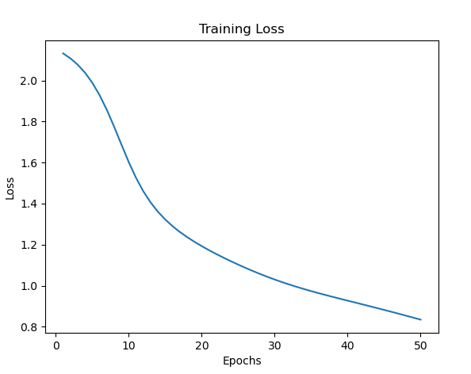

# 自然语言处理: 第二章Word2Vec

## 一. 理论基础

1. 维度很高(与语料库有关)，计算复杂
2. 稀疏性，浪费计算效率，只有一个元素是1 其他都是0
3. 缺乏语义信息，无法衡量语义相似度
4. 无法处理未知单词


<br />


<br />


而在One-Hot的基础上，Word2Vec 是一种分布式表达字/词的方式，其是以一种能够刻画语义之间相似度并且纬度较低的稠密向量表示。如下图，利用Word2vec的表示的话，其在特征空间拥有相似语义的向量，距离更加接近或者说相似度更高，并且赋予了向量语义的信息， 比如 : 爸爸 - 儿子  ≈ 妈妈 - 女儿 。




<br />


<br />


那么Word2vec如何实现的呢？ 主要有两种实现方式:

1. CBOW(Continuous Bag of Words)模型，通过滑动窗口的词去预测中心词 ， 其中窗口中的词经过embedding层求一个sum(mean)然后再去预测中心词 。由于CBOW在训练过程中关注于根据上下文词预测目标词，它倾向于对频繁出现的词汇表现更好，因为这些词对整体上下文的贡献更大
2. Skip-Gram 模型 ， 通过中心词去预测滑动窗口的词( 每个词与中心词都组成一个pair 然后构建网络去预测) 。在训练过程中关注于预测上下文词。因此，它通常在处理罕见词汇和具有更大窗口大小的数据集上表现更好




<br />


<br />


下面以CBOW做一个图解 ,:

1. 得到一个目标句子 : 【'我','喜欢','咖哥','老师'】
2. 现在设定是窗口是2 所以目前的中心词是'咖哥' ,  目标是'老师'
3. 将输入词'咖哥'做One-Hot 编码
4. 输入一个线性层，得到一个embedding 向量(其权重矩阵应该是 vocab_size * embedding大小)
5. 然后将embedding 向量再通过一个线形层映射回原字典大小的向量坐Softmax ， 与目标单词'老师' 做交叉熵 更新网络参数
6. 经过多次迭代后，取4中的权重每一行作为每个单词的表达embedding ，也就是我们求得Word2Vec (好像也有一种做法是把同样5中的权重(embedding * vocab_size)每一列作为embedding 或者将前面的4和5的embedding做一个mean)




<br />


<br />


## 二.代码实现


代码实现的流程如上图, 可以分成6步 ，下面主要演示了下关键步骤代码:


<br />


<br />


* 构建语料库, 利用类实现，通过输入语料库句子 和设定窗口值进行初始化

```
class CBOW():
    def __init__(self ,  sentences , window_size = 3 ,) -> None:
        self.window_size = window_size
        self.sentences = sentences
        # 将所有句子连接在一起，然后用空格分隔成词汇
        words = ' '.join(sentences).split()
        # 构建词汇表，去除重复的词
        self.word_list = list(set(words))
        # 创建一个字典，将每个词汇映射到一个唯一的索引
        self.word_to_idx = {word: idx for idx, word in enumerate(self.word_list)}
        # 创建一个字典，将每个索引映射到对应的词汇
        self.idx_to_word = {idx: word for idx, word in enumerate(self.word_list)}
        self.voc_size = len(self.word_list) # 计算词汇表的大小
        print("词汇表：", self.word_list) # 输出词汇表
        print("词汇到索引的字典：", self.word_to_idx) # 输出词汇到索引的字典
        print("索引到词汇的字典：", self.idx_to_word) # 输出索引到词汇的字典
```


<br />


<br />


* 生成skipgram数据 ， 这里分了两种情况 第一种 `get_embedding_ENdataset`是生成One-Hot编码的训练数据 ， 对应着网络输入一个linear 而第二种是 `get_embedding_dataset` 是直接生成idx 而对应着网络输入一个embedding层

```
    def _encoding(self, word):
        tensor = torch.zeros(self.voc_size) 
        tensor[self.word_to_idx[word]] = 1
        return tensor

    def get_embedding_ENdataset(self):
        data = self._get_unembedding_dataset() # 拿到为编码的数据
        self.cbow_data = [(self.word_to_idx[target] , [self._encoding(content) for content in context_words]) for target , context_words in data]
        print("CBOW数据样例（已编码）：", self.cbow_data[0])
        return self.cbow_data

    def get_embedding_dataset(self):
        data = self._get_unembedding_dataset() # 拿到为编码的数据
        self.cbow_data = [(self.word_to_idx[target] , [self.word_to_idx[content] for content in context_words]) for target , context_words in data]
        print("CBOW数据样例（已编码）：", self.cbow_data[0])
        return self.cbow_data
```


<br />


<br />


* 定义CBOW网络， 这里对比了两种网络，一种是输入是linear 一种输入是embedding，其实整体词袋模型是一个只有一个隐藏层的softmax网络。

```
class CBOW_onehot(nn.Module):
    def __init__(self, voc_size, embedding_size):
        super(CBOW_onehot, self).__init__()
        # 从词汇表大小到嵌入大小的线性层（权重矩阵）
        self.input_to_hidden = nn.Linear(voc_size, 
                                         embedding_size, bias=False)  
        # 从嵌入大小到词汇表大小的线性层（权重矩阵）
        self.hidden_to_output = nn.Linear(embedding_size, 
                                          voc_size, bias=False)  

    def forward(self, X): # X: [num_context_words, voc_size]
        # 生成嵌入：[num_context_words, embedding_size]
        embeddings = self.input_to_hidden(X)  
        # 计算隐藏层，求嵌入的均值：[embedding_size]
        hidden_layer = torch.mean(embeddings, dim=0)  
        # 生成输出层：[1, voc_size]
        output_layer = self.hidden_to_output(hidden_layer.unsqueeze(0)) 
        return output_layer
  
class CBOW_embedding(nn.Module):
    def __init__(self, voc_size, embedding_size):
        super(CBOW_embedding, self).__init__()
        # 从词汇表大小到嵌入大小的线性层（权重矩阵）
        self.input_to_hidden = nn.Embedding(voc_size, 
                                         embedding_size)  
        # 从嵌入大小到词汇表大小的线性层（权重矩阵）
        self.hidden_to_output = nn.Linear(embedding_size, 
                                          voc_size, bias=False)  

    def forward(self, X): # X: [num_context_words, voc_size]
        # 生成嵌入：[num_context_words, embedding_size]
        embeddings = self.input_to_hidden(X)  
        # 计算隐藏层，求嵌入的均值：[embedding_size]
        hidden_layer = torch.mean(embeddings, dim=0)  
        # 生成输出层：[1, voc_size]
        output_layer = self.hidden_to_output(hidden_layer.unsqueeze(0)) 
        return output_layer
```


<br />


<br />


* 训练模型 ， 这里定义了training 函数， 其中参数第一个是不同的网络，lr是学习率, epoch 是迭代次数 ， 而flag对应的是不同模型对应着不同的输入数据，需要声明一下。

```
    def training(self , cbow_model:nn.Module , lr = 0.001 , epochs = 1000 , flag = False):
        assert self.cbow_data is not None
        criterion = nn.CrossEntropyLoss()  # 定义交叉熵损失函数
        optimizer = optim.SGD(cbow_model.parameters(), lr= lr)

        # 开始训练循环
        loss_values = []  # 用于存储每轮的平均损失值
        for epoch in range(epochs):
            loss_sum = 0
            for target, context_words in self.cbow_data:
                # 将上下文词转换为One-hot向量并堆叠
                # flag == 1 indicates embedding , else onehot
                X = torch.tensor(context_words) if flag else torch.stack(context_words).float()

                y_pred = cbow_model(X)  # 计算预测值
                y_true = torch.tensor(target).reshape(1)
                loss = criterion(y_pred, y_true)  # 计算损失
                loss_sum += loss.item()
                optimizer.zero_grad()  # 清空梯度
                loss.backward()  # 反向传播
                optimizer.step()  # 更新参数
              
            if (epoch+1) % 100 == 0: # 输出每100轮的损失，并记录损失
                print(f"Epoch: {epoch+1}, Loss: {loss_sum/len(self.cbow_data)}")  
                loss_values.append(loss_sum / len(self.cbow_data))
```


<br />


<br />


<br />


## 三.结果

loss 曲线



特征空间表征，可以看到意思相近的词位置靠的更加接近:


