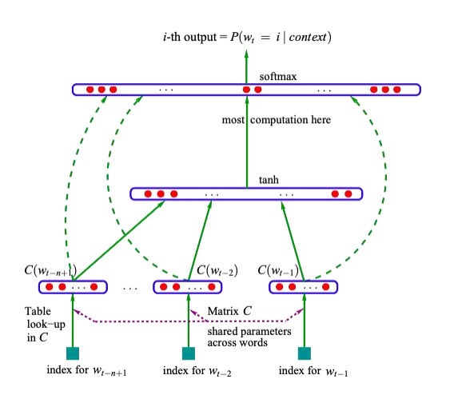

# 自然语言处理: 第三章NPLM(Neural Probabilistic Language Mode)

## 理论基础

NPLM的全称是"Neural Probabilistic Language Model"，即神经概率语言模型。这是一种基于神经网络的语言模型，用于生成自然语言文本。最早是由Bengio 在2003年的[A Neural Probabilistic Language Mode](https://jmlr.csail.mit.edu/papers/volume3/bengio03a/bengio03a.pdf)l一文中提出来的， NPLM通过学习文本数据的概率分布，能够预测下一个单词或字符的概率，从而生成连贯的语句或段落。这种模型在机器翻译、文本生成和自然语言处理等任务中被广泛应用。


<br />


<br />


其中NPLM主要由三部分组成:

* **输入层**将单词映射到连续的词向量空间(根据上下文信息可动态调整) ， 实际就是又文本的index 转换成为embedding的过程
* **隐藏层**通过非线性激活函数学习单词间的复杂关系，其中隐藏层可以自行调整
* **输出层**通过Softmax层产生下一个单词的概率分布 





<br />


<br />


## 代码实现

下面是一个构建最简单的NPLM的代码实现，其流程如下图：


1. 构建语料库，其实就是分词之后利用字典得到对应的index

   ```
   class Corpus():
       def __init__(self , sentences) -> None:
           self.sentences = sentences
           # 将所有句子连接在一起，用空格分隔成词汇，再将重复的词去除，构建词汇表
           self.word_list = list(set(" ".join(sentences).split()))  
           # 创建一个字典，将每个词汇映射到一个唯一的索引
           self.word_to_idx = {word: idx for idx, word in enumerate(self.word_list)} 
           # 创建一个字典，将每个索引映射到对应的词汇
           self.idx_to_word = {idx: word for idx, word in enumerate(self.word_list)}  
           self.voc_size = len(self.word_list)  # 计算词汇表的大小
           print('字典：', self.word_to_idx)  # 打印词汇到索引的映射字典
           print('字典大小：', self.voc_size)  # 打印词汇表大小 
   ```
2. 生成训练数据 ， 这里实现比较简单，每个句子去预测最后一个词，前面的词则都作为content

   ```
   class Corpus():
       def __init__(self , sentences) -> None:
           self.sentences = sentences
           # 将所有句子连接在一起，用空格分隔成词汇，再将重复的词去除，构建词汇表
           self.word_list = list(set(" ".join(sentences).split()))  
           # 创建一个字典，将每个词汇映射到一个唯一的索引
           self.word_to_idx = {word: idx for idx, word in enumerate(self.word_list)} 
           # 创建一个字典，将每个索引映射到对应的词汇
           self.idx_to_word = {idx: word for idx, word in enumerate(self.word_list)}  
           self.voc_size = len(self.word_list)  # 计算词汇表的大小
           print('字典：', self.word_to_idx)  # 打印词汇到索引的映射字典
           print('字典大小：', self.voc_size)  # 打印词汇表大小 


       def make_batch(self , batch_size = 3):
           input_batch = []  # 定义输入批处理列表
           target_batch = []  # 定义目标批处理列表
           selected_sentences = random.sample(self.sentences, batch_size) # 随机选择句子
           for sen in selected_sentences:  # 遍历每个句子
               word = sen.split()  # 用空格将句子分隔成词汇
               # 将除最后一个词以外的所有词的索引作为输入
               input = [self.word_to_idx[n] for n in word[:-1]]  # 创建输入数据
               # 将最后一个词的索引作为目标
               target = self.word_to_idx[word[-1]]  # 创建目标数据
               input_batch.append(input)  # 将输入添加到输入批处理列表
               target_batch.append(target)  # 将目标添加到目标批处理列表
           input_batch = torch.LongTensor(input_batch) # 将输入数据转换为张量
           target_batch = torch.LongTensor(target_batch) # 将目标数据转换为张量
           return input_batch, target_batch  # 返回输入批处理和目标批处理数据
   ```
3. 定义NPLM模型， 这里定义了一个比较简单的隐藏层为N层的LSTM 以及 GRU 网络 ， 其中batch_first 设置为true的话，输出的tensor的格式为(batch , seq , feature) 反之则为输出的tensor的格式为(seq,  batch , feature) 。 其次， voc_size的意思是词表大小， embedding_size是嵌入层的大小 ， n_hidden 代表的是隐藏层的大小 ， num_layers 代表的是RNN网络的层数。

   ```
   class Lstm(nn.Module):
       def __init__(self , voc_size , embedding_size , n_hidden , num_layers):
           super(Lstm, self).__init__()
           self.embedding = nn.Embedding(voc_size, embedding_size)
           self.lstm = nn.LSTM(embedding_size, n_hidden, num_layers ,  batch_first=True)
           self.linear = nn.Linear(n_hidden, voc_size)

       def forward(self, X):
           X = self.embedding(X)
           lstm_out, _ = self.lstm(X)
           output = self.linear(lstm_out[:, -1, :])  # 只选择最后一个时间步的输出作为全连接层的输入
           return output

   class Gru(nn.Module):
       def __init__(self , voc_size , embedding_size , n_hidden , num_layers):
           super(Gru, self).__init__()
           self.embedding = nn.Embedding(voc_size, embedding_size)
           self.gru = nn.GRU(embedding_size, n_hidden, num_layers , batch_first=True)
           self.linear = nn.Linear(n_hidden, voc_size)

       def forward(self, X):
           X = self.embedding(X)
           lstm_out, _ = self.gru(X)
           output = self.linear(lstm_out[:, -1, :])  # 只选择最后一个时间步的输出作为全连接层的输入
           return output
   ```
4. 实例化模型, 这里因为涉及两个隐层模式(lstm 以及gru)， 如果需要哪个注释掉就行。

   ```
       # model = Lstm( voc_size ,  embedding_size, n_hidden , num_layers) # 创建神经概率语言模型实例
       model = Gru(voc_size ,  embedding_size, n_hidden , num_layers)
       print('RNN模型结构：', model)  # 打印模型的结构
   ```
5. 训练

   ```
   def train(model , corpus , lr):
       criterion = nn.CrossEntropyLoss() # 定义损失函数为交叉熵损失
       optimizer = optim.Adam(model.parameters(), lr= lr) # 定义优化器为Adam，学习率为0.1
       # 训练模型
       for epoch in range(5000): # 设置训练迭代次数
           optimizer.zero_grad() # 清除优化器的梯度
           input_batch, target_batch = corpus.make_batch() # 创建输入和目标批处理数据
           output = model(input_batch) # 将输入数据传入模型，得到输出结果
           # output的形状为 [batch_size, n_class]，target_batch的形状为 [batch_size]
           loss = criterion(output, target_batch) #计算损失值
           if (epoch + 1) % 1000 == 0: # 每1000次迭代，打印损失值
               print(f"Epoch: {epoch + 1:04d} cost = {loss:.6f}") 
           loss.backward() # 反向传播计算梯度
           optimizer.step() # 更新模型参数

       return model
   ```
6. 做inference

```
def test(input , corpus , model):
    # 将输入序列转换为对应的索引
    input_indices = [[corpus.word_to_idx[word] for word in seq] for seq in input]  
    input_tensor = torch.LongTensor(input_indices)  # 将输入序列的索引转换为张量
    # 对输入序列进行预测，取输出中概率最大的类别
    predict = model(input_tensor).data.max(1)[1]  
    # 将预测结果的索引转换为对应的词汇
    predict_strs = [corpus.idx_to_word[n.item()] for n in predict.squeeze()]  
    for input_seq, pred in zip(input, predict_strs):
        print(input_seq, '->', pred)  # 打印输入序列和预测结果
```


<br />


<br />


<br />

## 结果

整体实验结果如下:


