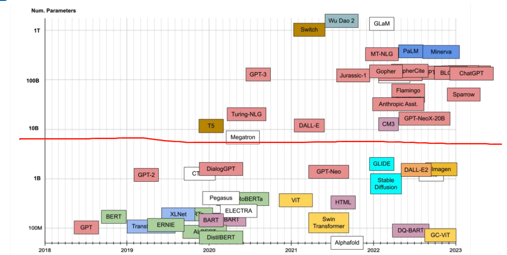
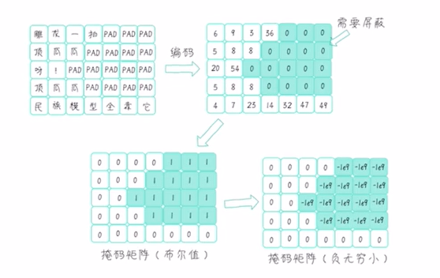
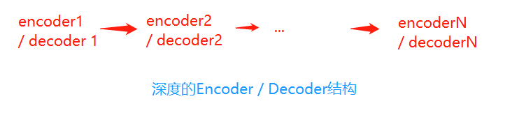
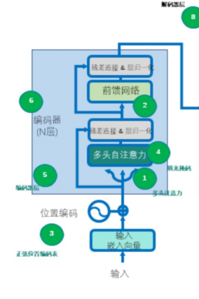
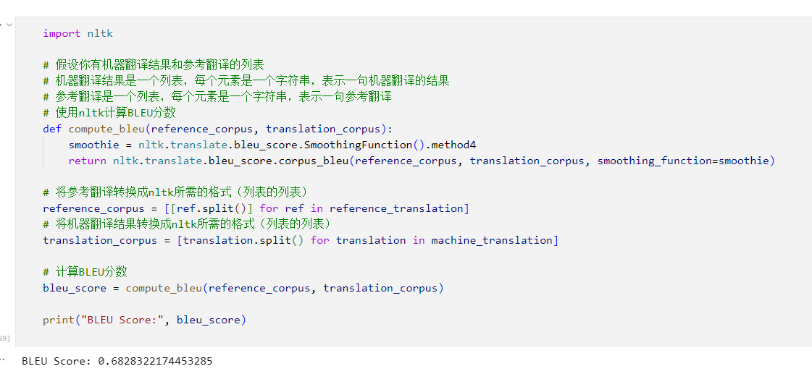

# 自然语言处理: 第六章Transformer- 现代大模型的基石

## 理论基础

Transformer（来自2017年google发表的[Attention Is All You Need (arxiv.org)](https://arxiv.org/abs/1706.03762) ），接上面一篇attention之后，transformer是基于自注意力基础上引申出来的结构，其主要解决了seq2seq的两个问题:

1. 考虑了原序列和目标序列自身内部的自注意力
2. 大大降低的计算成本以及复杂度，完全由全连接层替代了时序模型，使得模型可以并行处理


自从transformer 架构出现后，基于transformer的大模型就开始遍地开花，可以看到下图中超过百万级别的大模型凑够18年以后就层出不穷。



整体结构如下图，整体可以分成9各部分: 其中红线标记的就是transformer 独有的结构，主要是**多头自注意力，位置编码。**


<br />

<br />

1. **缩放点积注意力**

自注意力简而言之就是输入向量X，通过一系列线性变换后，得到了一个同样维度的X'，但是这个X' 不是简单的word2vec 而是一个动态的阅读过上下文的X' ，它包含了丰富的信息。具体的变换操作可以参考上一篇博客[Attention注意力机制](https://blog.csdn.net/victor_manches/article/details/131797072?spm=1001.2014.3001.5502)。


<br />

<br />

<br />

2. **逐位置前馈网络**
   对多头注意力的输出(batch , seq , embedding_size)继续多一层线性变换，并且是逐位置的进行线性变换后输出依然是(batch , seq , embedding_size)。这里的作用其实主要有两个：

* 对输入序列中的每个位置的表示进行变换，这里的逐位置意思是每个位置经过同样的权重和偏置，可以看作是1*1 卷积，后得到输出，这里是逐位置的变换，而不是整体将整个seq全部展开后进行变换是为了不引入顺序的依赖性，并且利用transformer架构中的并行处理
* 逐位置的前向传播网络还有助于增加模型的表达能力，可以让模型学到更复杂的特征表示，因为这里会涉及到一个seq , embedding_size 升维后再降维的操作


<br />

<br />

3. **正弦位置编码表**

因为在语言模型中，每个词的顺序是非常重要的，由于transformer 架构不像RNN这类时序模型一样，模型本身知道输入序列的顺序，，所以为了保留输入序列的顺序信息，所以引入了位置编码这个概念。

具体公式如下:  其中pos : ( 0 - seq_len ) , d :(embedding_size) , i : (0 - embedding_size ) ， 其中不同的embedding上函数的相位不同

其中至于为什么用正弦函数进行编码，这个应该是一个实践出来的方程，因为他是一个周期性的函数，可以使得模型更好处理循环和重复出现的模式(比如语法结构)


<br />

<br />

**4. 填充位置掩码**

由于深度学习里都是以batch为单位的作为训练的，所以需要把所有的句子都利用 `<pad>` 填充至等长，这样就可以做batch的训练。除此之外，为了将这里的 `<pad >`的注意力设置成0， 所以需要传入一个bool matrix 告诉网络哪些位置是填充了的，并将其注意力权重设置成无穷小。



<br />

<br />

**5. 编码器**

这里是由多个编码器层叠加形成最终的深层次的编码器，也就是前一层的输出是当前层的输入，最后一层的输出作为整个编码器的输出，具体结构如下:



而单层的编码器层是由自注意力 + (正弦)位置编码 +  填充掩码 +  前馈网络构成



<br />

<br />

**6. 后续位置掩码**

序列生成任务中，解码器的每个实践步都依赖于前面已经生成的部分序列，在解码器中，生成的自注意力由于每次生成的内容不能关注到后续位置的注意力，换句话说就是为了防止解码器在生成当前位置实过度依赖未来的信息。

举个例子比如说我的目标中英机器翻译 ， 编码器的输入是**I love you** -> 解码器的输入应该是 `<sos> `我 爱 你 `<eos>`所以对于编码器而言我由于我需要整个任务，所以我必须看完所有内容，所以我可以看完整个I love you 这一句话，但是对于解码器而言，我需要生成的目标是 `<sos> `我 爱 你 `<eos>` 所以编码器只有看完了整个I love you 的输入解码器才能输出第一个字我， 而生成第二个字爱的时候，解码器只能看见 `<sos> `我 这两个输入的自注意力，而不能看见爱和你，否则就类似作弊了。所以后续位置掩码就应运而生，类似一个三角矩阵。


<br />

<br />

7. **解码器**

解码器也是由N层解码器层深度叠加实现的，其中与编码器层结构类似，但是添加了几个特别的点是编解码多头注意力 ， 这里比较好理解就是因为在解码器得到自己的自注意力后，需要与编码器的输出做注意力整合， 除此之外还有一个后续位置掩码。


<br />

<br />

## 代码实现

### Transformer搭建

1. 缩放点积注意力

   ```
   # 定义缩放点积注意力类
   class ScaledDotProductAttention(nn.Module):
       def __init__(self):
           super(ScaledDotProductAttention, self).__init__()  
       def forward(self, Q, K, V, attn_mask):  
           """
           Q 是当前要处理的上下文的信息, -> X1
           K 不同位置的输入与查询的相关性  -> X2
           V 是来自输入序列的一组表示  -> X2
           """
           # 计算注意力分数（原始权重）, score = (Q * K / 缩放因子)
           scores = torch.matmul(Q, K.transpose(-1, -2)) / np.sqrt(d_k)  #(batch , seq_q , seq_k)
           # 使用注意力掩码，将attn_mask中值为1的位置的权重替换为极小值
           scores.masked_fill_(attn_mask, -1e9) 
           # 对注意力分数进行softmax
           weights = nn.Softmax(dim=-1)(scores)
           # 计算上下文向量（也就是注意力的输出）, 是上下文信息的紧凑表示
           context = torch.matmul(weights, V) #  (batch , seq_q , embedding)
           return context, weights # 返回上下文向量和注意力分数
   ```
2. 多头注意力类

   ```
   class MultiHeadAttention(nn.Module):
       def __init__(self):
           super(MultiHeadAttention, self).__init__()
           self.W_Q = nn.Linear(d_embedding, d_k * n_heads) # Q的线性变换层
           self.W_K = nn.Linear(d_embedding, d_k * n_heads) # K的线性变换层
           self.W_V = nn.Linear(d_embedding, d_v * n_heads) # V的线性变换层
           self.linear = nn.Linear(n_heads * d_v, d_embedding)
           self.layer_norm = nn.LayerNorm(d_embedding)

       def forward(self, Q, K, V, attn_mask): 
           #-------------------------维度信息-------------------------------- 
           # Q K V [batch_size, len_q/k/v, embedding_dim] 
           #-------------------------维度信息--------------------------------  
           residual, batch_size = Q, Q.size(0) # 保留残差连接
           # 将输入进行线性变换和重塑，以便后续处理 ， 下面的-1 代表的是qkv各自的seq_len
           q_s = self.W_Q(Q).view(batch_size, -1, n_heads, d_k).transpose(1,2)  
           k_s = self.W_K(K).view(batch_size, -1, n_heads, d_k).transpose(1,2)
           v_s = self.W_V(V).view(batch_size, -1, n_heads, d_v).transpose(1,2)
           #-------------------------维度信息-------------------------------- 
           # q_s k_s v_s: [batch_size, n_heads, len_q/k/v, d_q=k/v]
           #-------------------------维度信息-------------------------------- 
           # 将注意力掩码复制到多头 attn_mask: [batch_size, n_heads, len_q, len_k]
           attn_mask = attn_mask.unsqueeze(1).repeat(1, n_heads, 1, 1)
           #-------------------------维度信息-------------------------------- 
           # attn_mask [batch_size, n_heads, len_q, len_k]
           #-------------------------维度信息-------------------------------- 
           # 使用缩放点积注意力计算上下文和注意力权重
           # context: [batch_size, n_heads, len_q, dim_v]; weights: [batch_size, n_heads, len_q, len_k]
           context, weights = ScaledDotProductAttention()(q_s, k_s, v_s, attn_mask)
           #-------------------------维度信息-------------------------------- 
           # context [batch_size, n_heads, len_q, dim_v]
           # weights [batch_size, n_heads, len_q, len_k]
           #-------------------------维度信息-------------------------------- 
           # 重塑上下文向量并进行线性变换，[batch_size, len_q, n_heads * dim_v]
           context = context.transpose(1, 2).contiguous().view(batch_size, -1, n_heads * d_v) 
           #-------------------------维度信息-------------------------------- 
           # context [batch_size, len_q, n_heads * dim_v]
           #-------------------------维度信息--------------------------------   
           output = self.linear(context) # [batch_size, len_q, embedding_dim]
           #-------------------------维度信息-------------------------------- 
           # output [batch_size, len_q, embedding_dim]
           #-------------------------维度信息--------------------------------   
           # 与输入(Q)进行残差链接，并进行层归一化后输出[batch_size, len_q, embedding_dim]
           output = self.layer_norm(output + residual)
           #-------------------------维度信息-------------------------------- 
           # output [batch_size, len_q, embedding_dim]
           #-------------------------维度信息--------------------------------   
           return output, weights # 返回层归一化的输出和注意力权重
   ```
3. 逐位置前向传播网络

   ```
   # 定义逐位置前向传播网络类
   class PoswiseFeedForwardNet(nn.Module):
       def __init__(self):
           super(PoswiseFeedForwardNet, self).__init__()
           # 定义一维卷积层1，用于将输入映射到更高维度
           self.conv1 = nn.Conv1d(in_channels=d_embedding, out_channels=2048, kernel_size=1)
           # 定义一维卷积层2，用于将输入映射回原始维度
           self.conv2 = nn.Conv1d(in_channels=2048, out_channels=d_embedding, kernel_size=1)
           # 定义层归一化
           self.layer_norm = nn.LayerNorm(d_embedding)

       def forward(self, inputs): # inputs: [batch_size, len_q, embedding_dim]
           #-------------------------维度信息-------------------------------- 
           # inputs [batch_size, len_q, embedding_dim]
           #-------------------------维度信息--------------------------------  
           residual = inputs  # 保留残差连接 [batch_size, len_q, embedding_dim]
           # 在卷积层1后使用ReLU激活函数 [batch_size, embedding_dim, len_q]->[batch_size, 2048, len_q]
           output = nn.ReLU()(self.conv1(inputs.transpose(1, 2))) 
           #-------------------------维度信息-------------------------------- 
           # output [batch_size, 2048, len_q]
           #-------------------------维度信息--------------------------------
           # 使用卷积层2进行降维 [batch_size, 2048, len_q]->[batch_size, embedding_dim, len_q]
           output = self.conv2(output).transpose(1, 2) # [batch_size, len_q, embedding_dim]
           #-------------------------维度信息-------------------------------- 
           # output [batch_size, len_q, embedding_dim]
           #-------------------------维度信息--------------------------------
           # 与输入进行残差链接，并进行层归一化，[batch_size, len_q, embedding_dim]
           output = self.layer_norm(output + residual) # [batch_size, len_q, embedding_dim]
           #-------------------------维度信息-------------------------------- 
           # output [batch_size, len_q, embedding_dim]
           #-------------------------维度信息--------------------------------
           return output # 返回加入残差连接后层归一化的结果
   ```
4. 正弦位置编码表

   ```
   # 生成正弦位置编码表的函数，用于在Transformer中引入位置信息
   def get_sin_enc_table(n_position, embedding_dim):
       #-------------------------维度信息--------------------------------
       # n_position: 输入序列的最大长度
       # embedding_dim: 词嵌入向量的维度
       #-----------------------------------------------------------------  
       # 根据位置和维度信息，初始化正弦位置编码表
       sinusoid_table = np.zeros((n_position, embedding_dim))  
       # 遍历所有位置和维度，计算角度值
       for pos_i in range(n_position):
           for hid_j in range(embedding_dim):
               angle = pos_i / np.power(10000, 2 * (hid_j // 2) / embedding_dim)
               sinusoid_table[pos_i, hid_j] = angle  
       # 计算正弦和余弦值
       sinusoid_table[:, 0::2] = np.sin(sinusoid_table[:, 0::2])  # dim 2i 偶数维
       sinusoid_table[:, 1::2] = np.cos(sinusoid_table[:, 1::2])  # dim 2i+1 奇数维  
       #-------------------------维度信息--------------------------------
       # sinusoid_table 的维度是 [n_position, embedding_dim]
       #-----------------------------------------------------------------  
       return torch.FloatTensor(sinusoid_table)  # 返回正弦位置编码表
   ```
5. 填充位置注意力掩码

   ```
   # 生成填充注意力掩码的函数，用于在多头自注意力计算中忽略填充部分
   def get_attn_pad_mask(seq_q, seq_k):
       #-------------------------维度信息--------------------------------
       # seq_q 的维度是 [batch_size, len_q]
       # seq_k 的维度是 [batch_size, len_k]
       #-----------------------------------------------------------------
       batch_size, len_q = seq_q.size()
       batch_size, len_k = seq_k.size()
       # 生成布尔类型张量[batch_size，1，len_k(=len_q)]
       pad_attn_mask = seq_k.data.eq(0).unsqueeze(1)  #<PAD> Token的编码值为0 
       # 变形为何注意力分数相同形状的张量 [batch_size，len_q，len_k]
       pad_attn_mask = pad_attn_mask.expand(batch_size, len_q, len_k)
       #-------------------------维度信息--------------------------------
       # pad_attn_mask 的维度是 [batch_size，len_q，len_k]
       #-----------------------------------------------------------------
       return pad_attn_mask # [batch_size，len_q，len_k]
   ```
6. 编码器(层)

   ```
   # 定义编码器层类
   class EncoderLayer(nn.Module):
       def __init__(self):
           super(EncoderLayer, self).__init__()  
           self.enc_self_attn = MultiHeadAttention() #多头自注意力层  
           self.pos_ffn = PoswiseFeedForwardNet() # 位置前馈神经网络层

       def forward(self, enc_inputs, enc_self_attn_mask):
           #-------------------------维度信息--------------------------------
           # enc_inputs 的维度是 [batch_size, seq_len, embedding_dim]
           # enc_self_attn_mask 的维度是 [batch_size, seq_len, seq_len]
           #-----------------------------------------------------------------
           # 将相同的Q，K，V输入多头自注意力层
           enc_outputs, attn_weights = self.enc_self_attn(enc_inputs, enc_inputs,
                                                  enc_inputs, enc_self_attn_mask)
           # 将多头自注意力outputs输入位置前馈神经网络层
           enc_outputs = self.pos_ffn(enc_outputs)
           #-------------------------维度信息--------------------------------
           # enc_outputs 的维度是 [batch_size, seq_len, embedding_dim] 维度与 enc_inputs 相同
           # attn_weights 的维度是 [batch_size, n_heads, seq_len, seq_len] 在注意力掩码维度上增加了头数
           #-----------------------------------------------------------------
           return enc_outputs, attn_weights # 返回编码器输出和每层编码器注意力权重

   # 定义编码器类
   n_layers = 6  # 设置Encoder/Decoder的层数
   class Encoder(nn.Module):
       def __init__(self, corpus):
           super(Encoder, self).__init__()  
           self.src_emb = nn.Embedding(corpus.src_vocab, d_embedding) # 词嵌入层
           self.pos_emb = nn.Embedding.from_pretrained( \
             get_sin_enc_table(corpus.src_len+1, d_embedding), freeze=True) # 位置嵌入层
           self.layers = nn.ModuleList(EncoderLayer() for _ in range(n_layers))# 编码器层数

       def forward(self, enc_inputs):  
           #-------------------------维度信息--------------------------------
           # enc_inputs 的维度是 [batch_size, source_len]
           #-----------------------------------------------------------------
           # 创建一个从1到source_len的位置索引序列
           pos_indices = torch.arange(1, enc_inputs.size(1) + 1).unsqueeze(0).to(enc_inputs)
           #-------------------------维度信息--------------------------------
           # pos_indices 的维度是 [1, source_len]
           #-----------------------------------------------------------------   
           # 对输入进行词嵌入和位置嵌入相加 [batch_size, source_len，embedding_dim]
           enc_outputs = self.src_emb(enc_inputs) + self.pos_emb(pos_indices)
           #-------------------------维度信息--------------------------------
           # enc_outputs 的维度是 [batch_size, seq_len, embedding_dim]
           #-----------------------------------------------------------------
           enc_self_attn_mask = get_attn_pad_mask(enc_inputs, enc_inputs) # 生成自注意力掩码
           #-------------------------维度信息--------------------------------
           # enc_self_attn_mask 的维度是 [batch_size, len_q, len_k]  
           #-----------------------------------------------------------------   
           enc_self_attn_weights = [] # 初始化 enc_self_attn_weights
           # 通过编码器层 [batch_size, seq_len, embedding_dim]
           for layer in self.layers: 
               enc_outputs, enc_self_attn_weight = layer(enc_outputs, enc_self_attn_mask)
               enc_self_attn_weights.append(enc_self_attn_weight)
           #-------------------------维度信息--------------------------------
           # enc_outputs 的维度是 [batch_size, seq_len, embedding_dim] 维度与 enc_inputs 相同
           # enc_self_attn_weights 是一个列表，每个元素的维度是[batch_size, n_heads, seq_len, seq_len]  
           #-----------------------------------------------------------------
           return enc_outputs, enc_self_attn_weights # 返回编码器输出和编码器注意力权重
   ```
7. 后续注意力掩码

   ```
   # 生成后续注意力掩码的函数，用于在多头自注意力计算中忽略未来信息
   def get_attn_subsequent_mask(seq):
       #-------------------------维度信息--------------------------------
       # seq 的维度是 [batch_size, seq_len(Q)=seq_len(K)]
       #-----------------------------------------------------------------
       attn_shape = [seq.size(0), seq.size(1), seq.size(1)] # 获取输入序列的形状 
       #-------------------------维度信息--------------------------------
       # attn_shape是一个一维张量 [batch_size, seq_len(Q), seq_len(K)]
       #-----------------------------------------------------------------
       # 使用numpy创建一个上三角矩阵（triu = triangle upper）
       subsequent_mask = np.triu(np.ones(attn_shape), k=1)
       #-------------------------维度信息--------------------------------
       # subsequent_mask 的维度是 [batch_size, seq_len(Q), seq_len(K)]
       #-----------------------------------------------------------------
       # 将numpy数组转换为PyTorch张量，并将数据类型设置为byte（布尔值）
       subsequent_mask = torch.from_numpy(subsequent_mask).byte()
       #-------------------------维度信息--------------------------------
       # 返回的subsequent_mask 的维度是 [batch_size, seq_len(Q), seq_len(K)]
       #-----------------------------------------------------------------
       return subsequent_mask # 返回后续位置的注意力掩码
   ```
8. 解码器(层)

   ```
   # 定义解码器层类
   class DecoderLayer(nn.Module):
       def __init__(self):
           super(DecoderLayer, self).__init__()    
           self.dec_self_attn = MultiHeadAttention() # 多头自注意力层   
           self.dec_enc_attn = MultiHeadAttention()  # 多头注意力层，连接编码器和解码器    
           self.pos_ffn = PoswiseFeedForwardNet() # 位置前馈神经网络层

       def forward(self, dec_inputs, enc_outputs, dec_self_attn_mask, dec_enc_attn_mask):
           #-------------------------维度信息--------------------------------
           # dec_inputs 的维度是 [batch_size, target_len, embedding_dim] ，右移一位
           # enc_outputs 的维度是 [batch_size, source_len, embedding_dim] ， 编码器的输出
           # dec_self_attn_mask 的维度是 [batch_size, target_len, target_len] ， 解码器位置掩码(正弦位置掩码 + 后续位置掩码)
           # dec_enc_attn_mask 的维度是 [batch_size, target_len, source_len] ， 编解码器掩码
           #-----------------------------------------------------------------  
           # 将相同的Q，K，V输入多头自注意力层， 这里QKV都是dec_inputs
           dec_outputs, dec_self_attn = self.dec_self_attn(dec_inputs, dec_inputs, 
                                                           dec_inputs, dec_self_attn_mask)
           #-------------------------维度信息--------------------------------
           # dec_outputs 的维度是 [batch_size, target_len, embedding_dim]
           # dec_self_attn 的维度是 [batch_size, n_heads, target_len, target_len]
           #-----------------------------------------------------------------    
           # 将解码器输出和编码器输出输入多头注意力层 ， Q:dec_inputs KV是enc_output
           dec_outputs, dec_enc_attn = self.dec_enc_attn(dec_outputs, enc_outputs, 
                                                         enc_outputs, dec_enc_attn_mask) 
           #-------------------------维度信息--------------------------------
           # dec_outputs 的维度是 [batch_size, target_len, embedding_dim]
           # dec_enc_attn 的维度是 [batch_size, n_heads, target_len, source_len]
           #-----------------------------------------------------------------      
           # 输入位置前馈神经网络层
           dec_outputs = self.pos_ffn(dec_outputs)
           #-------------------------维度信息--------------------------------
           # dec_outputs 的维度是 [batch_size, target_len, embedding_dim]
           # dec_self_attn 的维度是 [batch_size, n_heads, target_len, target_len]
           # dec_enc_attn 的维度是 [batch_size, n_heads, target_len, source_len]   
           #-----------------------------------------------------------------
           # 返回解码器层输出，每层的自注意力和解-编编码器注意力权重
           return dec_outputs, dec_self_attn, dec_enc_attn


   # 定义解码器类
   n_layers = 6  # 设置Decoder的层数
   class Decoder(nn.Module):
       def __init__(self, corpus):
           super(Decoder, self).__init__()
           self.tgt_emb = nn.Embedding(corpus.tgt_vocab, d_embedding) # 词嵌入层
           self.pos_emb = nn.Embedding.from_pretrained(get_sin_enc_table(corpus.tgt_len+1, d_embedding), freeze=True) # 位置嵌入层    
           self.layers = nn.ModuleList([DecoderLayer() for _ in range(n_layers)]) # 叠加多层

       def forward(self, dec_inputs, enc_inputs, enc_outputs): 
           #-------------------------维度信息--------------------------------
           # dec_inputs 的维度是 [batch_size, target_len]
           # enc_inputs 的维度是 [batch_size, source_len]
           # enc_outputs 的维度是 [batch_size, source_len, embedding_dim]
           #-----------------------------------------------------------------   
           # 创建一个从1到source_len的位置索引序列
           pos_indices = torch.arange(1, dec_inputs.size(1) + 1).unsqueeze(0).to(dec_inputs)
           #-------------------------维度信息--------------------------------
           # pos_indices 的维度是 [1, target_len]
           #-----------------------------------------------------------------          
           # 对输入进行词嵌入和位置嵌入相加 , 作为解码器层首个输入向量
           dec_outputs = self.tgt_emb(dec_inputs) + self.pos_emb(pos_indices) 
           #-------------------------维度信息--------------------------------
           # dec_outputs 的维度是 [batch_size, target_len, embedding_dim]
            #-----------------------------------------------------------------    
           # 生成解码器自注意力掩码和解码器-编码器注意力掩码
           dec_self_attn_pad_mask = get_attn_pad_mask(dec_inputs, dec_inputs) # 填充位掩码
           dec_self_attn_subsequent_mask = get_attn_subsequent_mask(dec_inputs) # 后续位掩码
           dec_self_attn_mask = torch.gt((dec_self_attn_pad_mask.to(device) \
                                          + dec_self_attn_subsequent_mask.to(device)), 0)  #  只要是填充位置或者后续位置是1的话就返回

           dec_enc_attn_mask = get_attn_pad_mask(dec_inputs, enc_inputs) # 解码器-编码器掩码
           #-------------------------维度信息--------------------------------    
           # dec_self_attn_pad_mask 的维度是 [batch_size, target_len, target_len]
           # dec_self_attn_subsequent_mask 的维度是 [batch_size, target_len, target_len]
           # dec_self_attn_mask 的维度是 [batch_size, target_len, target_len]
           # dec_enc_attn_mask 的维度是 [batch_size, target_len, source_len]
            #-----------------------------------------------------------------   
           dec_self_attns, dec_enc_attns = [], [] # 初始化 dec_self_attns, dec_enc_attns
           # 通过解码器层 [batch_size, seq_len, embedding_dim]
           for layer in self.layers:
               dec_outputs, dec_self_attn, dec_enc_attn = layer(dec_outputs, enc_outputs, 
                                                                dec_self_attn_mask, dec_enc_attn_mask)
               dec_self_attns.append(dec_self_attn)
               dec_enc_attns.append(dec_enc_attn)
           #-------------------------维度信息--------------------------------
           # dec_outputs 的维度是 [batch_size, target_len, embedding_dim]
           # dec_self_attns 是一个列表，每个元素的维度是 [batch_size, n_heads, target_len, target_len]
           # dec_enc_attns 是一个列表，每个元素的维度是 [batch_size, n_heads, target_len, source_len]
           #----------------------------------------------------------------- 
           # 返回解码器输出，解码器自注意力和解-编编码器注意力权重   
           return dec_outputs, dec_self_attns, dec_enc_attns
   ```
9. Transformer类

```
# 定义Transformer模型
class Transformer(nn.Module):
    def __init__(self, corpus):
        super(Transformer, self).__init__()    
        self.encoder = Encoder(corpus) # 初始化编码器实例    
        self.decoder = Decoder(corpus) # 初始化解码器实例
        # 定义线性投影层，将解码器输出转换为目标词汇表大小的概率分布
        self.projection = nn.Linear(d_embedding, corpus.tgt_vocab, bias=False)

    def forward(self, enc_inputs, dec_inputs):
        #-------------------------维度信息--------------------------------
        # enc_inputs 的维度是 [batch_size, source_seq_len]
        # dec_inputs 的维度是 [batch_size, target_seq_len]
        #-----------------------------------------------------------------    
        # 将输入传递给编码器，并获取编码器输出和自注意力权重    
        enc_outputs, enc_self_attns = self.encoder(enc_inputs)
        #-------------------------维度信息--------------------------------
        # enc_outputs 的维度是 [batch_size, source_len, embedding_dim]
        # enc_self_attns 是一个列表，每个元素的维度是 [batch_size, n_heads, src_seq_len, src_seq_len]    
        #-----------------------------------------------------------------      
        # 将编码器输出、解码器输入和编码器输入传递给解码器
        # 获取解码器输出、解码器自注意力权重和编码器-解码器注意力权重   
        dec_outputs, dec_self_attns, dec_enc_attns = self.decoder(dec_inputs, enc_inputs, enc_outputs)
        #-------------------------维度信息--------------------------------
        # dec_outputs 的维度是 [batch_size, target_len, embedding_dim]
        # dec_self_attns 是一个列表，每个元素的维度是 [batch_size, n_heads, tgt_seq_len, src_seq_len]
        # dec_enc_attns 是一个列表，每个元素的维度是 [batch_size, n_heads, tgt_seq_len, src_seq_len]   
        #-----------------------------------------------------------------            
        # 将解码器输出传递给投影层，生成目标词汇表大小的概率分布
        dec_logits = self.projection(dec_outputs)  
        #-------------------------维度信息--------------------------------
        # dec_logits 的维度是 [batch_size, tgt_seq_len, tgt_vocab_size]
        #-----------------------------------------------------------------
        # 返回逻辑值(原始预测结果),编码器自注意力权重，解码器自注意力权重，解-编码器注意力权重
        return dec_logits, enc_self_attns, dec_self_attns, dec_enc_attns
```

<br />

<br />

### 数据集的读取

由于pytorch中的dataloader是按照batch读取数据，其中范式代码如下，其中√表示的是比较常需要设置的参数:

```
class torch.utils.data.DataLoader(
 dataset,  # 继承torch.utils.data.Dataset，后面会细讲 √ 
 batch_size = 1,  # batch_size √ 
 shuffle = False,  # 是否每次迭代都需要打乱数据集 √ 
 collate_fn = <function default_collate>, # 用于自定义样本处理的函数，后面会细讲 √ 
 sampler = None, # 自定义采样规则
 batch_sampler = None, # 
 num_workers = 0, # 使用多少个子进程来导入数据，默认是0意思是用主进程导入数据，这个数字必须要大于0 
 pin_memory = False, # 内存寄存，默认为False。在数据返回前，是否将数据复制到CUDA内存中。
 drop_last = False, # 丢弃最后数据，默认为False。设置了 batch_size 的数目后，最后一批数据未必是设置的数目，即batch_len / batch_size 不是整除的情况。这时你是否需要丢弃这批数据。
 timeout = 0, # 超时，默认为0。是用来设置数据读取的超时时间的，但超过这个时间还没读取到数据的话就会报错。 所以，数值必须大于等于0。
 worker_init_fn=None # 子进程导入模式，默认为Noun。在数据导入前和步长结束后，根据工作子进程的ID逐个按顺序导入数据
 )
```

<br />

<br />

上面可以看到dataset是自定义数据集的类，其继承于torch.utils.data.Dataset，主要用于读取单个数据，其必须要定义的三个函数__init__ , __getitem____ , __len____（).例子如下:

```
class TranslationDataset(Dataset):
    def __init__(self, sentences, word2idx_cn, word2idx_en): # 设置参数

        self.sentences = sentences
        self.word2idx_cn = word2idx_cn
        self.word2idx_en = word2idx_en

    def __len__(self): # 返回数据的长度
        return len(self.sentences)

    def __getitem__(self, index): # 输入id , 返回单个数据的 feature 以及 label
        sentence_cn = [self.word2idx_cn[word] for word in self.sentences[index][0].split()]
        sentence_en = [self.word2idx_en[word] for word in self.sentences[index][1].split()]
        sentence_en_in = sentence_en[:-1]  # remove <eos> , decorder input
        sentence_en_out = sentence_en[1:]  # remove <sos> , decorder output
        return torch.tensor(sentence_cn), torch.tensor(sentence_en_in), torch.tensor(sentence_en_out)
```

<br />

可以看到如果初始化的dataset的每个单独的数据的长度并不一致


<br />

其次是collate_fn, 我们都知道为了使得dataloader 按照batch读取数据时需要取出同等大小的batch 的数据，所以这里要求所有特征向量需要是等大小的，但是我们都知道nlp任务里大部分文本数据都不可能保证对齐，所以我们需要补pad，这里就需要利用这个colldate_fn函数/对象了。 下其中collate_fn 传入的参数是batch的数据 也就是batch of dataset[id]  针对于上面的TranslationDataset的形状就是[batch , 3] ,

```
def collate_fn(batch):
    batch.sort(key=lambda x: len(x[0]), reverse=True)
    sentence_cn, sentence_en_in, sentence_en_out = zip(*batch)
    sentence_cn = nn.utils.rnn.pad_sequence(sentence_cn, padding_value=corpus_loader.word2idx_cn['<pad>'],batch_first=True)
    sentence_en_in = nn.utils.rnn.pad_sequence(sentence_en_in, padding_value=corpus_loader.word2idx_en['<pad>'],batch_first=True)
    sentence_en_out = nn.utils.rnn.pad_sequence(sentence_en_out, padding_value=corpus_loader.word2idx_en['<pad>'],batch_first=True)
    return sentence_cn, sentence_en_in, sentence_en_out
```

其次是利用了nn.utils.rnn.pad_sequence 进行padding， 其中有三个参数， 整个函数最后返回[batch , M] , M是batch中最大的长度:

* target : list / 矩阵 ， shape = [batch , N ] N 可以长度不一
* batch_first : 默认把batch放在第一维度
* padding_value : 填充的值，也就是padding的index

`targets = pad_sequence(targets , batch_first=True , padding_value=self.pad_idx) `

<br />

其次如果需要对collate_fn输入参数，一般有两种方法：

1. 使用lambda函数

   ```
   info = args.info	# info是已经定义过的
   loader = Dataloader(collate_fn=lambda x: collate_fn(x, info))
   ```
2. 创建可以调用的类

   ```
   class collater():
   	def __init__(self, *params):
   		self. params = params

   	def __call__(self, data):
   		'''在这里重写collate_fn函数'''

   loader = Dataloader(collate_fn = collater(*params))
   ```

## 结果

最后利用nltk的API测试了下整个网络在整个训练集上的BLUE分数，这里其实是要分出一个验证集出来是比较好的，但是实践比较有限就不做了，可以看到整个BLUE的分数还不错有0.68左右。


