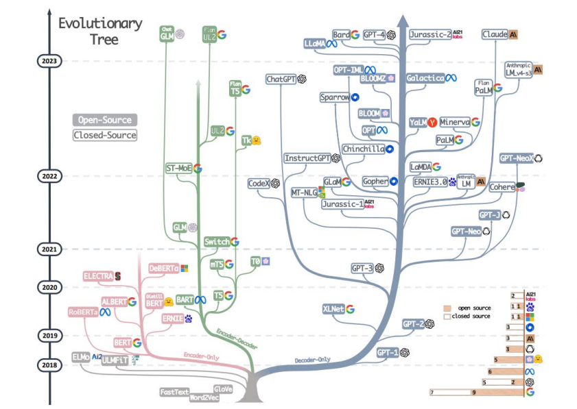
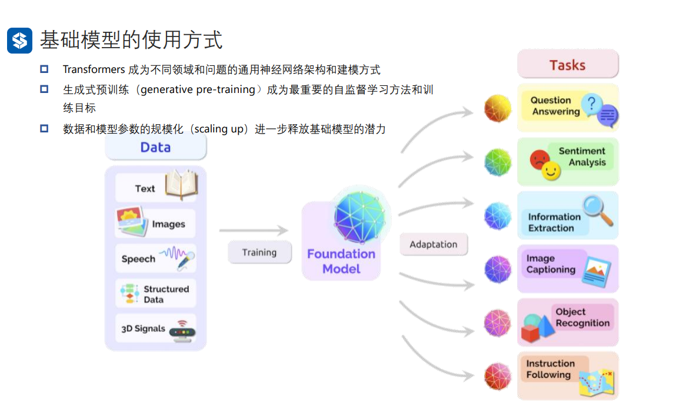
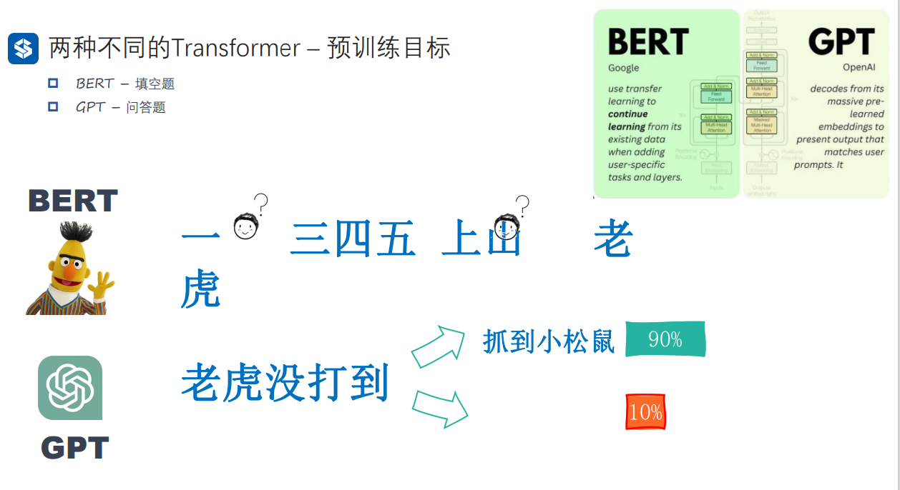
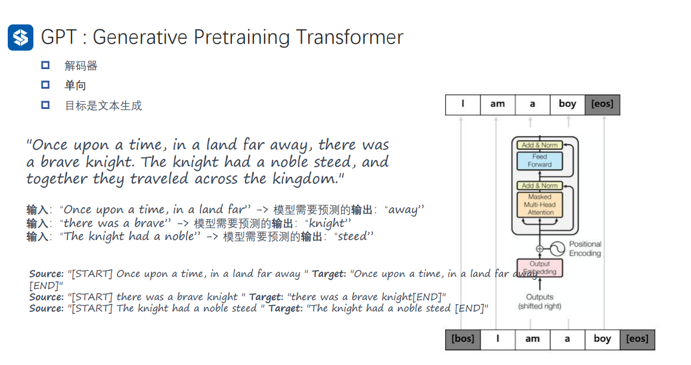
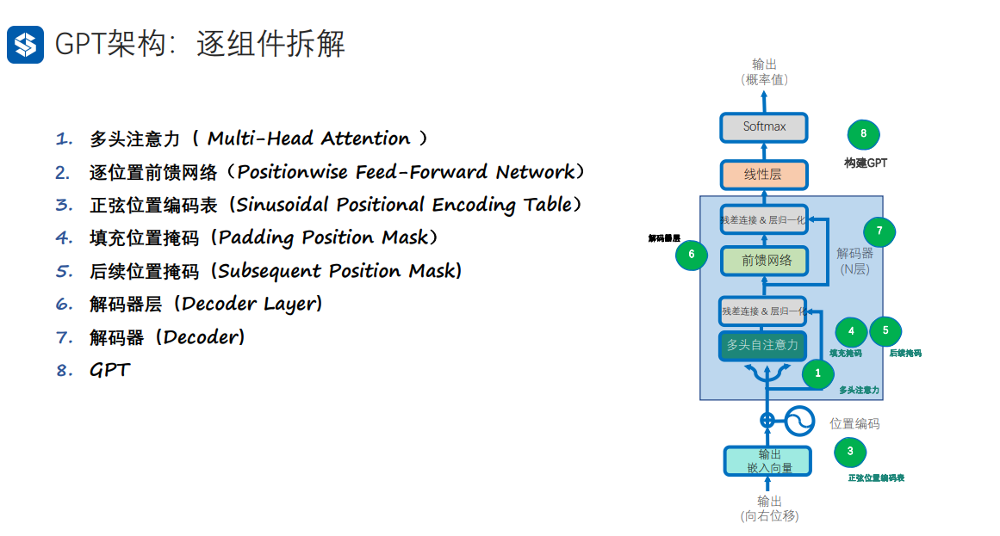
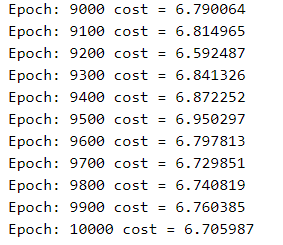

# 自然语言处理: 第七章GPT的搭建

## 理论基础

在以transformer架构为框架的大模型遍地开花后，大模型的方向基本分成了三类分别是:

* decoder-only架构 , 其中以GPT系列为代表
* encoder-only架构，其中以BERT系列为代表
* encoder-decoder架构，标准的transformer架构以BART和T5为代表



大模型的使用方法如下: 分解成pre-train 和fine-tuning ，其中pre-train是收集大量的高质量的文本(或者其他多模态的输入)去让模型拥有文本理解的泛化能力，而fine-tuing则是对应各自的下游任务将pre-train好的model在下游任务中作微调，从而适应不同的任务头。



<br />


那么为什么基于transformer的架构为什么需要可以分成上面的三个分支呢？除了最基本的encoder-decoder架构，这种能普遍处理好各种任务外，那么decoder-only 和 encoder-only的区别在哪？下面以BERT和GPT为代表来分别解释这两种架构的代表，而其中最主要的区别就是二者的预训练目标的区别: 我们由之前[Seq2Seq](https://blog.csdn.net/victor_manches/article/details/131500575?spm=1001.2014.3001.5502)的模型知道，

* BERT全称是Bidirectional Encoder Representation from Transformers，可以看到它是一个**双向**的模型，而编码器的作用主要是将输入的全部文本信息压缩至一个定长的向量，然后再给下游任务作fine_tuning，所以BERT这种Encoder-only的架构的预训练任务更像是一个填空题，以下图的例子为例，BERT的任务就是给一个完整的文本， **一(二)三四五，上山(打)老虎**，需要去预测括号里的内容，而且BERT本身是一个双向的网络，所以在预测括号里的内容时候，他是已经看过全文的，所以这种encoder-only的架构它更具有推理和理解上下文的能力，所以用来做文本分类，关系抽取与命名实体识别的任务有更好的效果，这种预训练的模式叫做MLM(masked language model)。
* 而GPT作为decoder-only，它拥有更好的文本生成能力，它的预训练任务就更加贴合我们传统理解的NLP任务，同样如下图的例子，GPT的预训练过程是**老虎没打到,(抓到小松鼠)**，通过上文去预测下文，所以它是一个**单向**的，也就是更像一个问答题，所以它具有更好的文本生成能力所以就更适合用来作聊天机器人。



<br />

因此，GPT的生成式预训练如,内容如下: 输入是上文，输出是下文，并且是单向的decoder结构，所以相比于传统的transformer结构，GPT结构更加的轻量了。除此之外还需要注意的是，在训练阶段由于保证运行效率，直接就由文本在前端加一个 `<sos>, `但是在inference阶段需要没生成一个字，连同之前的上文一起再输入给下一次作为输入。



<br />

因此这种decorder-only的结构，除了去除了encoder结构之外，自身的decoder基本跟transfor的decoder结构一致，但是去掉了encoder-decoder的self-attention这部分，transformer基本的结构可以参考上文[第六章Transformer- 现代大模型的基石](https://blog.csdn.net/victor_manches/article/details/132110742?spm=1001.2014.3001.5502): 分解的结构如下图:



<br />


还有一种解释是是从对模型的期望来解释BERT 和GPT的区别，根据前文我们可以知道BERT的预训练的模式是作填空题，所以它本身并不具备生成文字内容的能力，但是它具有更好的理解上下文的能力，所以对应不同的任务，只需要BERT + Head(任务头) 就可以针对不同的任务，所以这就导致了BERT更适合成为专才。而GPT由于预训练是做的问答题，而其实所有的NLP任务都可以看成是问答的任务，比如说机器翻译，你只要给GPT下一个prompt `请帮我将下列句子翻译成英文`这样GPT就可以翻译成英文了。对于其他任务也是一样的，只需要下对应的prompt，所以GPT是更像一个通才，无需加单独的任务头，便可以完成不同的任务。


## 代码实现

### 1. 多头注意力

```
class ScaledDotProductAttention(nn.Module):
    def __init__(self):
        super(ScaledDotProductAttention, self).__init__()  
    def forward(self, Q, K, V, attn_mask):  
        # Q K V [batch_size, n_heads, len_q/k/v, dim_q=k/v] (dim_q=dim_k)
        # 计算注意力分数（原始权重）[batch_size，n_heads，len_q，len_k]
        scores = torch.matmul(Q, K.transpose(-1, -2)) / np.sqrt(d_k) 
        # 使用注意力掩码，将attn_mask中值为1的位置的权重替换为极小值
        # attn_mask [batch_size,n_heads,len_q,len_k],形状和scores相同
        scores.masked_fill_(attn_mask.to(torch.bool), -1e9) 
        # 对注意力分数进行softmax
        weights = nn.Softmax(dim=-1)(scores)
        # 计算上下文向量（也就是注意力的输出）, 是上下文信息的紧凑表示
        context = torch.matmul(weights, V)
        return context, weights # 返回上下文向量和注意力分数
  
# 定义多头注意力类
d_embedding = 512  # Embedding Size
n_heads = 8  # number of heads in Multi-Head Attention
batch_size = 3 # 每一批数据量
class MultiHeadAttention(nn.Module):
    def __init__(self):
        super(MultiHeadAttention, self).__init__()
        self.W_Q = nn.Linear(d_embedding, d_k * n_heads) # Q的线性变换层
        self.W_K = nn.Linear(d_embedding, d_k * n_heads) # K的线性变换层
        self.W_V = nn.Linear(d_embedding, d_v * n_heads) # V的线性变换层
        self.linear = nn.Linear(n_heads * d_v, d_embedding)
        self.layer_norm = nn.LayerNorm(d_embedding)

    def forward(self, Q, K, V, attn_mask): 
        # Q K V [batch_size,len_q/k/v,embedding_dim]  
        residual, batch_size = Q, Q.size(0) # 保留残差连接
        # 将输入进行线性变换和重塑，以便后续处理
        # q_s k_s v_s: [batch_size,n_heads.,len_q/k/v,d_q=k/v]
        q_s = self.W_Q(Q).view(batch_size, -1, n_heads, d_k).transpose(1,2)  
        k_s = self.W_K(K).view(batch_size, -1, n_heads, d_k).transpose(1,2)
        v_s = self.W_V(V).view(batch_size, -1, n_heads, d_v).transpose(1,2)
        # 将注意力掩码复制到多头 [batch_size,n_heads,len_q,len_k]
        attn_mask = attn_mask.unsqueeze(1).repeat(1, n_heads, 1, 1)
        # 使用缩放点积注意力计算上下文和注意力权重
        context, weights = ScaledDotProductAttention()(q_s, k_s, v_s, attn_mask)
        # 重塑上下文向量并进行线性变换，[batch_size，len_q，n_heads * dim_v]
        context = context.transpose(1, 2).contiguous().view(batch_size, -1, n_heads * d_v) 
        output = self.linear(context)
        # 与输入(Q)进行残差链接，并进行层归一化后输出[batch_size, len_q, embedding_dim]
        output = self.layer_norm(output + residual)
        return output, weights # 返回层归一化的输出和注意力权重
```

### 2. 逐位置前馈网络

```
# 定义逐位置前向传播网络类
class PoswiseFeedForwardNet(nn.Module):
    def __init__(self):
        super(PoswiseFeedForwardNet, self).__init__()
        # 定义一维卷积层1，用于将输入映射到更高维度
        self.conv1 = nn.Conv1d(in_channels=d_embedding, out_channels=2048, kernel_size=1)
        # 定义一维卷积层2，用于将输入映射回原始维度
        self.conv2 = nn.Conv1d(in_channels=2048, out_channels=d_embedding, kernel_size=1)
        # 定义层归一化
        self.layer_norm = nn.LayerNorm(d_embedding)

    def forward(self, inputs): 
        # inputs: [batch_size, len_q, embedding_dim]  
        residual = inputs  # 保留残差连接
        # 在卷积层1后使用ReLU激活函数
        output = nn.ReLU()(self.conv1(inputs.transpose(1, 2)))
        # 使用卷积层2进行降维
        output = self.conv2(output).transpose(1, 2)
        # 与输入进行残差链接，并进行层归一化，[batch_size, len_q, embedding_dim]
        output = self.layer_norm(output + residual)
        return output # 返回层归一化后的输出加上残差连接的结果
```

### 3. 正弦位置编码表

```
def get_sin_enc_table(n_position, embedding_dim):
    # 根据位置和维度信息，初始化正弦位置编码表
    sinusoid_table = np.zeros((n_position, embedding_dim))  
    # 遍历所有位置和维度，计算角度值
    for pos_i in range(n_position):
        for hid_j in range(embedding_dim):
            angle = pos_i / np.power(10000, 2 * (hid_j // 2) / embedding_dim)
            sinusoid_table[pos_i, hid_j] = angle  
    # 计算正弦和余弦值
    sinusoid_table[:, 0::2] = np.sin(sinusoid_table[:, 0::2])  # dim 2i 偶数维
    sinusoid_table[:, 1::2] = np.cos(sinusoid_table[:, 1::2])  # dim 2i+1 奇数维  
    return torch.FloatTensor(sinusoid_table)
```

### 4. 填充位置掩码

```
# 生成填充注意力掩码的函数，用于在多头自注意力计算中忽略填充部分
def get_attn_pad_mask(seq_q, seq_k):
    batch_size, len_q = seq_q.size()
    batch_size, len_k = seq_k.size()
    # 生成布尔类型张量[batch_size，1，len_k(=len_q)]
    pad_attn_mask = seq_k.data.eq(0).unsqueeze(1)  #<PAD> Token的编码值为0 
    # 变形为何注意力分数相同形状的张量 [batch_size，len_q，len_k]
    pad_attn_mask = pad_attn_mask.expand(batch_size, len_q, len_k) 
    return pad_attn_mask # 形状[batch_size，len_q，len_k]
```

### 5. 后续位置掩码

```
# 生成后续注意力掩码的函数，用于在多头自注意力计算中忽略未来信息
def get_attn_subsequent_mask(seq):
    # 获取输入序列的形状 [batch_size, seq_len(len_q), seq_len(len_k)]
    attn_shape = [seq.size(0), seq.size(1), seq.size(1)]
    # 使用numpy创建一个上三角矩阵（triu = triangle upper）
    subsequent_mask = np.triu(np.ones(attn_shape), k=1)
    # 将numpy数组转换为PyTorch张量，并将数据类型设置为byte（布尔值）
    subsequent_mask = torch.from_numpy(subsequent_mask).byte()
    return subsequent_mask # [batch_size, seq_len(len_q), seq_len(len_k)]
```

### 6. 解码器

```
# 构建解码器层
class DecoderLayer(nn.Module):
    def __init__(self):
        super(DecoderLayer, self).__init__()
        self.self_attn = MultiHeadAttention()  # 多头自注意力层
        self.feed_forward = PoswiseFeedForwardNet()  # 位置前馈神经网络层
        self.norm1 = nn.LayerNorm(d_embedding)  # 第一个层归一化
        self.norm2 = nn.LayerNorm(d_embedding)  # 第二个层归一化

    def forward(self, dec_inputs, attn_mask=None):
        # 使用多头自注意力处理输入
        attn_output, _ = self.self_attn(dec_inputs, dec_inputs, dec_inputs, attn_mask)
        # 将注意力输出与输入相加并进行第一个层归一化
        norm1_outputs = self.norm1(dec_inputs + attn_output)
        # 将归一化后的输出输入到位置前馈神经网络
        ff_outputs = self.feed_forward(norm1_outputs)
        # 将前馈神经网络输出与第一次归一化后的输出相加并进行第二个层归一化
        dec_outputs = self.norm2(norm1_outputs + ff_outputs)
        return dec_outputs
  
# 构建解码器
n_layers = 6  # 设置Encoder/Decoder的层数
class Decoder(nn.Module):
    def __init__(self, corpus):
        super(Decoder, self).__init__()
        self.src_emb = nn.Embedding(corpus.vocab_size, d_embedding)  # 词嵌入层（参数为词典维度）
        self.pos_emb = nn.Embedding(corpus.seq_len, d_embedding)  # 位置编码层（参数为序列长度）  
        self.layers = nn.ModuleList([DecoderLayer() for _ in range(n_layers)]) # 初始化N个解码器层

    def forward(self, dec_inputs):  
        positions = torch.arange(len(dec_inputs), device=dec_inputs.device).unsqueeze(-1) # 位置信息  
        inputs_embedding = self.src_emb(dec_inputs) + self.pos_emb(positions) # 词嵌入与位置编码相加  
        attn_mask = get_attn_subsequent_mask(inputs_embedding).to(dec_inputs.device) # 生成自注意力掩码
        dec_outputs =  inputs_embedding # 初始化解码器输入，这是第一层解码器层的输入  
        for layer in self.layers:
            # 每个解码器层接收前一层的输出作为输入，并生成新的输出
            # 对于第一层解码器层，其输入是dec_outputs，即词嵌入和位置编码的和
            # 对于后续的解码器层，其输入是前一层解码器层的输出    
            dec_outputs = layer(dec_outputs, attn_mask) # 将输入数据传递给解码器层
        return dec_outputs # 返回最后一个解码器层的输出，作为整个解码器的输出
```

### 7. GPT

```
class GPT(nn.Module):
    def __init__(self, corpus):
        super(GPT, self).__init__()
        self.corpus = corpus
        self.decoder = Decoder(corpus) # 解码器，用于学习文本生成能力
        self.projection = nn.Linear(d_embedding, corpus.vocab_size)  # 全连接层，输出预测结果

    def forward(self, dec_inputs):  
        dec_outputs = self.decoder(dec_inputs) # 将输入数据传递给解码器
        logits = self.projection(dec_outputs) # 传递给全连接层以生成预测
        return logits #返回预测结果
  
    def decode(self, input_str, strategy='greedy', **kwargs):
        if strategy == 'greedy': # 贪心解码函数
            return generate_text_greedy_search(self, input_str, **kwargs)
        elif strategy == 'beam_search': # 集束解码函数
            return generate_text_beam_search(self, input_str, **kwargs)
        else:
            raise ValueError(f"Unknown decoding strategy: {strategy}")
```

### 8. Greedy_search & Beam_search

```
def generate_text_beam_search(model, input_str, max_len=5, beam_width=5, repetition_penalty=1.2):
    # 将模型设置为评估（测试）模式，关闭dropout和batch normalization等训练相关的层
    model.eval()
    # 让NLTK工具帮忙分一下词
    input_str = word_tokenize(input_str)
    # 将输入字符串中的每个token转换为其在词汇表中的索引, 如果输入的词不再词表里面，就忽略这个词
    input_tokens = [model.corpus.vocab[token] for token in input_str if token in model.corpus.vocab]
    # 检查输入的有意义的词汇长度是否为0
    if len(input_tokens) == 0:
        return   
    # 创建一个列表，用于存储候选序列，初始候选序列只包含输入tokens
    candidates = [(input_tokens, 0.0)]  
    # 创建一个列表，用于存储所有生成的序列及其得分
    final_results = []
    # 禁用梯度计算，以节省内存并加速测试过程
    with torch.no_grad():
        # 生成最多max_len个tokens
        for _ in range(max_len):
            # 创建一个新的候选列表，用于存储当前时间步生成的候选序列
            new_candidates = []      
            # 遍历当前候选序列
            for candidate, candidate_score in candidates:
                # 将当前候选序列转换为torch张量并将其传递给模型
                device = "cuda" if torch.cuda.is_available() else "cpu"
                inputs = torch.LongTensor(candidate).unsqueeze(0).to(device)
                outputs = model(inputs)          
                # 只关心最后一个时间步（即最新生成的token）的logits
                logits = outputs[:, -1, :]
                # 应用重复惩罚：为已经生成的词汇应用惩罚，降低它们再次被选择的概率
                for token in set(candidate):
                    logits[0, token] /= repetition_penalty
                # 将<pad>标记的得分设置为一个很大的负数，以避免选择它
                logits[0, model.corpus.vocab["<pad>"]] = -1e9          
                # 找到具有最高分数的前beam_width个tokens
                scores, next_tokens = torch.topk(logits, beam_width, dim=-1)
                # 遍历生成的tokens及其得分
                for score, next_token in zip(scores.squeeze(), next_tokens.squeeze()):
                    # 将生成的token添加到当前候选序列
                    new_candidate = candidate + [next_token.item()]              
                    # 更新候选序列得分
                    new_score = candidate_score - score.item()              
                    # 如果生成的token是EOS（结束符），将其添加到最终结果中
                    if next_token.item() == model.corpus.vocab["<eos>"]:
                        final_results.append((new_candidate, new_score))
                    else:
                        # 将新生成的候选序列添加到新候选列表中
                        new_candidates.append((new_candidate, new_score))
            # 从新候选列表中选择得分最高的beam_width个序列
            candidates = sorted(new_candidates, key=lambda x: x[1], reverse=True)[:beam_width]
    # 选择得分最高的候选序列，如果final_results为空，选择当前得分最高的候选序列
    if final_results:
        best_candidate, _ = sorted(final_results, key=lambda x: x[1])[0]
    else:
        best_candidate, _ = sorted(candidates, key=lambda x: x[1])[0]
    # 将输出 token 转换回文本字符串
    output_str = " ".join([model.corpus.idx2word[token] for token in best_candidate])
    return output_str

def generate_text_greedy_search(model, input_str, max_len=5):
    # 将模型设置为评估（测试）模式，关闭dropout和batch normalization等训练相关的层
    model.eval()
    # 使用NLTK工具进行词汇切分
    input_str = word_tokenize(input_str)
    # 将输入字符串中的每个token转换为其在词汇表中的索引, 如果输入的词不在词表里面，就忽略这个词
    input_tokens = [model.corpus.vocab[token] for token in input_str if token in model.corpus.vocab]
    # 检查输入的有意义的词汇长度是否为0
    if len(input_tokens) == 0:
        return   
    # 创建一个列表，用于存储生成的词汇
    output_tokens = input_tokens
    # 禁用梯度计算，以节省内存并加速测试过程
    with torch.no_grad():
        # 生成最多max_len个tokens
        for _ in range(max_len):
            # 将当前生成的tokens转换为torch张量并将其传递给模型
            device = "cuda" if torch.cuda.is_available() else "cpu"
            inputs = torch.LongTensor(output_tokens).unsqueeze(0).to(device)
            outputs = model(inputs)          
            # 只关心最后一个时间步（即最新生成的token）的logits
            logits = outputs[:, -1, :]
            # 找到具有最高分数的token
            _, next_token = torch.topk(logits, 1, dim=-1)
            # 如果生成的token是EOS（结束符），则停止生成
            if next_token.item() == model.corpus.vocab["<eos>"]:
                break
            # 否则，将生成的token添加到生成的词汇列表中
            output_tokens.append(next_token.item())
    # 将输出 tokens 转换回文本字符串
    output_str = " ".join([model.corpus.idx2word[token] for token in output_tokens])
    return output_str

```

<br />

<br />

## 结果

本次实验设置了三个对照组，分别是baseline(N_head = 8 , n_layer = 6)， N_head  = 32 , n_layer = 18，可以看到训练10000个step之后得loss分别如下图:

从收敛程度上来看，18层layer得transformer 完全没有收敛，这个可能是因为深度神经网络的梯度消失，所以我们设置的网络如果没有残差链接的话，尽量不要太深。然后再看多头，可以看到头的数量好像也不是越多越好，但是其实二者都收敛了，具体结果我们可以结合一下inference的结果看看。



<br />

可以看到两种解码得方式，greedy_search在大部分时候由于设置了惩罚项所以现在大部分时候是两个单词无限循环，相比之下beam_search得结果就好得多，更像一句话。

其次对比一下三个对照组得结果，正如loss的结果一样，深层次GPT架构无论是beam_search还是greedy_search翻译的结果都非常的差，出现了很多标点，这应该就是没有收敛的结果。然后对比下不同的head数量，这里看上去也是n_head越少的效果越好。


