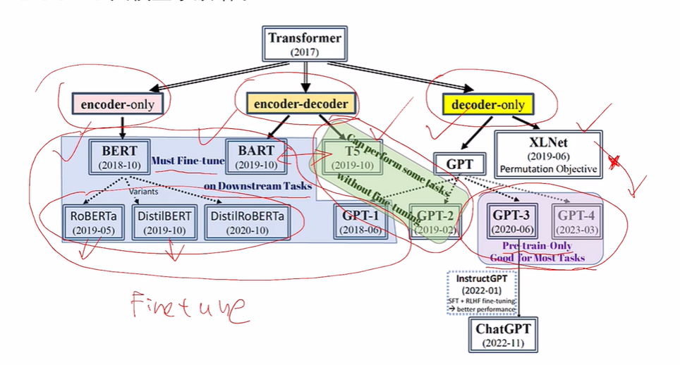
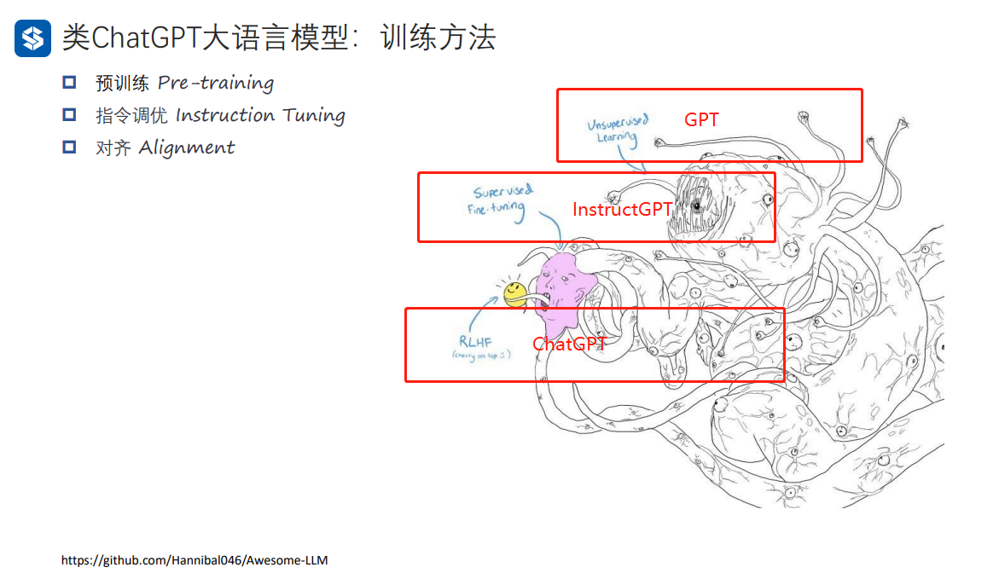
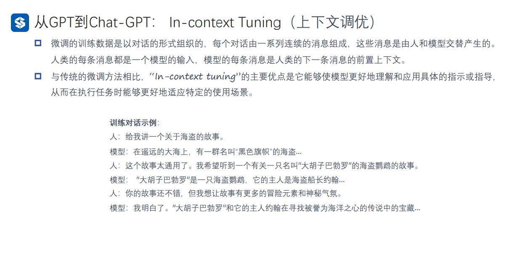
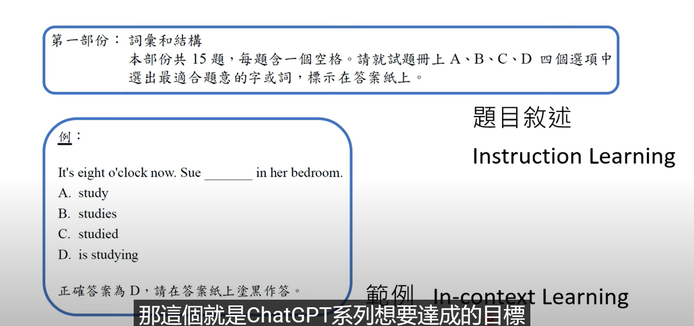
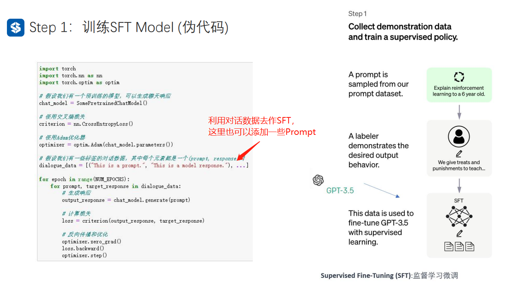
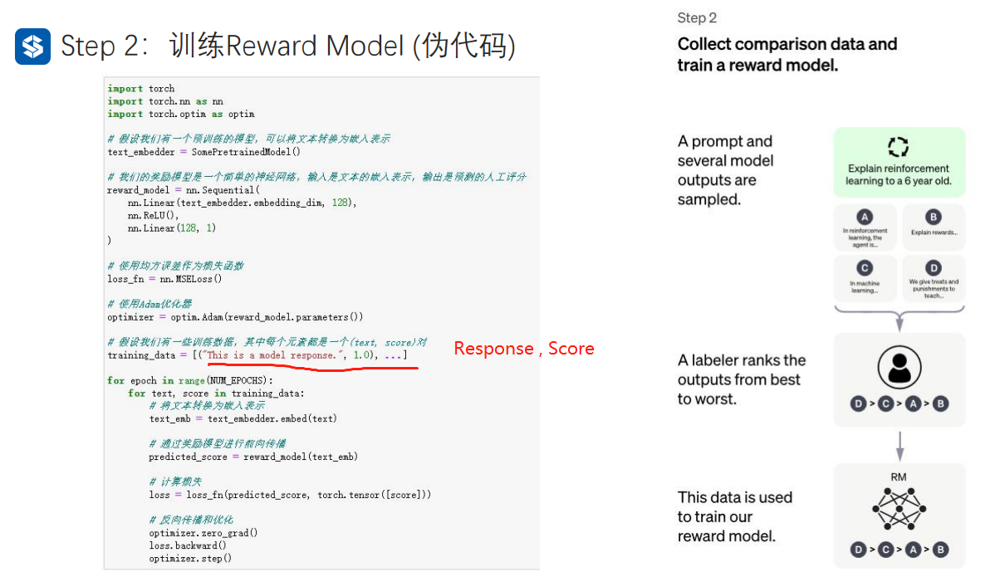
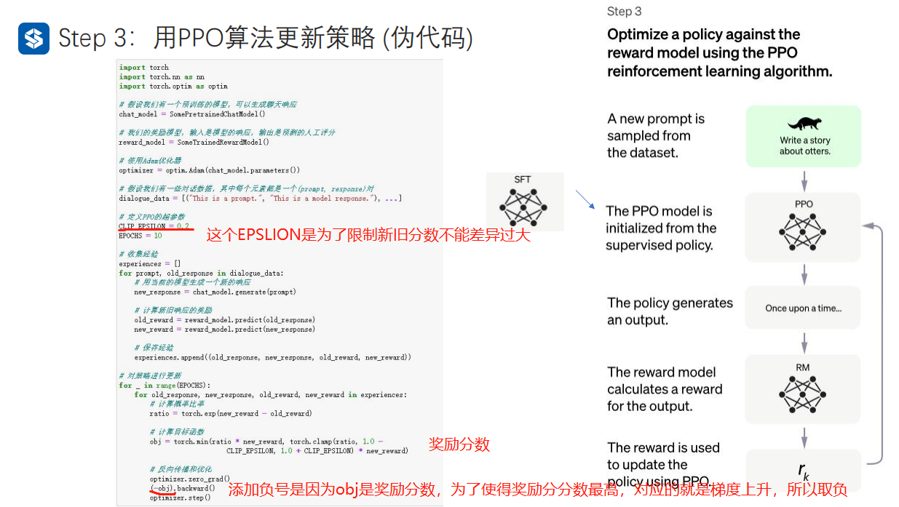
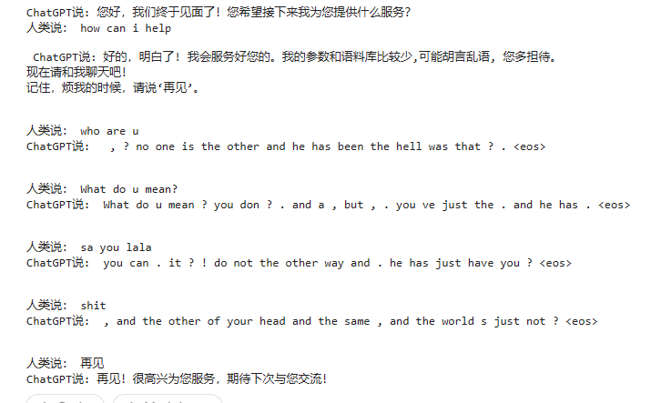

# 自然语言处理: 第八章chatGPT的搭建

## 理论基础

Transformer 大模型家族可以分成三类, 至于三者的区别可以参考上一章:

* Encoder-only,
* Decoder-only,  只需要Pre_train
* Encoder-decoder , 可以在一些任务上无需进行fine_tune

必须要在下游任务进行微调比如Bert ， Bart 。 T5 这种无需要微调就能完成一些任务 。最后GPT从3开始，只需要预训练就能适应很多任务。



<br />

<br />

关于现在ChatgGPT的训练方法主要分为三步:

1. Pre-Training, 这些就是从大量的文本中作问答的无监督的预训练，这个过程可以参考上一章内容，这一部分基本大家都一样，通过大量文本的无监督的学习，大模型就逐渐拥有了文本的理解能力，这种大模型由于参数超过一定数量级后(million级)，就拥有了**涌现能力(拥有few-shot 或者zero-shot的能力)**。
2. Instruction Tuning, SFT(supervised Fine-tuning)通过特定的指令调优，进行监督学习，使得生成的内容类似你问我答。
3. Alignment, RLHF(Reinforcement Learning human feedback)经过人类的输入的强化学习从而得到更好的结果，生成的内容就更像对话



<br />

<br />

### In - context Tuning(上下文调优)

由于预训练的文本不全是对话的数据集，所以为了让GPT更适合作为聊天机器人，所以利用对话内容作为数据，对GPT进行tuning，也就是给机器例子，从而让机器学会你的例子模板去回答。



<br />

下面的数据来自于[Larger language models do in-context learning differently ](https://arxiv.org/abs/2303.03846) ， 作者对in-context learning进行了研究，主要工作是对in-context learning的数据集给标记错误的lable后，再让不同大小的模型去学习这些错误的label，最后作者发现，其实in-context learning是有学习到知识的，而不是只是通过这些例子去学习到对话(或者激活某种任务的能力)，从下面从左至右模型大小逐渐减少，可以看到这个在in-context learning的能力只有在大模型的基础上才能实现，具体可以参考上面这一篇论文。


<br />

<br />

### Instruction Tuning(指令调优)

通过添加一些明确的指令(Prompt)从而使得模型不仅仅会对话，而且能通过prompt暗示得到人类最想要的结果，这也是为什么prompt工程师诞生的原因。


[Scaling Instruction-Finetuned Language Models ](https://arxiv.org/abs/2210.11416) 在这篇文章中以PaLM为例验证了instruction tuning的有效性，如下图，可以看到随着instruction tuning的任务量增多，模型在不同任务的准确性也越来越好。


最近刷到了李宏毅老师教材，这里也解释了上文中in - context learning 和 instruction learning 的区别，对应的题目描述就是instruction  ， 而下面的例子就是in-content learning。



<br />

<br />

<br />

### Alignment Training

在GPT -> instructGPT之后，为了让模型更像人类的行为，因此引入了对齐训练。OPENAI使用的是RLHF(Reinforcement Learning human feedback)，简单的理解就是他在训练的时候引入了人类的打分机制，由于GPT生成模型其每次对于同样的问题回答都不一样，而人类根据GPT的回答进行打分，然后将这个分数去训练一个回归判分模型，训练完成之后这个打分模型能根据GPT的回答自动打分。拥有了这个打分模型之后，就可以在instructGPT模型不断生成答案，通过训练好的打分模型去打分，得到的分数再去优化instructGPT 使得优化后的GPT的得分越来越高。最后不断的重复这个过程最终可以使得GPT的回答与人类的回答对齐


<br />

1. 通过大量的文本作预训练，使得GPT拥有涌现能力
2. 通过SFT得到InstructionGPT，教会GPT拥有对话的能力，并且通过特殊的prompt得到对应的回答(对应下图step1)
3. 创建强化学习的奖励模型(对应下图step2)
4. 利用奖励模型，使用近端策略优化微调模型(PPO),可以参考这一篇知乎[Proximal Policy Optimization (PPO) 算法理解：从策略梯度开始 ](https://zhuanlan.zhihu.com/p/614115887)
   (对应下图step3)

<br />

<br />


<br />

<br />

<br />

## 代码实现

### SFT(Supervised Fine-tuning)

这里展示了一个简易代码，也就是在读取了做完无监督的预训练模型，利用一些加入了prompt的对话文本去作tuning，使得整个模型具备能根据prompt得到对应的贴合人类的回答，从而实现聊天机器人的功能



### Reward-model

根据人为的打分去训练一个判分模型。



### PPO

利用step2训练好的打分模型，对经过SFT模型生成的答案进行打分，然后将这个分数的奖励进行最大化最终去优化整个instructGPT，不断的循环最终得到chatGPT



<br />

<br />

<br />

## 结果

这里展示的一个任务是在之前WiKi数据集上做完预训练之后得到的WikiGPT模型，这个模型已经具备一定的文本生成和理解能力了。再在Movie对白数据集进行的In-context tuning，使得其具有对话的能力，令其生成的内容更像对话，而不是生硬的文本。(PS: 如果想使得自己的模型进行prompt tuning, 目前比较常见的方法是利用特定的prompt 生成一段指令，然后将文本输入给GPT的API作生成回答，便可以快速得到一定量的问答数据，但是这样的话模型能力肯定是比GPT的能力低的，但是比自己找人生成对话数据成本更低时间更快，适用于小的垂直领域)

```
import torch
from GPT_Model_with_Decode import GPT
from CorpusLoader import MovieCorpus
from Utilities import read_data
from ModelTrainer import Trainer
import datetime

device = "cuda" if torch.cuda.is_available() else "cpu"
# 加载 MovieCorpus 数据  
dialog_corpus = MovieCorpus(read_data('cornell movie-dialogs corpus/processed_movie_lines.txt'))
chat_gpt = GPT(dialog_corpus).to(device)
chat_gpt.load_state_dict(torch.load('99_TrainedModel/WikiGPT_0.01_200_20230620_111344.pth'))
# chat_gpt.eval()

# 微调 ChatGPT 模型
trainer = Trainer(chat_gpt, dialog_corpus, learning_rate=0.001, epochs=200)
trainer.train()

# 保存微调后的模型
timestamp = datetime.datetime.now().strftime("%Y%m%d_%H%M%S") # 获取当前时戳
model_save_path = f'99_TrainedModel/miniChatGPT_{trainer.lr}_{trainer.epochs}_{timestamp}.pth'
torch.save(chat_gpt.state_dict(), model_save_path)

# 测试微调后的模型
input_str = "how are you ?"
greedy_output = chat_gpt.decode(input_str, strategy='greedy', max_len=50)
beam_search_output = chat_gpt.decode(input_str, strategy='beam_search', max_len=50, beam_width=5, repetition_penalty=1.2)

print("Input text:", input_str)
# print("Greedy search output:", greedy_output)
print("Beam search output:", beam_search_output)
```

如同上面代码，数据集采用的是电影对白的形式，一问一答。首先读取之前预训练好的WikiGPT，然后直接在MovieCorpus作训练就好了，因为数据的格式也是一问一答，所以代码与上一章的内容基本一致。这样训练好的之后的MiniGPT的文本生成能力就会更像人类的对话功能靠齐。

最终的效果如下：可以看到可能还是因为数据太小，或者训练的问题，整个生成的文本还是不能练成一句话，但是看上去也比较像对话了。


