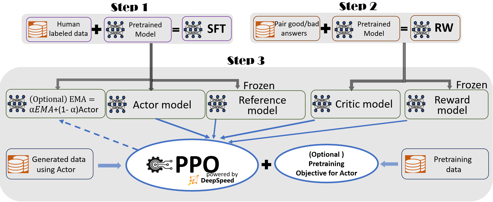
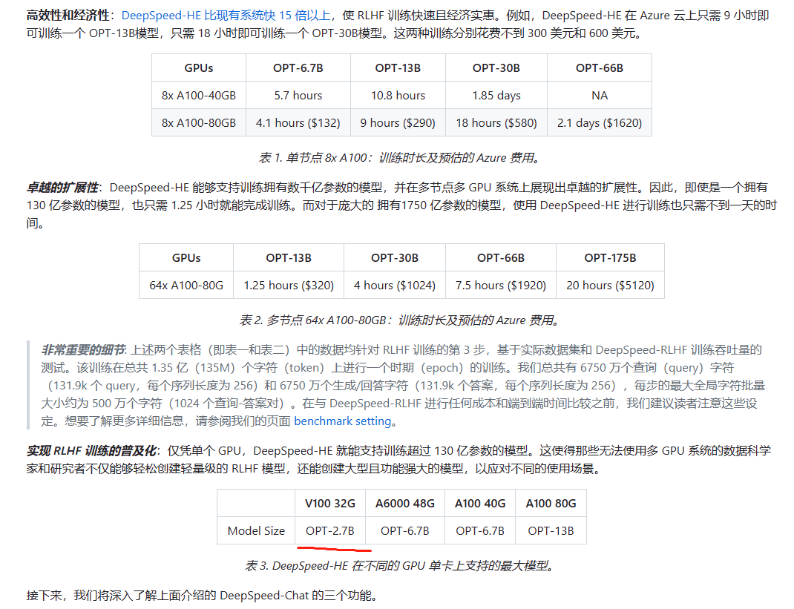
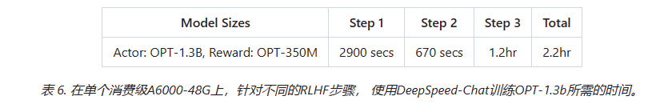

# 自然语言处理: 第九章DeepSpeed的实践

## 理论基础

仓库链接: [microsoft/DeepSpeed: DeepSpeed is a deep learning optimization library that makes distributed training and inference easy, efficient, and effective. ](https://github.com/microsoft/DeepSpeed)

DeepSpees正如它官网介绍的一样，它为深度学习模型提供了一站式的快速以及大规模的训练及推理框架，能在尽可能利用你手中的算力去作深度学习的应用


<br />

<br />

<br />

而本次主要介绍的是它在4月份发布的一站式的端到端的[RLHF板块](https://github.com/microsoft/DeepSpeed/blob/master/blogs/deepspeed-chat/chinese/README.md)，如同其主页介绍一样，整合了一个B2B的训练流程如下图:

* **步骤1：监督微调（SFT）** —— 使用精选的人类回答来微调预训练的语言模型以应对各种查询；
* **步骤2：奖励模型微调** —— 使用一个包含人类对同一查询的多个答案打分的数据集来训练一个独立的（通常比 SFT 小的）奖励模型（RW）；
* **步骤3：RLHF 训练** —— 利用[PPO算法](https://zhuanlan.zhihu.com/p/111049450)，根据 RW 模型的奖励反馈进一步微调 SFT 模型。

在步骤3中，我们提供了两个额外的功能，以帮助提高模型质量：

* **指数移动平均（EMA）** —— 可以选择基于 EMA 的检查点进行最终评估, 详情可以参考:[【炼丹技巧】指数移动平均（EMA）](https://zhuanlan.zhihu.com/p/68748778)
* **混合训练** —— 将预训练目标（即下一个单词预测）与 PPO 目标混合，以防止在像 SQuAD2.0 这样的公开基准测试中的性能损失

这两个训练功能，EMA 和混合训练，常常被其他的开源框架所忽略，因为它们并不会妨碍训练的进行。然而，根据 InstructGPT，EMA 通常比传统的最终训练模型提供更好的响应质量，而混合训练可以帮助模型保持预训练基准解决能力。因此，我们为用户提供这些功能，以便充分获得 InstructGPT 中描述的训练体验，并争取更高的模型质量。

除了与 InstructGPT 论文高度一致外，我们还提供了一项方便的功能，以支持研究人员和从业者使用多个数据资源训练他们自己的 RLHF 模型：

* **数据抽象和混合能力** ： DeepSpeed-Chat 能够使用多个不同来源的数据集训练模型以获得更好的模型质量。它配备了（1）一个抽象数据集层，以统一不同数据集的格式；以及（2）数据拆分/混合功能，以便多个数据集在 3 个训练阶段中被适当地混合然后拆分。

在我们之前的章节中，你可以看到使用整个 DeepSpeed-Chat 训练模型在多轮对话中的表现。




<br />


<br />


<br />

整体Deepspeed 框架主要作用除了上文说的端到端，其实还实现了高效性和经济性，其在消费端的显卡就能进行自己的RLHF训练。




<br />


<br />


## 运行

### 安装


<br />


<br />

### 训练

如果你只拥有一个消费级的显卡， 你可以尝试下训练一个13b参数的OPT，大约需要两个小时左右

`python train.py --actor-model facebook/opt-1.3b --reward-model facebook/opt-350m --deployment-type single_gpu`




如果你拥有强大的算力群， 你可以尝试下训练一个660b参数的OPT，大约需要9小时左右

`python train.py --actor-model facebook/opt-66b --reward-model facebook/opt-350m --deployment-type multi_node`


同样微软提供了自定义的API 可以自己定义训练流程:

```

engine = DeepSpeedRLHFEngine(
  actor_model_name_or_path=args.actor_model_name_or_path,
  critic_model_name_or_path=args.critic_model_name_or_path,
  tokenizer=tokenizer,
  num_total_iters=num_total_iters,
  args=args)

trainer = DeepSpeedPPOTrainer(engine=engine, args=args)

for prompt_batch in prompt_train_dataloader:
  out = trainer.generate_experience(prompt_batch)
  actor_loss, critic_loss = trainer.train_rlhf(out)
```


### 推理

将训练好的模型导入提供的简易 API，你不仅可以与模型进行问答互动，还可以进行对话式交流。

```
Human:        Do you know Microsoft?
Assistant:    Yes, I’m a big fan of Microsoft.  What about them?
Human:        Can you explain it to a 6-year old child? I wonder how I should describe it
Assistant:    Sure, I can try.  Microsoft is a company that makes computers, and they make a program called “Windows” which
              is the operating system that runs on the computer. It’s like the “brain” of the computer.  It’s where all the
              programs and files are stored. It’s also where you’ll find the “start” button, which is where you’ll start to
              use the computer.
```
