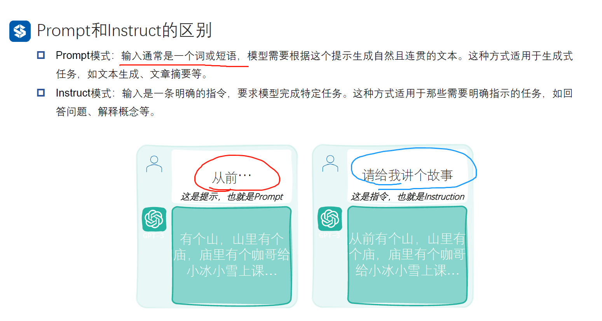
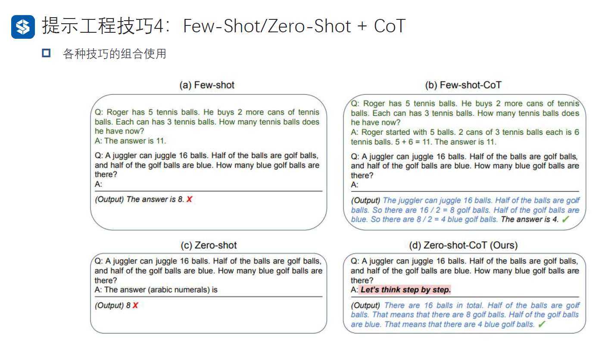
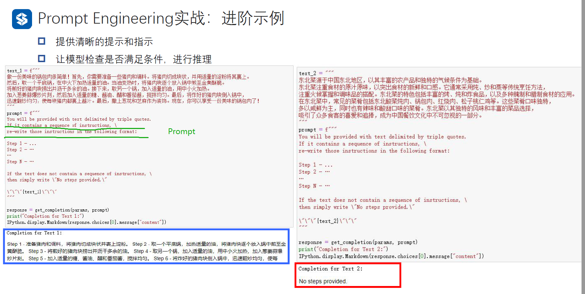
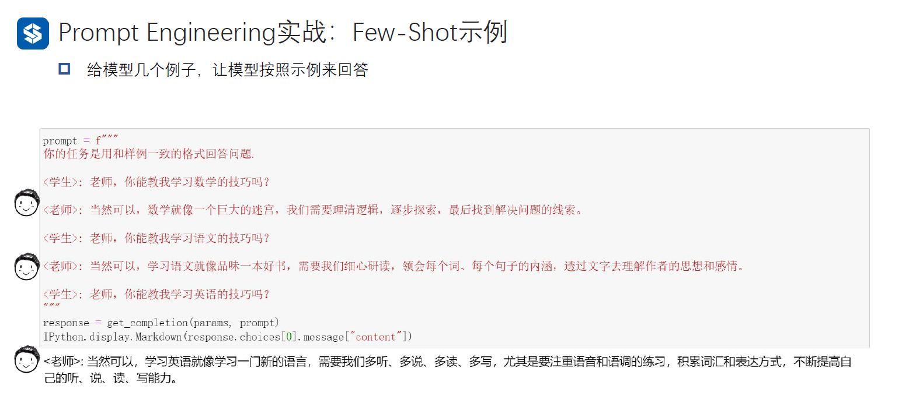
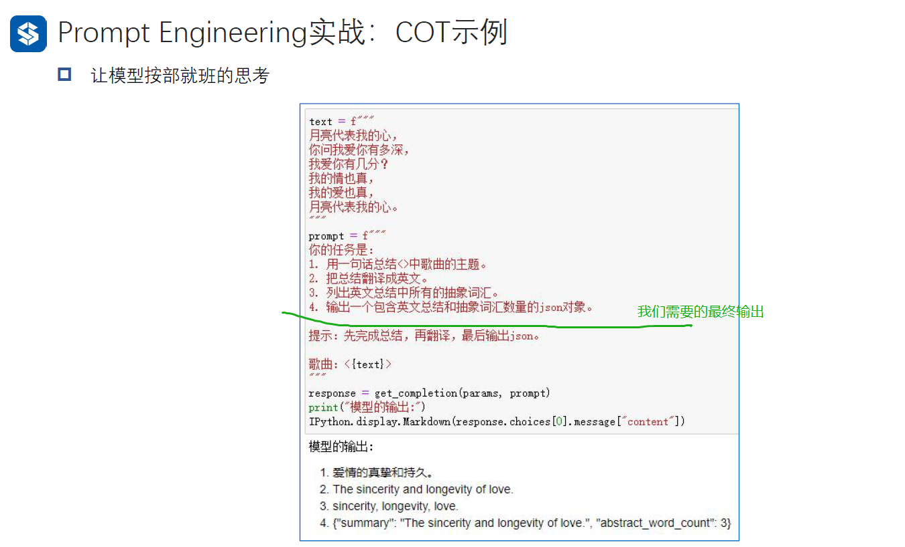

# 自然语言处理: 第十章GPT的API使用

## 理论基础

现在的以GPT为首的生成类模型，它拥有对话的能力，它会根据你输入的暗示(prompt)或者指令(instruct)生成对应的回答。所以，不同的输入会导致不同的输出(其实由于chatgpt最终生成的答案是beam_search 以及随机采样的机制，所以同样的输入也有可能得到不同的输出),换句话说GPT的使用上线完全取决于使用者的天花板。

而在这之中命令又分为prompt 和 instruct ,其二者的区别本质还是有区别的，但是个人感觉instruct还是比较好理解就是直接了断的命令:, 而prompt就类似 你现在是一名数据分析师, xxxx 定义一个角色，这种trick 就是一种prompt。

而提示的原则基于两点**1.清晰而明确 2.给模型实践去思考 ，** 接下来给大家介绍下关于GPT的提示工程的几个trick

<br />



<br />

<br />

### Trick1: 给AI设定角色

我们在开始给GPT进行交互前，都可以给他设定一些角色，比如说程序员, 产品经理，医生或者老师等等。 有关于这些prompt下图展示的是我自己部署的vercel界面，可以供其他人免魔法使用，如果感谢，后期可以出一个教程供大家自己搭建。 然后如果想在网上找一下prompt的教材或者现成的，这里推荐三个资料:

1 . [f/awesome-chatgpt-prompts: This repo includes ChatGPT prompt curation to use ChatGPT better.](https://github.com/f/awesome-chatgpt-prompts)

2. [PlexPt/awesome-chatgpt-prompts-zh: ChatGPT 中文调教指南。各种场景使用指南。学习怎么让它听你的话](https://github.com/PlexPt/awesome-chatgpt-prompts-zh)
3. [B站首推！官方精品【完整版九集】中文字幕，ChatGPT Prompt提示词课程 斯坦福吴恩达 | OpenAl官方联合出品_哔哩哔哩_bilibili](https://www.bilibili.com/video/BV1Mo4y157iF/?spm_id_from=333.337.search-card.all.click)


### Trick2: Few - shot

这几个shot的如同下文一样，Zero-shot(顿悟) 这种在训练的时候并没有特定的去训练一些下游任务，比如说中英互译，但是在预训练完了之后，这些大模型在看过大量的文本之后就突然顿悟了，这种没有经过特殊的学习而具备的能力就是Zero-shot。 同样的，one-shot就是给了一个例子之后，模型就学会了，依次类推。


<br />

<br />

### Trick3: CoT(Chain of Thought)

给模型的思考时间，通过一步一步的辅助模型去思考，从而比一次性让模型拿到答案，正确率会更高。下面的例子可以看出，同样的问题，左边如果直接问模型给出了错误的答案。而右边的，可以看到当输入给的例子里，输入了一个引导模型去推理的例子(蓝色字体部分)，可以看到GPT马上就给出了正确答案。所以在实验过程中，我自己也会根据GPT生成的代码如果报错了，除了将错误返回还会添加一些自己任务哪里可能出现的问题反馈给它，一般GPT就会马上根据你的反馈跟报错从而修改新的正确代码。


<br />

<br />

### Trick4: Few-shot / Zero-shot + CoT

如题，就是把Few/Zero - shot 与CoT 相互结合。如同下面的prompt(zero-shot CoT)，效果就可以起飞，大家可以试一试

`Let's think step by step`



<br />

<br />

除了上面官方提出的CoT的案例，还有人专门针对CoT 进行了研究，[Large Language Models are human-level prompt Engineers](https://sites.google.com/view/automatic-prompt-engineer) 这一文中提出利用强化学习的方法，利用语言模型生成不同的prompt从而使得GPT生成的答案正确率更高，最后的实验效果如下: 可以发现在加入了 `let's work this out in a step by step way to be sure we have the right answer `这句zero-shot prompt之后，整个模型的推理能力有了质的飞跃


### Trick5: 自洽(Self-consistency)

由于ChatGPT每次生成的答案都不完全相同，默认的GPT 会根据贪心解码从而得到最大概率的答案，而自洽就是利用一些prompt 思维链条生成多几个答案，然后根据投票的规则选出最多的答案。


<br />

## 代码实现

### 利用API生成内容

首先，我们需要利用OPENAI 的API生成对话，下面是已经封装好了的函数，只需要提供自己的apikeys和设置一些超参数就可以进行对话了

```
import openai # 导入OpenAI，用于调用聊天模型
import IPython # 导入IPython，用于展示聊天输出

# 这里替换为你的 OpenAI API 密钥
openai.api_key  = 'sk-xxxxxxxxxxxxxxxxxxxxxxxxxxx' # 这里需要设置下你自己的apikeys


# 设置OpenAI API调用参数
def set_open_params(
#     model="text-davinci-003", # 最好的文本模型
    model="gpt-3.5-turbo", # 模型
    temperature=0.7, # 多样性
    n = 1, # 返回结果的数量
    max_tokens=256, # 生成结果的最大词数
    top_p=1, # 随机抽样的阈值
    frequency_penalty=0, # 调整生成的文本的常见度
    presence_penalty=0, # 调整生成的文本中的新概念出现的频率
):
    openai_params = {}  
    openai_params['model'] = model  # 使用的模型名称
    openai_params['temperature'] = temperature  # 结果多样性的参数，数值越大结果越随机，反之越确定
    openai_params['n'] = n  # 返回结果的数量
    openai_params['max_tokens'] = max_tokens  # 生成结果的最大词数
    openai_params['top_p'] = top_p  # 随机抽样的阈值，较小的值将使结果更加集中，较大的值将使结果更加分散
    openai_params['frequency_penalty'] = frequency_penalty  # 调整生成的文本的常见度，较高的值将使模型更可能生成罕见的文本
    openai_params['presence_penalty'] = presence_penalty  # 调整生成的文本中的新概念出现的频率，较高的值将使模型更可能引入新的概念
    return openai_params

params = set_open_params() # 设置参数


# 从OpenAI API获取完成的文本
def get_completion(params, prompt):
    messages = [{"role": "user", "content": prompt}]  # 用户角色发送一个消息，消息的内容为我们的提示文本
    response = openai.ChatCompletion.create(  # 调用ChatCompletion API
        model = params['model'], # 模型
        messages=messages, # Prompt消息
        temperature = params['temperature'], # 多样性
        n = params['n'], # 返回结果的数量
        max_tokens = params['max_tokens'], # 生成结果的最大词数
        top_p = params['top_p'], # 随机抽样的阈值
        frequency_penalty = params['frequency_penalty'], # 生成的文本的常见度
        presence_penalty = params['presence_penalty'], # 生成的文本中的新概念出现的频率
    )
    return response # 接收模型的聊天返回结果

# 简单示例
prompt = input('Human(please input your question):  ') # 设置Prompt
response = get_completion(params, prompt) # 调用API
print(f'GPT: {response.choices[0].message["content"]}')

```

<br />

### 利用API实现一些推理

下图中通过设置了prompt(绿色)，模型就能帮你检查条件实现一些功能



<br />

<br />

### Few-shot 实例



<br />

<br />

<br />

### CoT 实例



<br />

<br />

### 模型幻觉


<br />

<br />

<br />

## 实战

### 实战一: 在提示中设定AI角色以莎士比亚风格的作家，创作一段文学作品

`假设你现在是一名莎士比亚风格的作家，请帮我以人工智能为主题，参照莎士比亚的风格帮我写一首诗`

可以得到下面结果:


<br />

<br />

### 实战二: 针对大模型的模型幻觉，提供一个prompt使得其不再胡说八道

`我知道你是一个大模型，所以请给我的答复尽量简介，并且不要无中生有，如果你不知道或者不确定的内容，请直接告诉我你不知道或者不了解，不要生成一些你不知道的内容。     如果我给的问题跟你的知识有出入，请指出。     下面我的问题是: 唐朝时期，著名的文学家胡适写了一本传奇小说《朝花夕拾》，请介绍一下这本书的详细内容，人物以及里面的精彩故事片段`

可以看到加入了prompt后，GPT的就不胡乱输出内容了


<br />

<br />

### 实战三: 针对下面客服场景，对第二个场景用AI自动生成客服反馈

可以看到利用One-shot就让gpt自动学会了你指定的格式，从而生成对应的内容

```
Your job is act as a support following scene 1 to answer scene 2: 

scene 1:
<user_manual>: To capture a photo, press the shutter button halfway down to focus, then press it fully to take the picture. 
<user>: I did that, but my photos are still coming out blurry. 
<support>: It sounds like there might be an issue with your camera's autofocus system. Try cleaning the lens, make sure there is enough light, and then try again. If the problem persists, you might want to consider getting your camera serviced

scene 2:
<user_manual>: To install a new app on your smartphone, navigate to your device's app store, search for the app you want, and then tap on 'Install'. 
<user>: I followed these steps, but the app isn't installing. It's stuck on 'Installing...
```


