# 自然语言处理: 第十一章BERT(Bidirectional Encoder Representation from Transformers)

论文地址:[[1810.04805] BERT: Pre-training of Deep Bidirectional Transformers for Language Understanding (arxiv.org)](https://arxiv.org/abs/1810.04805)

## 理论基础

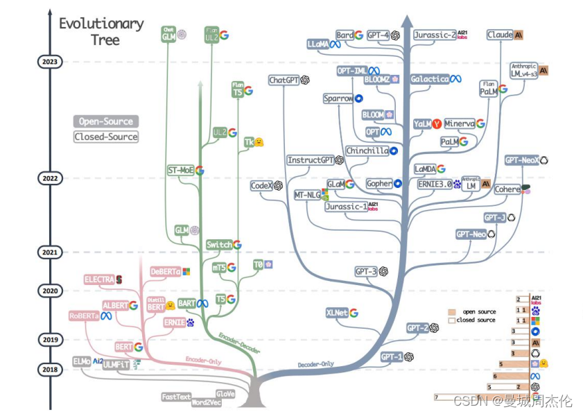

之前介绍[GPT的搭建](https://blog.csdn.net/victor_manches/article/details/132197681?spm=1001.2014.3001.5502)的方式的时候，将BERT与GPT进行了对比，我们可以知道BERT和GPT都是基于transformer架构下的分支，二者在最初提出的时间差不多，但是却有着完全不同的走向，以BERT为代表的decorder-only家族发展出了RoBERTa， ALBERT , 以及DeBERTa 等，但是在这之后就没有更好的架构提出了，而是以GPT为代表的decorder-only家族以及T5这种Encorder-decorder架构遍地开花结果。但是这并不影响BERT在NLP发展上的历史地位，它的一些思想我们在如今的大模型上还是能看到它的影子。下面我们就慢慢的走近BERT的世界。

` `

BERT的全称为Bidirectional Encoder Representation from Transformers, 参数大概约有340M的参数，训练数据大概有3M个字， 从名字我们就可以看到BERT的几个关键点:

* Encoder : 代表它是一个Encoder-only的架构
* Bidirection: 代表它是一个双向的架构
* Transformer：代表它是一个基于transformer框架的架构

` `

有关于transformer 和 encoder 的关键点可以参考我的上一篇博客[Transformer- 现代大模型的基石](https://blog.csdn.net/victor_manches/article/details/132110742?spm=1001.2014.3001.5502) ，BERT出名其主要的核心思想是在于:

* Encoder - only 代表 ， 经过接不同的任务头进行fine_tune 可以完成各式各样的任务
* 提出了MLM(masked language model)的预训练方法

 

 

首先,BERT的输入是所有如下图，除了每个词的Token之外，还有两个输入:

1. 句子成分，由于后续需要句子顺序
2. 位置信息，与GPT一样补偿位置信息

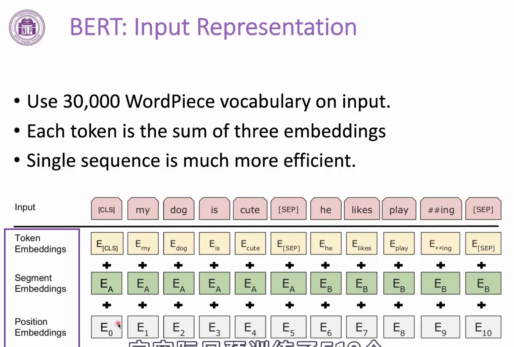

 

 

 

### Pre-trained

BERT的预训练目标是同样也是一种无监督的学习，具体的就是从网上大量爬下来的语料库中做填空题，如下图，在网上爬了一个短语台湾大学，MLM的原理就是随机的mask某个单词可以用 `<mask>`或者随机的用某个字去代替这个字，然后将mask后的句子全部输入给BERT，BERT是一个seq2seq的架构，它能输出一个等长的向量，然后将mask的位置输出的字与原本盖住的字得到loss，最后去做梯度下降,这个就是MLM任务的基本原理. 以BERT为代表的encoder-only的架构的预训练都是以MLM类似填空题为主的，区别于GPT的问答机制。

**PS: 如果想利用BERT在自己的domain上做一些任务，将自己的语料库做MLM 会对性能有提升，这个叫domain adaption.**

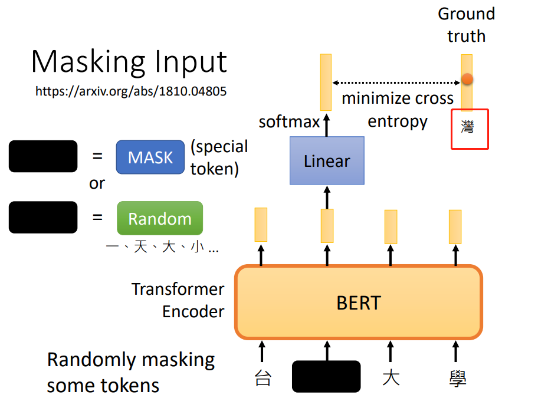

 

 

在整个BERT种，为了保持整个预训练资料的稳定性，所以作者应该是根据效果应用了15% 的masking，其中80 %是用mask替代， 然后 10 % 是随机词，还有10%保持一致(这个是为了保证BERT不会每次都去修改原文)

 

 

### Fine_tuning

经过Google本身预训练的之后，BERT已经具备了填空的能力，但是如果要适应于不同的下游任务，需要BERT通过fine_tune(接不同的任务头)就可以适用于不同的下游任务，fine_tune不同于pre_train,它是一种有监督的任务，需要你提供有label的数据集让BERT + Head去学习，下面介绍4个BERT适用于不同的下游任务

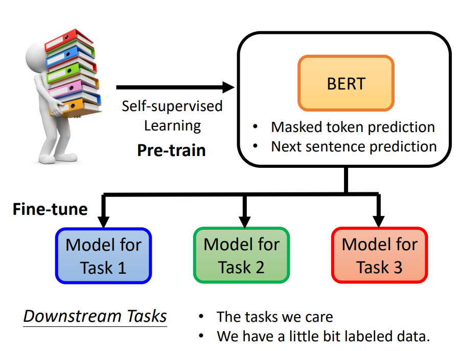

 

 

#### Case1: Sentiment Analysis

BERT适用于情感分析任务只需要将预训练好的BERT接一个linear head 最后输出对应的情感，你只需要收集大量的情感分析的case 给这个模型去做梯度下降就可以了。

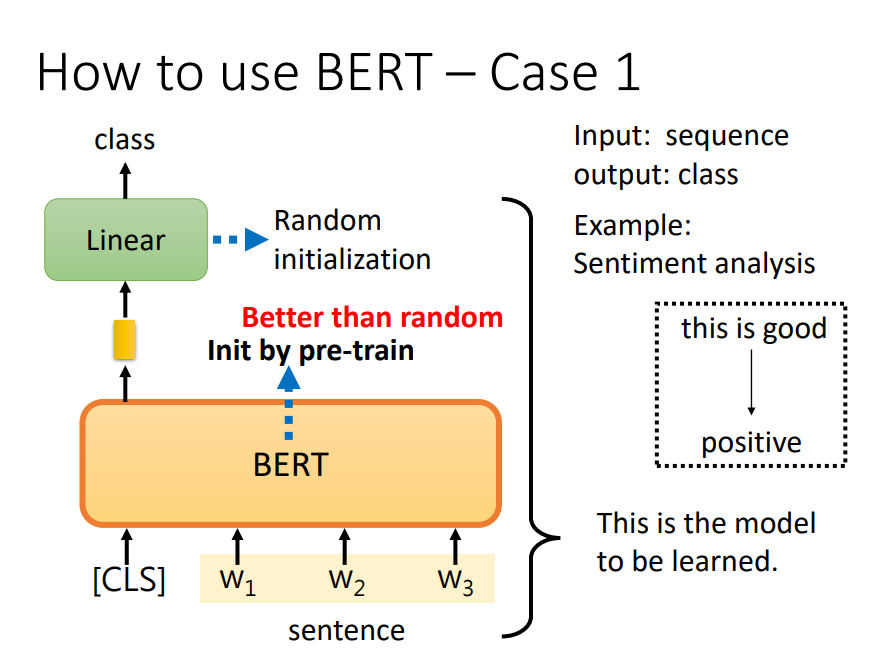

 

 

#### Case2: POS tagging

词性标注任务同样也是NLP任务的一种，相比于情感分析，它稍微复杂的地方就是他需要对每个输出位置都进行分类，而不是跟情感分析一样只对第一个整体进行分类。最终将loss叠加然后再进行梯度下降。

 

 

#### Case3: Natural Language Inference

自然语言推理，就是将前提premise + 假设jypothesis 全部输入给模型，然后让他判断二者的关系，其实也是一种分类问题。

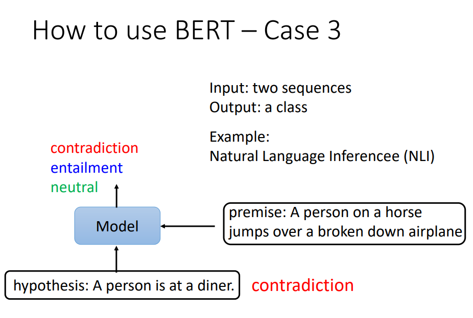

 

 

#### Case4: Extraction-based Question Answering

基于语料的问答，同样它需要输入给模型文章 + 问题， 模型输出两个数字{s , e} 这两个数字代表的是答案在语料库中的起始位置，如下面gravity 就是文本的第17个字开始，到17个字结束。

具体一点的做法就是将question 和 document 拼起来之后全部输入给BERT， 然后初始化两个随机向量, 然后将每个随机化得向量与document对应的位置的输出做点积然后将整个output做一个softmax得到开始的位置。

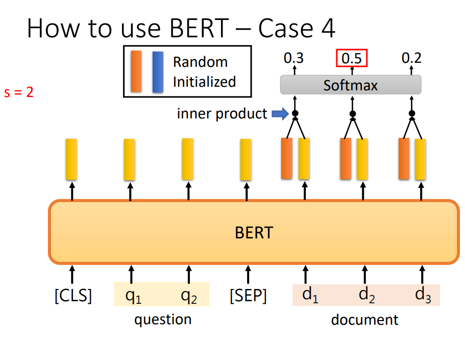

 

 

### 工作原理

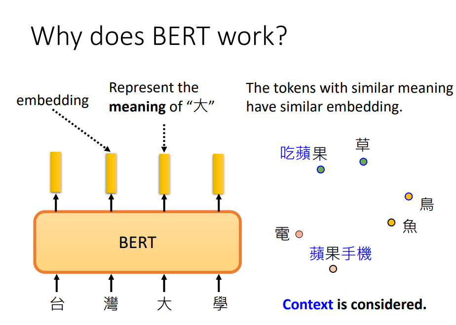

有关于BERT理论成功的原因，这里有一些研究，有人发现将不同的词输入给BERT后得到的embedding，由于读过上下文且经过了[Attention注意力机制](https://blog.csdn.net/victor_manches/article/details/131797072?spm=1001.2014.3001.5502) , 得到的词向量有着意思相近的余弦距离就更小的特性，所以相比于[Word2Vec](https://blog.csdn.net/victor_manches/article/details/131236449?spm=1001.2014.3001.5502) ，BERT更像是一个动态的CBOW模型，并且有着比word2vec更好的效果因为注意力的加入，他能结合上下文动态的改变词向量，从而表达多义词，因此有人称BERT为Contextualized word embedding

 

除此之外，还有研究将一个Multi-lingual BERT 对其在不同语言的问答上做fine_tune但是只在中文的问答做测试。最后结果如下，可以看到即使是在英文的数据上做fine-tune结果还是能在中文的问答上做测试，结果也并没有下降的很多。

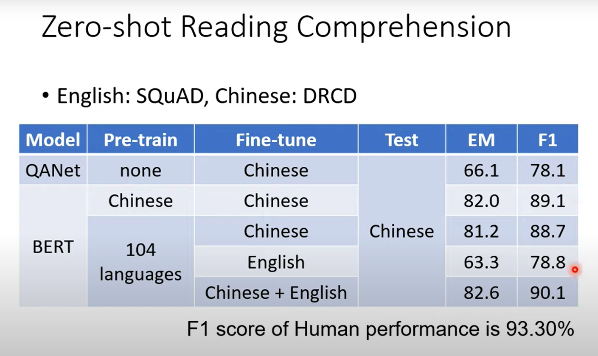

这里提出了一个猜想，就是将英文的数据经过BERT之后， 以及将中文数据经过BERT之后，发现二者embedding的距离是一个稳定的值。类似下图种，将英文语料通过multi-BERT后得到的词向量 + 一个稳定大小的向量后 然后这些词向量能完全对应上中文语料。

除此之外，有研究也表明了经过MLM的BERT的预训练模型不仅仅在NLP上有效果，在其他领域如预测蛋白质，DNA 以及音乐分类上都有很好的效果。

 

 

 

 

## BERT进化体

其实，在预训练阶段除了做MLM，BERT还采用了Next Sentence Prediction技术，就是在语料库中抽取一个句子作为上文，然后再随机的从语料库或者本身下文拿出来组成pair，输入给BERT 令其判断这两个句子是否是上下文。 但是这个技术在BERT的进化版中，RoBERTa提出了这个方法并没有多大的效果。所以在之后的ALBERT中提出了Sentence order prediction (句子排序)是有用的。

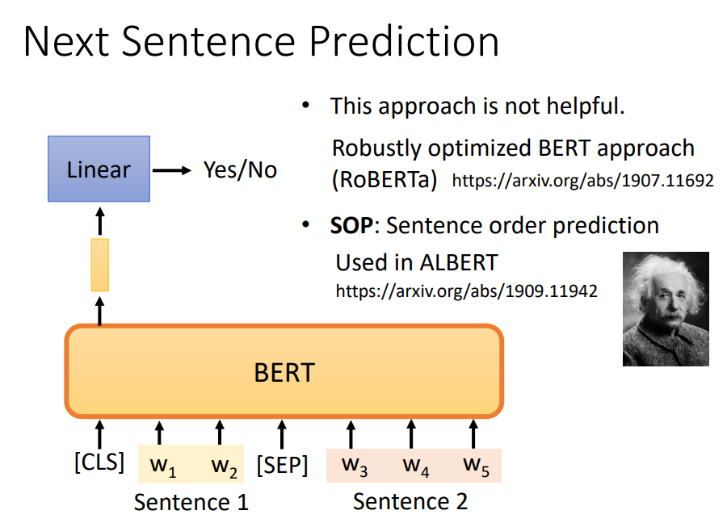

除了上面说的类似BERT 的MLM方法去预训练一个decoder-only的架构， 也能根据类似的方法去预训练Encoder - decoder的架构。 BART就是基于BERT的思想提出来的，但是不同的是他是一个Encoder - decoder的架构， 而且预训练的方法也在mlm的基础上做了一个改进，它主要用到了下面5种方法做预训练:

1. MLM，然后需要恢复原始句子
2. 删掉某个字，然后需要恢复原始句子
3. 打乱单词顺序，然后需要恢复原始句子
4. 将短句顺序做旋转，然后需要恢复原始句子
5. mask + 选装顺序，，然后需要恢复原始句子

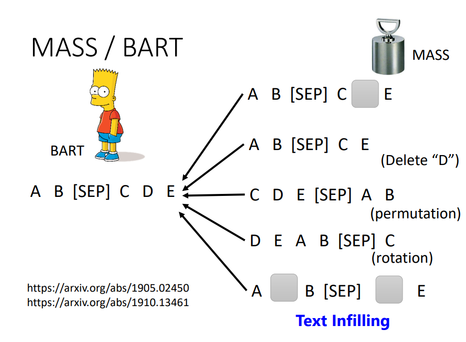
