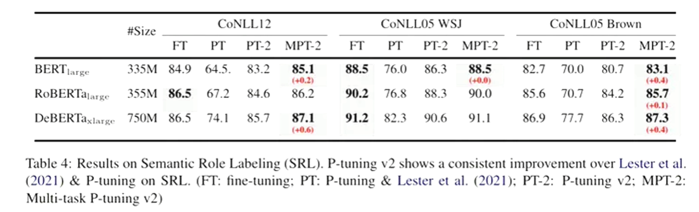
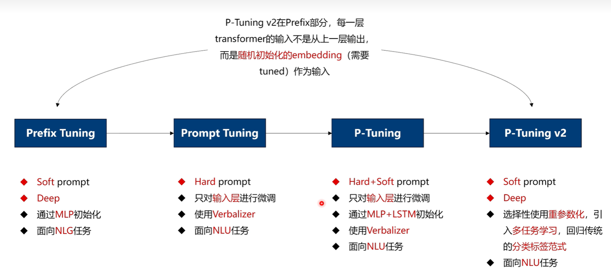
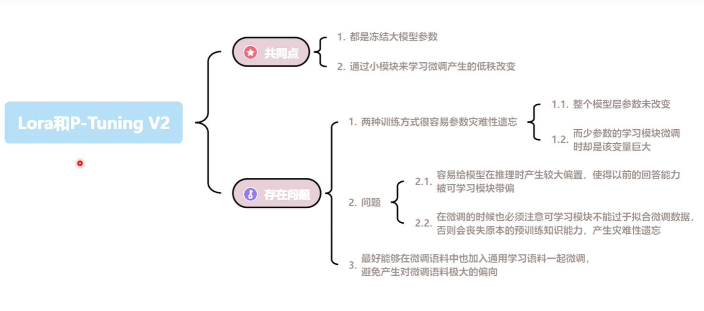
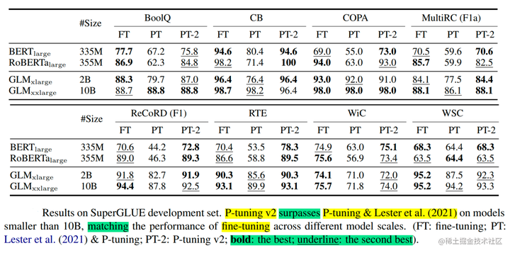

# 自然语言处理: 第十三章P-tuing系列之P-tuning V2

项目地址: [P-Tuning](https://github.com/THUDM/P-tuning)

论文地址: [[2110.07602] P-Tuning v2: Prompt Tuning Can Be Comparable to Fine-tuning Universally Across Scales and Tasks (arxiv.org)](https://arxiv.org/abs/2110.07602)

 

## 理论基础

在上一篇[第十三章P-tuing系列之P-tuning V1-CSDN博客](https://blog.csdn.net/victor_manches/article/details/136466792?spm=1001.2014.3001.5502) 简单的介绍了P-tuning V1的核心思想，其核心思想主要是通过构造训练一个少量参数的prompt-encoder(lstm+mlp) 构建无真实语义信息的 virtual token 结合原始的input从而达到能与全量fine-tuning 一样效果的预训练过程，但是V1版本同时存在下面三个方面的局限性:

* **模型通用性**:  只有在1B以上的参数的预训练模型效果才能超过fine-tuing
* **任务通用性**：现存在的prompt-tuning 不能很好地处理序列标签标注的任务(1. 序列标注需要预测一连串得标签而不是单一标签 2. 序列标注通常预测得是无实际意义的标签)
* **缺少深度提示优化**: 在Prompt Tuning和P-tuning中，连续提示只被插入transformer第一层的输入embedding序列中，在接下来的transformer层中，插入连续提示的位置的embedding是由之前的transformer层计算出来的，这可能导致两个可能的优化挑战。

  * 由于序列长度的限制，可调参数的数量是有限的。
  * 输入embedding对模型预测只有相对间接的影响

 

 

基于上面提到的三点局限性，清华的团队在V1的基础上提出了V2的版本，可以看到V1的版本只是在输入层加入了prompts 而V2的版本更像prefix-tuning 一样在每一个transformer层加入了prompt tokens，这样做的目的主要是为了:

1. 更多可学习的参数（从P-tuning和Prompt Tuning的0.01%增加到0.1%-3%），从而允许更多的任务容量，而这些参数相比于全量微调还是小很多
2. 加入到更深层结构中的Prompt能给模型预测带来更直接的影响。

 

 

具体做法基本同Prefix Tuning，可以看作是将文本生成的Prefix Tuning技术适配到NLU任务中，然后做了一些改进：

* **选择性使用重参数化的编码器** 。以前的方法利用重参数化功能来提高训练速度和鲁棒性（如：Prefix Tuning中的MLP、P-Tuning中的LSTM））。在 P-tuning v2 中，作者发现重参数化的改进很小，这种技术取决于任务集和数据集(不同的数据上表现也不同)
* **针对不同任务采用不同的提示长度** 。提示长度在提示优化方法的超参数搜索中起着核心作用。在实验中，我们发现不同的理解任务通常用不同的提示长度来实现其最佳性能，这与Prefix-Tuning中的发现一致，简单来说的NLU任务通常情况下较短的prmopt大约20 token就能获得最佳性能，困难的任务下，大约100+token会有更好的效果。下图是p-tuning v2的源码，可以看到连续模板PrefixEncoder类的pre_seq_len提示长度是一个手动输入的参数。

  
* **引入多任务学习** 。先在多任务的Prompt上进行预训练，然后再适配下游任务。多任务学习对我们的方法来说是可选的，但可能是相当有帮助的。一方面，连续提示的随机惯性给优化带来了困难，这可以通过更多的训练数据或与任务相关的无监督预训练来缓解；另一方面，连续提示是跨任务和数据集的特定任务知识的完美载体。我们的实验表明，在一些困难的序列任务中，多任务学习可以作为P-tuning v2的有益补充。

  
* **回归传统的分类标签范式，而不是映射器** 。标签词映射器（Label Word Verbalizer）一直是提示优化的核心组成部分，它将one-hot类标签变成有意义的词，以利用预训练语言模型头。尽管它在few-shot设置中具有潜在的必要性，但在全数据监督设置中，Verbalizer并不是必须的。它阻碍了提示调优在我们需要无实际意义的标签和句子嵌入的场景中的应用。因此，P-Tuning v2回归传统的CLS标签分类范式，采用随机初始化的分类头（Classification Head）应用于tokens之上，以增强通用性，可以适配到序列标注任务。如下图V1中通过Verbalizers 可以将great 映射为positive 但是同样的这样的verbalizer就会限制了模型在不同任务上的适配性。

 

 

下图对比了Prefix Tuning / Prompt Tuning / P-Tuning / P-Tuning V2的一些特点，总结一下：

* P-Tuning V2 和 prefix-Tuning 在结构上很像，都是通过在每一层中增加无语义的soft prompt
* 除了prompt tuning 其余都是微调技术

  

 
*  

 

  最后，这里对比了一下之前讲到的[自然语言处理: 第十二章LoRA解读](https://blog.csdn.net/victor_manches/article/details/132287864?spm=1001.2014.3001.5502) 做了一个简单的对比，可以看到二者都是parameter-efficcient fine-tuning methods(PEFT)技术，都是在冻结大模型参数的基础上，只需要构建新的挂件去训练从而减少显存消耗的预训练技术。但是二者都存在着灾难性遗忘的问题，这里以笔者的实际经验以及理解来看。P-tuing 的灾难性遗忘的痛点或许会比LoRA更加严重，因为它是相当于添加了很多prompt(虽然这些是virtual prompt)但是如果对于新任务来说的话，它始终与P-tuing的数据集的形式差别很多，所以并不能很好的适配新任务。(纯属个人观点，欢迎讨论)

  

 

 

 

## 结果对比

对于简单的NLU任务，如SST-2（单句分类），Prompt Tuning和P-Tuning在较小的规模下没有显示出明显的劣势。但是当涉及到复杂的挑战时，如：自然语言推理（RTE）和多选题回答（BoolQ），它们的性能会非常差。相反，P-Tuning v2在较小规模的所有任务中都与微调的性能相匹配。并且，P-tuning v2在RTE中的表现明显优于微调，特别是在BERT中。

 

为了评估P-Tuning v2在一些困难的NLU挑战中的能力，作者选择了三个典型的序列标注任务（名称实体识别、抽取式问答（QA）和语义角色标签（SRL）），共八个数据集。我们观察到P-Tuning v2在所有任务上都能与全量微调相媲美。

 

## 参考资料

[【自娱自乐读paper】p-tuning v2论文精读_哔哩哔哩_bilibili](https://www.bilibili.com/video/BV1JQ4y1H7DR/?spm_id_from=333.337.search-card.all.click&vd_source=7660edfc8efcdd6e371b5a2c5bfc45bd)

[大模型参数高效微调技术原理综述（三）-P-Tuning、P-Tuning v2 - 知乎 (zhihu.com)](https://zhuanlan.zhihu.com/p/635848732)
