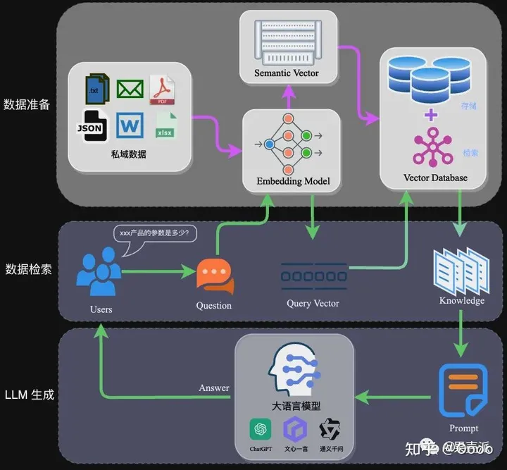
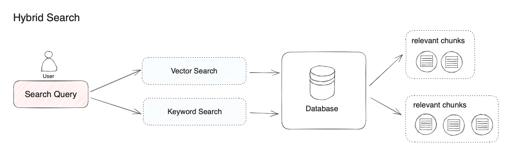

# 自然语言处理: 第十五章RAG(Retrieval Augmented Generation)

论文地址: [[2005.11401] Retrieval-Augmented Generation for Knowledge-Intensive NLP Tasks (arxiv.org)](https://arxiv.org/abs/2005.11401)

代码地址: [可以参考百度文心一言为例子，与本文代码无关](https://aistudio.baidu.com/projectdetail/7431640)

本篇文章主要是介绍Retrieval Augmented Generation下文简称RAG技术的实现原理和代码实现以及大体的改进思路(持续更新)。

## 理论基础

随着ChatGPT的爆火推动了LLM(large language model)一统江湖的热潮，近两年各种大模型相继推出，也逐渐封杀了小模型的路子。但当涉及到专业场景或行业细分领域时，通用大模型就会面临以下三个主要的问题

* **知识的局限性和非实时性** ：模型自身的知识完全源于它的训练数据，而现有的主流大模型（ChatGPT、文心一言、通义千问…）的训练集基本都是构建于网络公开的数据，对于一些实时性的、非公开的或离线的数据是无法获取到的，这部分知识也就无从具备。
* **幻觉问题** ：所有的AI模型的底层原理都是基于数学概率，其模型输出实质上是一系列数值运算，大模型也不例外，所以它有时候会一本正经地胡说八道，尤其是在大模型自身不具备某一方面的知识或不擅长的场景。而这种幻觉问题的区分是比较困难的，因为它要求使用者自身具备相应领域的知识。
* **数据安全性** ：对于企业来说，数据安全至关重要，没有企业愿意承担数据泄露的风险，将自身的私域数据上传第三方平台进行训练。这也导致完全依赖通用大模型自身能力的应用方案不得不在数据安全和效果方面进行取舍。

<br />

<br />

相对于成本昂贵的fine-Tuning技术，在2020年Facebook AI Research(FAIR)团队发表一篇名为《Retrieval-Augmented Generation for Knowledge-Intensive NLP Tasks》的论文。这篇论文首次提出了RAG概念往往成为一种更优选择(PS: LLM 的发展方向除了本文提到的RAG 还有普遍的认为是agent，有关于agent的知识会后续介绍)二者的对比如下表:

| 优势                                                                                  | 劣势                                                                        |
| ------------------------------------------------------------------------------------- | --------------------------------------------------------------------------- |
| 任务通用性, 无需定制化，根据prompt可以通用于多种任务                                  | 任务专业性，微调对于特定任务的完成效果好，但在通用性问题上不够灵活          |
| 实时更新，RAG能够访问最新的外部信息，保持知识的时效性                                 | 外部依赖，RAG的性能高度依赖于外部知识库的质量和覆盖范围                     |
| 减少幻觉，通过使用外部验证信息，RAG有助于减少语言模型产生的错误或虚构信息             | 实现复杂，RAG的实现比单纯的微调更复杂，需要处理检索和生成的结合             |
| 高透明度，生成答案时引用外部信息源，增加可信度和可追溯性。                            | 生成延迟，检索过程可能增加回答生成的时间延迟。                              |
| 避免重训练，相比于微调，RAG减少了频繁重训练的需要，因为模型可以通过检索即时获取新信息 | 准确性挑战，虽然可以减少幻觉，但RAG也面临着确保检索结果准确性和相关性的挑战 |

<br />

<br />

那么介绍了这么多RAG的优点，那么什么是RAG呢？一句话来说，就是把答案告诉大模型然后通过大模型得到最终的答案。Naive-RAG的话，可以把整个Pipeline分成下面三个块:

1. 数据准备: 将私有的数据(可多模态文/图/视频/表)，切分后利用向量数据库将这些数据作为词向量(词向量的知识可以参考[Word2Vec](https://blog.csdn.net/victor_manches/article/details/131236449?spm=1001.2014.3001.5502))保存到向量数据中
2. 数据检索并返回: 用户提出问题后，同样的转换成向量，然后通过计算问题和向量数据库里相似度，检索出最相关的K个文档
3. LLM的检索生成: 拼接检索出的K个文档 以及问题，一起输入给LLM，得到最终的回答。
4. 

<br />

<br />

上面就是最基础的RAG的技术路线，但是在实际的应用过程中还存在很多可以优化的地方，下图摘自于[langchain](https://github.com/sagazluiz/langchain/blob/0445d8e4d1e7fbec3a053c1fbd40ecb7fc909076/rag-from-scratch/rag_from_scratch_5_to_9.ipynb)的关于RAG的技术增强路线，后面我会摘取重要的块给大家陆续展开，方便大家在工程上或者实践上展开。


<br />

## 代码实现

### 数据准备

私有的数据库里可能存在各种各样的格式的文档常见的文字为主有pdf/word/ppt/txt 等以及 图片 , excel 等。这些都是需要预处理的提出有用信息，因为对于模型来说，他们只认识文字 / 图片 / 音频 。下面以常见的pdf文档为例，除了提取出文档里的文字信息，还需要将这些文字进行split切分(这是因为LLM会有输入字符字数的限制如果检索出的文档字数超过限制，LLM就无法回答后续问题)。 # 安装 pdf 解析库，也可以用langchain的

```
!pip install pdfminer.six

from pdfminer.high_level import extract_pages
from pdfminer.layout import LTTextContainer

def extract_text_from_pdf(filename, page_numbers=None, min_line_length=1):
    '''从 PDF 文件中（按指定页码）提取文字'''
    paragraphs = []
    buffer = ''
    full_text = ''
    # 提取全部文本
    for i, page_layout in enumerate(extract_pages(filename)):
        # 如果指定了页码范围，跳过范围外的页
        if page_numbers is not None and i not in page_numbers:
            continue
        for element in page_layout:
            if isinstance(element, LTTextContainer):
                full_text += element.get_text() + '\n'
    # 按空行分隔，将文本重新组织成段落
    lines = full_text.split('\n')
    for text in lines:
        if len(text) >= min_line_length:
            buffer += (' '+text) if not text.endswith('-') else text.strip('-')
        elif buffer:
            paragraphs.append(buffer)
            buffer = ''
    if buffer:
        paragraphs.append(buffer)
    return paragraphs
```

<br />


上面的代码只是在每固定长度进行切分了，这样切分会有两个问题:

1. 粒度太大可能导致检索不精准，粒度太小可能导致信息不全面
2. 问题的答案可能跨越两个片段

所以一般除了需要输入切分的长度split_size，简单的还会定义一个chunk_size。这样就会缓解上面的两个问题

```
from nltk.tokenize import sent_tokenize
import json


def split_text(paragraphs, chunk_size=300, overlap_size=100):
    '''按指定 chunk_size 和 overlap_size 交叠割文本'''
    sentences = [s.strip() for p in paragraphs for s in sent_tokenize(p)]
    chunks = []
    i = 0
    while i < len(sentences):
        chunk = sentences[i]
        overlap = ''
        prev_len = 0
        prev = i - 1
        # 向前计算重叠部分
        while prev >= 0 and len(sentences[prev])+len(overlap) <= overlap_size:
            overlap = sentences[prev] + ' ' + overlap
            prev -= 1
        chunk = overlap+chunk
        next = i + 1
        # 向后计算当前chunk
        while next < len(sentences) and len(sentences[next])+len(chunk) <= chunk_size:
            chunk = chunk + ' ' + sentences[next]
            next += 1
        chunks.append(chunk)
        i = next
    return chunks
```

<br />

<br />

切完文档之后，我们会得到这种重叠且分段的文档，接下来就会利用向量数据库把这些文字缓存成向量并存储下来。而目前主流的数据库对比如下图: 下面以一个elasticsearch数据库为例，将上面的文档转换成向量。


- FAISS: Meta 开源的向量检索引擎 https://github.com/facebookresearch/faiss
- Pinecone: 商用向量数据库，只有云服务 https://www.pinecone.io/
- Milvus: 开源向量数据库，同时有云服务 https://milvus.io/
- Weaviate: 开源向量数据库，同时有云服务 https://weaviate.io/
- Qdrant: 开源向量数据库，同时有云服务 https://qdrant.tech/
- PGVector: Postgres 的开源向量检索引擎 https://github.com/pgvector/pgvector
- RediSearch: Redis 的开源向量检索引擎 https://github.com/RediSearch/RediSearch
- ElasticSearch 也支持向量检索 https://www.elastic.co/enterprise-search/vector-search

```
# 安装 ES 客户端
!pip install elasticsearch7
# 安装NLTK（文本处理方法库）
!pip install nltk

from elasticsearch7 import Elasticsearch, helpers
from nltk.stem import PorterStemmer
from nltk.tokenize import word_tokenize
from nltk.corpus import stopwords
import nltk
import re

import warnings
warnings.simplefilter("ignore")  # 屏蔽 ES 的一些Warnings

nltk.download('punkt')  # 英文切词、词根、切句等方法
nltk.download('stopwords')  # 英文停用词库

def to_keywords(input_string):
    '''（英文）文本只保留关键字'''
    # 使用正则表达式替换所有非字母数字的字符为空格
    no_symbols = re.sub(r'[^a-zA-Z0-9\s]', ' ', input_string)
    word_tokens = word_tokenize(no_symbols)
    stop_words = set(stopwords.words('english'))
    ps = PorterStemmer()
    # 去停用词，取词根
    filtered_sentence = [ps.stem(w)
                         for w in word_tokens if not w.lower() in stop_words]
    return ' '.join(filtered_sentence)

# 1. 创建Elasticsearch连接
es = Elasticsearch(
    hosts=['xxxxxxx'],  # 服务地址与端口
    http_auth=("username", "pass"),  # 用户名，密码
)

# 2. 定义索引名称
index_name = "string_index"

# 3. 如果索引已存在，删除它（仅供演示，实际应用时不需要这步）
if es.indices.exists(index=index_name):
    es.indices.delete(index=index_name)

# 4. 创建索引
es.indices.create(index=index_name)

# 5. 灌库指令
actions = [
    {
        "_index": index_name,
        "_source": {
            "keywords": to_keywords(para),
            "text": para
        }
    }
    for para in paragraphs
]

# 6. 文本灌库
helpers.bulk(es, actions)

def search(query_string, top_n=3):
    # ES 的查询语言
    search_query = {
        "match": {
            "keywords": to_keywords(query_string)
        }
    }
    res = es.search(index=index_name, query=search_query, size=top_n)
    return [hit["_source"]["text"] for hit in res["hits"]["hits"]]

results = search("how many parameters does llama 2 have?", 2)
for r in results:
    print(r+"\n")

```

<br />

<br />

### 数据检索

```
import chromadb
from chromadb.config import Settings


class MyVectorDBConnector:
    def __init__(self, collection_name, embedding_fn):
        chroma_client = chromadb.Client(Settings(allow_reset=True))

        # 为了演示，实际不需要每次 reset()
        chroma_client.reset()

        # 创建一个 collection , 类似表
        self.collection = chroma_client.get_or_create_collection(name="demo")
        self.embedding_fn = embedding_fn

    def add_documents(self, documents, metadata={}):
        '''向 collection 中添加文档与向量'''
        self.collection.add(
            embeddings=self.embedding_fn(documents),  # 每个文档的向量
            documents=documents,  # 文档的原文
            ids=[f"id{i}" for i in range(len(documents))]  # 每个文档的 id
        )

    def search(self, query, top_n):
        '''检索向量数据库'''
        results = self.collection.query(
            query_embeddings=self.embedding_fn([query]),
            n_results=top_n
        )
        return results

# 创建一个向量数据库对象
vector_db = MyVectorDBConnector("demo", get_embeddings)
# 向向量数据库中添加文档
vector_db.add_documents(paragraphs)

user_query = "Llama 2有多少参数"

results = vector_db.search(user_query, 2)

class RAG_Bot:
    def __init__(self, vector_db, llm_api, n_results=2):
        self.vector_db = vector_db
        self.llm_api = llm_api
        self.n_results = n_results

    def chat(self, user_query):
        # 1. 检索
        search_results = self.vector_db.search(user_query, self.n_results)

        # 2. 构建 Prompt
        prompt = build_prompt(
            prompt_template, info=search_results['documents'][0], query=user_query)

        # 3. 调用 LLM
        response = self.llm_api(prompt)
        return response

# 创建一个RAG机器人
bot = RAG_Bot(
    vector_db,
    llm_api=get_completion
)

user_query = "llama 2有多少参数？"

response = bot.chat(user_query)

print(response)
```

上面的例子只展示了基于关键字(上一节基于es)和向量(本节基于chromdb)的搜索，RAG 检索环节中的主流方法是向量检索，即语义相关度匹配的方式。技术原理是通过将外部知识库的文档先拆分为语义完整的段落或句子，并将其转换（Embedding）为计算机能够理解的一串数字表达（多维向量），同时对用户问题进行同样的转换操作。计算机能够发现用户问题与句子之间细微的语义相关性，比如 “猫追逐老鼠” 和 “小猫捕猎老鼠” 的语义相关度会高于 “猫追逐老鼠” 和 “我喜欢吃火腿” 之间的相关度。在将相关度最高的文本内容查找到后，RAG 系统会将其作为用户问题的上下文一起提供给大模型，帮助大模型回答问题。

除了能够实现复杂语义的文本查找，向量检索还有其他的优势：

* 相近语义理解（如老鼠/捕鼠器/奶酪，谷歌/必应/搜索引擎）
* 多语言理解（跨语言理解，如输入中文匹配英文）
* 多模态理解（支持文本、图像、音视频等的相似匹配）
* 容错性（处理拼写错误、模糊的描述）

虽然向量检索在以上情景中具有明显优势，但有某些情况效果不佳。比如：

* 搜索一个人或物体的名字（例如，伊隆·马斯克，iPhone 15）
* 搜索缩写词或短语（例如，RAG，RLHF）
* 搜索 ID（例如， `gpt-3.5-turbo` ， `titan-xlarge-v1.01` ）

而上面这些的缺点恰恰都是传统关键词搜索的优势所在，传统关键词搜索擅长：

* 精确匹配（如产品名称、姓名、产品编号）
* 少量字符的匹配（通过少量字符进行向量检索时效果非常不好，但很多用户恰恰习惯只输入几个关键词）
* 倾向低频词汇的匹配（低频词汇往往承载了语言中的重要意义，比如“你想跟我去喝咖啡吗？”这句话中的分词，“喝”“咖啡”会比“你”“想”“吗”在句子中承载更重要的含义）

对于大多数文本搜索的情景，首要的是确保潜在最相关结果能够出现在候选结果中。向量检索和关键词检索在检索领域各有其优势。混合搜索正是结合了这两种搜索技术的优点，同时弥补了两方的缺点。

在混合检索中，你需要在数据库中提前建立向量索引和关键词索引，在用户问题输入时，分别通过两种检索器在文档中检索出最相关的文本。



“混合检索”实际上并没有明确的定义，本文以向量检索和关键词检索的组合为示例。如果我们使用其他搜索算法的组合，也可以被称为“混合检索”。比如，我们可以将用于检索实体关系的知识图谱技术与向量检索技术结合。

不同的检索系统各自擅长寻找文本（段落、语句、词汇）之间不同的细微联系，这包括了精确关系、语义关系、主题关系、结构关系、实体关系、时间关系、事件关系等。可以说没有任何一种检索模式能够适用全部的情景。**混合检索通过多个检索系统的组合，实现了多个检索技术之间的互补。**

**最后通过检索回的文本还有一个比较重要的超参数就是K:召回的文本数量，这里原论文推荐是10左右是比较好的(这个可以左右适当调整)**

<br />

<br />

### 模型检索生成

最后通过上一部分数据检索召回的K个文档，有时候不一定最适合的答案在最前面，所以这里一般会再加上一个召回模型，这种召回模型的机理就是专门对于这种RAG技术的retrival后的top K个文档进行重排序。具体的技术方案如下图


代码

```
!pip install sentence_transformers

from sentence_transformers import CrossEncoder

model = CrossEncoder('cross-encoder/ms-marco-MiniLM-L-6-v2', max_length=512)
user_query = "how safe is llama 2"

scores = model.predict([(user_query, doc)
                       for doc in search_results['documents'][0]])
# 按得分排序
sorted_list = sorted(
    zip(scores, search_results['documents'][0]), key=lambda x: x[0], reverse=True)
for score, doc in sorted_list:
    print(f"{score}\t{doc}\n")
```

最后进行完重排序后的文档根据先后顺序进行拼接，连接最原始的query(问题)一同塞给LLM进行反馈，整体的pipeline就完成了。

```
user_query = "how many parameters does llama 2 have?"

# 1. 检索
search_results = search(user_query, 2)

# 2. 构建 Prompt
prompt = build_prompt(prompt_template, info=search_results, query=user_query)
print("===Prompt===")
print(prompt)

# 3. 调用 LLM
response = get_completion(prompt)
# response = get_completion_ernie(prompt)
print("===回复===")
print(response)from openai import OpenAI
import os
# 加载环境变量
from dotenv import load_dotenv, find_dotenv
_ = load_dotenv(find_dotenv())  # 读取本地 .env 文件，里面定义了 OPENAI_API_KEY

client = OpenAI(
    api_key=os.getenv("OPENAI_API_KEY"),
    base_url=os.getenv("OPENAI_BASE_URL")
)

def get_completion(prompt, model="gpt-3.5-turbo"):
    '''封装 openai 接口'''
    messages = [{"role": "user", "content": prompt}]
    response = client.chat.completions.create(
        model=model,
        messages=messages,
        temperature=0,  # 模型输出的随机性，0 表示随机性最小
    )
    return response.choices[0].message.content

def build_prompt(prompt_template, **kwargs):
    '''将 Prompt 模板赋值'''
    prompt = prompt_template
    for k, v in kwargs.items():
        if isinstance(v, str):
            val = v
        elif isinstance(v, list) and all(isinstance(elem, str) for elem in v):
            val = '\n'.join(v)
        else:
            val = str(v)
        prompt = prompt.replace(f"__{k.upper()}__", val)
    return prompt
prompt_template = """
你是一个问答机器人。
你的任务是根据下述给定的已知信息回答用户问题。
确保你的回复完全依据下述已知信息。不要编造答案。
如果下述已知信息不足以回答用户的问题，请直接回复"我无法回答您的问题"。

已知信息:
__INFO__

用户问：
__QUERY__

请用中文回答用户问题。
"""

user_query = "how many parameters does llama 2 have?"

# 1. 检索
search_results = search(user_query, 2)

# 2. 构建 Prompt
prompt = build_prompt(prompt_template, info=search_results, query=user_query)
print("===Prompt===")
print(prompt)

# 3. 调用 LLM
response = get_completion(prompt)
# response = get_completion_ernie(prompt)
print("===回复===")
print(response)


```

<br />

<br />

## 应用场景

RAG技术可以在以下一些常见的自然语言处理任务中发挥作用：

1.问答系统（QA Systems）：RAG可以用于构建强大的问答系统，能够回答用户提出的各种问题。它能够通过检索大规模文档集合来提供准确的答案，无需针对每个问题进行特定训练。

2.文档生成和自动摘要（Document Generation and Automatic Summarization）：RAG可用于自动生成文章段落、文档或自动摘要，基于检索的知识来填充文本，使得生成的内容更具信息价值。

3.智能助手和虚拟代理（Intelligent Assistants and Virtual Agents）：RAG可以用于构建智能助手或虚拟代理，结合聊天记录回答用户的问题、提供信息和执行任务，无需进行特定任务微调。

4.信息检索（Information Retrieval）：RAG可以改进信息检索系统，使其更准确深刻。用户可以提出更具体的查询，不再局限于关键词匹配。

5.知识图谱填充（Knowledge Graph Population）：RAG可以用于填充知识图谱中的实体关系，通过检索文档来识别和添加新的知识点

<br />

***最后如果对整体代码感兴趣，或者对RAG的应用感兴趣的可以私聊我，大家一起交流讨论。感谢！！***

***最后如果对整体代码感兴趣，或者对RAG的应用感兴趣的可以私聊我，大家一起交流讨论。感谢！！***

***最后如果对整体代码感兴趣，或者对RAG的应用感兴趣的可以私聊我，大家一起交流讨论。感谢！！***

## 参考资料

[一文搞懂大模型RAG应用（附实践案例） - 知乎 (zhihu.com)](https://zhuanlan.zhihu.com/p/668082024)

[学习检索增强生成(RAG)技术，看这篇就够了——热门RAG文章摘译(9篇) - 知乎 (zhihu.com)](https://zhuanlan.zhihu.com/p/673392898)

[混合检索 - Dify](https://docs.dify.ai/v/zh-hans/learn-more/extended-reading/retrieval-augment/hybrid-search)

[RAG一文读懂！概念、场景、优势、对比微调与项目代码示例 (qq.com)](https://mp.weixin.qq.com/s/LqtT0EfbcfcYQd6xeH5_VQ)
