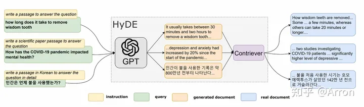
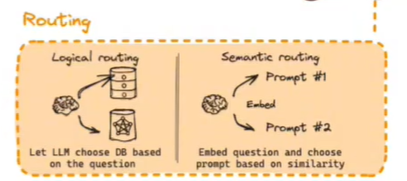
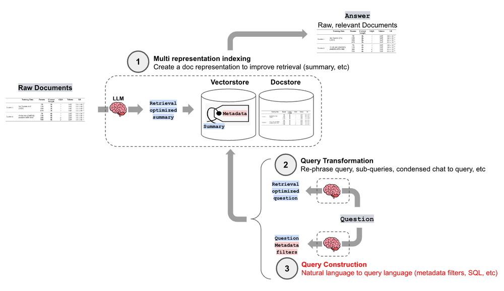
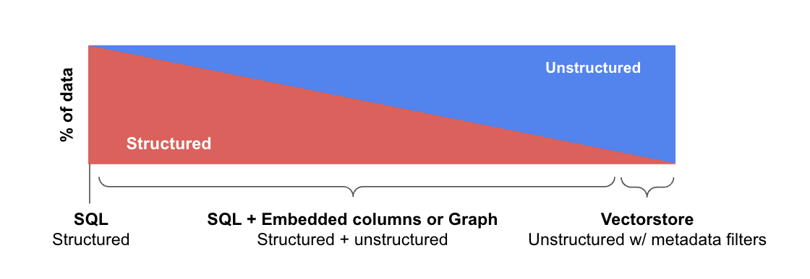
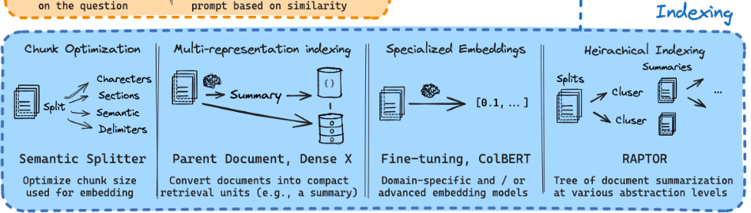
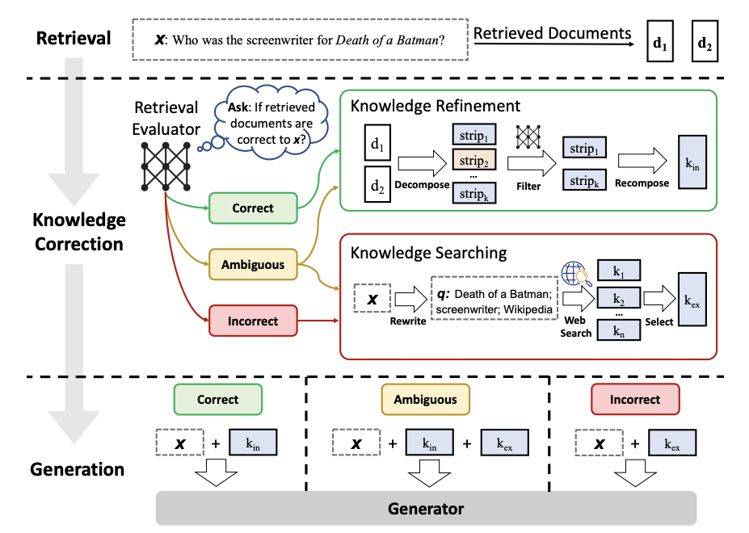
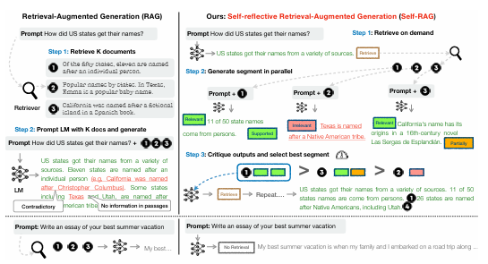

# 自然语言处理: 第十六章RAG的优化技术

上一篇文章主要介绍了Naive-RAG的基础架构，感兴趣的可以回顾下，本篇文章主要是介绍RAG技术的改进思路(持续更新)。下图摘自于[langchain](https://github.com/sagazluiz/langchain/blob/0445d8e4d1e7fbec3a053c1fbd40ecb7fc909076/rag-from-scratch/rag_from_scratch_5_to_9.ipynb)的关于RAG的技术增强路线，下面我会按照上面上面的板块逐渐展开。


<br />


<br />


## 1. Query Translation

查询转换是一系列技术，因为用户提出的query质量不稳定，所以可以使用 LLM 作为推理引擎来修改用户输入以提高检索质量。有很多技术实现可供选择：


1. [Step-back prompting](https://link.zhihu.com/?target=https%3A//arxiv.org/pdf/2310.06117.pdf%3Fref%3Dblog.langchain.dev) 使用 LLM 生成一个更通用的查询，以此检索到更通用或高层次的上下文，用于为我们的原始查询提供答案。同时执行原始查询的检索，并在最终答案生成步骤中将两个上下文发送到 LLM。这是 LangChain 的一个[示例实现](https://link.zhihu.com/?target=https%3A//github.com/langchain-ai/langchain/blob/master/cookbook/stepback-qa.ipynb%3Fref%3Dblog.langchain.dev)。
2. **[Query re-write (查询重写)](https://github.com/langchain-ai/langchain/blob/ced5e7bae790cd9ec4e5374f5d070d9f23d6457b/cookbook/rewrite.ipynb)：使用 LLM 来重新表述初始查询** ，以改进检索。LangChain 和 LlamaIndex 都有实现，个人感觉LlamaIndex 解决方案在这里更强大。
3. Multi-query **多查询**，比如**对于复杂的查询，大语言模型能够将其拆分为多个子查询(分而治之)。** 比如，

* 当你问：“在 Github 上，Langchain 和 LlamaIndex 这两个框架哪个更受欢迎？”，

我们不太可能直接在语料库找到它们的比较，所以将这个问题分解为两个更简单、具体的合理的子查询：

* “Langchain 在 Github 上有多少星？”
* “Llamaindex 在 Github 上有多少星？”

这些子查询会并行执行，检索到的信息随后被汇总到一个 LLM 提示词中。这两个功能分别在 Langchain 中以[多查询检索器](https://link.zhihu.com/?target=https%3A//python.langchain.com/docs/modules/data_connection/retrievers/MultiQueryRetriever%3Fref%3Dblog.langchain.dev)的形式和在 Llamaindex 中以[子问题查询引擎](https://link.zhihu.com/?target=https%3A//docs.llamaindex.ai/en/stable/examples/query_engine/sub_question_query_engine.html)的形式实现。

4. [Hypothetical Document Embeddings（HyDE）](https://zhuanlan.zhihu.com/p/678990235)假设性回答，是一种生成文档嵌入以检索相关文档而不需要实际训练数据的技术。首先，LLM创建一个假设答案来响应查询。虽然这个答案反映了与查询相关的模式，但它包含的信息可能在事实上并不准确。接下来，查询和生成的答案都被转换为嵌入。然后，系统从预定义的数据库中识别并检索在向量空间中最接近这些嵌入的实际文档。




<br />


<br />


## 2. Routing



**查询路由是 LLM 驱动的决策步骤，决定在给定用户查询的情况下下一步该做什么** ——选项通常是总结、对某些数据索引执行搜索或尝试许多不同的路由，然后将它们的输出综合到一个答案中。

查询路由器还用于选择数据存储位置来处理用户查询。这些数据存储位置可能是多样的，比如传统的向量存储、图形数据库或关系型数据库，或者是不同层级的索引系统。在处理多文档存储时，通常会用到摘要索引和文档块向量索引这两种不同的索引。**定义查询路由器包括设置它可以做出的选择。**


简单来说就是由LLM驱动根据不同的query 去选择索引的数据库，或者根据query 的语义相似度去配置不同的prompt

[LlamaIndex](https://link.zhihu.com/?target=https%3A//docs.llamaindex.ai/en/stable/module_guides/querying/router/root.html) 和 [LangChain](https://link.zhihu.com/?target=https%3A//python.langchain.com/docs/expression_language/how_to/routing%3Fref%3Dblog.langchain.dev) 都提供了对查询路由器的支持


<br />


<br />


<br />


## 3. Query Construction

首先介绍几个定义，包括结构化数据、非结构化数据和半结构化数据

* 结构化数据：主要存储在SQL或Graph数据库中，结构化数据的特点是预定义的模式，以表或关系组织，使其易于进行精确的查询操作。
* 半结构化数据：半结构化数据将结构化元素（例如文档或关系数据库中的表）与非结构化元素（例如关系数据库中的文本或嵌入列）混合在一起。
* 非结构化数据：通常存储在向量数据库中，非结构化数据由没有预定义模型的信息组成，通常伴有支持过滤的结构化metadata。




在典型的检索增强生成（RAG）系统中，用户query被转换为向量表示，然后将该向量与源文档的向量表示进行比较，从而找到最相似的向量。这对于非结构化数据非常有效，但是对于结构化数据就不一定了。

然而很多数据都有一定的结构。这些数据中的大部分存在于关系型（如SQL）或图形数据库中。即使是非结构化数据，也通常与结构化meta相关联（如作者、类型、发布时间等数据）。

如下图，[langchain](https://blog.langchain.dev/query-construction/)就专门针对不同的数据种类特点提出了采用合适的NL-To-X方法，将自然语言转换为每种数据类型的特定查询语法。




<br />


总的来说，query construction 就是根据不同的问题，利用LLM去驱动选择不同的数据库(包括关系数据库，图数据库 以及普通的向量数据库)


<br />


## 4. Indexing



1. **Chunk optimization(切分优化)**: 上一节提到的，由于LLM的输入长度一般是有限制的，所以我们处理的数据一般都是需要做一个切分细化的处理。所以块的大小是一个需要重点考虑的问题。块的大小取决于所使用的嵌入模型以及模型需要使用 token 的容量，一般常用的是512 ，[有一项关于块大小选择的研究](https://link.zhihu.com/?target=https%3A//www.pinecone.io/learn/chunking-strategies/)。在 LlamaIndex 中，[NodeParser 类](https://link.zhihu.com/?target=https%3A//docs.llamaindex.ai/en/stable/api_reference/service_context/node_parser.html)很好支持解决这个问题，其中包含一些高级选项，例如定义自己的文本拆分器、元数据、节点/块关系等。除了根据块的大小进行切分，我们还可以根据章节，语义(LLM去智能判断如何切分)以及定位符去切分。用于生产中的一些分块器包括可以参考[langchian](https://www.langchain.com.cn/modules/indexes/text_splitters)
2. **数据清洗(Data cleaning):** 由于我们索引的数据决定了RAG答案的质量，因此在建立索引之前，需要对数据做很多预处理操作来保证数据质量非常关键。**下面是数据清洗的一些Tips：**

   * 清除特殊字符、奇怪的编码、不必要的HTML标记来消除文本噪声（比如使用regex）；
   * 找出与主要主题无关的文档异常值并将其删除（可以通过实现一些主题提取、降维技术和数据可视化来实现这一点）；
   * 使用相似性度量删除冗余文档
3. **Multi-representation indexing(多层表达索引)**: ，通过将原始数据生成summary后重新作为embedding再存到summary database中。索引的话首先通过summary database找到最相关summary最回溯到原始文档中去。
4. **Specialized embeddings(特殊向量)**： 常用于多模态数据，比如图片数据，利用特殊的向量去做索引
5. **Heirachical Indexing(分层索引**): 带层级结构的去索引，比如可以先从关系数据库里索引处对应的关系，然后再利用索引出的关系再进一步去搜寻basic数据库。-- Multi-representation indexing也属于分层索引的一种
6. **Vectorisation(向量化):**  Embedding的模型有很多选项，比如 [bge-large](https://link.zhihu.com/?target=https%3A//huggingface.co/BAAI/bge-large-en-v1.5) 或 [E5 嵌入系列](https://link.zhihu.com/?target=https%3A//huggingface.co/intfloat/multilingual-e5-large)。只需查看 [MTEB](https://link.zhihu.com/?target=https%3A//huggingface.co/spaces/mteb/leaderboard) 排行榜以获取最新更新即可。有关分块和向量化步骤的 end2end 实现，请查看 LlamaIndex 中完整数据摄取管道的[示例](https://link.zhihu.com/?target=https%3A//docs.llamaindex.ai/en/latest/module_guides/loading/ingestion_pipeline/root.html%23)。
7. **Content enhancements(内容增强)**: 这里的内容是将相关的上下文组合起来供 LLM 推理，以检索较小的块以获得更好的搜索质量。有两种选择：

   * [围绕较小的检索块的句子扩展上下文](https://docs.llamaindex.ai/en/stable/examples/node_postprocessor/MetadataReplacementDemo.html)，在此方案中，文档中的每个句子都是单独嵌入的，这为上下文余弦距离搜索提供了极大的查询准确性. 为了在获取最相关的单个句子后更好地推理找到的上下文，我们将上下文窗口扩展为检索到的句子前后的 k 个句子，然后将这个扩展的上下文发送到 LLM。绿色部分是在索引中搜索时发现的句子嵌入，整个黑色 + 绿色段落被送到 LLM 以扩大其上下文，同时根据提供的查询进行推理

     
   * [递归地将文档拆分为多个较大的父块](https://docs.llamaindex.ai/en/latest/examples/retrievers/auto_merging_retriever.html)，其中包含较小的子块。这里的思路与语句窗口检索器非常相似——搜索更精细的信息片段，然后在在LLM 进行推理之前扩展上下文窗口。文档被拆分为较小的子块，这些子块和较大的父块有引用关系。首先在检索过程中获取较小的块，然后如果前 k 个检索到的块中有超过 n 个块链接到同一个父节点（较大的块），我们将这个父节点替换成给 LLM 的上下文——工作原理类似于自动将一些检索到的块合并到一个更大的父块中，因此得名。请注意，搜索仅在子节点索引中执行。以angchain给我们提供了一种[父文档检索器](https://zhuanlan.zhihu.com/p/673880793)

     
8. **Hybird search(混合检索)**: 只要是不同检索方式的方法都可以称之为混合检索，比如如上一章简述的结合传统的基于关键字的搜索（稀疏检索算法，如 [tf-idf](https://link.zhihu.com/?target=https%3A//en.wikipedia.org/wiki/Tf%25E2%2580%2593idf) 或搜索行业标准 [BM25](https://link.zhihu.com/?target=https%3A//en.wikipedia.org/wiki/Okapi_BM25)）和现代语义或向量搜索都，并将其结果组合在一个检索结果中。这里唯一的关键是如何组合不同相似度分数的检索结果。这个问题通常通过 [Reciprocal Rank Fusion](https://link.zhihu.com/?target=https%3A//plg.uwaterloo.ca/~gvcormac/cormacksigir09-rrf.pdf) 算法来解决，该算法能有效地对检索结果进行重新排序，以得到最终的输出结果。

**下面是数据清洗的一些Tips：**

* 清除特殊字符、奇怪的编码、不必要的HTML标记来消除文本噪声（比如使用regex）；
* 找出与主要主题无关的文档异常值并将其删除（可以通过实现一些主题提取、降维技术和数据可视化来实现这一点）；
* 使用相似性度量删除冗余文档

**下面是数据清洗的一些Tips：**

* 清除特殊字符、奇怪的编码、不必要的HTML标记来消除文本噪声（比如使用regex）；
* 找出与主要主题无关的文档异常值并将其删除（可以通过实现一些主题提取、降维技术和数据可视化来实现这一点）；
* 使用相似性度量删除冗余文档

**下面是数据清洗的一些Tips：**

* 清除特殊字符、奇怪的编码、不必要的HTML标记来消除文本噪声（比如使用regex）；
* 找出与主要主题无关的文档异常值并将其删除（可以通过实现一些主题提取、降维技术和数据可视化来实现这一点）；
* 使用相似性度量删除冗余文档

```text
RecursiveCharacterTextSplitter
```


```text
NLTKTextSplitter
```


在 LangChain 中，这种方法是通过 [Ensemble Retriever](https://link.zhihu.com/?target=https%3A//python.langchain.com/docs/modules/data_connection/retrievers/ensemble) 来实现的，该类将你定义的多个检索器结合起来，比如一个基于 faiss 的向量索引和一个基于 BM25 的检索器，并利用 RRF 算法进行结果的重排。

在 LlamaIndex 中，这一过程也是以类似的方式 [实现](https://link.zhihu.com/?target=https%3A//docs.llamaindex.ai/en/stable/examples/retrievers/reciprocal_rerank_fusion.html) 的。混合或融合搜索通常能提供更优秀的检索结果，因为它结合了两种互补的搜索算法——既考虑了查询和存储文档之间的语义相似性，也考虑了关键词匹配。


<br />


<br />


## 5. Retrival 


当我们通过上一部分indexing 索引出了K个相关文档后，这些文档的排序由于是若干个数据库返回的，所以排序不一定准确。所以需要通过通过过滤、重排或一些转换来完善它们了。在 LlamaIndex 中，有各种可用的[后处理器](https://link.zhihu.com/?target=https%3A//docs.llamaindex.ai/en/stable/module_guides/querying/node_postprocessors/root.html)，根据相似性分数、关键字、元数据过滤掉结果，或使用其他模型（如 LLM）、sentence-transformer 交叉编码器，Cohere 重新排名接口或者基于元数据重排它们。这是将检索到的上下文提供给 LLM 以获得结果答案之前的最后一步。

1. **Rerank(重排序)**：因为在搜索的时候存在随机性，这应该就是我们在RAG中第一次召回的结果往往不太满意的原因 **。**所以我们需要单独的对召回的模型进行重排序。

   * 目前rerank模型里面，最好的应该是cohere，不过它是收费的。开源的是智源发布的bge-reranker-base和bge-reranker-large。bge-reranker-large的能力基本上接近cohere，而且在一些方面还更好；
   * 几乎所有的Embeddings都在重排之后显示出更高的命中率和MRR，所以rerank的效果是非常显著的；
   * embedding模型和rerank模型的组合也会有影响，可能需要开发者在实际过程中去调测最佳组合**。**
2. **Refinement(过滤)**: 这里由于即使通过重排序后的文档，有的与query的相关度也不是很高，这里可以通过设置一个阈值将相关度低于阈值的相关文档给过滤掉。
3. [**Corrective - RAG( 修正的)**](https://arxiv.org/abs/2401.15884) : 通过一个分析模型判断召回文档是否相关/模糊/错误，对于错误的文档，会进行web_search进行知识增强 **(一般适用知识库不足以支撑回答)**

   
4. 待更新


<br />


<br />


<br />


## 6. Generation

这是任何 RAG 管道的最后一步——根据我们检索的所有上下文和初始用户查询生成答案。

最简单的方法是将所有获取的上下文（高于某个相关性阈值）与查询一起连接并提供给 LLM。但是，与往常一样，还有其他更复杂的选项，涉及多个 LLM 调用，以优化检索到的上下文并生成更好的答案。

响应合成的主要方法有：

* 通过将检索到的上下文逐块发送到 LLM 来优化答案, 比如[self-rag](https://arxiv.org/pdf/2310.11511.pdf):

  
* 概括检索到的上下文，以适应提示
* 根据不同的上下文块生成多个答案，然后将它们连接或概括起来。

有关更多详细信息，请查看[响应合成器模块文档](https://link.zhihu.com/?target=https%3A//docs.llamaindex.ai/en/stable/module_guides/querying/response_synthesizers/root.html)。


<br />


<br />


## 7.其他优化方式

1. **聊天引擎**: 关于构建一个可以多次用于单个查询的完美 RAG 系统的下一件工作是 **聊天逻辑** ，就像在 LLM 之前时代的经典聊天机器人中一样 **考虑到对话上下文** 。这是支持后续问题、代词指代或与上一个对话上下文相关的任意用户命令所必需的。它是通过查询压缩技术解决的，将聊天上下文与用户查询一起考虑在内。与往常一样，有几种方法可以进行上述上下文压缩
   * 流行且相对简单的 [ContextChatEngine](https://link.zhihu.com/?target=https%3A//docs.llamaindex.ai/en/stable/examples/chat_engine/chat_engine_context.html)，首先检索与用户查询相关的上下文，然后将其与内存缓冲区中的聊天记录一起发送到 LLM，以便 LLM 在生成下一个答案时了解上一个上下文。
   * 更复杂的情况是 [CondensePlusContextMode](https://link.zhihu.com/?target=https%3A//docs.llamaindex.ai/en/stable/examples/chat_engine/chat_engine_condense_plus_context.html)——在每次交互中，聊天记录和最后一条消息被压缩到一个新的查询中，然后这个查询进入索引，检索到的上下文与原始用户消息一起传递给 LLM 以生成答案。需要注意的是，LlamaIndex 中还支持基于 [OpenAI 智能体的聊天引擎](https://link.zhihu.com/?target=https%3A//docs.llamaindex.ai/en/stable/examples/chat_engine/chat_engine_openai.html)，提供更灵活的聊天模式，Langchain 还支持 OpenAI 功能 API。


2. **编码器和 LLM 微调:** 这种方法主要是对 Transformer 编码器 和 LLM 进行微调。其中，编码器影响嵌入质量，从而影响上下文检索质量。LLM 负责最好地使用提供的上下文来回答用户查询。如今的一大优势是可以使用像 GPT-4 这样的高端 LLM 来生成高质量的数据集。但是必须清楚，使用小型合成数据集进微调基础模型，可能会降低基础模型的通用能力。

   * **编码器微调**:参考[ 知乎大神的结论](https://zhuanlan.zhihu.com/p/674755232)，对 [bge-large-en-v1.5](https://link.zhihu.com/?target=https%3A//huggingface.co/BAAI/bge-large-en-v1.5) 编码器进行微调，发现对于检索效果提升影响有限。因为针对搜索优化的最新 Transformer 编码器已经非常高效。
   * **rerank微调**: 如果不完全信任基础编码器，可以使用交叉编码器对检索到的结果进行重排。这个过程是这样的：你把查询和每个前 k 个检索到的文本块一起送入交叉编码器，中间用 SEP (分隔符) Token 分隔，并对它进行微调，使其对相关的文本块输出 1，对不相关的输出 0。一个这种微调过程的成功案例可以在[这里](https://link.zhihu.com/?target=https%3A//docs.llamaindex.ai/en/latest/examples/finetuning/cross_encoder_finetuning/cross_encoder_finetuning.html%23)找到，结果显示通过交叉编码器微调，成对比较得分提高了 4%。
   * **LLM微调**: OpenAI 开始提供 LLM 微调 [API](https://link.zhihu.com/?target=https%3A//platform.openai.com/docs/guides/fine-tuning)，LlamaIndex 有一个关于在 RAG 设置中微调 `GPT-3.5-turbo` 的教程。RAG 管道评估的 ragas 框架显示，忠实度指标增加了 5%，这意味着微调后的 GPT 3.5-turbo 模型比原始模型更好地利用了提供的上下文来生成答案。Meta AI Research 最近的论文 [RA-DIT： Retrieval Augmented Dual Instruction Tuning](https://link.zhihu.com/?target=https%3A//arxiv.org/pdf/2310.01352.pdf) 展示了一种更复杂的方法，提出了一种同时调整 LLM 和 Retriever 的技术（原始论文中的双编码器）关于查询、上下文和答案的三元组。该技术被用于通过微调 API 微调 OpenAI LLM。也被用于微调了Llama2 开源模型（在原始论文中），结果与带有 RAG 的 Llama2 65B 相比，知识密集型任务指标增加 ~5%和常识推理任务增加几个百分点。
3. 待更新

<br />


<br />


## 参考资料


[图解高级RAG技术 - 知乎 (zhihu.com)](https://zhuanlan.zhihu.com/p/674755232)

[LLM之RAG实战（十八）| 使用Query转换来改进RAG效果 - 知乎 (zhihu.com)](https://zhuanlan.zhihu.com/p/678990235)

[RAG系统如何高效检索不同类型的数据 - 知乎 (zhihu.com)](https://zhuanlan.zhihu.com/p/678189285)

[Query Construction (langchain.dev)](https://blog.langchain.dev/query-construction/)

[Rerank——RAG中百尺竿头更进一步的神器，从原理到解决方案 - 知乎 (zhihu.com)](https://zhuanlan.zhihu.com/p/676996307)
