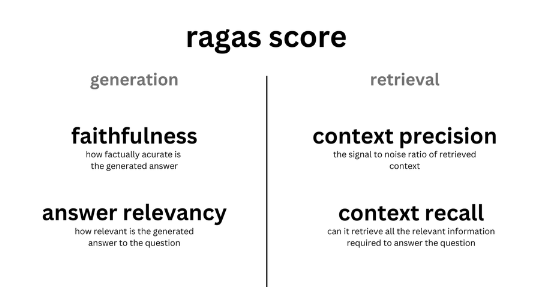

# 自然语言处理: 第十七章RAG的评估技术RAGAS

论文地址：[[2309.15217] RAGAS: Automated Evaluation of Retrieval Augmented Generation (arxiv.org)](https://arxiv.org/abs/2309.15217)

项目地址: [explodinggradients/ragas: Evaluation framework for your Retrieval Augmented Generation (RAG) pipelines (github.com)](https://github.com/explodinggradients/ragas)

上一篇文章主要介绍了[RAG的优化技术](https://blog.csdn.net/victor_manches/article/details/136720188?spm=1001.2014.3001.5501)，感兴趣的可以回顾下，本篇文章主要是介绍RAG技术的主流评估方法。

<br />

<br />

## 应用原理



RAG 系统性能评估的多个框架，都包含了几项独立的指标，例如总体答案相关性、答案基础性、忠实度和检索到的上下文相关性。例如本章主要介绍的的RAGAS 使用[真实性](https://link.zhihu.com/?target=https%3A//docs.ragas.io/en/latest/concepts/metrics/faithfulness.html)和[答案相关性](https://link.zhihu.com/?target=https%3A//docs.ragas.io/en/latest/concepts/metrics/answer_relevance.html)来评价生成答案的质量，并使用经典的上下文[精准度](https://link.zhihu.com/?target=https%3A//docs.ragas.io/en/latest/concepts/metrics/context_precision.html)和[召回率](https://link.zhihu.com/?target=https%3A//docs.ragas.io/en/latest/concepts/metrics/context_recall.html)来评估 RAG 方案的检索性能,上述指标共同构成了RAGAs评分，用于全面评估RAG pipeline性能。出了上述四个指标，最核心的RAG的两个指标还是关于生成的答案的，所以RAG同样也提供了最下面两个评估指指标

* [Faithfulness(忠诚度)](https://docs.ragas.io/en/stable/concepts/metrics/faithfulness.html) - generation: 衡量生成答案与给定上下文中的事实的一致性，越接近1越好。**如果答案(answer)中提出的所有基本事实(claims)都可以从给定的上下文(context)中推断出来，则生成的答案被认为是忠实的** 。为了计算这一点，首先从生成的答案中识别一组claims。然后，将这些claims中的每一项与给定的context进行交叉检查，以确定是否可以从给定的context中推断出它。忠实度分数由以下公式得出：

  
* [Answer Relevancy(回答相关性)](https://docs.ragas.io/en/stable/concepts/metrics/semantic_similarity.html)- generation:衡量生成的提示答案与问题的相关性，越接近1越好。

  当答案直接且适当地解决原始问题时，该答案被视为相关。重要的是，我们对答案相关性的评估不考虑真实情况，而是对答案缺乏完整性或包含冗余细节的情况进行惩罚。为了计算这个分数，LLM会被提示多次为生成的答案生成适当的问题，并测量这些生成的问题与原始问题之间的平均余弦相似度。基本思想是，如果生成的答案准确地解决了最初的问题，LLM应该能够从答案中生成与原始问题相符的问题。
* [Context Precision(内容准确性](https://docs.ragas.io/en/stable/concepts/metrics/context_precision.html)) - retrieval: 衡量检索的上下文内容与标准答案的相关性，理想情况下，所有相关文档块(chunks)必须出现在顶层。该指标使用question和计算contexts。

  
* [Context recall(召回内容)](https://docs.ragas.io/en/stable/concepts/metrics/context_recall.html)- retrieval : 使用带注释的答案作为基本真理来衡量检索到的上下文的内容，衡量检索到的上下文(Context)与人类提供的真实答案(ground truth)的一致程度，它是根据ground truth和检索到的Context计算出来的。为了根据真实答案(ground truth)估算上下文召回率(Context recall)，分析真实答案中的每个句子以确定它是否可以归因于检索到的Context。 在理想情况下，真实答案中的所有句子都应归因于检索到的Context。

  
* [Answer semantic similarity(回答语义相似度)](https://docs.ragas.io/en/stable/concepts/metrics/semantic_similarity.html): 评估生成的答案和标准答案的语义相似度，越接近1越好。
* [Answer correctness(回答准确性)](https://docs.ragas.io/en/stable/concepts/metrics/answer_correctness.html)，评估生成答案和标准答案的准确性，越接近1越好。

(上述6个index 值都是【0，1】之间)

<br />

<br />

RAGAs的评估流程在文中有比较详细的描述，在此只摘抄关键字。

* **开始** ：启动准备和设置RAG应用的过程。
* **数据准备** ：加载和分块处理文档。
* **设置向量数据库** ：生成向量嵌入并存储在向量数据库中。
* **设置检索器组件** ：基于向量数据库设置检索器。
* **组合RAG管道** ：结合检索器、提示模板和LLM组成RAG管道。
* **准备评估数据** ：准备问题和对应的真实答案。
* **构建数据集** ：通过推理准备数据并构建用于评估的数据集。
* **评估RAG应用** ：导入评估指标并对RAG应用进行评估。
* **结束** ：完成评估过程。

整个流程如下图所示


<br />

<br />

除了RAGAS ，还有一个简单有效的检索器评估管道的例子可以在[这里](https://link.zhihu.com/?target=https%3A//github.com/run-llama/finetune-embedding/blob/main/evaluate.ipynb)找到，它已被应用于编码器的微调部分。一个更高级的方法不仅考虑 **命中率** ，还包括了常用的搜索引擎评估指标 **平均倒数排名 (Mean Reciprocal Rank)** ，以及生成答案的质量指标，如真实性和相关性，这在 OpenAI 的[实用指南](https://link.zhihu.com/?target=https%3A//github.com/openai/openai-cookbook/blob/main/examples/evaluation/Evaluate_RAG_with_LlamaIndex.ipynb)中有所展示。LangChain 提供了一个颇为先进的评估框架 [LangSmith](https://link.zhihu.com/?target=https%3A//docs.smith.langchain.com/)。在这个框架中，你不仅可以实现自定义的评估器，还能监控 RAG 管道内的运行，进而增强系统的透明度。

如果你正在使用 LlamaIndex 进行构建，可以尝试 [rag_evaluator llama pack](https://link.zhihu.com/?target=https%3A//github.com/run-llama/llama-hub/tree/dac193254456df699b4c73dd98cdbab3d1dc89b0/llama_hub/llama_packs/rag_evaluator)

## 快速入门

### 安装

`!pip install ragas`

或者源码安装

```
!git clone https://github.com/explodinggradients/ragas && cd ragas
!pip install -e .
```

<br />

<br />

### 快速评估

```

from datasets import Dataset 
import os
from ragas import evaluate
from ragas.metrics import faithfulness, answer_correctness

os.environ["OPENAI_API_KEY"] = "your-openai-key"

data_samples = {
    'question': ['When was the first super bowl?', 'Who won the most super bowls?'],
    'answer': ['The first superbowl was held on Jan 15, 1967', 'The most super bowls have been won by The New England Patriots'],
    'contexts' : [['The First AFL–NFL World Championship Game was an American football game played on January 15, 1967, at the Los Angeles Memorial Coliseum in Los Angeles,'], 
    ['The Green Bay Packers...Green Bay, Wisconsin.','The Packers compete...Football Conference']],
    'ground_truth': ['The first superbowl was held on January 15, 1967', 'The New England Patriots have won the Super Bowl a record six times']
}

dataset = Dataset.from_dict(data_samples)

score = evaluate(dataset,metrics=[faithfulness,answer_correctness])
score.to_pandas()
```

参考资料:

[学习检索增强生成(RAG)技术，看这篇就够了——热门RAG文章摘译(9篇) - 知乎 (zhihu.com)](https://zhuanlan.zhihu.com/p/673392898)

[高级RAG(四)：Ragas评估 - 知乎 (zhihu.com)](https://zhuanlan.zhihu.com/p/675777378)
