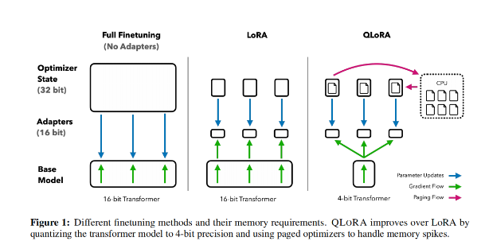

# 自然语言处理: 第十八章微调技术之QLoRA

文章地址: [QLoRA: Efficient Finetuning of Quantized LLMs (arxiv.org)](https://arxiv.org/abs/2305.14314)

项目地址: [artidoro/qlora: QLoRA: Efficient Finetuning of Quantized LLMs (github.com)](https://github.com/artidoro/qlora)

## 前言

QLoRA是来自华盛顿大学的Tim Dettmers大神提出的模型量化算法，应用于LLM训练，降低显存需求，其足以在单个48GB显存的GPU上对LLAMA 65B进行微调，同时能保持16位全量微调的效果。其核心是在LoRA的基础上作出优化,优化的内容主要包括以下3点:

    1. 新定义了一种4位标准浮点数NF4(Normal Float4）的最优数据类型

    2. 双重量化，对普通参数和量化常数分别量化，进一步减少缓存占用

    3. 分页优化器(page optimizer)，在显存过高时以部分内存替代显存

 

 

## 一.原理

 

上图分别展示了Fine-tuning ，LoRA和QLoRA的区别，其中LoRA原理可以参考我之前的文章,[自然语言处理: 第十二章LoRA解读_lora自然英语处理-CSDN博客](https://blog.csdn.net/victor_manches/article/details/132287864?spm=1001.2014.3001.5502) 而QLoRA的核心主要是在LoRA的基础上做了3点改进分别是:NF4浮点数量化，双重量化以及分页优化器，下面我就会分别来介绍他们三个的核心原理。

 

#### 1 4-bit NormalFloat Quantization(NF4 量化)

NormalFloat (简称NF)是一种数据类型，它是建立在 Quantile quantization（后译为分位数量化）基础上的，它是一种信息论上最优的数据类型，可以确保每个量化区间从输入张量中分配相同数量的值。分位数量化通过经验累积分布函数估计输入张量的分位数来工作。分位数量化的主要局限性在于分位数估计的这个过程会比较费力。

在神经网络中，预训练的权重通常具有零中心的正态分布，标准差为σ。通过缩放σ，可以使得分布恰好适应NF的范围。对于NF，作者设置了一个任意的范围[-1, 1]。因此，数据类型和神经网络权重的分位数都需要被归一化到这个范围。

对于范围在[-1, 1]内的零均值正态分布，他们计算了信息理论上最优的数据类型。这个过程包括：(1) 估计理论N(0, 1)分布的 2k+ 1 个分位数，得到一个k位的分位数量化数据类型；(2) 将这个NF的值归一化到[-1, 1]范围；(3) 通过绝对最大值重标定，将输入权重张量归一化到[-1, 1]范围，然后进行量化。一旦模型权重范围和NF范围匹配，就可以像通常那样进行量化。这个过程等价于重新缩放权重张量的标准差，使其匹配k位数据类型的标准差。更具体的来看这个公式，展示了 2k到分位数的映射公式：

 

 

#### 2 Double Quantization(双重量化)

简而言之就是对量化常量进行了量化，以达到进一步内存节约。在精确的4位量化中，需要较小的块大小，但这也会带来相当大的内存开销。例如，当使用 32bit 的常量并且 blocksize 是 64 的时候，那么对于每个参数会增加 0.5 bit，但是如果对这一组量化常量再次进行量化，那么可以进一步缩减空间花费。

假设有 64 * 256 个参数，那么将他们量化的过程，blocksize 在等于 64 的情况下，会花费256 个 32 bit 量化常量，这里为单层量化。那这 256 个 32bit 数据也挺花费空间的，对这 256 个数据进行进一步的量化，使用 blocksize 为 256，在花费掉一个32bit 量化常量的情况下，可以将这 256 个 量化为 256 个 了，这一步为二次量化。手写稿中最后两行表达的意思就是，将 64∗256 个参 *数* ，进行一层量化的话，过程中消耗的空间为 32∗256 的空间，进行二次量化的话，过程中会消耗掉 8∗256+32的空间，所以二次量化做到了 0.127 bit per parameter，比一次量化进一步节约了 0.373 bit per parameter. 0.373=32/64−(8/64+32/64/256) 。

 

 

#### 3 Page Optimizer(分页优化器)

分页优化器则是利用[NVIDIA统一内存的](https://docs.nvidia.com/cuda/cuda-c-programming-guide/)功能，在 GPU 偶尔因内存不足(OOM)而出现情况时，将保存的部分梯度检查点转移到CPU内存上，而在优化器更新阶段需要内存时则将其分页回到 GPU 内存中，实现 CPU 和 GPU 之间的自动页面传输，确保 GPU 处理过程无误。该功能类似于 CPU RAM 和磁盘之间的常规内存分页操作。

最后，QLoRA将量化的思想和LoRA的低秩适配器的思想结合从而实现微调。

 

 

 

## 二. 实验结果

基于以上三点优化QLoRA取得了非常不错的成绩，作者提出了的QLoRA可以在一个消费级的48GB的显卡上去媲美一个16bit的全量微调的效果，而这个正常来说是需要780GB显存才能全量微调的。而且作者发现，他们基于QLoRA对OASST1微调出来的Guanaco家族大模型性能如下表，他们在单个消费级别的显卡训练不到12小时在Vicuna基准上可以达到ChatGPT 97.8%的性能水平，如果训练时间达到24小时后，其最大的Guanaco模型可以达到99.3%，并且最小的Guanaco模型仅需要5GB显存。

