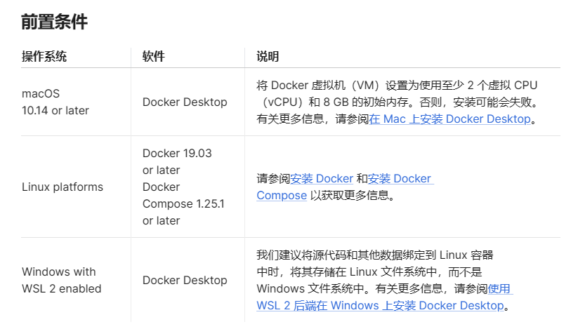

# 自然语言处理: 第二十章Dify本地部署

项目地址: [dify](https://github.com/langgenius/dify?tab=readme-ov-file)

## a. 理论基础

Dify 是一个 LLM 应用开发平台，已经有超过 10 万个应用基于 Dify.AI 构建。它融合了 Backend as Service 和 LLMOps 的理念，涵盖了构建生成式 AI 原生应用所需的核心技术栈，包括一个内置 RAG 引擎。使用 Dify，你可以基于任何模型自部署类似 Assistants API 和 GPTs 的能力。

<br />

本地成功部署后，就可以在此基础上配置自己专属的RAG 和 agent了。


## b. 本地部署

建议使用linux或者macos系统，windows系统部署下，有的功能会有bug，问了作者也暂时无法解决。

<br />

### 一.前置条件



### 二. 安装postgre, redis , nodejs & redis , docker , qdrant(向量数据库)

#### 1. 安装postgresql

可以直接参考这一篇文章: [安装postgresql](https://www.jb51.net/article/122902.htm)  , 按照里面的命令创建超级用户 / 设置root 密码 / 创建一个dify的数据库就可以了。

```
# PostgreSQL database configuration
DB_USERNAME=postgres
DB_PASSWORD=difyai123456
DB_HOST=localhost
DB_PORT=5432
DB_DATABASE=dify
```

<br />

<br />

#### 2. 安装redis

可以直接参考这一篇文章: [安装redis](https://blog.51cto.com/u_16175518/8554439)  , 这里按照里面的步骤修改密码就可以了，其他都可以不用设置。

```
# redis configuration
REDIS_HOST=localhost
REDIS_PORT=6379
REDIS_USERNAME=
REDIS_PASSWORD=difyai123456
REDIS_DB=0
```

<br />

<br />

#### 3. 安装nodejs & npm

可以直接参考这一篇文章: [安装nodejs &amp; npm](https://developer.aliyun.com/article/760687#:~:text=%E5%A6%82%E4%BD%95%E5%9C%A8%20Ubuntu%2020.04%20%E4%B8%8A%E5%AE%89%E8%A3%85%20Node.js%20%E5%92%8C%20npm%201,%E8%BF%99%E4%B8%AA%E5%B7%A5%E5%85%B7%E5%85%81%E8%AE%B8%E4%BD%A0%E5%9C%A8%E5%90%8C%E4%B8%80%E5%8F%B0%E6%9C%BA%E5%99%A8%E4%B8%8A%E5%AE%89%E8%A3%85%E5%A4%9A%E4%B8%AA%20Node.js%20%E7%89%88%E6%9C%AC%E3%80%82%20%E5%A6%82%E6%9E%9C%E4%BD%A0%E6%98%AF%20Node.js%20%E5%BC%80%E5%8F%91%E8%80%85%EF%BC%8C%E8%BF%99%E5%8F%AF%E8%83%BD%E6%98%AF%E4%BD%A0%E6%9C%80%E5%96%9C%E6%AC%A2%E7%9A%84%E5%AE%89%E8%A3%85%20Node.js%20%E7%9A%84%E6%96%B9%E5%BC%8F%E3%80%82)  ,  这里笔者试过如果直接安装的话大概率是低于18版本的，所以需要如介绍的需要下载并重新执行nodesource.curl -sL

`https://deb.nodesource.com/setup_18.x | sudo -E bash -`

**在安装完之后还需要设置以下npm的国内镜像，否则会很慢， 具体npm换新原可以参考[npm换源](https://blog.csdn.net/scand123/article/details/132981443)**

`npm config set registry https://registry.npm.taobao.org`

<br />

<br />

#### 4. 安装docker

在安装向量数据库之前，需要安装[docker](https://zhuanlan.zhihu.com/p/651148141) 。[Docker 安装 (完整详细版)_docker安装-CSDN博客](https://blog.csdn.net/BThinker/article/details/123358697) 按照说明文档安装完成之后运行，检测是否安装成功

```text
sudo docker run hello-world
```

<br />

<br />

#### 5. 安装向量数据库qdrant(推荐)

dify支持weaviate, qdrant, milvus 三个数据库，这里介绍了qdrant，weaviate有点其他问题。 qdrant 可以直接从[docker安装](https://learnku.com/docs/uniqchat/qdrant-xiang-liang-shu-ju-ku-an-zhuang-pei-zhi/15296)，简单。

`sudo docker run -d -p 6333:6333 qdrant/qdrant`

安装完成之后会执行上面代码启动qdrant服务，可以得到一串api字符，在api/.env环境中输入如下 , 还需要把VECTOR_STORE相对应的改称对应的数据库：

```
# Vector database configuration, support: weaviate, qdrant, milvus
VECTOR_STORE=qdrant


# Qdrant configuration, use `http://localhost:6333` for local mode or `https://your-qdrant-cluster-url.qdrant.io` for remote mode
QDRANT_URL=http://localhost:6333
QDRANT_API_KEY= xxxxxxxxxxxxxxxxxxxxxxxxxxxxxxxxxxxxxxxxxxxxxxxxxxxxxxxxxxxx
QDRANT_CLIENT_TIMEOUT=20
```

**当然也可以直接启动[qdrant](https://cloud.qdrant.io/login)云服务，这个需要从qdrant官网里找到apikeys 和 自己账号专属的url , 再修改对应的配置文件**

<br />

<br />

### 三. 安装环境

在安装完上面的数据后，就按照[dfiy给的官方文档](https://docs.dify.ai/v/zh-hans/getting-started/install-self-hosted/local-source-code)配置就可以了。这里说几个可能遇到的坑。

#### 1 .  .env文件配置

**有几个地方如果不感肯定的话建议，按照默认文件里的去修改redis / postgresql  配置， 比如名称/ 密码 / 用户名等**

#### 2.  [openai] Error: ffmpeg is not installed

没有装ffmpeg的话，安装以下bash指令就可以安装

`$ sudo apt-get update`

`$ sudo apt-get install ffmpeg`

#### 3. 其他本地部署问题

可以参考官方文档，几个常见的本地[部署问题](https://docs.dify.ai/v/zh-hans/learn-more/faq/install-faq).

<br />

<br />

<br />

<br />

## c. Docker部署

docker启动是最快速的方法，也是官方推荐的方法，如果不需要修改源码的话，在安装完docker后使用下面命令安装，安装docker可以参考[Docker 安装 (完整详细版)_docker安装-CSDN博客](https://blog.csdn.net/BThinker/article/details/123358697)

```
cd docker
docker compose up -d
```
