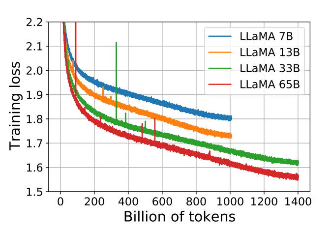

# 自然语言处理: 第二十一章大模型基底之llama1

文章地址: [LLaMA:OpenandEfficient Foundation Language Models](https://arxiv.org/pdf/2302.13971.pdf)

项目地址: [meta-llama/llama: Inference code for Llama models (github.com)](https://github.com/meta-llama/llama)

## 前言

LLaMA可以说是目前开源届最强的基底模型之一，有无数的商用版本是将其作为基底模型来做后续扩展或者说商用的，截至到24年3月目前META已经推出了LLaMA1 & LLaMA2 两个版本，接下来两期我会分别介绍这两个大基底模型之间的两点以及意义。 本文关注LLaMA1的技术亮点，其推出了4个不同参数大小的模型分别是: 7B , 13B , 33B & 65B。在大部分的任务上，LLaMA-13B强于GPT-3(175B)。LLaMA-65B的性能，可以和最好的LM相媲美，如Chinchilla-70B 和 PaLM-540B。**其性能的亮点充分的证明了高质量数据的重要性，而不是一股脑的叠加网络深度。**

<br />

<br />

## 技术原理

在LLaMA1之前，大厂们的主要方向还是去堆积网络深度和层数，但是却给我们指引了另外一个方向。 LLaMA给我们灌输的核心理念:  **在给定的计算预算下，最佳性能并不是由最大的模型实现的，而是由更多数据训练的较小模型实现的** 。Hoffmann等人的scalling law的目标是确定在特定的训练计算预算下，如何最佳地缩放数据集和模型大小。然而，这个目标忽视了推理预算，在大规模提供语言模型时变得至关重要。在这种情况下，考虑到目标性能水平， **首选模型不是训练速度最快的，而是推理速度最快的** 。虽然训练一个大型模型达到一定性能水平可能更便宜，但训练时间更长的较小模型在推理阶段最终会更经济。例如，虽然Hoffmann等人建议在 200B 标记上训练 10B 模型，但 Meta 发现 7B 模型的性能在 1T token 后仍在持续提高。

重点是训练一系列语言模型，以在各种推理预算下实现最佳性能，通过使用更多 token 进行训练，而不是通常使用的数量。LLaMA目标在于，**通过在超大规模的数据上训练，给出一系列可能最好 performance 的 LLM。**

<br />

<br />

### 1. 训练方法

#### 1.1 Pre-training data(预训练数据)

    

<center> 图1. LLaMA1预训练数据分布 </center>

如图1所示 LLaMa 预训练数据大约包含 1.4T tokens，对于绝大部分的训练数据，在训练期间模型只见到过1次，Wikipedia 和 Books 这两个数据集见过2次。可以看到其数据类型还是比较全面且高质量的，涵盖了不同领域

* **English CommonCrawl [67%]** ：对五个 CommonCrawl 数据集进行预处理，时间跨度从2017年到2020年，使用 CCNet 流水线。该过程在行级别进行数据去重，使用 fastText 线性分类器进行语言识别，以删除非英语页面，并使用 n-gram 语言模型过滤低质量内容。此外，还训练了一个线性模型，用于将页面分类为 Wikipedia 中的引用页面与随机抽样页面，并丢弃未被分类为引用的页面。
* **C4 [15%]** 。C4的预处理还包括去重和语言识别步骤：与 CCNet 的主要区别在于质量过滤，这主要依赖于标点符号的存在或网页中的词语和句子数量等启发式方法。
* **Github [4.5%]** 。使用 Google BigQuery 上可用的公共 GitHub 数据集。只保留了在 Apache、BSD 和 MIT 许可下发布的项目。此外，使用基于行长度或字母数字字符比例的启发式方法过滤低质量文件，并使用正则表达式删除了诸如头文件之类的样板文件。最后，对生成的数据集进行了文件级别的去重，使用完全匹配的方法
* **Wikipedia [4.5%]** 。添加了截至2022年6月至8月的 Wikipedia 数据，涵盖20种语言。处理数据以去除超链接、评论和其他格式样板。
* **Gutenberg and Books3 [4.5%]** 。添加了两个书的数据集，分别是 Gutenberg 以及 ThePile (训练 LLM 的常用公开数据集) 中的 Book3 部分。处理数据时执行重复数据删除，删除内容重叠超过 90% 的书籍。
* **ArXiv [2.5%]** 。处理了arXiv Latex文件，以添加科学数据到数据集中。移除了第一节之前的所有内容，以及参考文献。还移除了.tex文件中的注释，并且内联展开了用户编写的定义和宏，以增加论文之间的一致性。
* **Stack Exchange [2%]** 。作者添加了 Stack Exchange，这是一个涵盖各种领域的高质量问题和答案网站，范围从计算机科学到化学。作者从 28 个最大的网站保留数据，从文本中删除 HTML 标签并按分数对答案进行排序

<br />

<br />

#### 1.2 tokenizer(分词器)

使用byte pair encoding (BPE) 算法，使用的是Sentence-Piece的实现。所有数字被拆分为单独的digit，所有未知的UTF-8 字符，回退到字节来进行分解。因此，LLaMA 可以通过byte 的方式，构造出很多不在 vocab 中的字符，从而也具有较好的多语言能力。

<br />


#### 1.3 optimizer(优化器)

模型使用AdamW优化器进行训练，超参数 β1=0.9 、 β2=0.95 、权重衰减为0.1、梯度裁剪为1.0；使用余弦学习率表调度学习率，这样最终的学习率等于最大学习率的10%；使用2000个warmup step，并根据模型的大小而改变学习率和batch size大小如图2。


<br />


### 2. architecture(模型结构)

模型基于原始transformer架构，但做出一些改动,[括号中的是具体灵感方向]：

* Pre-normalization 预归一化[GPT3]
* SwiGLU 激活函数 [PaLM]
* Rotary Embeddings 旋转位置[GPTNeo]

下面就让我分别介绍下这三个改进点: 


<br />


#### 2.1 Pre-normalization 预归一化

为了提高训练的稳定性，对每个transformer层的**输入**进行归一化，而不是输出进行归一化。

同时，使用 RMS Norm (Root Mean Square layer normalization) ，与layernorm RMS Norm的主要区别在于去掉了*减去均值的部分*，RMS Norm 的作者认为这种模式在简化了Layer Norm 的计算，可以在减少约 7%∼64% 的计算时间, 其公式如下: 


代码实现如下：

```
class LlamaRMSNorm(nn.Module):
    def __init__(self, hidden_size, eps=1e-6):
        """
        LlamaRMSNorm is equivalent to T5LayerNorm
        """
        super().__init__()
        self.weight = nn.Parameter(torch.ones(hidden_size))
        self.variance_epsilon = eps

    def forward(self, hidden_states):
        input_dtype = hidden_states.dtype
        variance = hidden_states.to(torch.float32).pow(2).mean(-1, keepdim=True)
        hidden_states = hidden_states * torch.rsqrt(variance + self.variance_epsilon)

        return (self.weight * hidden_states).to(input_dtype)
```

<br />


#### 2.2 SwiGLU 激活函数


LLaMa 使用 SwiGLU 激活函数替换 ReLU 以提高性能，维度从

    变为    . **SwiGLU** 是2019年提出的新的激活函数，它结合了 **SWISH** 和 **GLU** 两种者的特点。SwiGLU 主要是为了提升T**ransformer** 中的 FFN(feed-forward network) 层的实现,其公式如下图：


其代码实现如下:

```
class LlamaMLP(nn.Module):
    def __init__(
        self,
        hidden_size: int,
        intermediate_size: int,
        hidden_act: str,
    ):
        super().__init__()
        self.gate_proj = nn.Linear(hidden_size, intermediate_size, bias=False)
        self.down_proj = nn.Linear(intermediate_size, hidden_size, bias=False)
        self.up_proj = nn.Linear(hidden_size, intermediate_size, bias=False)
        # config 中 hidden_act = 'silu'
        # 'silu' 和 'swish' 对应的激活函数均为：SiLUActivation 
        # https://github.com/huggingface/transformers/blob/717dadc6f36be9f50abc66adfd918f9b0e6e3502/src/transformers/activations.py#L229
        self.act_fn = ACT2FN[hidden_act]

    def forward(self, x):
        # 对应上述公式的 SwiGLU
        return self.down_proj(self.act_fn(self.gate_proj(x)) * self.up_proj(x))
```


#### 2.3 Rotary Embeddings 旋转位置 

[RoPE旋转位置编码](https://arxiv.org/pdf/2104.09864.pdf) 提出的一种能够将相对位置信息依赖集成到 self-attention 中并提升 transformer 架构性能的位置编码方式。而目前很火的 LLaMA、GLM 模型也是采用该位置编码方式。其核心思想是“通过绝对位置编码的方式实现相对位置编码”，可以说是具备了绝对位置编码的方便性，同时可以表示不同 token 之间的相对位置关系。不同于原始 Transformers 论文中，将 pos embedding 和 token embedding 进行相加，RoPE 是将位置编码和 query （或者 key） 进行相乘。(**这里我暂时也还没看完全明白所以待后续更新**) ， 相关代码: 

```
# 代码增加了注释，可以看到和原始公式的对应关系。
class LlamaRotaryEmbedding(torch.nn.Module):
    def __init__(self, dim, max_position_embeddings=2048, base=10000, device=None):
        super().__init__()
        # 此处 inv_freq 对应公式中的 theta
        inv_freq = 1.0 / (base ** (torch.arange(0, dim, 2).float().to(device) / dim))
        self.register_buffer("inv_freq", inv_freq)

        self.max_seq_len_cached = max_position_embeddings
        t = torch.arange(self.max_seq_len_cached, device=self.inv_freq.device, dtype=self.inv_freq.dtype)
        # 此处 freqs 对应公式中的 m * theta, t 对应公式中的 m，表示位置
        freqs = torch.einsum("i,j->ij", t, self.inv_freq)
        # Different from paper, but it uses a different permutation in order to obtain the same calculation
        # 此处和原始公式不同，theta_0 和 theta_0 不再相邻
        # 而是分在向量的前半部分和后半部分
        emb = torch.cat((freqs, freqs), dim=-1)
        dtype = torch.get_default_dtype()
        self.register_buffer("cos_cached", emb.cos()[None, None, :, :].to(dtype), persistent=False)
        self.register_buffer("sin_cached", emb.sin()[None, None, :, :].to(dtype), persistent=False)

    def forward(self, x, seq_len=None):
        # x: [bs, num_attention_heads, seq_len, head_size]
        if seq_len > self.max_seq_len_cached:
            self.max_seq_len_cached = seq_len
            t = torch.arange(self.max_seq_len_cached, device=x.device, dtype=self.inv_freq.dtype)
            freqs = torch.einsum("i,j->ij", t, self.inv_freq)
            # Different from paper, but it uses a different permutation in order to obtain the same calculation
            emb = torch.cat((freqs, freqs), dim=-1).to(x.device)
            self.register_buffer("cos_cached", emb.cos()[None, None, :, :].to(x.dtype), persistent=False)
            self.register_buffer("sin_cached", emb.sin()[None, None, :, :].to(x.dtype), persistent=False)
        # 大部分情况下，直接从这里返回
        return (
            self.cos_cached[:, :, :seq_len, ...].to(dtype=x.dtype),
            self.sin_cached[:, :, :seq_len, ...].to(dtype=x.dtype),
        )


def rotate_half(x):
    """Rotates half the hidden dims of the input."""
    # 此次和原始推导中不同，正负号不是间隔的，而是分前半部分和后半部分。但对于结果没有影响
    x1 = x[..., : x.shape[-1] // 2]
    x2 = x[..., x.shape[-1] // 2 :]
    return torch.cat((-x2, x1), dim=-1)


def apply_rotary_pos_emb(q, k, cos, sin, position_ids):
    # The first two dimensions of cos and sin are always 1, so we can `squeeze` them.
    cos = cos.squeeze(1).squeeze(0)  # [seq_len, dim]
    sin = sin.squeeze(1).squeeze(0)  # [seq_len, dim]
    cos = cos[position_ids].unsqueeze(1)  # [bs, 1, seq_len, dim]
    sin = sin[position_ids].unsqueeze(1)  # [bs, 1, seq_len, dim]
    # 对应上图中 RoPE 的简化计算
    q_embed = (q * cos) + (rotate_half(q) * sin)
    k_embed = (k * cos) + (rotate_half(k) * sin)
    return q_embed, k_embed
```

<br />

如果深入对RoPE感兴趣，可以参考[十分钟读懂旋转编码（RoPE） - 知乎 (zhihu.com)](https://zhuanlan.zhihu.com/p/647109286)

<br />


<br />


### 3. 高效实现


* LLaMa 采用了高效的 causal multi-head attention (基于 xformers)，不存储注意力权重，且不计算 mask 掉的 query 和 key 的值。
* 为了进一步提高训练效率，LLaMa 通过 checkpointing 技术来减少在反向传播过程中需要重新计算的激活数量。更具体地说，保存了计算代价较高的激活，例如线性层的输出。这是通过手动实现 Transformer 层的反向函数来实现的，而不是依赖于 PyTorch 的自动微分功能。
* 为了充分利用这种优化，LLaMa 需要通过使用模型和序列并行性来减少模型的内存使用。
* LLaMa 还尽可能多地在激活计算和 GPU 之间的通信之间进行重叠（由于all_reduce操作），以提高效率。

在训练一个包含 65B 参数的模型时，LLaMa 的代码在具有 80G B内存的 2048 个 A100 GPU 上每秒处理约 380个 token。这意味着在包含 1.4万亿 token 的数据集上进行训练大约需要21天。


<br />


<br />


## 实验结果

### 1. 训练结果



<center> 图3.LLaMA 不同参数模型的训练损失 </center>

作者对33B和65B训练了1.4T数据，而7B和13B只训练了1T数据，可以发现随着token的增大，训练的损失在不断的降低，而且随着参数量增大，损失也在不断的降低。


### 2. 性能

在之前的研究的基础上，作者考虑了 zero-shot 和 few-shot，并在总共20个基准上报告了结果，并且对比了包括 GPT-3、Gopher、Chinchilla 和 PaLM，以及开源的 OPT 模型、GPT-J 和 GPT-Neo等模型效果。

下图是在常识推理上的实验结果，可以发现在同等参数模型下，LLAMA明显是性能最好的：


<br />


<br />


## 总结


总结一下 LLaMa 的技术要点：

* 模型结构：主体结构依然是transformer的([decoder-only](https://blog.csdn.net/victor_manches/article/details/132197681?spm=1001.2014.3001.5502))，不同之处在于位置编码使用了 **旋转编码(RoPE)** ，归一化使用了  **RMSNorm** ，激活函数使用了  **SwiGLU**  。
* 训练优化：选择了**小 LLM配大数据**的思路，预训练使用了 **1.4T** 的 token，经过了充分的训练。

整体上看似乎并没有特别大的亮点，但是简单实用，个人觉得LLaMA给大家明确了之后对高质量数据的追求，而不是一位的叠加网络深度。


<br />


<br />


**参考文献:**

[LLaMa-1 技术详解 (zhihu.com)](https://www.zhihu.com/tardis/zm/art/648774481?source_id=1005)

[LLaMA 超详细解读（paper &amp; code） - 知乎 (zhihu.com)](https://zhuanlan.zhihu.com/p/632102048)

[十分钟读懂旋转编码（RoPE） - 知乎 (zhihu.com)](https://zhuanlan.zhihu.com/p/647109286)

[RoPE旋转位置编码](https://arxiv.org/pdf/2104.09864.pdf)
