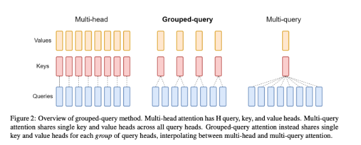
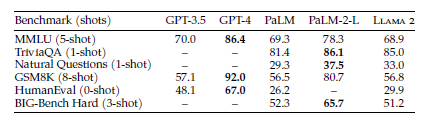

# 自然语言处理: 第二十一章大模型基底之llama2

文章地址: [LLaMA:OpenandEfficient Foundation Language Models](https://arxiv.org/pdf/2302.13971.pdf)

项目地址: [meta-llama/llama: Inference code for Llama models (github.com)](https://github.com/meta-llama/llama)

## 前言

在LLaMa1的基础之上有兴趣的可以看看我上一篇博客[自然语言处理: 第二十一章大模型基底之llama1](https://blog.csdn.net/victor_manches/article/details/137017314?spm=1001.2014.3001.5501)。Meta 又继续推出了LLaMa2， 其分别由3个不同大小的权重模型分别是:7B,13B以及70B的版本。但是Meta AI 在LLaMa1中实践得到的经验后继续用在了LLaMa2上，LLaMa2的网络结构如图1，整体如同LLaMa1也是decoder-only based的transformer结构，整体由32个block构成，可以看出其整体结构基本与LLaMa1相似，比如说：

    ● 在LLaMa1的基础上，继续增加了40%的预训练数据。主要是清理了一些隐私数据和知识增强从而提高数据质量

    ● 继续在每个block输入层中使用RMSNorm

    ● 继续使用RoPE位置编码


<center>


图1. LLaMa2网络结构`</center>`


## 一. 改进

### 改进1： Grouped-query attention

    

<center>图2. 自回归模型输出方式 </center>

介绍GQA之前，需要先给大家铺垫一下自回归模型的输出方式和KV cache的基本概念。如图2，是典型的decoder-only自回归模型的输出方式，所谓自回归模型就是利用自己输出的结果再作为输入再去输出(好像听着很拗口)。还是给大家举个例子吧: 我们用过LLaMa或者gpt这种自回归模型的时候都知道它输出好像都是一个一个字往外面蹦，并不是一次性生成了所有答案。这里其实就能看出其输出的机理，如下图，当我输入一二三四五给模型作为输入的时候，它第一次会多生成一个上字，然后再多输出的一个字的结果。重新作为输入继续给模型得到第二次输出山，依次类推。。。 直到模型得到 `<eos>` 这种特殊符号就会停止输出。

```
In  [1]: {prompt:"一二三四五，"}
Out [1]: 一二三四五，上

In  [2]: 一二三四五，上
Out [2]: 一二三四五，上山

In  [3]: 一二三四五，上山
Out [3]: 一二三四五，上山打

In  [4]: 一二三四五，上山打
Out [4]: 一二三四五，上山打老

In  [5]: 一二三四五，上山打老
Out [5]: 一二三四五，上山打老虎

In  [6]:  一二三四五，上山打老虎
Out [6]:  一二三四五，上山打老虎<eos>
 
```

重复上面的过程，我们就不难发现，虽然答案只生成了5个字却经过了6次循环，比如说最早的prompt就重复了6次相同的矩阵计算，所以没必要在对之前的token进行Attention计算，这样就能节省大部分算力，由此K V Cache便是来解决这个问题的：通过将每次计算的K和V缓存下来，之后新的序列进来时只需要从KV Cache中读取之前的KV值即可，就不需要再去重复计算之前的KV了。


<center>




图3.MHA & GQA & MQA 机理 `</center>`

但是种KV cache方法虽然理论上能行得通，[但是在实际应用中大量的数据缓存与硬件的通信能力有着极高的压力](https://mp.weixin.qq.com/s/_4OxoRLxhOcjGf0Q4Tvp2Q)。所以GQA(grouped-query attention) 算法便从软件方面进行优化了。如图3是三种自注意力机制的的对比，其中GQA是LLaMa2的机制，而MQA 是LLaMa1的计算机制。那么为什么会从原始的NHA 转换到MQA 再转到GQA呢？

原始的 MHA(Multi-Head Attention)，QKV 三部分有相同数量的头，且一一对应。每次做 Attention，head1 的 QKV 就做好自己运算就可以，输出时各个头加起来就行。而 MQA(Multi-query Attention) 则是，让 Q 仍然保持原来的头数，但 KV只有一个，相当于所有的 Q 头共享一组 K 和 V 头，所以叫做 Multi-Query 了。实验发现一般能提高 30%-40% 的计算性能，但是性能精度会有所降低。而GQA 通过分组一定头数共享一组KV，从而达到性能和计算中的一个trade-off，这样既不像MQA一样降低很多精度，也可以相比于NHA提高速度。


<br />


<br />


### 改进2：SiLu 激活函数

相比于SwiGLU函数，这里用了更加简单的SiLU函数(个人感觉应该是对比了SwiGLU性能差别不大）其公式如下:


<br />


<br />

## 二. 实验结果 

如表1所示，Llama 2 模型优于 Llama 1 模型。特别是，与 Llama 1 65B 相比，Llama 2 70B 在 MMLU 和 BBH上的结果分别提高了≈5和≈8个点。Llama 2 7B 和 30B 模型在除代码基准外的所有类别上都优于相应大小的 MPT模型。对于 Falcon 模型，Llama 2 7B 和 34B 在所有类别的基准上都优于 Falcon 7B 和 40B 模型。


<center>


表1. 与开源模型性能对比




<center>表2. 与闭源模型对比</center></center>

此外，Llama 2 70B 模型优于所有开源模型。 除了开源模型，Meta 还将 Llama 2 70B 的结果与闭源模型进行了比较。如表2所示，Llama 2 70B 在 MMLU 和 GSM8K 上接近 GPT-3.5（OpenAI，2023），但在编码基准上有显著差距。Llama 2 70B 的结果在几乎所有基准上都与 PaLM（540B）相当或更好。但是，Llama 2 70B 与 GPT-4 和 PaLM-2-L 之间仍然存在很大的性能差距。


## 总结：

> LLaMa系列是Meta公司开源的最强模型，尤其是llama2在推出的当时70B的模型基本吊打所有开源模型，荣登开源模型榜首的位置。两代llama2模型有着相同的地方，也有着许多改进点值得后续继续研究：
>
> 1. 高质量数据集的重要性(广而精)
> 2. RoPE提供了相对位置编码的解决方法
> 3. GQA 替代NHA以及MQA 从而达到性能与速度的trade-off
> 4. NMSNorm 以及 SiLu激活函数的改进
>
> LLaMA系列模型以其高质量、可扩展性和灵活性，在NLP领域取得了显著的进展。通过不断的技术创新和优化，LLaMA模型在各种任务上展现了卓越的性能，成为了大型语言模型研究和应用的重要里程碑。随着模型参数规模的不断扩大和训练技术的不断进步，LLaMA系列模型将继续在自然语言处理领域发挥重要作用。
