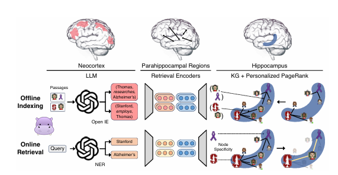
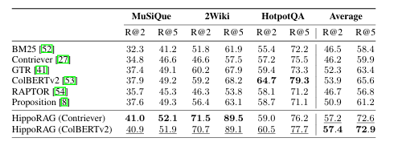
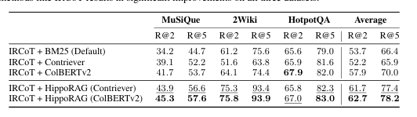
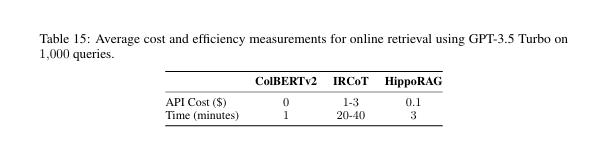

# 自然语言处理:第三十二章HippoRAG：受海马体启发的RAG

文章链接: [HippoRAG: Neurobiologically Inspired  Long-Term Memory for Large Language Models](https://arxiv.org/pdf/2405.14831)

项目地址: [OSU-NLP-Group/HippoRAG: HippoRAG is a novel RAG framework inspired by human long-term memory that enables LLMs to continuously integrate knowledge across external documents. (github.com)](https://github.com/OSU-NLP-Group/HippoRAG)

 

 

 

 

## 摘要

HippoRAG，这是一种由斯坦福大学联合发布的新颖的检索框架，灵感来源于人类长期记忆的海马索引理论。HippoRAG结合了大型语言模型（LLMs）、知识图谱和个性化PageRank算法，以模拟人类记忆中新皮层和海马的不同角色。通过这种方法，HippoRAG能够在新体验中更深入、更高效地整合知识。我们比较了HippoRAG与现有检索增强生成（RAG）方法在多跳问题回答上的性能，结果表明HippoRAG显著优于现有最先进方法，最高提升了20%。此外，HippoRAG的单步检索在成本和速度上都大大优于迭代检索方法(比如说IRCoT)，同时还能处理现有方法无法触及的新类型场景。

 

 

## 背景

哺乳动物大脑经过数百万年的进化，发展出了存储大量世界知识并在不断整合新体验的同时避免灾难性遗忘的能力。然而，尽管大型语言模型（LLMs）取得了令人印象深刻的成就，但它们在预训练后仍然难以有效地整合大量新体验。现有的RAG方法无法帮助LLMs执行跨段落边界整合新知识的任务，因为每个新段落都是孤立编码的。HippoRAG的设计灵感来源于海马记忆索引理论，该理论认为人类的强大上下文记忆依赖于新皮层和海马之间的交互。

HippoRAG的主要亮点包括：

- **单步多跳检索**：HippoRAG能够在单次检索中执行多跳推理，这是通过模仿大脑的关联记忆能力实现的，相较于现有RAG方法显著提高了性能， **最高可达20%** 。
- **效率和成本**：与迭代检索方法相比，HippoRAG在在线检索过程中成本更低，速度更快。HippoRAG的单步检索在成本上节 **省10-30倍** ，在速度上快 **6-13倍** ，并且与IRCoT结合使用可以带来进一步的显著增益。
- **处理新场景**：HippoRAG能够处理现有方法无法解决的新类型场景，这表明了其在知识整合方面的潜力。

 

 

## 核心算法

HippoRAG的核心算法包括以下几个关键步骤：

1. **离线索引(offline indexing)**：使用指令调整的大型语言模型（LLM）作为人工新皮层，通过开放信息提取（OpenIE）从检索语料库中的段落中提取知识图谱（KG）三元组。
   - 新皮层模拟：使用一个指令调整的大型语言模型（LLM），作为人工新皮层，通过开放信息提取（OpenIE）从文档集合中提取知识图谱（KG）三元组。这一过程被称为开放信息提取，它从文档中提取名词短语作为离散信号，而不是密集的向量表示，从而实现更细粒度的模式分离。
   - 知识图谱构建：构建的KG是无模式的（schemaless），允许更灵活的模式分离和新信息整合。
   - 海马索引构建：使用标准的检索编码器（retrieval encoders），这些编码器为KG中的相似但不完全相同的名词短语提供额外的边，帮助下游的模式完成。
2. **在线检索**：使用相同的三个组件执行在线检索，模拟人脑的记忆检索过程。LLM基础的新皮层从查询中提取一组显著的命名实体，这些命名实体与KG中的节点基于检索编码器确定的相似性相连。LLM新皮质从查询中提取命名实体，而海马旁回检索编码器将它们链接到我们的海马体索引。然后我们利用**个性化PageRank（PPR）算法**：利用PPR算法在KG上运行，使用查询概念作为种子，整合跨段落的信息进行检索。来实现基于上下文的检索，并提取最后的答案。
   * 查询处理：LLM基于新皮层从查询中提取一组显著的命名实体（query named entities），这些实体随后通过检索编码器与KG中的节点链接。
   * 模式完成：选定的查询节点成为部分线索，人工海马体执行模式完成，通过个性化PageRank（PPR）算法在KG上运行，使用查询概念作为种子，整合跨文档的信息进行检索。
   * 个性化PageRank（PPR）：PPR算法是一种PageRank的变体，它只通过一组用户定义的源节点（即查询节点）在图中分布概率。这使得PPR输出只偏向于查询节点集，模仿海马体从特定部分线索中提取相关信号。

 

 

 

## 结果

**单步检索性能。** HippoRAG在MuSiQue和2WikiMultiHopQA上的表现超过了所有基线，并且在挑战性较小的HotpotQA数据集上达到了可比的性能。

**在多跳问题回答（QA）**基准测试中，HippoRAG在MuSiQue和2WikiMultiHopQA数据集上的表现显著优于现有RAG方法，提升了大约3%到20%。此外，HippoRAG的在线检索过程比现有的迭代检索方法如IRCoT快6到13倍，同时成本降低了10到30倍。

**成本与速度评测**

 

 

 

## 总结

HippoRAG作为一种新型的RAG框架，通过模仿人类记忆中新皮层和海马的交互，提供了一种强大的长期记忆解决方案。它在多跳QA任务上展现出卓越的性能，特别是在单步多跳检索和处理新场景方面。尽管HippoRAG在某些方面仍有改进空间，但其目前的表现已经证明了它作为一种有前景的方法，能够推动大型语言模型在理解和整合知识方面的发展。
