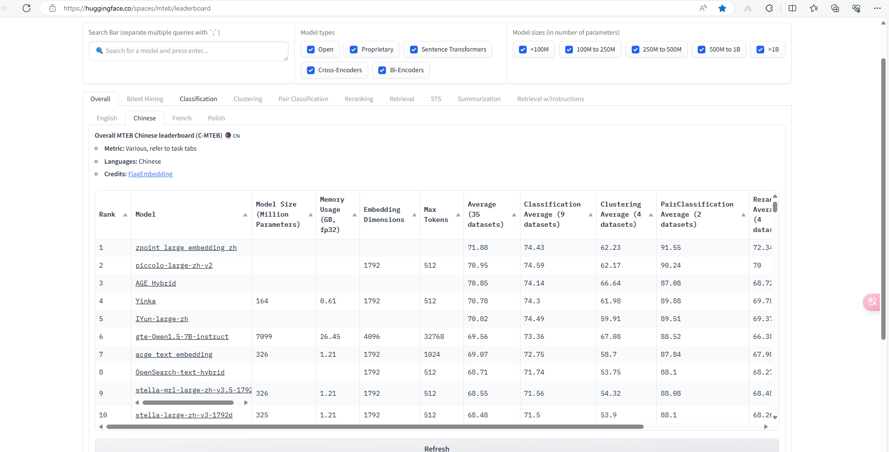

# 自然语言处理:第三十五章Embedding 测评榜单MTEB

文章链接: [[2210.07316] MTEB: Massive Text Embedding Benchmark (arxiv.org)](https://arxiv.org/abs/2210.07316)

项目地址: [mteb:MTEB: Massive Text Embedding Benchmark - GitCode](https://gitcode.com/embeddings-benchmark/mteb/overview?utm_source=csdn_github_accelerator&isLogin=1) 

github地址: [FlagEmbedding/C_MTEB at master · FlagOpen/FlagEmbedding (github.com)](https://github.com/FlagOpen/FlagEmbedding/tree/master/C_MTEB)

Hugging Face Leadboard: [MTEB Leaderboard - a Hugging Face Space by mteb](https://huggingface.co/spaces/mteb/leaderboard)

<br />

<br />

NLP的应用中，有一个最关键的步骤就是将文字/其他多模态的模型转换成词嵌入/向量化，而对应的这个模型便称之为Embedding模型。那么在这么多embedding模型里，如何评价好坏呢？本文就会介绍，[MTEB](https://github.com/embeddings-benchmark/mteb)(Massive Text Embedding Benchmark)是目前评测文本向量很重要的一个参考，其[榜单](https://huggingface.co/spaces/mteb/leaderboard)也是各大文本向量模型用来展示与其他向量模型强弱的一个竞技台。[C-MTEB](https://github.com/FlagOpen/FlagEmbedding/tree/master/C_MTEB)则是专门针对中文文本向量的评测基准。本文介绍了 Massive Text Embedding Benchmark (MTEB)，这是一个大规模的文本嵌入基准测试，旨在全面评估文本嵌入方法的性能。MTEB 覆盖了 8 种嵌入任务，包含 58 个数据集和 112 种语言。通过对 33 种模型的基准测试，MTEB 建立了迄今为止最全面的文本嵌入基准。研究发现，没有单一的文本嵌入方法能够在所有任务上都占据优势，这表明该领域尚未就通用文本嵌入方法达成共识，并且尚未将其扩展到足以在所有嵌入任务上提供最先进的结果。

<br />

<br />

<br />

## MTEB

### 背景

随着人工智能和自然语言处理技术的飞速发展，文本嵌入技术已成为推动这些领域进步的重要工具。文本嵌入是将文本转换为密集向量表示的过程，这些向量能够捕捉文本中的语义信息，并使得文本之间的相似性和差异性可以通过向量之间的距离来度量。这种技术已被广泛应用于各种NLP任务中，如文本分类、聚类、搜索、问答等。

然而，文本嵌入模型的评估一直是一个挑战。传统的评估方法通常基于有限的数据集和单一的任务，这无法全面反映模型在真实世界应用中的泛化能力。此外，随着新的文本嵌入模型不断涌现，如何公平地比较不同模型之间的性能也变得越来越困难。

为了解决这些问题，研究人员提出了各种基准测试，以更全面地评估文本嵌入技术的性能。然而，这些基准测试往往存在局限性，例如涵盖的任务和数据集数量有限，或者仅关注于特定的应用场景。因此，需要一个更加全面、更加广泛的基准测试来评估文本嵌入技术的性能。


<br />


<br />


<br />


### 任务

MTEB 包含以下 8 种任务类型：

1. **Bitext Mining** ：寻找两种语言句子集之间的最佳匹配。输入是来自两种不同语言的两个句子集，对于来自第一个句子集的句子，找到在第二个子集中最匹配的句子。模型将句子编码成向量后用余弦相似度来寻找最相似的句子对。F1是主要的评估指标、Accuracy、precision、recall也一并计算了。
2. **Classification** ：使用嵌入模型训练逻辑回归分类器。训练集和测试集通过给定模型编码，测试集向量被用来训练一个LR分类器(最多100次迭代)，然后使用测试集来打分，主要评估指标是accuracy with average precision，同时包括F1。
3. **Clustering** ：将句子或段落分组为有意义的簇。给定句子集或段落集，将其分组为有意义的簇。在编码后的文档上训练一个 mini-batch k-means 模型(batch size为32, k是不同标签的个数)，然后使用v-meature为模型打分。
4. **Pair Classification** ：为一对文本输入分配标签，通常是二元变量，表示重复或释义对。输入是一对带标签的文本，两个文本被编码后计算多种距离：cosine similarity, dot product, euclidean distance, manhattan distance。接着使用最佳阈值来计算accuracy, average precision, f1, precision, recall。基于余弦相似度的平均精度是主要指标。
5. **Reranking** ：根据与查询的相关性对结果进行重新排序。输入是一个查询语句以及一个包含相关和不相关文本的列表。模型编码文本后比较与查询语句的余弦相似性。每个查询语句的分数都被计算并平均所有查询语句的分数。指标有平均 M R R @ k MRR@kMRR@k和MAP(主要指标)
6. **Retrieval** ：找到相关文档。每个数据集包括一个语料集，查询语句及其与语料中的相关文档的映射。模型编码所有查询语句和语料文档之后计算余弦相似度，对每一个查询语句的结果排序后计算k的多个取值所对应的nDCG@k, MRR@k, MAP@k, precision@k , recall@k。使用BEIR相同的设置，nDCG@10是主要指标。
7. **Semantic Textual Similarity (STS)** ：确定句子对的相似性。给定句子对计算它们的相似度，标签是连续得分(越大相似度越高)。模型编码句子后计算使用不同的距离指标计算它们的相似性，计算好的距离与标签相似度基准比较Pearson和Spearman相关性。主要指标是基于余弦相似度的Spearma
8. **Summarization** ：评估机器生成的摘要。包括一个手写摘要和机器生成摘要数据集，目标是给机器生成摘要打分。模型编码所有摘要，然后对于每一个机器生成摘要向量，计算其与所有手写摘要向量的距离，将相似度最大的分数作为单个机器生成摘要的分数，接下来与基准比较计算Pearson和Spearman相关性。主要指标是基于余弦相似度的Spearman相关性。


<br />


<br />


在 MTEB 上评估了超过 30 种模型，包括开源模型和通过 API 访问的模型，如 OpenAI Embeddings 端点。结果显示，不同的模型在不同的任务上表现各异，没有单一的最佳解决方案。例如，SimCSE 在 STS 上表现强劲，但在聚类和检索任务上表现不佳


<br />


<br />


MTEB中的数据集可以归为三类：

* Sentence to sentence(S2S)
* Paragraph to paragraph (P2P)
* Sentence to paragraph (S2P）

<br />


MTEB基于如下需求构建：

- 多样性Diversity，涵盖不同的任务、不同的语言、句子级别和篇章级别的数据集
- 简单易用Simpilicity, 提供一个API可以应用于不同的模型
- 可扩展性Extensibility，新数据集很容易加入到基准中
- 可复现性Reproducibility，给数据集和软件添加版本使得很容易复现评测结果

<br />


<br />


<br />


## C-MTEB

C-MTEB是为了评估中文文本向量，共收集了如上图所示的35个公共数据集，一共分为6类的评估任务：

> - retrieval，包括查询语句和语料库，对于每个查询，从语料库中查询最相似的top-k个文档，使用BEIR相同的设置，nDCG@10是主要指标。
> - re-ranking，包括查询语句和候选文档集（一个正样本和N个负样本），基于向量相似性来重排序，MAP是主要指标。
> - STS (semantic textual similarity)，基于向量相似度比较两个句子的相关性，计算了Spearman 相关性并作为主要指标。
> - classification，与MTEB一样。
> - pair classification，比较一对句子的相似性，使用平均精度作为主要指标。
> - clustering，评测方法与MTEB一样。向量在每个任务上的表现是对应任务下所有数据集的平均指标来决定，而向量整体性能是所有数据集的平均值决定的。


<br />


<br />


## 使用方法代码

MTEB 的软件是开源的，允许通过添加不到 10 行代码来评估任何嵌入模型。下面简单的说一下使用方法: 

### 安装

`pip install mteb`

### 使用

- 使用python脚本（参考 [scripts/run_mteb_english.py](https://gitcode.com/embeddings-benchmark/mteb/blob/main/scripts/run_mteb_english.py) 和 [mteb/mtebscripts](https://gitcode.com/embeddings-benchmark/mtebscripts)）：
- ```python
  import mteb
  from sentence_transformers import SentenceTransformer

  # 定义 sentence-transformers 模型名
  model_name = "average_word_embeddings_komninos"
  # 或直接从 Hugging Face 加载：
  # model_name = "sentence-transformers/all-MiniLM-L6-v2"

  model = SentenceTransformer(model_name)
  tasks = mteb.get_tasks(tasks=["Banking77Classification"])
  evaluation = mteb.MTEB(tasks=tasks)
  results = evaluation.run(model, output_folder=f"results/{model_name}")
  ```
- 使用CLI命令行

```
mteb --available_tasks

mteb -m sentence-transformers/all-MiniLM-L6-v2 \
    -t Banking77Classification  \
    --verbosity 3

# 如果没有指定，默认将结果保存在 results/{model_name} 文件夹中
```

* 并行使用多个 GPU 可以通过自定义编码函数实现，例如 [此处](https://github.com/microsoft/unilm/blob/b60c741f746877293bb85eed6806736fc8fa0ffd/e5/mteb_eval.py#L60) 或 [此处](https://github.com/ContextualAI/gritlm/blob/09d8630f0c95ac6a456354bcb6f964d7b9b6a609/gritlm/gritlm.py#L75)。
* 其他高级用法可以参考官网[mteb:MTEB: Massive Text Embedding Benchmark - GitCode](https://gitcode.com/embeddings-benchmark/mteb/overview?utm_source=csdn_github_accelerator&isLogin=1)


<br />


<br />


## Leadboard

截至到本榜单更新时间: 24/06/05,[MTEB Leaderboard - a Hugging Face Space by mteb](https://huggingface.co/spaces/mteb/leaderboard) 中文top10如下。




<br />


<br />
