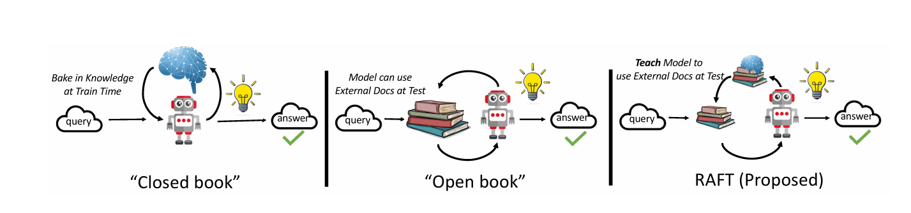
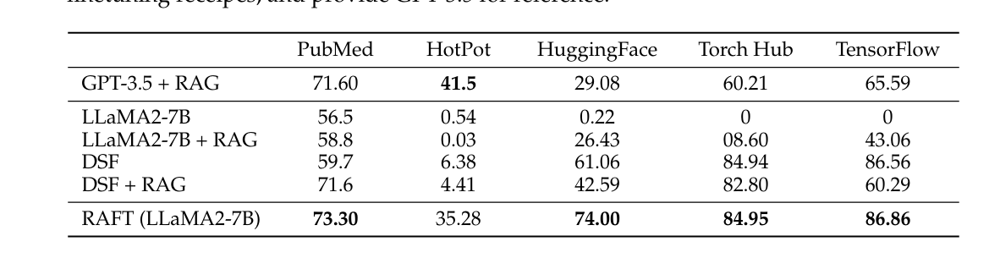

# 自然语言处理:第三十七章 RAFT 微调SFT+RAG

文章链接:[[2403.10131] RAFT: Adapting Language Model to Domain Specific RAG (arxiv.org)](https://arxiv.org/abs/2403.10131)

 

 

## 摘要

本文由加州大学伯克利分校计算机科学系的Tianjun Zhang等人撰写，介绍了Retrieval Augmented Fine Tuning（RAFT）这一新型训练技术。RAFT旨在提高大型语言模型（LLMs）在特定领域内回答“开放书”问题的能力。该技术通过结合相关文档的检索和模型的微调，让模型学会忽略与问题无关的分心文档，从而提升模型在特定领域内的推理能力。本文在PubMed、HotpotQA和Gorilla等多个数据集上验证了RAFT的效果，并展示了其作为一种后训练技术，如何有效改善预训练LLMs在领域特定RAG（Retrieval-Augmented Generation）任务中的表现。

 

 

## 背景介绍

近年来，大型语言模型（LLMs）如GPT系列、BERT等在自然语言处理领域取得了显著的进展。然而，这些模型在应用到具体领域时，往往面临知识偏差、数据稀疏等问题，导致性能下降。为了解决这一问题，研究者们提出了多种方法，如基于RAG的提示（prompting）和微调（finetuning）。然而，如何有效地将领域特定知识融入预训练模型，仍然是一个开放的研究问题。

大模型在回答问题的时候可以分为两种模式，如下图:

1. 利用大模型本身自带的source domain 进行**“闭卷式”**回答
2. 利用向量数据库检索回来的知识进行**“开卷式”**回答
3. 这是RAFT重点关注的方向。LLM 事先知道自己将要被测试的 domain，并会提前准备，考试时，可以参考该领域的所有文档资料来完成回答。

RAFT技术的提出，为解决这一问题提供了新的思路。它结合了文档检索和模型微调sft，让模型在回答问题的过程中，能够参考相关领域的知识，从而提高回答的准确性。这一技术的亮点在于，它不需要对模型进行大规模的重新训练，只需要通过微调，即可让模型适应特定领域。[RAFT](https://so.csdn.net/so/search?q=RAFT&spm=1001.2101.3001.7020) 的特点在于它的微调（SFT）过程。 **在 SFT 过程中，训练模型忽略任何检索到的、无助于回答特定问题的文档，从而让模型学会消除干扰** 。另外，RAFT 使用 chain-of-though 来进一步提高模型的推理能力。

 

 

## 核心算法

RAFT技术的核心在于其训练过程。给定一个问题和一组检索到的文档，RAFT训练模型学会忽略那些与问题无关的分心文档，同时引用相关文档中的正确序列来回答问题。这一过程通过两个主要步骤实现：

1. **文档检索**：根据问题，从相关语料库中检索出一组可能包含答案的文档。这一步骤依赖于高效的文档检索算法，确保检索到的文档与问题高度相关。
2. **模型微调**：在训练过程中，模型被训练去识别哪些文档是相关的，哪些是分心的。对于相关文档，模型需要学习如何从中提取有用的信息来回答问题。对于分心文档，模型需要学会忽略它们，避免它们对答案产生干扰。

> 以下是RAFT训练的具体步骤和机制：

1. **数据准备与设置**：

   - 在训练开始前，首先为每个问题（qi）准备一套数据，包括一个或多个“金色文档”（di∗），这些文档直接关联于问题并含有正确答案。金色文档可以是单个文件，也可以是多个文件，例如在HotpotQA数据集中就是这样。
   - 除了金色文档，还会添加一定数量的“干扰文档”（dk），这些文档与问题无关或无助于回答问题。
   - 数据集被划分为两部分：一部分（P%）的数据包含金色文档和干扰文档，另一部分（1-P%）则只包含干扰文档，没有金色文档。这样做的目的是促使模型在某些情况下不得不依赖上下文推导答案，而不是简单记忆。
2. **训练流程**：

   - 使用标准的监督微调（SFT）技术，模型接受训练，目标是从提供的文档和问题中生成答案。模型不仅要学会从相关文档中提取信息，还要学会忽略那些无关的干扰文档。
   - 训练过程中，模型看到的每条训练数据格式可能是这样的：对于P%的数据，是问题+金色文档+干扰文档1至干扰文档k→正确答案；对于剩余(1-P)%的数据，则是问题+干扰文档1至干扰文档k→正确答案。
3. **引入链式思维（Chain-of-Thought, CoT）**：

   - 为了进一步提升模型的推理能力，RAFT鼓励生成完整的推理链，明确引用原始上下文来解释答案。这意味着在训练中，模型不仅要生成答案，还要展示出如何通过逻辑推理达到这个答案，这有助于增强模型的理解深度和准确度。
4. **测试阶段**：

   - 在测试时，模型会接收到问题和通过RAG管道检索得到的top-k文档。无论检索器是什么，RAFT都能独立运作。
   - 经过RAFT训练的模型在面对不同数量的测试文档时表现得更为稳健，这得益于在训练中引入了多样化的干扰文档，使得模型学会了在不同文档情境下有效筛选信息。
5. **性能评估与调整**：

   - 通过对比实验，RAFT在PubMed、HotpotQA和Gorilla等多个数据集上展现出了优于仅使用监督微调或RAG的性能，尤其是在处理包含干扰信息的场景下。
   - 研究还分析了训练时干扰文档数量的影响，并发现不同领域（如NQ、Trivia QA和Hotpot QA）最优的文档数量不同，这为模型的泛化能力提供了宝贵洞察。

 

 

其链式思考CoT（chain-of-thought）意味着模型在回答问题的过程中，会展示其推理过程，从而让人们更好地理解模型的决策过程。这种可解释性对于提高模型的信任度和可靠性至关重要。下图是CoT的过程，**用于对 RAFT 进行 SFT 的训练数据中，每个 question 的 answer 都是 CoT style 的，并且 answer 中还清晰地标注了引用来源** 。一个训练数据样本如下所示：

RAFT的核心思想是将指令式微调和检索增强生成相结合，以适应特定领域的开卷考试设置。RAFT的训练数据包括问题（Q）、一组文档（Dk，包括“golden”文档D *和“干扰”文档Dk）、以及由一个文档生成的链式推理风格答案（A* ）。RAFT的训练方法如下：

* 对于数据集中的一部分问题，保留golden文档和干扰文档。
* 对于另一部分问题，不包括golden文档，只包括干扰文档。
* 使用标准监督训练技术微调语言模型，训练它从提供的问题和文档中生成答案。

RAFT的关键特点包括：

* **忽略干扰文档** ：训练模型识别并忽略那些不包含答案相关信息的文档。
* **链式推理** ：生成包含推理过程的答案，以提高模型的准确性和鲁棒性。
* **直接引用** ：在生成答案时直接引用相关文档中的确切序列。

## 实验结果与结论

为了验证RAFT技术的有效性，研究者在PubMed、HotpotQA和Gorilla等多个数据集上进行了实验。实验结果表明，RAFT在Hotpot QA和Torch Hub评估中的表现提升显著，分别达到了35.25%和76.35%。与领域特定微调（DSF）模型相比，RAFT在依赖提供上下文解决问题方面表现更好，特别是在Hotpot和HuggingFace数据集上，分别提高了30.87%和31.41%。

 

除了讨论本身RAFT的影响，作者还讨论了CoT的影响，可以看到加入了CoT后，整体性能都有提升。

 

此外，研究者还分析了RAFT技术对于模型推理能力的影响。实验结果表明，通过引入相关文档的检索和模型微调，RAFT能够显著提高模型的推理能力。这种推理能力的提升不仅体现在答案的准确性上，还体现在模型对于问题的理解和解释能力上。这种可解释性的提升对于增加模型的可信度和应用价值具有重要意义。

 

## 总结与展望

RAFT技术的提出，为大型语言模型在特定领域内的应用提供了新的解决方案。通过结合文档检索和模型微调，RAFT能够显著提高模型在领域特定RAG任务上的性能。同时，其链式思考风格的响应也增加了模型的可解释性，提高了模型的信任度和可靠性。

总结一下 RAFT 模型能够表现好的原因：

1. 对原生的 LLM 模型，使用 domain specific 的训练数据对其进行 SFT，让 LLM 能够提前熟悉这个 domain，并学会利用检索到的文档来生成回答。
2. SFT 训练中，将 oracle doc 和 distractor doc 进行混合来对 LLM 做训练，提高了 RAFT 忽略不相关信息的能力。
3. SFT 训练样本中，answer 采用 CoT style，提高了模型的推理能力。
