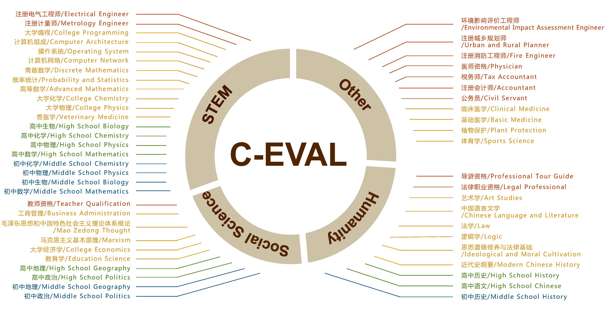
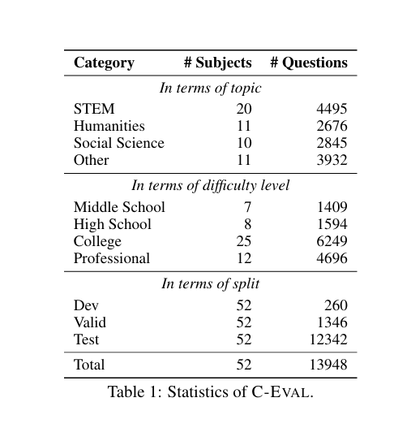
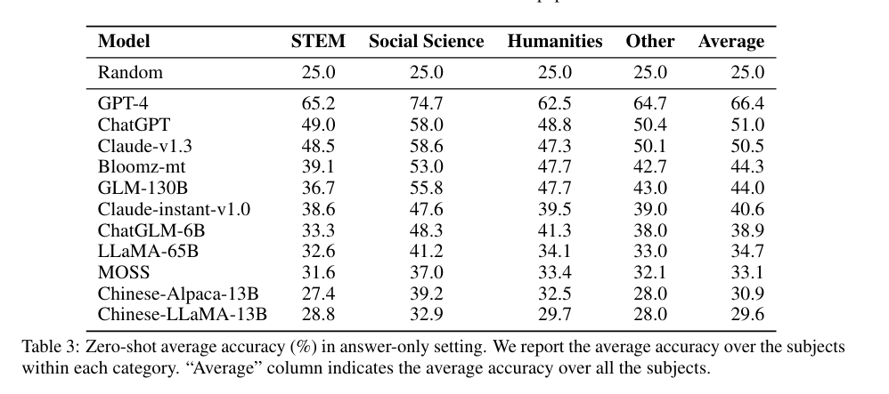
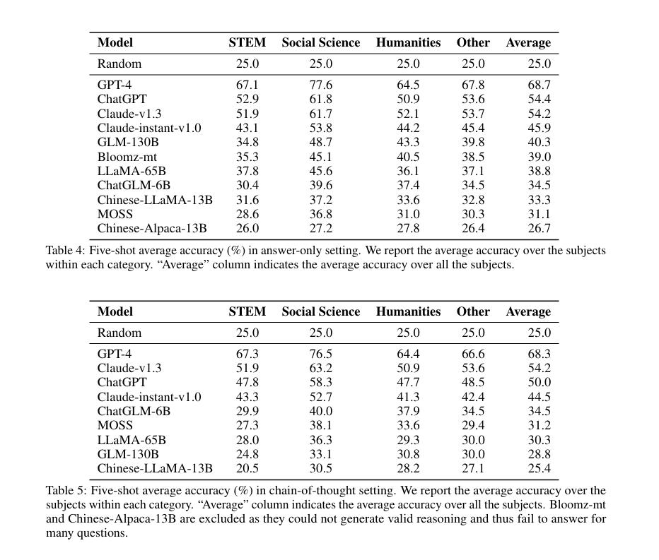

# 自然语言处理:第三十九章 中文测评榜单-CEval

文章链接:[2305.08322 (arxiv.org)](https://arxiv.org/pdf/2305.08322)

官网: [C-Eval: 一个适用于大语言模型的多层次多学科中文评估套件 (cevalbenchmark.com)](https://cevalbenchmark.com/index_zh.html#home_zh)

主页: [hkust-nlp/ceval: Official github repo for C-Eval, a Chinese evaluation suite for foundation models [NeurIPS 2023]](https://github.com/hkust-nlp/ceval)

<br />

<br />

在人工智能领域，尤其是自然语言处理技术迅速发展的今天，如何准确评估大型语言模型（LLMs）的性能成为了一个重要课题。最近，由上海交通大学、清华大学、爱丁堡大学和香港科技大学的研究人员联合开发的C-EVAL评估套件，为我们提供了一个全面评估中文环境下基础模型能力的解决方案。

## 摘要

C-EVAL 是首个旨在评估基础模型在中文语境下的高级知识和推理能力的综合评估套件。C-EVAL 包含跨越四个难度级别（初中、高中、大学和专业）的选择题，涵盖52个不同学科，从人文学科到科学工程。C-EVAL 还包括一个名为 C-EVAL HARD 的子集，包含需要高级推理能力的非常具有挑战性的科目。我们对最先进的大型语言模型进行了全面评估，结果显示只有 GPT-4 的平均准确率超过60%，表明当前模型还有很大的改进空间。我们期望 C-EVAL 能帮助分析基础模型的关键优势和不足，促进其为中文用户的发展和成长。

<br />

<br />

## 背景介绍

随着大型语言模型（LLMs）的快速发展，新的自然语言处理（NLP）基准测试变得迫切需要。传统的NLP基准测试大多设计用于衡量特定和相对简单的能力，而LLMs展示了各种新能力，将评估重点转向更广泛的世界知识和复杂的推理能力。近年来，新的基准测试被提出，用于探测LLM的多种能力，如MMLU、BIG-bench和HELM等。然而，这些现代基准测试主要针对英语，导致对LLMs在其他语言中的能力了解有限。因此，我们专注于评估基础模型在中文语境下的高级能力，这是世界上使用最广泛的语言之一。

<br />

<br />

## 核心算法



C-EVAL的设计核心在于它包含了13948个多项选择题，涵盖了52个不同的学科和四个难度级别，如下所示。您可以在 [探索](https://cevalbenchmark.com/static/explore.html) 中查看数据集示例。 这些选择题分为四个难度级别：初中、高中、大学和专业，每个难度级别都包含大量涵盖不同学科的题目。 其算法重点在于数据的搜集与处理方法。为了确保问题的多样性和避免数据泄露风险，研究团队采取了从模拟考试和小规模地方考试中选取题目的策略，而非直接使用国家公开考试的题目。同时，通过网络获取PDF和Word文档，再进行解析和人工注释，特别是对于含有复杂LaTeX公式的题目，这一过程尤为关键。这样既丰富了题目的来源，又最大限度地减少了预训练数据可能带来的污染问题。具体来说:

* **题目设计** ：题目主要来自互联网上的模拟考试，部分大学题目来自中国顶尖大学的往年考试题，这些题目由学生公开分享。此外，还有少量题目来自全国研究生入学考试的模拟题，这些题目来自维普网，并获得了授权。
* **题目类别** ：题目分为52个学科，按主题分为四类：STEM（科学、技术、工程和数学）、社会科学、人文学科和其他领域。每个学科都被仔细挑选和验证，以确保其代表性和挑战性。
* **评估过程** ：我们使用现有的最先进的LLMs，包括面向英语和中文的模型，对这些题目进行评估。评估结果表明，目前只有GPT-4能够在平均准确率上超过60%，这表明现有的LLMs在处理中文复杂问题时仍有很大的改进空间。

C-EVAL还特别注重于生成高质量的解释数据，用于模型在少量示例（few-shot）设置下的链式思维（chain-of-thought, COT）评估。团队利用GPT-4自动生成逐步解释，之后人工修订以获得最终解释，确保了开发集的质量与准确性。

<br />

下面是C-Eval 数据集的分布，数据可以直接从[Huggingface数据集](https://huggingface.co/datasets/ceval/ceval-exam)下载。可以参考[GitHub](https://github.com/SJTU-LIT/ceval#data)了解如何读取和使用数据。：



<br />

<br />

## 实验结果与结论





作者对多种先进的LLMs进行了全面评估，包括GPT-4、ChatGPT等，也分别进行了Cot 与 5-shot 对比。实验结果显示：

1. **总体表现** ：GPT-4 的表现最好，平均准确率超过60%，但仍有改进空间。
2. **不同难度级别的表现** ：模型在初中和高中的题目上表现较好，但在大学和专业级别的题目上准确率显著下降，特别是在C-EVAL HARD部分。
3. **学科差异** ：模型在STEM领域的表现优于人文和社会科学领域，这可能是因为STEM领域的题目更具客观性和标准化，而人文和社会科学的题目更具主观性和复杂性。

结论显示，尽管LLMs在处理简单问题和部分领域时表现优异，但在处理复杂推理和高级知识应用时仍需改进。

<br />

## 简单使用

#### 下载数据

* 方法一：下载zip压缩文件（你也可以直接用浏览器打开下面的链接）：

`wget https://huggingface.co/datasets/ceval/ceval-exam/blob/main/ceval-exam.zip`

* 方法二：使用[Hugging Face datasets](https://huggingface.co/datasets/ceval/ceval-exam)直接加载数据集。示例如下：

```
from datasets import load_dataset
dataset=load_dataset(r"ceval/ceval-exam",name="computer_network")

print(dataset['val'][0])
# {'id': 0, 'question': '使用位填充方法，以01111110为位首flag，数据为011011111111111111110010，求问传送时要添加几个0____', 'A': '1', 'B': '2', 'C': '3', 'D': '4', 'answer': 'C', 'explanation': ''}
```

<br />

为了方便使用，我们已经整理出了与 52 个科目对应的学科名称处理程序以及它们的中英文名称。具体细节请查看 [subject_mapping.json](https://github.com/SJTU-LIT/ceval/blob/main/subject_mapping.json)。格式如下：

```
{
	"computer_network": [
		"Computer Network",
		"计算机网络",
		"STEM"
	],
	...
	"filename":[
	"英文名称",
	"中文名称"
	"类别(STEM,Social Science,Humanities,Other四选一)"
	]
}
```

<br />

每个科目由三个部分组成：dev、val 和 test。每个科目的 dev 集包含五个示范实例以及为 few-shot 评估提供的解释。val 集旨在用于超参数调整。而 test 集则用于模型评估。test 集上的标签不会公开，需要用户提交其结果才能自动获得测试准确性。[如何提交？](https://github.com/hkust-nlp/ceval/blob/main/README_zh.md#%E5%A6%82%E4%BD%95%E6%8F%90%E4%BA%A4)

下面是高中化学的示例：

```
id: 1
question: 25 °C时，将pH=2的强酸溶液与pH=13的强碱溶液混合，所得混合液的pH=11，则强酸溶液与强碱溶液 的体积比是(忽略混合后溶液的体积变化)____
A: 11:1
B: 9:1
C: 1:11
D: 1:9
answer: B
explanation: 
1. pH=13的强碱溶液中c(OH-)=0.1mol/L, pH=2的强酸溶液中c(H+)=0.01mol/L，酸碱混合后pH=11，即c(OH-)=0.001mol/L。
2. 设强酸和强碱溶液的体积分别为x和y，则：c(OH-)=(0.1y-0.01x)/(x+y)=0.001，解得x:y=9:1。
```

<br />

<br />

<br />

#### 测试

通常你可以直接从模型的生成中使用正则表达式提取出答案选项（A,B,C,D)。在少样本测试中，模型通常会遵循少样本给出的固定格式，所以提取答案很简单。然而有时候，特别是零样本测试和面对没有做过指令微调的模型时，模型可能无法很好的理解指令，甚至有时不会回答问题。这种情况下我们推荐直接计算下一个预测token等于"A", "B", "C", "D"的概率，然后以概率最大的选项作为答案 -- 这是一种受限解码生成的方法，MMLU的[官方测试代码](https://github.com/hendrycks/test/blob/4450500f923c49f1fb1dd3d99108a0bd9717b660/evaluate.py#L88)中是使用了这种方法进行测试。注意这种概率方法对思维链的测试不适用。[更加详细的评测教程](https://github.com/hkust-nlp/ceval/blob/main/resources/tutorial.md)。

在我们最初发布时，我们自己用了以下prompt进行测试：

```
以下是中国关于{科目}考试的单项选择题，请选出其中的正确答案。

{题目1}
A. {选项A}
B. {选项B}
C. {选项C}
D. {选项D}
答案：A

[k-shot demo, note that k is 0 in the zero-shot case]

{测试题目}
A. {选项A}
B. {选项B}
C. {选项C}
D. {选项D}
答案：
```

或者使用思维链：

```
以下是中国关于{科目}考试的单项选择题，请选出其中的正确答案。

{题目1}
A. {选项A}
B. {选项B}
C. {选项C}
D. {选项D}
答案：让我们一步一步思考，
1. {解析过程步骤1}
2. {解析过程步骤2}
3. {解析过程步骤3}
所以答案是A。

[k-shot demo, note that k is 0 in the zero-shot case]

{测试题目}
A. {选项A}
B. {选项B}
C. {选项C}
D. {选项D}
答案：让我们一步一步思考，
1. 
```

现在，你可以通过[lm-evaluation-harness](https://github.com/EleutherAI/lm-evaluation-harness) 在C-Eval的验证集上评估模型，这是一个用于自回归语言模型的少样本评估框架。任务名称的格式为 `Ceval-valid-{subject}`（如 `Ceval-valid-computer_network`）。例如，要评估托管在[HuggingFace Hub](https://huggingface.co/models)上的模型（如GPT-J-6B），可以使用以下命令：

`python main.py --model hf-causal --model_args pretrained=EleutherAI/gpt-j-6B --tasks Ceval-valid-computer_network --device cuda:0`

<br />

<br />

#### 提交


您首先需要准备一个 UTF-8 编码的 JSON 文件，并按照以下格式编写。详情请参考[submission_example.json](https://github.com/SJTU-LIT/ceval/blob/main/submission_example.json)。

```
## 每个学科内部的键名是数据集中的"id"字段
{
    "chinese_language_and_literature": {
        "0": "A",
        "1": "B",
        "2": "B",
        ...
    },
  
    "学科名称":{
    "0":"答案1",
    "1":"答案2",
    ...
    }
    ....
}
```

然后你可以将准备好的JSON文件提交到[这里](https://cevalbenchmark.com/static/user_interface_zh.html)，**请注意，你需要先登录才能访问提交页面**


<br />

## 总结与展望

本文提出了C-EVAL，这是首个综合评估基础模型在中文语境下高级知识和推理能力的评估套件。通过对多种先进LLMs的评估，我们发现现有模型在处理中文复杂问题时仍有显著的改进空间。C-EVAL 的数据和评估代码已公开，期望该评估套件能帮助研究者和开发者分析基础模型的关键优势和不足，促进其发展和成长，以更好地服务中文用户。
