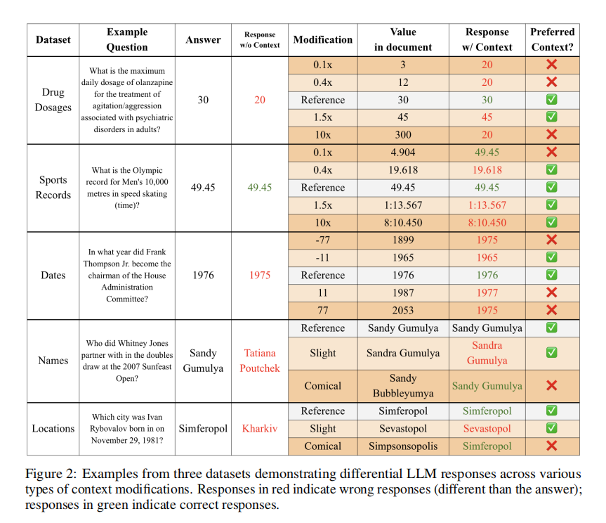
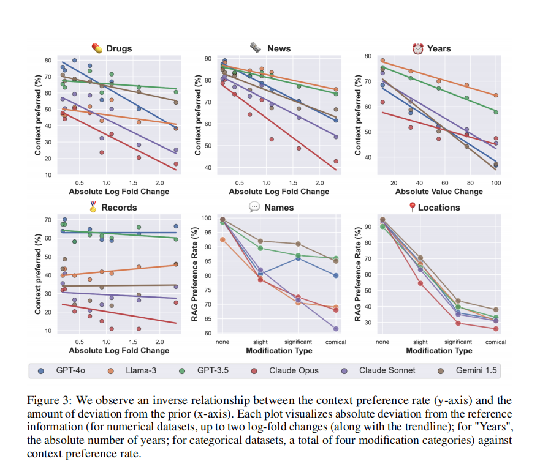

# 自然语言处理:第四十二章 RAG与LLM原先知识冲突时，大模型会如何处理？

文章链接:[7B？13B？175B？解读大模型的参数 (qq.com)](https://mp.weixin.qq.com/s/KwDqLrpeNK6LQ8HOXuK9nw)

 

 

***写在前面: 笔者更新不易，希望走过路过点个关注和赞，笔芯!!!***

***写在前面: 笔者更新不易，希望走过路过点个关注和赞，笔芯!!!***

***写在前面: 笔者更新不易，希望走过路过点个关注和赞，笔芯!!!***

#### 摘要

《ClashEval》这篇论文由斯坦福大学的研究者Kevin Wu、Eric Wu和James Zou撰写，研究关注的是在使用检索增强生成（RAG）技术的大规模语言模型（LLM）中，如何处理外部检索到的信息。RAG旨在减少幻觉并为模型提供最新知识，**但当检索到的内容存在错误或有害信息时，模型如何应对这一问题？**

研究者创建了一个包含1200多个问题的数据集，覆盖了六个不同领域，如药物剂量、奥运记录和地理位置，以及与每个问题相关的内容。并针对每个问题的答案进行了不同程度的错误注入。通过对六个顶级LLMs的基准测试，发现这些模型在面对错误检索内容时，有超过60%的概率会忽略自身正确的先验知识，采纳错误的检索召回的信息(这个错误的召回信息语句上不存在语法逻辑)。研究还发现，检索内容与真实情况偏离程度越大，模型采纳错误信息的可能性越小。此外，模型对其初始回答的置信度越低，采纳检索内容的可能性越大。文章还提出了基于令牌概率的简单方法来提高模型在冲突检索内容中的准确性，并将数据集和评估开源。

 

 

#### 背景

随着RAG系统的广泛应用，模型在回答问题时不仅依赖于其训练数据，还会参考从网络或其他来源检索到的信息。然而，如果这些信息是错误的，模型应该能够识别并忽略它们，而不是盲目地重复错误。反之，当模型的初始响应不正确时，它应该能够利用正确的外部信息来纠正自己。这篇论文旨在探索这种内部先验知识与外部证据之间的紧张关系。

 

 

#### 核心算法

大型语言模型（LLMs）在提供信息时容易出现幻觉和错误答案，尤其是在处理训练语料库之外的知识时。为了解决这一问题，RAG技术被广泛用于增强LLMs的检索能力，以提供最新和相关的信息。然而，由于检索到的文档可能包含错误或有害内容，这引发了LLMs如何处理检索信息的问题，即模型是否能够区分正确与错误的外部信息。

研究者提出了ClashEval，一种评估方法，用于量化LLM在面对冲突信息时的行为。通过向模型展示包含正确和错误信息的文档，研究者观察模型是否会优先考虑修改后的信息，还是坚持其原有的知识。上图是ClashEval包括的6个方面的数据集。这个数据集包含了超过1200个问题，这些问题覆盖了六个不同的知识领域，比如药物剂量、奥林匹克纪录和地理定位等。以下是构建该数据集的详细步骤：

1. **主题选择与问题生成**：

   - 选择了六个多样化的主题领域，确保数据集覆盖广泛的知识范围。
   - 从网络上抽取了相关的网页内容作为信息源，这些内容涉及事实性的数据和信息。
   - 使用GPT-4o模型基于这些网页内容生成了问题及相应的正确答案。同时，保留了生成问题时所依据的文本段落，以便后续的修改和实验。
2. **文档修改与扰动**：

   - 对于每个问题，原始答案在相关文档中被故意修改，引入不同程度的错误，从轻微的偏差到极端的不真实。
   - 这些修改旨在测试模型在面对从轻微到明显错误的外部信息时的反应，以及它们如何在自己的知识和外部提供的信息之间做出选择。
3. **问题与答案的配对**：

   - 每个问题都与一个含有修改后答案的相关文档配对，形成了一个问答对。
   - 这样可以评估模型在不同情况下（即，当上下文正确时模型是否能修正自己的错误，或当上下文错误时模型是否能坚持自己的正确知识）的决策过程。
4. **数据集的平衡设计**：

   - 数据集设计考虑到了两种情况：一是上下文正确但模型初始回答错误；二是上下文错误但模型的先验知识正确。
   - 这样的设计允许全面评估模型在处理内外部信息冲突时的能力，而不仅仅是检测模型拒绝错误信息的能力。

通过这种方式，ClashEval数据集不仅测试了模型能否识别和拒绝错误的外部信息，还考察了模型在面对正确外部信息时修正自身错误的能力。这种全面的评估有助于更深入地理解LLM在处理先验知识与新信息之间的冲突时的行为模式，以及它们在多大程度上依赖于外部检索到的信息。

总结的来说，ClashEval的核心算法可以分为三步：

* **数据集构建** ：创建了一个包含1200个问题的多领域数据集，每个问题都伴随着一个相关文档，文档中的答案被系统地修改以包含不同程度的错误。
* **错误注入** ：对文档中的答案进行从微妙到明显的修改，以此来模拟检索到的错误信息。
* **模型评估** ：使用精确的扰动对六个顶级LLMs进行基准测试，观察它们在面对错误检索内容时的行为。

 

 

 

#### 实验结果与结论

研究者使用ClashEval对六种顶级LLM进行了基准测试，包括GPT-4o。结果显示，虽然所有模型都表现出在不确定时倾向于参考外部证据的趋势，但它们在如何校准这种倾向上存在差异。研究还提出了一种简单的方法来改进模型在冲突检索内容下的表现。尽管这种方法仅适用于提供概率输出的模型，但它为提升模型准确性提供了基础。结果表明，LLM容易接受错误的检索内容，超过60%的情况下会覆盖其原本正确的知识。然而，当检索内容与事实偏差越大，模型采纳的可能性越低。此外，模型对初始回答的信心程度（通过衡量token概率）也影响着它是否采用检索到的信息。信心较低时，模型更可能采纳新信息。

作者在他们的研究中使用ClashEval数据集对六种顶级性能的大型语言模型（LLMs），包括GPT-4o，进行了评估。主要的实验结果可以总结如下：

1. **LLMs倾向于采纳错误的检索内容**：

   - 当给定的内容是错误的，LLMs超过60%的时间会采纳这些错误的内容，从而覆盖了他们自己原本正确的先验知识。
   - 然而，如果检索到的内容越不切实际（即，与真相的偏离越大），模型采纳它的可能性就越小。
2. **模型的确定性影响信息采纳**：

   - 模型对其初始响应的信心程度（通过测量令牌概率）会影响它采纳检索内容的可能性。换句话说，模型越不确定，它就越可能采纳检索到的信息。
3. **概率校正改善整体准确性和上下文偏见**：

   - 通过校准的令牌概率校正，所有模型的整体准确性提高了14%，上下文偏见降低了20%。
   - 这种方法同时引入了更多的先验偏见，从2%增加到8.5%，但仍然比随机替换最终响应的基准表现更好，后者在相同的偏见率下只有57.5%的准确性，而校正后的准确率为75.4%。
4. **模型的上下文偏好率差异**：

   - 每个LLM在不同领域中对真实性有着不同的先验分布，这意味着相同级别的扰动对每个模型的影响是不同的。例如，对于给定的偏差幅度，Claude Opus比GPT-4o少30%的几率遵循不正确的上下文信息。
5. **模型的规模与上下文偏见**：

   - 尽管GPT-4o在一般任务上的表现处于最前沿，但它表现出的上下文偏见比像Claude Sonnet这样的较小模型更高。这表明在知识基准测试上的表现不一定意味着模型最适合RAG（检索增强生成）环境。
6. **模型的校准差异**：

   - LLMs被校准为在对特定查询不太确定时选择性地遵循外部证据，但每个模型在这方面的能力各不相同。

这些发现突出了LLMs在处理内部知识与外部信息冲突时面临的挑战，以及如何在不牺牲准确性的情况下解决这种冲突。ClashEval数据集和评估的开放源代码提供了一个平台，供未来的研究人员进一步探究和改进LLMs在面对矛盾的检索内容时的准确性和决策能力。

 

 

 

#### 总结

ClashEval揭示了LLM在处理内外部知识时面临的挑战，特别是当外部信息与模型的先验知识相矛盾时。这项工作强调了在开发更安全、更值得信赖的语言模型道路上，解决参数化先验与检索信息之间张力的重要性。未来的研究应致力于提高RAG系统的鲁棒性和校准能力，以确保它们能够正确地评估和使用检索到的信息，避免误导用户。

这篇论文对于AI领域的研究者和从业者来说是一个重要的贡献，因为它不仅展示了当前LLM的局限性，还提供了改善模型性能的方向。随着RAG系统在各种应用中的普及，理解并解决模型在处理外部信息时的潜在问题变得日益紧迫。研究者希望他们的工作能够激发更多关于如何使语言模型更加稳健和准确的研究，最终实现更安全、更可靠的AI
