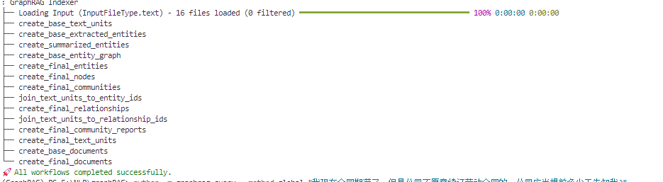

# 自然语言处理:第四十六章 GraphRAG 快速入门

项目链接:[microsoft/graphrag: A modular graph-based Retrieval-Augmented Generation (RAG) system (github.com)](https://github.com/microsoft/graphrag)

实现过程:

<br />

<br />

***写在前面: 笔者更新不易，希望走过路过点个关注和赞，笔芯!!!***

***写在前面: 笔者更新不易，希望走过路过点个关注和赞，笔芯!!!***

***写在前面: 笔者更新不易，希望走过路过点个关注和赞，笔芯!!!***

GraphRAG 是微软提出来的复合[RAG](https://blog.csdn.net/victor_manches/article/details/136493368?ops_request_misc=%257B%2522request%255Fid%2522%253A%25229F01CE5B-0E26-429B-AAC1-B2F0BA5C8B10%2522%252C%2522scm%2522%253A%252220140713.130102334.pc%255Fblog.%2522%257D&request_id=9F01CE5B-0E26-429B-AAC1-B2F0BA5C8B10&biz_id=0&utm_medium=distribute.pc_search_result.none-task-blog-2~blog~first_rank_ecpm_v1~rank_v31_ecpm-1-136493368-null-null.nonecase&utm_term=RAG&spm=1018.2226.3001.4450)，有关于GraphRAG的细节介绍和实现过程可以参考我之前的文章: [自然语言处理:第四十五章 GraphRAG 实现过程](https://blog.csdn.net/victor_manches/article/details/141714121?spm=1001.2014.3001.5501)  。 这次就跟着我一起去看看如何将GraphRAG应用到实战里。

官网其实给了三种GraphRAG的方式:

1. [从pypi包安装](https://pypi.org/project/graphrag/)
2. [源码部署](https://microsoft.github.io/graphrag/posts/developing/)
3. [利用GraphRAG加速](https://github.com/Azure-Samples/graphrag-accelerator)

**要求: python >= 3.10 & <= 3.12**


<br />


<br />


## 一. python部署

### 1. 新建环境

```
conda create -n GraphRAG python=3.11
conda activate GraphRAG
```


<br />


### 2. 环境安装

`pip install graphrag `


### 3. 初始化项目

```bash
mkdir -p ./ragtest/input   # 建立一个ragtest/input 文件夹用于存放查询文件 ， ragtest 是工作目录
curl https://www.gutenberg.org/cache/epub/24022/pg24022.txt > ./ragtest/input/book.txt # 目前只支持txt和csv文件解析
python -m graphrag.index --init --root ./ragtest # 初始化项目文件夹， root后面输入的是项目文件夹，
```

然后在ragtest的文件夹下面会生成两个文件: .env 和 setting.yaml 文件


<br />


### 4. 修改配置文件

#### 4.1 在.env文件里配置apikeys

改成你sk开头的apikeys就可以了

`GRAPHRAG_API_KEY=sk-xxxxxxxxxxxxxxxxxxx`


<br />


#### 4.2 在setting.yaml文件修改url和model

由于配置文件里需要对应的修改对话模型和embedding模型，所以对应的有几个内容需要修改，下面这5个是比较常见需要修改的地方，如果其他的需要修改的可以参考官网[Configuring GraphRAG Indexing (microsoft.github.io)](https://microsoft.github.io/graphrag/posts/config/overview/)

```
llm:
  model: deepseek-chat
  model_supports_json: false # recommended if this is available for your model.
  api_base: https://api.agicto.cn/v1  #  https://<instance>.openai.azure.com

embeddings:
  llm:
    model: text-embedding-3-small
    api_base: https://api.agicto.cn/v1

```


<br />


<br />


### 5. 构建GraphRAG的图谱

`python -m graphrag.index --root ./ragtest   `


比较耗时，取决于你文件大小，运行成功后应该是这样：




<br />


<br />


### 6. 查询问题

GraphRAG提供了两种查询机制:

1. Global: 问题的回答要基于所有文档的理解

   ```bash
   python -m graphrag.query \
   --root ./ragtest \
   --method global \
   "What are the top themes in this story?"
   ```
2. Local: 问题的回答基于某篇文档就能直接回答

   ```bash
   python -m graphrag.query \
   --root ./ragtest \
   --method local \
   "Who is Scrooge, and what are his main relationships?"
   ```


官网解释: 


<br />


<br />


<br />


## 二、源码部署

### 1. 新建环境

同上


<br />


### 2.下载源码

```
git clone https://github.com/microsoft/graphrag.git   
cd graphrag
```


<br />


### 3. 下载依赖并初始化

#### 3.1 安装poetry资源[包管理工具](https://so.csdn.net/so/search?q=%E5%8C%85%E7%AE%A1%E7%90%86%E5%B7%A5%E5%85%B7&spm=1001.2101.3001.7020)及相关依赖：

```
pip install poetry 
poetry install

```


<br />


#### 3.2 初始化

`poetry run poe index --init --root .    `

同样的也会生成会生成两个文件: .env 和 setting.yaml 文件


<br />


#### 3.3 放入文件夹

```
mkdir ./input
curl https://www.xxx.com/xxx.txt > ./input/book.txt  #示例，可以替换为任何的txt文件
```


<br />


<br />


### 4. 修改配置文件

同上


<br />


### 5. 构建GraphRAG的图谱

`poetry run poe index --root .    `

成功后截图：

⠋ GraphRAG Indexer
├── Loading Input (InputFileType.text) - 1 files loaded (0 filtered) ━━━━━━━━━━━━━━━━━━━━━━━━━━━━━━━━━━━━━━━━ 100% 0:00:00 0:00:00
├── create_base_text_units
├── create_base_extracted_entities
├── create_summarized_entities
├── create_base_entity_graph
├── create_final_entities
├── create_final_nodes
├── create_final_communities
├── join_text_units_to_entity_ids
├── create_final_relationships
├── join_text_units_to_relationship_ids
├── create_final_community_reports
├── create_final_text_units
├── create_base_documents
└── create_final_documents
🚀 All workflows completed successfully.


<br />


<br />


### 6. 查询问题

同样的也分为两种查询方式global 和local：

1Global: `poetry run poe query --root . --method global "本文主要讲了什么"`

2. Local: `poetry run poe query --root . --method local "本文主要讲了什么"    `


## 三. 利用GraphRAG加速

可以参考这一篇note: [graphrag-accelerator/notebooks/1-Quickstart.ipynb at main · Azure-Samples/graphrag-accelerator (github.com)](https://github.com/Azure-Samples/graphrag-accelerator/blob/main/notebooks/1-Quickstart.ipynb)
