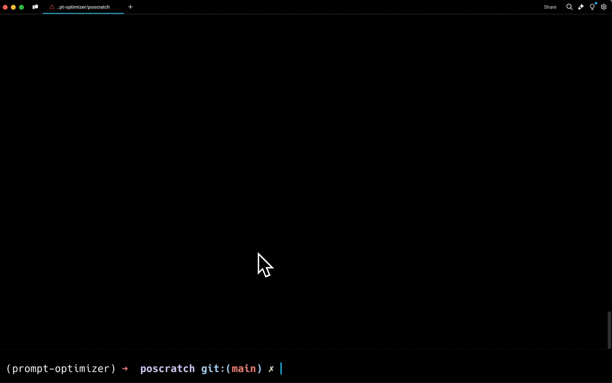

# 自然语言处理:第六十七章 LangChain推出自动化提示优化工具Promptim：一键优化，效率倍增

**本人项目地址大全：[Victor94-king/NLP__ManVictor: CSDN of ManVictor](https://github.com/Victor94-king/NLP__ManVictor)**

原文地址：[MinerU：精准解析PDF文档的开源解决方案](https://mp.weixin.qq.com/s/EV2_CJtwPaKinVPw2O2T-g)

论文链接：[MinerU: An Open-Source Solution for Precise  Document Content Extraction](https://arxiv.org/pdf/2409.18839)

git地址：**https://github.com/opendatalab/MinerU**

<br />

***写在前面: 笔者更新不易，希望走过路过点个关注和赞，笔芯!!!***

***写在前面: 笔者更新不易，希望走过路过点个关注和赞，笔芯!!!***

***写在前面: 笔者更新不易，希望走过路过点个关注和赞，笔芯!!!***

<br />

<br />

<br />

上一章介绍了Prompt 工程的方法，但是实际过程中是否可以自动化的去优化prompt

在当前 AI 开发中，提示词工程常常面临优化耗时、效果不稳定等挑战。LangChain 近日推出自家的自动提示词优化工具Promptim ^[1]^ ，为开发者提供了一套系统化改进 AI 提示词的解决方案。这款工具能够自动优化特定任务的提示词，显著提升开发效率。


Promptim 的设计理念是让开发者只需准备初始提示词、数据集和评估标准，系统便会自动运行优化循环，生成更优质的提示词。该工具与 LangSmith 平台无缝对接，可实现数据集管理、提示词管理、结果追踪等功能。

Promptim 有三大核心优势：

* 大幅节省调试时间，告别繁琐的手动优化
* 引入科学方法论（借鉴 DSPy），使提示词工程更加规范
* 轻松实现跨模型迁移，降低模型切换成本

工具的运行机制包含五个关键步骤：从指定数据集和评估标准，到获取基准分数，再到循环评估优化，最后在测试集验证并可选择引入人工反馈。这一流程既保证了优化的科学性，又兼顾了实用性。

官方介绍，他们的工具与 DSPy 相比，有以下不同：

* 专注于单个提示词的优化，而 DSPy 致力于优化整个"复合 AI 系统"
* 更强调保持人在循环中的作用，包括支持人工反馈环节，而 DSPy 相对更加自动化
* 专注于提示词重写，而 DSPy 提供更广泛的优化方案，如微调和少样本提示等

虽然 Promptim 能够自动完成大部分优化工作，但开发团队建议在关键节点保留人工审核，以确保优化结果符合预期。

官方同时表示，接下来将着力开发动态少样本提示等新功能，并计划与 LangSmith 实现更深度的整合，进一步提升工具的实用价值。

快速入门Promptim 是一个实验性的**提示**优**化**库，用于帮助您系统地改进 AI 系统。

Promptim 自动化了对特定任务提示词进行改进的过程。您提供初始提示词、数据集、自定义评估器（和可选的人类反馈），`promptim` 运行一个优化循环，生成一个旨在优于原始提示词的精炼提示。

有关设置和使用的详细信息，请参见下面的快速入门指南。



以下是文件的前几段内容翻译成中文的示例。为了完整翻译整个文件，我将逐步翻译并保持原有的markdown格式。

```markdown
# Promptim

Promptim 是一个实验性的**提示**优**化**库，用于帮助您系统地改进 AI 系统。

Promptim 自动化了对特定任务提示词进行改进的过程。您提供初始提示词、数据集、自定义评估器（和可选的人类反馈），`promptim` 运行一个优化循环，生成一个旨在优于原始提示词的精炼提示。

有关设置和使用的详细信息，请参见下面的快速入门指南。


## 快速入门

让我们尝试在简单的推文生成任务上进行提示优化。

### 1. 安装

首先安装 CLI。

```shell
pip install -U promptim
```

并确保您的环境中有有效的 [LangSmith API 密钥](https://smith.langchain.com/)。对于快速入门任务，我们将使用 Anthropic 的 Claude 模型作为优化器和目标系统。

```shell
LANGSMITH_API_KEY=CHANGEME
ANTHROPIC_API_KEY=CHANGEME
```

### 2. 创建任务

接下来，创建一个任务进行优化。

```

这是初步翻译的内容，如果确认无误，我会继续翻译后续部分。
```

### 3. 定义数据集和提示词

创建一个数据集并定义初始提示词。在这个例子中，我们的目标是生成有吸引力的推文。

```python
dataset = [
    {"topic": "人工智能", "example_tweet": "人工智能正改变我们的世界！#未来"},
    {"topic": "气候变化", "example_tweet": "气候变化是真实存在的，现在行动刻不容缓！#环保"},
    {"topic": "区块链", "example_tweet": "区块链技术为金融带来革命性改变。#金融科技"}
]

initial_prompt = "生成一条有吸引力的推文，主题是{topic}。"
```

### 4. 设置评估器

创建一个自定义的评估器来测量推文的质量。此评估器会根据示例推文的相似性评分生成的推文。

```python
def evaluate(generated_tweet, example_tweet):
    # 简单的相似度评分（可以替换为更复杂的评估逻辑）
    return generated_tweet in example_tweet
```

### 5. 优化提示词

使用 Promptim 优化您的提示词。

```python
from promptim import Optimizer

optimizer = Optimizer(
    model="claude",  # 使用的模型
    initial_prompt=initial_prompt,
    dataset=dataset,
    evaluate_fn=evaluate
)

optimized_prompt = optimizer.optimize()
print("优化后的提示词:", optimized_prompt)
```

### 6. 验证结果

运行优化后，您可以使用优化后的提示词并评估其效果。

Promptim 支持多种配置选项，您可以根据需求进行调整：

- **模型选择**：选择适合您任务的模型，例如 `claude` 或 `gpt-4`。
- **数据集大小**：根据任务的复杂性调整数据集大小。
- **优化迭代**：控制优化循环的迭代次数。


相关阅读：

[Langchain 创始人新项目 Auto-Prompt Builder 一键优化你的 Prompt，再也不担心写不好 Prompt 了](https://mp.weixin.qq.com/s?__biz=MzA5MTIxNTY4MQ==&mid=2461143534&idx=1&sn=092113c434092d1c5777d1a3c6b0f728&scene=21#wechat_redirect)

[Weavel Ape 超过 DSPy，或将成为最好用的提示（prompt）优化工具](https://mp.weixin.qq.com/s?__biz=MzA5MTIxNTY4MQ==&mid=2461146642&idx=1&sn=4df9c085356ef8c1220c49eee0eee6cc&scene=21#wechat_redirect)

[DSPy（声明式自改进语言程序），面向大模型编程的新方法，克服当前 LLM 应用开发的诸多缺点](https://mp.weixin.qq.com/s?__biz=MzA5MTIxNTY4MQ==&mid=2461145805&idx=1&sn=a54aa88c8cccdcd1f6ffa8b5e810ad60&chksm=873978e3b04ef1f501fd147a8e0a30135f080909562d4e6456758e47f6a9000072121032d6ad&token=658496341&lang=zh_CN&scene=21#wechat_redirect)

[伯克利：即使模型再强大，复合 AI 系统（ Compound AI Systems）都将会是一种领先的应用模式](https://mp.weixin.qq.com/s?__biz=MzA5MTIxNTY4MQ==&mid=2461146137&idx=1&sn=b709807d7f615b6cd384f923393301da&chksm=87397e37b04ef721a8be37ae3db98b20a66b83d92d6d227220f6e08b175e16969d918b705113&token=658496341&lang=zh_CN&scene=21#wechat_redirect)

### 参考资料

[1]Promptim: *https://github.com/hinthornw/promptimizer*
