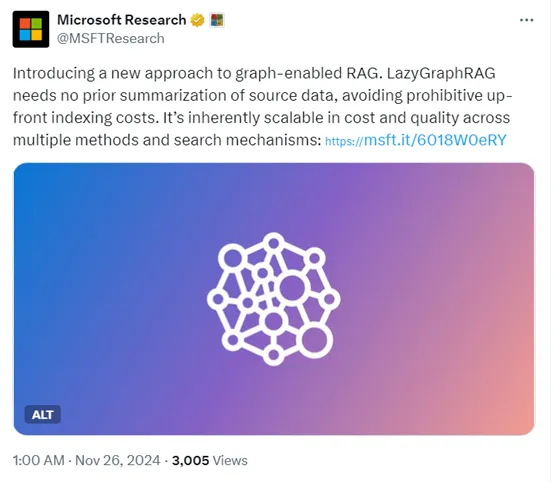

# 自然语言处理:第七十二章 微软推出超越自己GraphRAG的LazyGraphRAG

**本人项目地址大全：[Victor94-king/NLP__ManVictor: CSDN of ManVictor](https://github.com/Victor94-king/NLP__ManVictor)**

原文地址: [如何从头训练大语言模型: A simple technical report - 知乎](https://zhuanlan.zhihu.com/p/906819356)

 

***写在前面: 笔者更新不易，希望走过路过点个关注和赞，笔芯!!!***

***写在前面: 笔者更新不易，希望走过路过点个关注和赞，笔芯!!!***

***写在前面: 笔者更新不易，希望走过路过点个关注和赞，笔芯!!!***

 

**摘要:**

今年7月，微软首次开源了超大知识索引GraphRAG，仅4个多月的时间在Github已超过19000颗星，成为目前最火的RAG框架之一。

但GraphRAG在处理全局数据查询时成本非常高，尤其是应用在那些大参数的AI模型中格外明显，查询的过程中也存在延迟、不准确等问题。 11月底微软研究院推出了LazyGraphRAG，这是一种新型的图谱增强生成增强检索（RAG）方法。这种方法显著降低了索引和查询成本，同时在回答质量上保持或超越竞争对手，使其在多种用例中具有高度的可扩展性和高效性。

关键要点:

*- **成本效益**：LazyGraphRAG在数据索引成本方面大幅下降，仅为GraphRAG的0.1%。同时，其成本与向量RAG相当。*

*- **查询性能**：在与向量RAG相近的查询成本下，LazyGraphRAG在本地查询方面的性能超越了其他竞品。*

*- **全局查询质量**：对全局查询，LazyGraphRAG在查询成本下降超过700倍的情况下，其答案质量与GraphRAG全球搜索相当。*

*- **可伸缩性**：LazyGraphRAG的性能随着相关性测试预算的调整而扩大，提供了成本和质量之间的权衡选择。*

*- **几乎无需索引成本**：该方法的索引成本几乎为零，适合进行一次性查询、探索性分析和流数据处理。*

*- **灵活性**：LazyGraphRAG的灵活性使其能在本地和全局查询范围内超越传统的专门查询机制。*

*- **开源可用性**：LazyGraphRAG将很快在开源的GraphRAG库中提供。*

Source:

*https://www.microsoft.com/en-us/research/blog/lazygraphrag-setting-a-new-standard-for-quality-and-cost/*

 

 

# **正文:**

适用于各种用例的经济实惠的 GraphRAG(https://aka.ms/graphrag) 项目旨在通过利用非结构化文本中的隐式关系来扩展 AI 系统可以在私有数据集上回答的问题类别。

与传统向量 RAG（或“语义搜索”）相比，GraphRAG 的一个关键优势是它能够回答针对整个数据集的全局查询，例如“数据中的主要主题是什么”或“对 X 最重要的影响是什么？相反，矢量 RAG 擅长于答案类似于查询并且可以在特定文本区域中找到的本地查询，例如“who”、“what”、“when”和“where”问题的典型情况。

在最近的博客文章中，我们分享了两种新的查询机制，它们利用 GraphRAG 创建的丰富的、基于摘要的数据索引，分别提高本地搜索性能和全局搜索成本。

[微软GraphRAG最新动态：通过动态社区选择改善全球搜索](http://mp.weixin.qq.com/s?__biz=MzI3ODE5Mzc1Ng==&mid=2247493291&idx=1&sn=ece77b12507cc95d8cb28f506e3a2689&chksm=eb581598dc2f9c8e9f36a0f26bb116694750552df1b46e6da466a31ebd84b971f8fc3a94ec94&scene=21#wechat_redirect)

[微软GraphRAG 0.4.0&amp;DRIFT图推理搜索更新](http://mp.weixin.qq.com/s?__biz=MzI3ODE5Mzc1Ng==&mid=2247492534&idx=1&sn=0af3e1b9bb85b1fac8179cf570fc605d&chksm=eb581085dc2f9993304e686df9e81e429b7d5b5c9dcebafbc80d0ab848e1f3c7bb1ff5043b20&scene=21#wechat_redirect)

在这篇博文中，我们介绍了一种完全不同的支持图的 RAG 方法，该方法不需要事先对源数据进行总结，从而避免了对某些用户和用例来说可能令人望而却步的前期索引成本。我们将这种方法称为 “LazyGraphRAG”。

与GraphRAG不同是， **LazyGraphRAG在数据索引阶段不进行任何预先的总结或嵌入生成，而是采用NLP名词短语提取来识别概念及其共现关系，然后再通过图统计来优化概念图** ，并提取层次社区结构。这使得LazyGraphRAG的索引成本极低，仅为GraphRAG的0.1%。也就是说将成本降低了1000倍。

在查询处理方面，GraphRAG使用广度优先搜索来确保查询回答时考虑了整个数据集的广度， **而LazyGraphRAG则结合了最佳优先搜索和广度优先搜索的动态，采用迭代加深的方式。** 首先按相似度排名文本片段，然后通过动态选择相关社区来逐步细化查询结果。

LazyGraphRAG 的一个关键优势是它在成本和质量方面固有的可扩展性。在一系列竞争方法（标准载体 RAG、RAPTOR, 和GraphRAG local,全局搜索机制），LazyGraphRAG 在成本质量范围内显示出强大的性能，如下所示：

* LazyGraphRAG 数据索引成本与矢量 RAG 相同，是完整 GraphRAG 成本的 0.1%。
* 对于与矢量 RAG 相当的查询成本，LazyGraphRAG 在本地查询上优于所有竞争方法，包括长上下文向量 RAG 和 GraphRAG 漂移搜索（我们最近推出的 RAG 方法显示性能优于矢量 RAG）以及 GraphRAG 本地搜索。
* 对于全局查询，相同的 LazyGraphRAG 配置也显示出与 GraphRAG Global Search 相当的答案质量，但查询成本低 700 倍以上。
* 对于 GraphRAG 全局搜索 4% 的查询成本，LazyGraphRAG 在本地和全局查询类型上都明显优于所有竞争方法，包括 C2 级别的 GraphRAG 全局搜索（为大多数应用程序推荐的社区层次结构的第三级）。

LazyGraphRAG即将在我们的开源GraphRAG库中推出，提供一个统一的查询接口，用于轻量级数据索引的本地和全局查询，其成本可与标准向量RAG相媲美。

 

 

 

## 将向量 RAG 和GraphRAG 与延迟 LLM 使用混合

LazyGraphRAG 旨在融合向量RAG 和GraphRAG 的优点，同时克服它们各自的局限性：

* 矢量 RAG 是一种最佳优先搜索形式，它使用与查询的相似性来选择最匹配的源文本块。但是，它不知道全局查询要考虑的数据集的广度。
* GraphRAG 全局搜索是一种广度优先搜索形式，它使用源文本实体的社区结构来确保在考虑数据集的全部广度的情况下回答查询。但是，它不知道本地查询要考虑的最佳社区。

LazyGraphRAG 以迭代深化的方式结合了最佳优先和广度优先搜索动态（表 1）。与完整 GraphRAG 的全局搜索机制相比，这种方法在延迟 LLM 使用并显着提高答案生成效率的方式上是“懒惰的”。整体性能可以通过一个主要参数（相关性测试预算）进行扩展，该参数以一致的方式控制成本-质量权衡。

| ``                  | GraphRAG                                                                                                                       | LazyGraphRAG                                                                                                                                                                                                                                                                                                                                                             |
| ------------------- | ------------------------------------------------------------------------------------------------------------------------------ | ------------------------------------------------------------------------------------------------------------------------------------------------------------------------------------------------------------------------------------------------------------------------------------------------------------------------------------------------------------------------ |
| Build index构建索引 | 使用 LLM 提取和描述实体及其关系，b） 使用 LLM 总结每个实体和关系的所有观察结果，c） 使用图形统计来优化实体图并提取分层社区结构 | 使用 NLP 名词短语提取来提取概念及其共现，b） 使用图形统计来优化概念图并提取分层社区结构                                                                                                                                                                                                                                                                                  |
| ``                  | ``                                                                                                                             | ``                                                                                                                                                                                                                                                                                                                                                                       |
| 优化查询            | None – 整个过程中使用原始查询                                                                                                 | 使用 LLM 来 a） 识别相关的子查询并将它们重新组合成一个扩展的查询，b） 使用概念图中的匹配概念来优化子查询                                                                                                                                                                                                                                                                 |
| 匹配查询            | None – 使用所有社区摘要回答所有查询 （ 广度优先 ）                                                                            | 对于每个 q 子查询 [3-5]：``– 使用文本块嵌入和块-社区关系，首先按与查询的相似性对文本块进行排名，然后按其排名靠前的社区排名对社区进行排名k 个文本块 （ 最好在前 ）``– 使用基于 LLM 的句子级相关性评估器来评估前 -k 个来自社区的未经测试的文本块（按排名顺序排列）（ 广度优先 ）``– 递归到子社区之后z个连续社区产生零相关文本块，或达到相关性测试预算 / Q（ 迭代加深 ） |
| 地图答案            | 使用 LLM 并行回答随机批次社区摘要的原始查询                                                                                    | 对于每个 q 子查询 [3-5]：``– 从相关文本块构建概念子图``– 使用概念的社区分配将相关块分组在一起 ``– 使用 LLM 从相关块组中提取与子查询相关的声明，作为仅关注相关内容的一种方式``– 对提取的声明进行排名和过滤，以适应预定义的上下文窗口大小                                                                                                                              |
| 减少答案            | 使用 LLM 通过映射的答案来回答原始查询                                                                                          | 使用 LLM 通过提取的 map 声明来回答扩展的查询                                                                                                                                                                                                                                                                                                                             |

 

 

## LazyGraphRAG答案质量是最先进的

我们将不同水平相关性测试预算的 LazyGraphRAG 与一系列竞争方法进行了比较，如下所示：

* 数据集：5,590 篇美联社新闻文章（需使用许可证）
* 查询：100 个综合查询（50 个本地查询和 50 个全局查询），使用新方法生成，将在以后的博客文章中介绍
* 指标：全面性、多样性、赋权（如此处所述，LLM 用于直接比较每个指标的答案对）
* 条件：包括具有三个相关性测试预算设置的 LazyGraphRAG，以及来自 GraphRAG 和文献的八个竞争条件（表 2）。

| 条件       | 描述                                                                                                                                    |
| ---------- | --------------------------------------------------------------------------------------------------------------------------------------- |
| Z100_Lite  | LazyGraphRAG 的相关性测试预算为 100，并在所有步骤中使用低成本的 LLM 模型                                                                |
| Z500       | LazyGraphRAG，相关性测试预算为 500，使用低成本的 LLM 进行相关性测试，使用更高级（成本更高）的 LLM 进行查询细化和 map/reduce 答案生成    |
| Z1500      | LazyGraphRAG 的相关性测试预算为 1,500，使用低成本的 LLM 进行相关性测试，使用更高级（成本较高）的 LLM 进行查询细化和 map/reduce 答案生成 |
| C1         | 社区级别 1 的 GraphRAG 全局搜索                                                                                                         |
| C2         | 社区级别 2 的 GraphRAG 全局搜索                                                                                                         |
| C3_Dynamic | 使用动态社区选择在社区级别 3 进行 GraphRAG 全局搜索（我们之前的博客文章中介绍了一种节省成本的解决方案）                                 |
| LS         | GraphRAG 本地搜索                                                                                                                       |
| DRIFT      | GraphRAG DRIFT 搜索                                                                                                                     |
| SS_8K      | 使用向量 RAG 进行语义搜索，检索 8k 个输入令牌                                                                                           |
| SS_64K     | 使用向量 RAG 检索 64k 输入标记的语义搜索（包括用于检查长上下文窗口对向量 RAG 的影响）                                                   |
| RAPTOR     | 一种基于分层聚类的 RAG 方法，与 LazyGraphRAG 有一些相似的功能                                                                           |

图 1 显示了 LazyGraphRAG 在八种竞争条件下的胜率。在使用低成本 LLM 模型的 100 次相关性测试的最低预算水平（与 SS_8K 的成本相同）时，LazyGraphRAG 在本地和全局查询上的表现明显优于所有条件，除了全局查询的 GraphRAG 全局搜索条件。在使用更高级的 LLM 模型（C2 查询成本的 4%）增加 500 次相关性测试的预算下，LazyGraphRAG 在本地和全局查询上都明显优于所有条件。随着相关性测试预算增加到 1,500，LazyGraphRAG 的胜率不断提高，证明了它在成本与质量方面的可扩展性。

表 3 显示了一个示例比较。

查询：描述美国个人在 2024 年健康保险计划的开放注册期间选择健康保险计划时应考虑哪些因素。

| 矢量 RAG（64K 上下文）                                                                                                                                                                                                                                                                                                                                                                                                                                                                                                                                                                                                                                                                                                                                                                                                                                                                                                                                                                                                                                                                                                                                                                                                                                                                                                                                                                                                                                                                                                                                                                                                                                                                                                                                                                                                                                                                                                                                                                                                                                                                                                                                                                          | LazyGraphRAG                                                                                                                                                                                                                                                                                                                                                                                                                                                                                                                                                                                                                                                                                                                                                                                                                                                                                                                                                                                                                                                                                                                                                                                                                                                                                                                                                                                                                                                                                                                                                                                                                                                                                                                                                                                                                                                                                                                                                                                                                                                                                                                                                                                                                                                                                                                                                                                                                                                                                                                                                                                                                                                                                                                                                                                                                                                                                                                                                                                                                                                                                                                                                                                                                                                                                                                                                                                                                                                                                                                                                                                                                                                                                                                                                                                                                                                                                                                                                                                                                                                                                                                                                                                                                                                                                                                                                                                                                                                                               |
| ----------------------------------------------------------------------------------------------------------------------------------------------------------------------------------------------------------------------------------------------------------------------------------------------------------------------------------------------------------------------------------------------------------------------------------------------------------------------------------------------------------------------------------------------------------------------------------------------------------------------------------------------------------------------------------------------------------------------------------------------------------------------------------------------------------------------------------------------------------------------------------------------------------------------------------------------------------------------------------------------------------------------------------------------------------------------------------------------------------------------------------------------------------------------------------------------------------------------------------------------------------------------------------------------------------------------------------------------------------------------------------------------------------------------------------------------------------------------------------------------------------------------------------------------------------------------------------------------------------------------------------------------------------------------------------------------------------------------------------------------------------------------------------------------------------------------------------------------------------------------------------------------------------------------------------------------------------------------------------------------------------------------------------------------------------------------------------------------------------------------------------------------------------------------------------------------- | ------------------------------------------------------------------------------------------------------------------------------------------------------------------------------------------------------------------------------------------------------------------------------------------------------------------------------------------------------------------------------------------------------------------------------------------------------------------------------------------------------------------------------------------------------------------------------------------------------------------------------------------------------------------------------------------------------------------------------------------------------------------------------------------------------------------------------------------------------------------------------------------------------------------------------------------------------------------------------------------------------------------------------------------------------------------------------------------------------------------------------------------------------------------------------------------------------------------------------------------------------------------------------------------------------------------------------------------------------------------------------------------------------------------------------------------------------------------------------------------------------------------------------------------------------------------------------------------------------------------------------------------------------------------------------------------------------------------------------------------------------------------------------------------------------------------------------------------------------------------------------------------------------------------------------------------------------------------------------------------------------------------------------------------------------------------------------------------------------------------------------------------------------------------------------------------------------------------------------------------------------------------------------------------------------------------------------------------------------------------------------------------------------------------------------------------------------------------------------------------------------------------------------------------------------------------------------------------------------------------------------------------------------------------------------------------------------------------------------------------------------------------------------------------------------------------------------------------------------------------------------------------------------------------------------------------------------------------------------------------------------------------------------------------------------------------------------------------------------------------------------------------------------------------------------------------------------------------------------------------------------------------------------------------------------------------------------------------------------------------------------------------------------------------------------------------------------------------------------------------------------------------------------------------------------------------------------------------------------------------------------------------------------------------------------------------------------------------------------------------------------------------------------------------------------------------------------------------------------------------------------------------------------------------------------------------------------------------------------------------------------------------------------------------------------------------------------------------------------------------------------------------------------------------------------------------------------------------------------------------------------------------------------------------------------------------------------------------------------------------------------------------------------------------------------------------------------------------------------------------ |
| # 在 2024 年开放注册期间选择健康保险计划时要考虑的因素 在开放注册期间选择健康保险计划可能是一个复杂的过程，但了解要考虑的关键因素可以帮助个人做出明智的决定。以下是一些需要牢记的重要方面：## 覆盖范围和网络 主要考虑因素之一是计划的覆盖网络。保险公司形成了医院和医生的覆盖网络，确保您首选的医疗保健提供者包含在您正在考虑的计划网络中至关重要。许多市场计划，例如健康维护组织 （HMO） 和独家提供者组织 （EPO），不涵盖其网络外的大多数非紧急护理的索赔 [数据：来源 （47419， 47421， 47420， 47410， 47408）]。## 费用：保费、免赔额和自付费用最高限额 了解与健康保险计划相关的费用至关重要。这包括每月保费、免赔额、共付额和共同保险。计划通常分为不同的级别，例如白金、黄金、白银和青铜，青铜计划的保费通常较低，但自付费用较高 [数据：来源（47411、47412、47416、47414、47418）]。此外，重要的是要考虑自付费用的最高限额，这是在保险开始承保所有费用之前，您在一年内必须为承保服务支付的最高金额 [数据：来源 （47416， 47415）]。## 税收抵免和成本分摊减免 收入较低的个人可能有资格获得基于收入的税收抵免，以帮助降低保费成本。在申请这些抵免时，准确估计您来年的收入非常重要，以避免偿还收到的任何超额抵免 [数据：来源 （47412， 47413）]。此外，那些收入低于联邦贫困线 250% 的人如果选择白银计划，可能有资格获得成本分摊减免，这可以降低免赔额和自付费用最高限额 [数据：来源 （47417， 47418）]。## Medicaid 和 Medicare 的特殊注意事项 对于那些从 Medicaid 过渡的人来说，重要的是要了解与 Medicaid 相比，市场计划可能具有更高的保费和共付额。此外，许多被从 Medicaid 中删除的人可能有资格通过延长的注册期加入市场计划 [数据：来源 （6284， 6285， 6286， 6287）]。对于老年人，Medicare 开放注册期允许在传统 Medicare 和 Medicare Advantage 计划之间切换，并考虑处方药承保范围和牙科和视力等额外福利 [数据：来源（72060、72061、72062、72063、72064）]。## 援助和资源 驾驭健康保险的复杂性可能具有挑战性，寻求保险代理人或政府资助的导航员的帮助可能是有益的。这些专业人员可以帮助个人了解他们的选择并做出明智的决定，而无需推荐具体计划 [数据：来源 （47424， 47425， 47426）]。# 结论 选择合适的健康保险计划需要仔细考虑各种因素，包括覆盖网络、成本、税收抵免和成本分摊减免的资格以及可用的帮助。通过彻底评估这些方面，个人可以选择最能满足他们来年的医疗保健需求和财务状况的计划。 | ### 健康保险计划的类型 在 2024 年开放注册期间选择健康保险计划时，美国个人有几种选择可供考虑：1. **Marketplace 计划**：这些计划根据《平价医疗法案》（ACA） 提供，分为白金、黄金、白银和青铜级别。青铜计划的保费通常较低，但自付费用较高，而白金计划的保费较高，但自付费用较低 [数据：来源 （47411， 47420， 47421）]。2. **低成本市场计划**：这些通常带有高免赔额，需要患者支付数千美元才能获得大多数保险。他们的年度自付费用最高限额可能超过 9,000 美元，家庭最高可达 18,000 美元 [数据：来源 （47415， 47416， 47414）]。3. **独家提供者组织 （EPO） 和健康维护组织 （HMO）**：EPO 和 HMO 通常将患者限制在医生网络中，并需要初级保健医生指导护理。它们往往更便宜，但缺乏网络外的灵活性 [数据：来源 （47420， 47421， 43218， 43217）]。4. **首选提供商组织 （PPO）**：这些计划允许网络外服务，但成本更高。与 HMO 和 EPO 相比，它们提供了更大的灵活性 [数据：来源 （43217）]。5. **高免赔额健康计划 （HDHP）**：定义为个人保险免赔额至少为 1,600 美元或家庭保险至少 3,200 美元的计划，自付费用最高限额分别为不超过 8,050 美元或 16,100 美元。HDHP 的保费通常较低，有时公司会向健康储蓄账户 （HSA） 供款以帮助支付免赔额 [数据：来源 （43227， 43226）]。6. **Medicare Advantage**：这些是联邦政府 Medicare 计划的私人版本，主要面向 65 岁及以上的人。它们通常包括处方药保险，并可能提供传统 Medicare 未提供的额外福利，例如牙科或视力保险 [数据：来源 （72063， 72061， 72060， 72062）]。7. **短期健康保险计划**：根据新规定，这些计划限制为三个月，并且最多只能续订四个月。它们旨在提供临时保险，但通常缺乏全面的保障 [数据：来源 （97999， 97995， 97996， 97997）]。### 成本因素：保费、免赔额、共付额和自付费用最高限额 2024 年健康保险计划的总体成本受以下几个因素影响：– **保费**：这是您为健康保险计划支付的固定每月费用。保费一直在上涨，2023 年家庭和单身计划的保费均显着增长了 7%，部分原因是通货膨胀 [数据：来源（83383、83382、83384、83385、83381、+更多）]。– **免赔额**：在保险开始支付之前，您自掏腰包支付的医疗保健服务金额。对于 HDHP，个人保险的免赔额至少为 1,600 美元或家庭保险至少 3,200 美元 [数据：来源 （43226， 43225）]。– **共付额和共同保险**：这些是您每次接受医疗服务时支付的费用。共付额是固定金额，而共同保险是服务成本的一定百分比。– **自付费用最高限额**：这是您在一年内为承保服务支付的最高金额。例如，HDHP 的个人保险自付费用最高限额不超过 8,050 美元，家庭保险的最高自付费用不超过 16,100 美元 [数据：来源 （43227， 43226）]。### 提供商网络：网络内与网络外 医疗保健提供者网络是选择健康保险计划的关键因素：– **网络内提供者**：这些是与您的保险计划达成协议以较低费率提供服务的医生和医院。确保您首选的医生和专家在网络内可以为您节省大量费用 [数据：来源 （43216， 47419）]。– **网络外提供者**：这些提供者的服务通常更昂贵，除非在紧急情况下，否则可能根本不在承保范围内。PPO 计划提供一些网络外保险，但成本较高，而 HMO 和 EPO 通常不承保非紧急网络外护理 [数据：来源 （43217， 47421）]。### 特定医疗需求和服务 在选择健康保险计划时，个人应考虑他们的特定医疗需求：– **处方药**：确保您的药物包含在计划的处方集范围内，因为药物承保范围每年都会发生变化 [数据：来源 （43220， 43218， 43219）]。– **心理健康服务**：心理健康治疗的承保范围是必不可少的，尤其是在新规则推动保险公司增加这些服务的承保范围的情况下 [数据：来源（97031、97028、97027、97030、97033、+更多）]。– **慢性病**：计划应涵盖针对慢性病的持续治疗和药物。Medicare 补充保险 （Medigap） 可以帮助弥补 Medicare 在慢性病管理方面的差距 [数据：来源 （93367， 93368）]。– **预防保健**：ACA 强制要求涵盖癌症筛查和 HIV 预防等预防服务，但由于正在进行的法律斗争，其未来不确定 [数据：来源（71106、71109、71098、71099、71100、+更多）]。### 开放注册的关键日期和步骤 2024 年健康保险计划的开放注册期涉及几个关键日期和步骤：– **市场计划**：开放注册从 2023 年 11 月 1 日开始，在大多数州持续到 12 月中旬，到 2024 年 1 月 16 日结束 [数据：来源（47419、47411、47416、47421、47409、+更多）]。– **医疗保险**：Medicare 的开放注册时间为 2023 年 10 月 15 日至 2023 年 12 月 7 日。在此期间，个人可以在传统的 Medicare、Medicare Advantage 计划和处方药计划之间进行选择 [数据：来源 （72061， 72063， 72060， 72062）]。– **特殊注册期**：由于失业或搬家等生活事件而失去保险的个人可能有资格参加特殊注册期。例如，那些被从 Medicaid 中删除的人可以在 2024 年 7 月之前加入市场计划 [数据：来源 （6288， 6289）]。通过考虑这些因素，个人可以就 2024 年的健康保险范围做出明智的决定，确保他们选择最能满足其医疗需求和财务状况的计划。 |

期待

LazyGraphRAG 表明，单一、灵活的查询机制有可能在本地-全局查询范围内大大优于各种专用查询机制，并且无需 LLM 数据摘要的前期成本。其非常快速且几乎免费的索引使 LazyGraphRAG 成为一次性查询、探索性分析和流数据用例的理想选择，而它通过增加相关性测试预算顺利提高答案质量的能力使其成为对 RAG 方法进行基准测试的宝贵工具（例如，“RAG 方法 X 击败了 LazyGraphRAG，任务 Z 的预算 Y”）。

这是否意味着所有启用图谱的 RAG 都应该是 lazy？我们认为答案是否定的，原因有三：

1. 实体、关系和社区摘要的 GraphRAG 数据索引具有超越问答的价值（例如，作为报告阅读和共享）。
2. 实体、关系和社区摘要的 GraphRAG 数据索引，结合类似 LazyGraphRAG 的搜索机制，可能会比单独的 LazyGraphRAG 获得更好的结果。
3. 一种新型的 GraphRAG 数据索引旨在支持类似 LazyGraphRAG 的搜索机制（例如，通过抢占式声明和主题提取）可能会获得最佳结果。

https://github.com/microsoft/graphrag

 

 

 

**参考文献**

1. [提升大型语言模型结果：何时使用GraphRAG](http://mp.weixin.qq.com/s?__biz=MzI3ODE5Mzc1Ng==&mid=2247493474&idx=1&sn=8f9c48b508d15784c502de9b7ca915d2&chksm=eb581451dc2f9d4759ac4837407e157c05be1be74af34f42738172ff92387faa52e72276795c&scene=21#wechat_redirect)
2. [微软GraphRAG最新动态：通过动态社区选择改善全球搜索](http://mp.weixin.qq.com/s?__biz=MzI3ODE5Mzc1Ng==&mid=2247493291&idx=1&sn=ece77b12507cc95d8cb28f506e3a2689&chksm=eb581598dc2f9c8e9f36a0f26bb116694750552df1b46e6da466a31ebd84b971f8fc3a94ec94&scene=21#wechat_redirect)
3. [GraphRAG产业化应用落地挑战和探索：知易行难 - 企业大模型独角兽Glean实践之四](http://mp.weixin.qq.com/s?__biz=MzI3ODE5Mzc1Ng==&mid=2247493353&idx=1&sn=9a55fe71d302a539249c811d12288581&chksm=eb5815dadc2f9cccd15e240576c1720c5ffd80223483ae15c68b40215c960415e4f09f4de94c&scene=21#wechat_redirect)
4. [GraphRAG从研发到上线的挑战-硅谷企业级大模型知识库独角兽Glean系列之三](http://mp.weixin.qq.com/s?__biz=MzI3ODE5Mzc1Ng==&mid=2247493353&idx=1&sn=9a55fe71d302a539249c811d12288581&chksm=eb5815dadc2f9cccd15e240576c1720c5ffd80223483ae15c68b40215c960415e4f09f4de94c&scene=21#wechat_redirect)
5. [企业级知识库为什么要用GraphRAG - 硅谷企业级ChatGPT独角兽Glean系列之二](http://mp.weixin.qq.com/s?__biz=MzI3ODE5Mzc1Ng==&mid=2247493160&idx=1&sn=80b1fb7b7aa7b044f28f1a4dc50235cc&chksm=eb58151bdc2f9c0d32b57ea8e907181e633e4763cbeff92b4e75119d76b3774bc9066a85d1aa&scene=21#wechat_redirect)
6. [企业智能知识库企业Glean利用GraphRAG融资2.6亿美元](http://mp.weixin.qq.com/s?__biz=MzI3ODE5Mzc1Ng==&mid=2247493104&idx=1&sn=9b1d4e66bac837a8d1a0c1c73d3d9cee&chksm=eb5816c3dc2f9fd5190aa44f7122a1e063f6b106e19c0b8935ee162f692d468d66bbdc01d2b2&scene=21#wechat_redirect)
7. [重磅 - 微软官宣正式在GitHub开源GraphRAG](http://mp.weixin.qq.com/s?__biz=MzI3ODE5Mzc1Ng==&mid=2247488990&idx=1&sn=2639861fe2ec1bb0b8ec3c979b63a7dc&chksm=eb5be6eddc2c6ffbc900afb197bce41fc495658b9508248025dd72ff6af590a94dd61c2f265b&scene=21#wechat_redirect)
8. [开源GraphRAG解读：微软的人工智能驱动知识发现方法](http://mp.weixin.qq.com/s?__biz=MzI3ODE5Mzc1Ng==&mid=2247489037&idx=1&sn=3fa1a64d698d1c107bc57459ae7827c7&chksm=eb5be53edc2c6c2863d3417996b185d01da8a89dec30e096f7b42dcd367fbd6e8bf0665492c6&scene=21#wechat_redirect)
9. [GraphRAG工程落地成本详细解读和实例分析](http://mp.weixin.qq.com/s?__biz=MzI3ODE5Mzc1Ng==&mid=2247490463&idx=1&sn=aa8fade7899940acfbbbcfe290f65d95&chksm=eb5be8acdc2c61baa2afa0ea4da1831ff24576fa1eee8b6ecbbb47c93489be4ac71a129f3ee3&scene=21#wechat_redirect)
10. [GraphRAG类型、限制、案例、使用场景详细解析](http://mp.weixin.qq.com/s?__biz=MzI3ODE5Mzc1Ng==&mid=2247489718&idx=1&sn=02b90db29bb9a69542591a9d23049bb0&chksm=eb5beb85dc2c6293c5326446fcccda4df1e1b33604ba524adb0e51083e4fd5a9051b83019306&scene=21#wechat_redirect)
11. [引入GraphRAG的场景条件分析](http://mp.weixin.qq.com/s?__biz=MzI3ODE5Mzc1Ng==&mid=2247489153&idx=1&sn=e132d13975981a3be62ee98ab2a8b058&chksm=eb5be5b2dc2c6ca4a2d1072179df94229244485afbe7bcbad06140d8cf48413eac3e0d2d2356&scene=21#wechat_redirect)
12. [不适用生成式人工智能的场景](http://mp.weixin.qq.com/s?__biz=MzI3ODE5Mzc1Ng==&mid=2247488924&idx=1&sn=aa8d2d410ccab2bc0dff8174353ce9cd&chksm=eb5be6afdc2c6fb9944c262beaf3b6834e1389a2213a1ef751f4351faa9709b0641c0b2a1658&scene=21#wechat_redirect)
13. [知识图谱增强大模型GraphRAG全面综述解读 - 蚂蚁集团、北大、浙大、人大等](http://mp.weixin.qq.com/s?__biz=MzI3ODE5Mzc1Ng==&mid=2247489611&idx=1&sn=42c82daeb79cf7a1c3bde1d92f004062&chksm=eb5beb78dc2c626e7c3956e7b41c86596eac8f96c9a1a81a690781b09ffb5c101e33fb03ef35&scene=21#wechat_redirect)
14. [5个知识图谱KG和RAG系统的误解 — 构建和使用RAG原生图谱](http://mp.weixin.qq.com/s?__biz=MzI3ODE5Mzc1Ng==&mid=2247489611&idx=1&sn=42c82daeb79cf7a1c3bde1d92f004062&chksm=eb5beb78dc2c626e7c3956e7b41c86596eac8f96c9a1a81a690781b09ffb5c101e33fb03ef35&scene=21#wechat_redirect)
15. [OpenKG-SIG | SIGData兴趣组：利用大模型构建LLM需要的知识图谱](http://mp.weixin.qq.com/s?__biz=MzI3ODE5Mzc1Ng==&mid=2247489264&idx=1&sn=53a4d38f0fb7e12549b8672c71d8b479&chksm=eb5be5c3dc2c6cd503cc9c5866b54aa2b4825112db331565876e9ae65a58af78c6c7fc4db77d&scene=21#wechat_redirect)
16. [关于大模型和知识图谱、本体的一场讨论](http://mp.weixin.qq.com/s?__biz=MzI3ODE5Mzc1Ng==&mid=2247490482&idx=1&sn=abc4f2940f05285f59961c10f955aa20&chksm=eb5be881dc2c619710f396943acbbd6f263bc57192be8a0aa42f08b62980653f22983ce4badb&scene=21#wechat_redirect)
17. [什么时候(不)用GraphRAG](http://mp.weixin.qq.com/s?__biz=MzI3ODE5Mzc1Ng==&mid=2247490835&idx=1&sn=ce2df996f493ffa680ea42d52a7616b8&chksm=eb5bee20dc2c673623e67fec9ab630206c15fb0b23d197d9f043094e7c02c386e32178413ad7&scene=21#wechat_redirect)
18. [GraphRAG工程落地成本详细解读和实例分析](http://mp.weixin.qq.com/s?__biz=MzI3ODE5Mzc1Ng==&mid=2247490463&idx=1&sn=aa8fade7899940acfbbbcfe290f65d95&chksm=eb5be8acdc2c61baa2afa0ea4da1831ff24576fa1eee8b6ecbbb47c93489be4ac71a129f3ee3&scene=21#wechat_redirect)
19. [Structured-GraphRAG知识增强框架——足球游戏数据案例研究](http://mp.weixin.qq.com/s?__biz=MzI3ODE5Mzc1Ng==&mid=2247492178&idx=1&sn=6929bb4444e5cfd9086b793359ededcc&chksm=eb581161dc2f987776381fe0741b6549c4cb6f56f56f0b86a8473a3fbbfeec836f60bb0e5fae&scene=21#wechat_redirect)
20. [StructRAG: 下一代GraphRAG - 中科院&amp;阿里](http://mp.weixin.qq.com/s?__biz=MzI3ODE5Mzc1Ng==&mid=2247492481&idx=1&sn=ff800df2783380d41ab6c9f284c23c69&chksm=eb5810b2dc2f99a48c2ea1f3a98722f51818100f8a723bf4676c23a39127977488ea18b551cb&scene=21#wechat_redirect)
21. [KG RAG vs. Vector RAG：基准测试、优化杠杆和财务分析示例 - WhyHow.AI实践](http://mp.weixin.qq.com/s?__biz=MzI3ODE5Mzc1Ng==&mid=2247488378&idx=1&sn=e57152bcd628d61477d7b0d609d1a7d0&chksm=eb5be049dc2c695feb8420e4e3f1fd14dbfe8c7f510a9e021405002bf6f36aa16e5275d85aa1&scene=21#wechat_redirect)
22. [WhyHow AI](http://mp.weixin.qq.com/s?__biz=MzI3ODE5Mzc1Ng==&mid=2247485679&idx=1&sn=3b3618e9aaf10e0079ba9bea7d44dbf1&chksm=eb5bfbdcdc2c72cae59fbd960fb3b65dffc78ffe1649b4fbbe9f486542efcf413f79eba03eb1&scene=21#wechat_redirect)
23. [知识图谱增强RAG流水线Use Case-WhyHow.AI](http://mp.weixin.qq.com/s?__biz=MzI3ODE5Mzc1Ng==&mid=2247485586&idx=1&sn=4b93b38bfe218877f70934c375a8bc87&chksm=eb5bfba1dc2c72b799a4bff7244dbb6bc5c841f30bc8e11d5d27e74b7d5d3c119edf1f1f6932&scene=21#wechat_redirect)
24. [“大模型+知识图谱”双轮驱动的医药数智化转型新范式-OpenKG TOC专家谈](http://mp.weixin.qq.com/s?__biz=MzI3ODE5Mzc1Ng==&mid=2247489509&idx=1&sn=26645e57f22fc8cab7d66cd90d9d17c6&chksm=eb5be4d6dc2c6dc0602db0d9cfc04ed11668891a9717e79179f72b0a7cec30522e1279c77a35&scene=21#wechat_redirect)
25. [知识图谱(KG)和大模型(LLMs)双轮驱动的企业级AI平台构建之道暨行业调研](http://mp.weixin.qq.com/s?__biz=MzI3ODE5Mzc1Ng==&mid=2247488461&idx=1&sn=84aab65526631a47c9a80b8d8de43fbb&chksm=eb5be0fedc2c69e8d863000b81948373fc69b3627ea5a74e8822144faf8e19eefc4c2e2735d3&scene=21#wechat_redirect)
