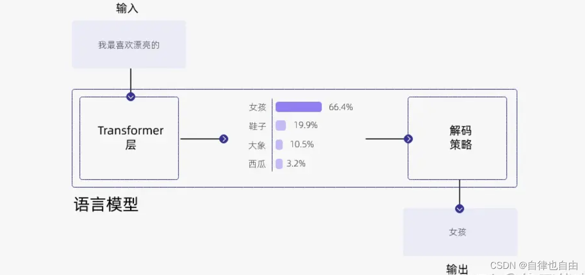

# 自然语言处理:第九十三章 大模型解码参数详解beam search/top-k/top-p/温度系数(转载)

**本人项目地址大全：[Victor94-king/NLP__ManVictor: CSDN of ManVictor](https://github.com/Victor94-king/NLP__ManVictor)**


<br />

***写在前面: 笔者更新不易，希望走过路过点个关注和赞，笔芯!!!***

***写在前面: 笔者更新不易，希望走过路过点个关注和赞，笔芯!!!***

***写在前面: 笔者更新不易，希望走过路过点个关注和赞，笔芯!!!***

<br />


## 0. 前言

我们都知道GPT在推理时是每步根据当前的序列预测下一个token。假设我们输入 “I am a”，GPT会对这个序列进行编码得到embedding，并预测下一个单词的概率。这里我们引出两个基本的问题：

* “I am a”作为输入，编码后也会得到三个token对应的embedding。那么哪个embedding用于预测下一个token？
* 在第一个问题解决后，词表中的单词作为下一个token的概率就得到了。此时GPT是怎么生成回答的？为什么相同的输入会有不同的回答？这种随机性（创造力）是如何实现的？

首先回答第一个问题。GPT会 **使用输入序列最后一个token对应的embedding做预测** 。也就是说，”a”经过编码后的embedding会被映射到整个词表上，得到下一个单词的概率。这其实很好理解，因为GPT是使用[masked attention](https://zhida.zhihu.com/search?content_id=238440982&content_type=Article&match_order=1&q=masked+attention&zhida_source=entity)的，每个token在编码时都只会和他前面的token交互。那么最后一个token自然就包括了当前序列的所有信息，因此用于预测下一个token是最合理的。

再来说第二个问题。当得到了整个词表中的单词作为下一个token的概率之后，GPT是选择概率最大（贪心）的那个作为输出吗？显然不是的。因为使用这样的策略，对于相同的输入GPT每次都会给出一样的回答（推理模式下所有参数都固定，不存在随机性）。而理解GPT回答的多样性就需要介绍一些生成策略了。

## 1. Beam search

beam search通过扩大每次选择的范围增加了生成的随机性。其存在一个超参数num_beams，用于设置每次选择的可能结果的个数。具体来说，beam search不严格要求选择当前最大概率的token，而是考虑 **累积概率最大的k个序列** 。为了方便叙述，我们假设输出的词表是’A,B,C’这三个字母。当输入为“I am a”, 设置num_beams=2，beam search的过程可表达为：

 **第一步：** 假设A,B,C对应的概率分别为0.5,0.2,0.3。那么此时选择每个token并组成序列的概率分别为：

“I am a A”: 0.5

“I am a B”: 0.3

“I am a C”: 0.2


beam search会选择概率最大的num_beams=2个序列，参与后续的生成。因此“I am a A”和“I am a B”会参与下一个token的预测。

 **第二步：** 将两个当前序列送入下一个token的预测中：


由上图可知”I am a A A”的概率为0.5 *0.1 = 0.05, * ”I am a A B”的概率为0.5*0.4=0.2。以此类推，可以算出六个可能序列对应的概率。此时再保留num_beams=2个最大概率的序列，分别是”I am a A C”=0.25, ”I am a B C”=0.27，再把这两个序列送到下一个token的预测中。

上述步骤会一直重复，直到遇到结束符或指定的长度。最终，会有num_beams个序列被预测出来。此时可以对这几个概率最大的序列做进一步的处理，例如选一个概率最大的作为最终的输出，或者根据概率做个采样作为输出。

beam search有什么好处呢？相比于每次都选最大的贪心，beam search显然 **增大了搜索空间** 。而且更重要的是，beam search会 **防止潜在概率很大的序列被过早的抛弃** 。例如”I am a B C”，在预测到B的时候序列的概率还是不大的，但是到C就变得更大了。

我们可以使用huggingface的GPT2模型感受一下beam search:

```python
from transformers import GPT2LMHeadModel, GPT2Tokenizer

tokenizer = GPT2Tokenizer.from_pretrained('gpt2')
model = GPT2LMHeadModel.from_pretrained('gpt2')

text = "I am a"
input_ids = tokenizer.encode(text, return_tensors='pt')

output = model.generate(input_ids, 
            max_length=10,  
            num_beams=5, 
            num_return_sequences=5, 
            early_stopping=True)

print(output.shape)
# torch.Size([5, 10])

for out in output:
  print(tokenizer.decode(out))
# I am a big believer in the power of the
# I am a big fan of this book. I
# I am a big fan of this book and I
# I am a big fan of this book. It
# I am a member of the United States Senate.
```

上面我们设置num_beams=5，用于生成5个最大概率的序列。同时num_return_sequences用于设置返回多少个结果。如果不设置就默认只会返回5个序列中概率最大的那个作为最终输出。early_stopping用于控制遇到终止符就停止生成。当num_beams=1时，beam search等价于贪心。

## 2.[ Top-k sampling](https://zhida.zhihu.com/search?content_id=238440982&content_type=Article&match_order=1&q=+Top-k+sampling&zhida_source=entity)

top-k采样其实很好理解。就是每一步只考虑概率最大的k个token，并且 **把这k个token的概率做重归一化，** 并随机采样得到预测的token。假设在一步中，ABC对应的概率ligits是[5,3,2]，k设置为2。那么会选出字母A,B，并把其对应的概率logits[5,3]进行重新归一化。这个归一化可以是softmax:

softmax([5,3])=[0.8808,0.1192]

随后基于归一化后的概率随机选A或B，拼接到“I am a”后面，并进行下一个token的预测，如此反复。

```python
...
output = model.generate(input_ids, 
            max_length=10,  
            do_sample=True,  
            top_k=50)

print(tokenizer.decode(output[0]))
# I am a man and do not belong in a
```

除了概率归一化，top-k和beam search有什么区别呢？看上去他们都是只考虑概率最大的那几个。他们的**核心区别**在于top-k自始至终只有一个序列进行预测，k只用于规定采样的范围，每步只采样一个token作为结果。而beam search会保留num_beams个序列进行预测。

## 3. Top-p sampling

[top-p sampling](https://zhida.zhihu.com/search?content_id=238440982&content_type=Article&match_order=1&q=top-p+sampling&zhida_source=entity)也叫Nucleus sampling。这种策略会把token的概率按照递减的次序累加，直到累加的概率值超过了阈值p，在这些token中做采样得到预测。

假设p=0.7，ABC在第一步预测的概率分布为[0.5,0.3,0.2]。那么A和B的概率值加起来超过了0.7，第一步就会在A,B中采样得到预测。假设第二步概率分布为[0.3,0.3,0.4]，那么ABC三个加起来才会超过0.7，此时第二步就会在这三个里面采样，如此反复。

可以看出top-p的每一步实际上会在一个动态长度的范围里做采样。这样的优点是可以排除一些概率不高的单词，例如分布为[0.9,0.05,0.05]时，只考虑第一个就足够了，而top-k还是会考虑前k个。并且在分布相对均衡时，top-p会增加输出的多样性。

```python
output = model.generate(input_ids, 
            max_length=10,  
            do_sample=True,  
            top_p=0.9)

print(tokenizer.decode(output[0]))
# I am a former New York City police commissioner,
```

## 4. [温度系数](https://zhida.zhihu.com/search?content_id=238440982&content_type=Article&match_order=1&q=%E6%B8%A9%E5%BA%A6%E7%B3%BB%E6%95%B0&zhida_source=entity)

在上面提到的归一化中，我们还可以引入温度系数调整概率分布：

softmax(xi)=exi/T∑jexj/T

相信大家在之前都听说过，大模型的生成需要调一些参数，其中温度系数就是经常出现的一个超参数。这里面温度系数就起到了对预测token的概率分布做调整的作用。还是以ABC对应的概率logits为[5,3,2]为例，我们试一下不同的T下归一化的结果：

```python
import torch.nn.functional as F
import torch

a = torch.tensor([5, 3, 2])

print(F.softmax(a/5., dim=0)) # t=5, [0.4506, 0.3021, 0.2473]
print(F.softmax(a/1., dim=0)) # t=1, [0.8438, 0.1142, 0.0420]
print(F.softmax(a/0.5, dim=0)) # t=0.5 [0.9796, 0.0179, 0.0024]
```

对比结果可以看出，T越大归一化后的概率分布越均匀，而T越小概率分布越陡峭。因此大的T会增加模型输出的随机性，而小的T则会让模型的输出更加固定。这也是“温度系数影响模型创造性”说法的原因。


## 5. 联合采样（top-k & top-p & Temperature）

思路：通常我们是将 top-k、top-p、Temperature 联合起来使用。使用的先后顺序是 top-k->top-p->Temperature。



首先我们设置 top-k = 3，表示保留概率最高的3个 token。这样就会保留女孩、鞋子、大象这3个 token。
女孩：0.664
鞋子：0.199
大象：0.105
接下来，我们可以使用 top-p 的方法，保留概率的累计和达到 0.8 的单词，也就是选取女孩和鞋子这两个 token。接着我们使用 Temperature = 0.7 进行归一化，变成：
女孩：0.660
鞋子：0.340
接着，我们可以从上述分布中进行随机采样，选取一个单词作为最终的生成结果。
