# 自然语言处理:第九十八章 私有化RAG封神组合：Dify+Fastgpt知识库

**本人项目地址大全：[Victor94-king/NLP__ManVictor: CSDN of ManVictor](https://github.com/Victor94-king/NLP__ManVictor)**

<br />

***写在前面: 笔者更新不易，希望走过路过点个关注和赞，笔芯!!!***

***写在前面: 笔者更新不易，希望走过路过点个关注和赞，笔芯!!!***

***写在前面: 笔者更新不易，希望走过路过点个关注和赞，笔芯!!!***

<br />


Dify 之前有介绍过 [自然语言处理: 第二十章Dify本地部署_dify 本地部署-CSDN博客](https://blog.csdn.net/victor_manches/article/details/137017648?ops_request_misc=%257B%2522request%255Fid%2522%253A%25226fe932a03f3860b6c06488e341a786c2%2522%252C%2522scm%2522%253A%252220140713.130102334.pc%255Fblog.%2522%257D&request_id=6fe932a03f3860b6c06488e341a786c2&biz_id=0&utm_medium=distribute.pc_search_result.none-task-blog-2~blog~first_rank_ecpm_v1~rank_v31_ecpm-1-137017648-null-null.nonecase&utm_term=dify&spm=1018.2226.3001.4450) 。但是即便dify已经升级到1.0完全体了，它的知识库问答效果还是一坨，，，

以下是我个人使用dify知识库之后的感受：


1.即便使用最新的父子分段后效果仍不理想；

2.配置有点繁琐，在知识库创建流程中已经设定了重排模型，到应用关联知识库的时候还要设定一次；

3.dify的知识库也支持fastgpt的问答拆分模式，但是这个拆分速度非常慢，还容易出错；

4.使用问答拆分之后的回复也是一坨，，，


说真的，dify除了知识库以外，其他大部分功能体验都比fastgpt要好。

有时候我真的有点恨铁不成钢。

而fastgpt的知识库效果是公认的好（以下是某群 群友的评价~）


所以，过去一年我大部分时间都在用fastgpt，毕竟知识库才是根本。

不过我想：如果能把dify和fastgpt结合，且不妙哉？

dify提供了外部知识库API，我知道，这事儿绝对能成！

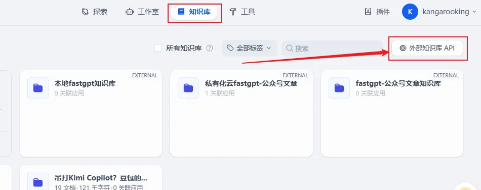

dify的外部知识库功能，支持添加外部知识库使用。

而fastgpt的知识库又刚好支持API调用。

那咱们可以直接把fastgpt知识库接入dify使用呀~

但是两边API接口不适配，，，是个问题。

遇到问题，我一般都会先找找有没有现成的方案（毕竟重复造轮子不是明智之举）

经过我的一番AI搜索，引擎搜索，各种查找，还真没找到现成的方案可以直接把fastgpt的知识库接入dify

*PS：如果您有其他方案，欢迎评论区分享~*

那么，就由我自己来创造"完美"！（造个轮子）

我用字节最新发布的AI编程工具Trae，花了30分钟左右，快速的完成了一个小项目，作为dify和fastgpt知识库的桥梁，可以快速、方便的把fastgpt的知识库外接到dify使用。

你可以把这个项目看做一个适配器。

姑且就给这个项目起名fda（fastgpt-dify-adapter）

看下dify外接fastgpt知识库前后的回复对比（左边是接入前，右边是接入后）

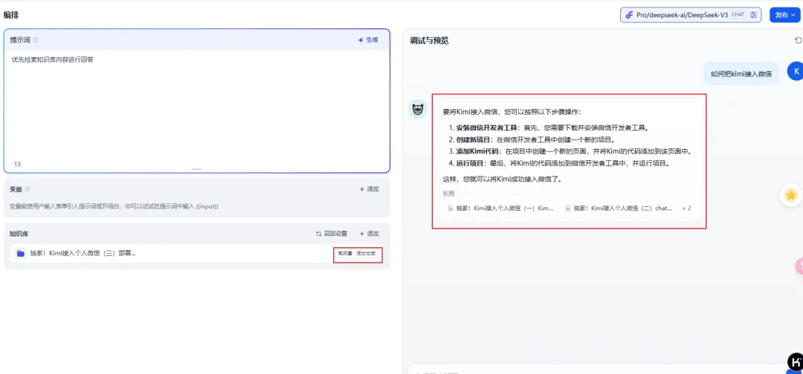


这个对比，两边所配置的参数，索引方式，索引模型，问答模型，以及知识库所上传的资料都一样。

但是dify的原始回复效果，我看了直接想报警！

完全跟我文章里面的内容不沾边，，，

整个接入过程简单分为3步：

1.配置、部署fda；

2.在fastgpt创建open apikey，复制知识库id；

3.在dify外接fastgpt知识库；


介绍差不多了，我们直接开始喂饭~


## 一、部署fda(fastgpt-dify-adapter)

fda（fastgpt-dify-adapter）使用python语言开发，支持docker-compose一键启动。

目前已经放到github

地址：https://github.com/kangarooking/fastgpt-dify-adapter

本篇教程使用的是[本地部署的fastgpt](https://mp.weixin.qq.com/s?__biz=MzkwMzE4NjU5NA==&mid=2247505944&idx=1&sn=eb341bf3dc4955be4916767d77985106&scene=21#wechat_redirect)和[本地部署的dify](https://mp.weixin.qq.com/s?__biz=MzkwMzE4NjU5NA==&mid=2247506421&idx=1&sn=240d895a1b03de12d1035cc186e142ab&scene=21#wechat_redirect)来完成对接

*PS：dify和fastgpt都有云端版本，懒得本地部署的朋友也可以通过云端版本测试。*

同样，fda也是本地部署（系统：win10）

咱们 **不需要去下载fda的源码** ，直接**创建一个fda的docker-compose.yml配置文件即可。**

先随便新建一个文件夹，在文件夹下新建一个.txt文件，把如下内容复制到.txt文件中（一定要保持yml格式，不能乱）

```
version: '3'
services:
  fastgpt-dify-adapter:
    image: registry.cn-guangzhou.aliyuncs.com/kangarooking/fastgpt-dify-adapter:1.0.1
    ports:
      - "5000:5000"
    environment:
      - FASTGPT_BASE_URL=http://host.docker.internal:3000
      # 问题优化配置
      - DATASET_SEARCH_USING_EXTENSION=false
      - DATASET_SEARCH_EXTENSION_MODEL=deepseek-chat
      - DATASET_SEARCH_EXTENSION_BG=
      # 重排序配置
      - DATASET_SEARCH_USING_RERANK=false
    restart: unless-stopped
```

*ps：本次镜像也特别帮大家上传到了阿里云，这样不需要科学上网就能快速下载镜像啦*

.txt文件保存之后，将**文件名连着后缀一起修改为docker-compose.yml**

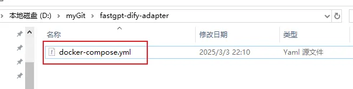

FASTGPT_BASE_URL：配置fastgpt地址（如果fastgpt和fda部署在同一个服务器的docker中，fastgpt地址建议直接使用 **http://host.docker.internal:3000**）

问题优化 和 重排序配置对应fastgpt的什么配置呢？

我放两个图你就懂了


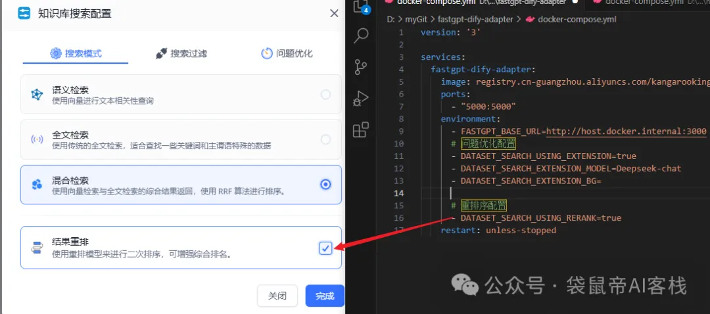

docker-compose.yml文件配置好之后

在docker-compose.yml文件所在目录的 **地址栏输入cmd 回车** ，进入控制台。


控制台输入指令**docker-compose up -d ，然后 回车（就自动下载、部署fda了）**

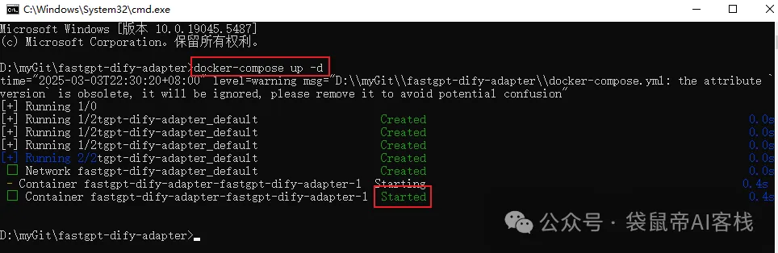

**如上图部署成功之后，可以打开docker-desktop，找到**Containers->fda->view details**查看fda的日志**

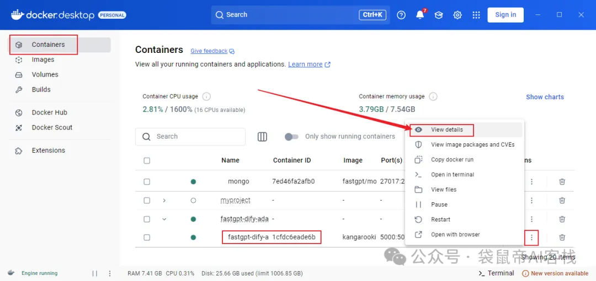


## 二、获取fastgpt相关参数


**我们需要获取fastgpt的openapi key**

**创建openapi key之后 需要复制下来备用**

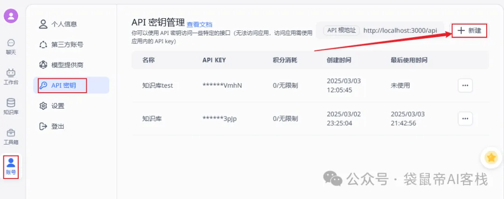

**找到你想要接入dify的知识库，点进去**

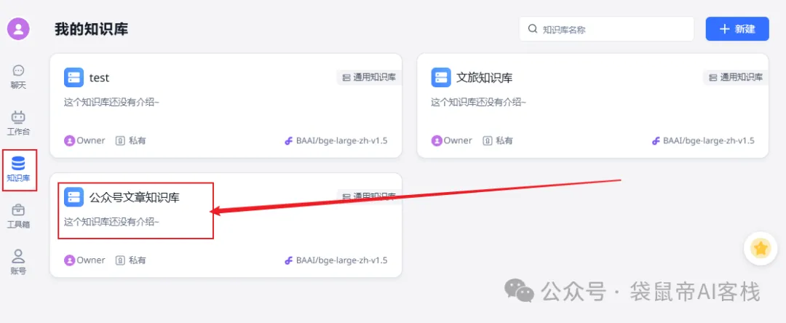

**在最右边找到知识库id，复制下来备用**

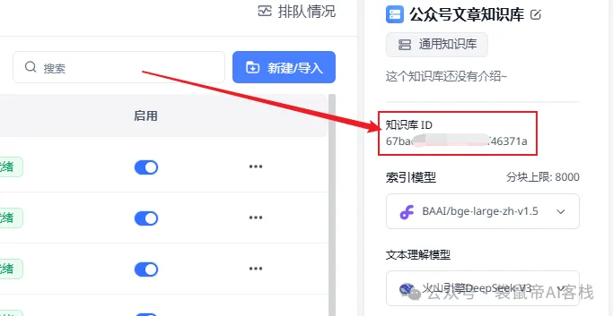


## 三、dify外接fastgpt知识库


访问dify，知识库->外部知识库API->添加外部知识库API

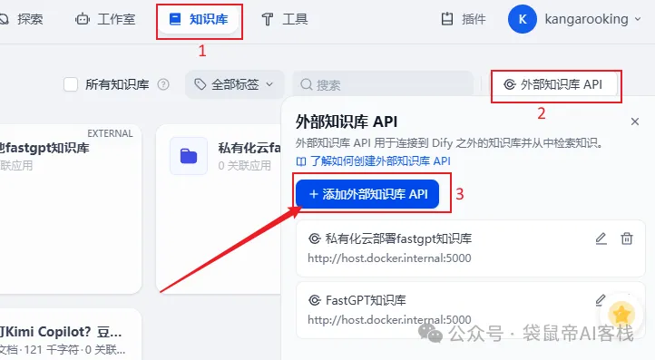

**API Endpoint填写fda的地址+端口（如有）**

*PS：如果dify和fda也是部署在同一服务器的docker中，fda的地址直接用：http://host.docker.internal:5000*

API key填写刚刚复制的fastgpt openapi key然后保存。

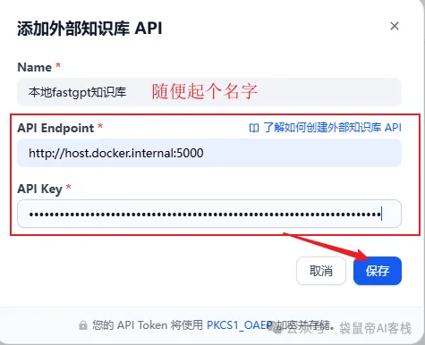

**如下图就保存成功了**

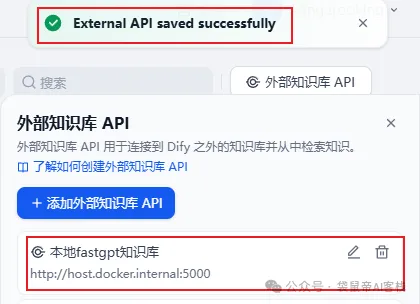

**然后我们创建一个外部知识库**

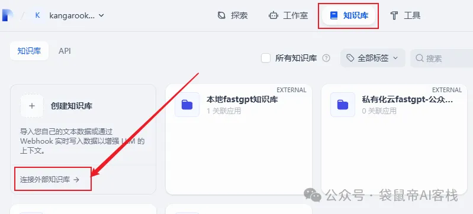

**注意填写刚刚复制的fastgpt知识库id**

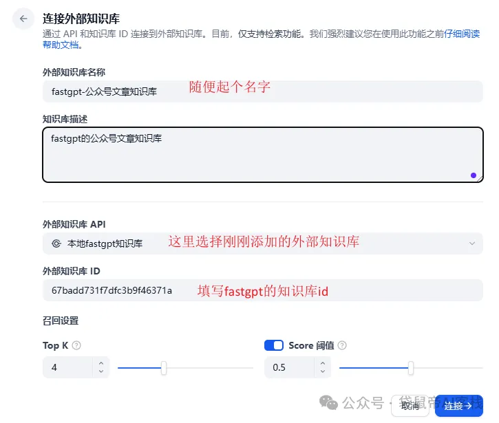

Top K 和 Score对应fastgpt哪里的配置，我放个图你就明白了

Top K为4=fastgpt的引用上限2000（如果是5就对应2500，以此类推）

Score=fastgpt的最低相关度

*建议 Top K拉到6以上，可以提供更多的长下文*

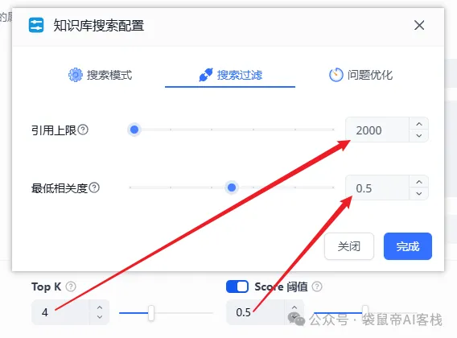

配置好之后，点击连接

最后，随便进入一个dify应用，点击添加知识库

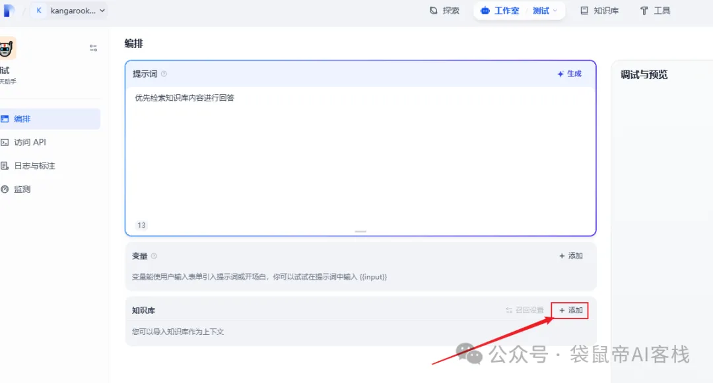

选择刚刚创建的外部库，添加

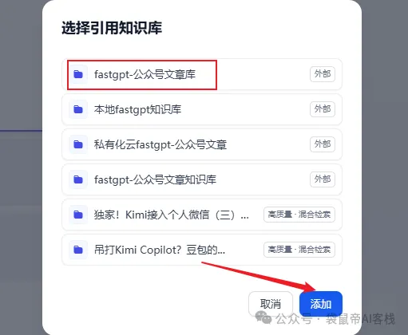

会弹出设置（这里的设置经我测试不起作用，不用管），直接保存

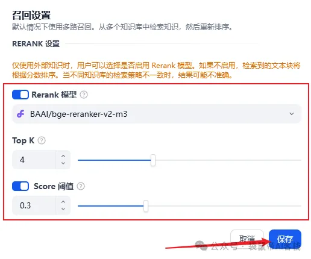

到这一步，我们就可以在dify里面愉快的使用fastgpt知识库来进行问答回复啦~ 效果提升不止一点点！

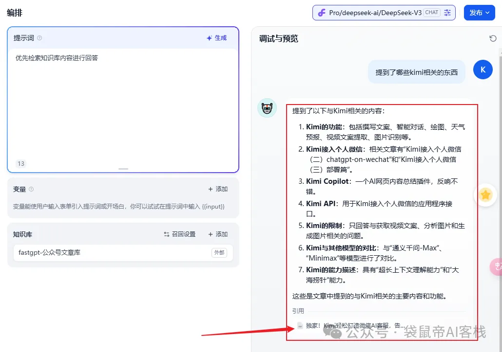

点击引用，还可以看到所有的引用内容

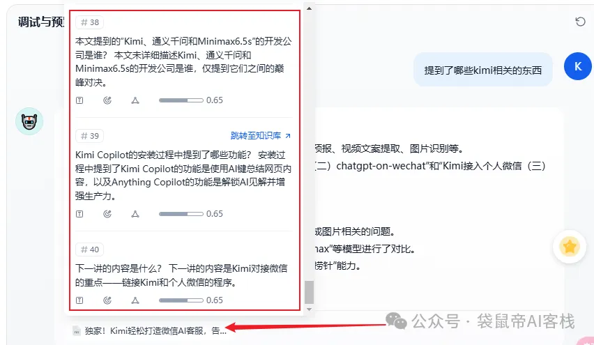

如果后续想调整外部知识库的参数，可以到外部知识库->设置里面调整

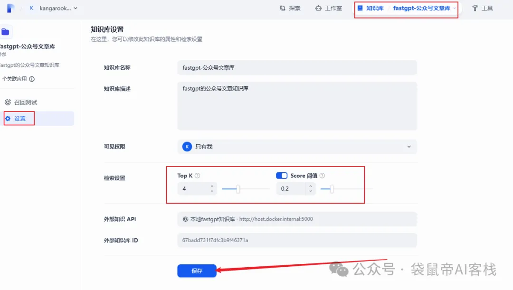

至此，外接fastgpt知识库的dify才算是世界上最好用的开源LLM应用平台！
